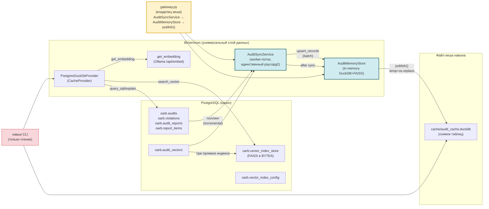
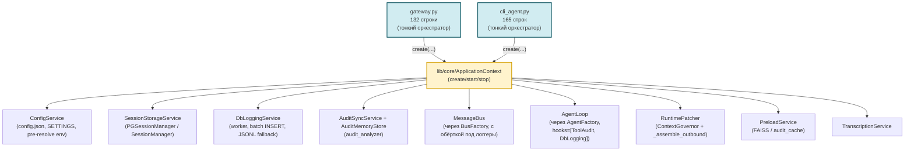

# Разработка nanobot: audit_analyzer и универсальный слой данных

> **Назначение:** техническая документация для разработчиков. Описывает архитектуру
> навыка `audit_analyzer`, универсальный инфраструктурный слой данных
> (`lib/services`), а также **v2.0.0 bootstrap-слой** (`lib/core/ApplicationContext`,
> `lib/lifecycle/`, `lib/cli/`, `lib/services/DbLoggingService`/`RuntimePatcher`/...)
> — общий для `gateway.py` и `cli_agent.py`. Управление DuckDB-кешем,
> векторными индексами и SQL-скрипты для развёртывания нужных таблиц.
> Пользовательская документация навыка — [`workspace/skills/audit_analyzer/SKILL.md`](workspace/skills/audit_analyzer/SKILL.md).
> Обзор проекта — [`README.md`](README.md).

---

## 📋 Оглавление

1. [Архитектура](#архитектура)
2. [Сервисный слой v2.0.0 (ApplicationContext + lib/)](#сервисный-слой-v200-applicationcontext--lib)
3. [Структура проекта](#структура-проекта)
4. [Универсальный слой данных lib/services](#универсальный-слой-данных-libservices)
5. [Конфигурация навыка](#конфигурация-навыка)
6. [CLI навыка: режимы](#cli-навыка-режимы)
7. [Жизненный цикл кеша](#жизненный-цикл-кеша)
   - [Управление синхронизацией](#управление-синхронизацией)
8. [Векторная индексация](#векторная-индексация)
9. [SQL-скрипты: создание таблиц](#sql-скрипты-создание-таблиц)
10. [Полная таблица связей между файлами (v2.0.0)](#полная-таблица-связей-между-файлами-v200)
11. [Тестирование](#тестирование)
12. [Изменения и миграции](#изменения-и-миграции)

---

## 🏗 Архитектура

Инфраструктура (DuckDB-кеш, векторные индексы, эмбеддинги) вынесена из навыка
в **универсальный слой** `lib/services` — он не завязан на предметную область
«аудит» и может переиспользоваться любым навыком. Навык `audit_analyzer` остался
тонким CLI: он конфигурирует провайдера из своих настроек и работает с ним
напрямую (без промежуточных обёрток-шимов).



**Потоки данных**

- `gateway.py` — единственный владелец файла кеша навыка. `AuditSyncService`
  (worker-поток, единственное подключение к PG) инкрементально синхронизирует
  таблицы в `AuditMemoryStore` (чисто in-memory DuckDB), а после каждого цикла
  `store.publish()` атомарно записывает снимок (temp + `os.replace`) в файл
  кеша навыка (`in_memory_cache_path`).
- Навык CLI (`predefined`/`sql`) — запросы выполняются по опубликованному кешу
  (или напрямую по PG, если кеш выключен). Создание/обновление кеша его не
  касается. Единый интерфейс бэкенда: `get_schema / query_sql / explain`.
- `--mode vector` — семантический поиск по FAISS-индексу: провайдер загружает
  индекс из `oarb.vector_index_store` (BYTEA), при промахе пересобирает из
  `oarb.audit_vectors`, эмбеддинг запроса получает через Ollama.

---

## 🆕 Сервисный слой v2.0.0 (ApplicationContext + lib/)

В v2.0.0 gateway и cli_agent сократились с 696/865 до 132/165 строк за счёт
вынесения всей инициализации в `ApplicationContext` (см. подробности в
`README.md` v2.0.0 changelog). Этот раздел — про
**внутреннее устройство** нового слоя, нужно при добавлении новых
сервисов или изменении lifecycle.

### Точки входа → общий bootstrap



### `lib/core/` (ApplicationContext + фабрики)

- **`application_context.py:ApplicationContext`** — единственный класс,
  собирающий все общие сервисы. Поля (помимо путей и конфига):
  `bus`, `agent`, `tool_audit_hook`, `hooks`, `session_manager`,
  `storage_mode`, `db_logging_service`, `audit_sync_service`,
  `audit_memory_store`, `config_service`, `runtime_patcher`,
  `transcription_service`, `subprocess_manager`, `preload_service`.
  Метод `start()` использует `ShutdownCoordinator` для регистрации
  сервисов; `stop()` — LIFO graceful shutdown.
  **Graceful degradation:** если БД недоступна, сервис остаётся `None`,
  gateway/cli работают без него (с предупреждением в логах).
- **`agent_factory.py:AgentFactory`** — `create(config, bus, session_manager=...,
  cron_service=..., db_logging_service=...)` → `(agent, hooks)`.
  Lazy-import `workspace.hooks.database_logging_hook` через try/except
  (если модуль не подключён — хук просто не добавляется).
- **`bus_factory.py:BusFactory`** — `create()` возвращает `MessageBus`,
  опционально обернув `publish_inbound`/`publish_outbound` async-логгерами
  из `db_logging_bus.py`. **Без monkey-patch'ей**: оригинальные методы
  шины сохраняются в замыкании.

### `lib/services/` (новые сервисы v2.0.0 + старые audit/кэш)

Полный список модулей (новые и pre-existing) — см. раздел [«Полная таблица связей»](#полная-таблица-связей-между-файлами-v200) ниже. Здесь — только
**новые** (v2.0.0), с краткой мотивацией:

| Сервис | Мотивация (почему выделен) |
|--------|---------------------------|
| `config_service.py` | Дубликат `_load_runtime_config` + `SETTINGS`-аксессора между gateway и cli. Pre-resolve `${PROVIDER_API_KEY}` от .secrets.env (см. ниже). |
| `session_storage.py` | Выбор `PGSessionManager` / `SessionManager` (auto / postgres / file) с поддержкой `session_manager.json` override. |
| `runtime_patcher.py` | `ContextGovernor.normalize_tool_result` + `agent._assemble_outbound` — оба monkey-patch'а в одном классе с fallback при изменении API nanobot. |
| `channel_factory.py` | `ChannelManager` + Redis + Postgres каналы + транскрипция (вынесено из gateway). |
| `transcription_service.py` | openai/groq key/URL/language (вынесено из gateway). |
| `subprocess_manager.py` | Streamlit spawn + terminate/kill. |
| `preload_service.py` | Разделяет FAISS preload (gateway) и audit_cache refresh (cli). |
| `db_logging_service.py` | **Новый** — структурированный журнал агента в `gateway_logs`. |
| `db_logging_bus.py` | **Новый** — обёртки `publish_inbound`/`publish_outbound` для `DbLoggingService`. |

### Pre-resolve `${VAR}` от `.secrets.env`

`nanobot._load_runtime_config` резолвит `${MISTRAL_API_KEY}` только из
`os.environ` и при отсутствии падает `ValueError`. Между тем `config.py`
для провайдерских ключей использует провайдер-скоупинг формат
`.secrets.env`:

```
# providers: mistral
api_key=XavGPsHjtNt3uOtFGUhabUuad5PRm2D0W
```

— в `os.environ` это не попадает как `MISTRAL_API_KEY`. Решение
(`ConfigService._pre_resolve_env_refs`): прочитать `config.json`,
найти `${VAR}` плейсхолдеры, для каждого `*_API_KEY` без env — достать
ключ из `SETTINGS.providers.<lower>.api_key` (туда `config.py` уже
подставил значение) и положить в `os.environ` ДО `_load_runtime_config`.
**Gateway больше НЕ требует `export MISTRAL_API_KEY=...` в shell.**

### Race-condition fix: callbacks ДО `ctx.start()`

`AuditSyncService` — worker-поток, который делает `initial_load` сразу
после `start()`. Если `set_on_new_records_callback(upsert_records)` ещё
не вызван к этому моменту, `_dispatch` скипает записи → DuckDB остаётся
пустым → `preload_vector_indexes` видит "нет данных" несмотря на
данные в `oarb.audit_vectors`. **Fix:** в `gateway.py:main()` callbacks
устанавливаются **ДО** `ctx.start()`. Тогда worker-тред при первом
`_do_initial_load` уже видит настроенные callbacks → `upsert_records`
вызывается → FAISS preload находит данные.

---

## 📁 Структура проекта

```
nanobot/
├── DEVELOPMENT.md                        # этот документ
├── tools/                                # инфраструктурные CLI-утилиты
│   └── build_vectors.py                  #   сборка векторных индексов (вне навыка)
├── sql/                                  # v2.0.0: все DDL сгруппированы по доменам
│   ├── README.md                          #   порядок применения, каталог
│   ├── session/                           #   session_meta + session_messages
│   ├── channels/                          #   seed_messages.sql (тестовые данные)
│   ├── logs/                              #   gateway_logs (DbLoggingService)
│   ├── audit_analyzer/                    #   домен oarb.* + векторы (GP)
│   ├── benchmarks/                        #   benchmark_runs + benchmark_results
│   └── migrations/                        #   инкрементальные миграции (например, logs)
│
├── lib/                                  #  v2.0.0: сервисный слой
│   ├── core/                             #   bootstrap ApplicationContext + фабрики
│   │   ├── application_context.py        #     create/start/stop, связывает все общие сервисы
│   │   ├── agent_factory.py              #     AgentLoop + ToolAudit + DatabaseLogging hooks
│   │   └── bus_factory.py                #     MessageBus + обёртки publish_inbound/outbound
│   ├── services/                         #   сервисный слой (v2.0.0 + pre-existing)
│   │   ├── config_service.py             #    SETTINGS-аксессор + pre-resolve env + таймауты
│   │   ├── session_storage.py            #    выбор PGSessionManager / SessionManager
│   │   ├── runtime_patcher.py            #    все monkey-patch'и (ContextGovernor + _assemble_outbound)
│   │   ├── channel_factory.py            #    ChannelManager + Redis/Postgres каналы
│   │   ├── transcription_service.py      #    openai/groq key/URL/language
│   │   ├── subprocess_manager.py         #    Streamlit spawn + terminate/kill
│   │   ├── preload_service.py            #    FAISS preload + audit_cache refresh
│   │   ├── db_logging_service.py         #    worker, batch INSERT, JSONL fallback, get_stats()
│   │   ├── db_logging_bus.py             #    обёртки publish_inbound/outbound
│   │   ├── audit_memory_store.py         #     in-memory DuckDB-зеркало + атомарный publish()
│   │   ├── audit_sync_service.py         #     фоновый поллинг PG (worker-поток)
│   │   ├── cache_provider.py             #     интерфейс CacheProvider + SearchResult
│   │   ├── cache_provider_impl.py        #     PostgresDuckDbProvider + фабрика и модульные функции
│   │   ├── text_splitter.py              #     чанкование текстов для индексаторов
│   │   # DDL для DbLoggingService (gateway_logs) теперь в sql/logs/ и sql/migrations/
│   ├── cli/                              #  вынесено из cli_agent.py
│   │   ├── console_loop.py               #   REPL + typewriter + consume_outbound
│   │   ├── display_config.py             #   DisplayConfig
│   │   └── hook_loader.py                #   сканирование workspace/hooks/*.py
│   ├── lifecycle/                        #  цикл запуска и graceful shutdown
│   │   ├── gateway_runner.py             #   run_forever с exponential backoff (1с → 30с)
│   │   └── shutdown_coordinator.py       #   LIFO graceful shutdown
│   ├── channels/                         #   каналы
│   │   ├── postgres_channel.py           #     канал через таблицу conversation_messages
│   │   └── redis_channel.py              #     канал через Redis-очереди (BRPOP/LPUSH)
│   ├── session/                          #   хранилище сессий
│   │   └── pg_session_manager.py         #     хранение сессий в PostgreSQL (замена JSONL)
│   └── (см. lib/core/, lib/cli/, lib/lifecycle/ выше)
│
├── workspace/                            # runtime-данные и хуки
│   ├── hooks/
│   │   ├── tool_audit_hook.py            #   хук аудита вызовов инструментов
│   │   └── database_logging_hook.py      #  AgentHook для tool-событий + run_finished в БД
│   └── skills/audit_analyzer/            # навык: тонкий CLI поверх провайдера
│       ├── SKILL.md                      #   пользовательская документация
│       ├── audit_analyze.bat / .sh       #   точки входа
│       ├── scripts/
│       │   ├── cli.py                    #   парсинг аргументов, маршрутизация режимов
│       │   ├── skill_config.py           #   конфиг из SETTINGS + build_cache_provider()
│       │   ├── database.py               #   Database (прямой PG, fallback) + QueryBackend
│       │   ├── sql_mode.py               #   режим sql: LLM → SQL → EXPLAIN → выполнение
│       │   ├── predefined_mode.py        #   режим predefined: готовые SQL-шаблоны
│       │   ├── predefined.py             #   резолв параметров (+ векторный поиск по source)
│       │   ├── scripts_registry.py       #   ScriptDefinition / ParamDefinition / реестр
│       │   ├── llm.py                    #   LLM-клиент (OpenAI-compatible HTTP)
│       │   └── output.py                 #   форматирование JSON-вывода
│       └── tests/
│           └── e2e_test.py               #   сквозной тест навыка (нужна живая БД)
│
├── gateway.py                            #  v2.0.0: 132 строки, тонкий оркестратор
├── cli_agent.py                          #  v2.0.0: 165 строк, тонкий оркестратор
├── streamlit_app.py                      # [web-клиент, не через ApplicationContext]
├── config.py                             # SETTINGS (project.json + config.json + .secrets.env)
└── project.json                          # конфигурация (channels.*, skills.*, gateway, cli, logging.db)
```

---

## 🔌 Универсальный слой данных lib/services

**Интерфейс** — `lib/services/cache_provider.py`:

- `CacheProvider` (ABC): `is_ready()`, `refresh()`, `check_stale()`,
  `preload_indexes()`, `search_vector()`, `query_sql()`, `explain()`,
  `get_schema()`, `close()`.
- `SearchResult` (dataclass): `content`, `score`, `source`, `table`, `pk_value`,
  `chunk`, `matched_chunks`, `row`.

**Реализация** — `lib/services/cache_provider_impl.py`:

- `PostgresDuckDbProvider` — единый провайдер: DuckDB-кеш + векторные индексы.
  Конструктор принимает только конфигурацию (схему, таблицы, пути, модель
  эмбеддинга) — без привязки к «аудиту».
- Модульные функции: `get_embedding()` (Ollama `/api/embed`),
  `load_cache_from_postgres(cache_path, db_config)`, `check_cache_stale(...)`,
  `read_vector_index_config(cfg)` (конфиг индексов из БД → fallback в настройках),
  `read_embedding_config(cfg)`, `build_cache_provider(cfg, base_dir)` (фабрика
  провайдера из конфиг-секции навыка).
- Тяжёлые зависимости (`duckdb`, `psycopg2`, `faiss`, `numpy`, `pandas`, `httpx`)
  импортируются **лениво** внутри методов — импорт модуля остаётся лёгким,
  и gateway может управлять жизненным циклом без побочных эффектов.
- Если передан `dsn` — провайдер сам вызывает `utils.db.configure(dsn)`
  (идемпотентно), поэтому пригоден для использования автономно.

**Единый интерфейс бэкенда запросов.** `Database` (прямой PG) и
`PostgresDuckDbProvider` (кеш) реализуют одинаковые методы
`get_schema / query_sql / explain` (протокол `QueryBackend` в
`scripts/database.py`), поэтому режимы `predefined`/`sql` работают с любым
бэкендом без ветвлений.

**Фабрика провайдера** — универсальная `lib.services.cache_provider_impl.build_cache_provider(cfg, base_dir)`
собирает провайдера из конфиг-секции навыка (DuckDB-кеш, индексы, эмбеддинг).
Навык делегирует ей через `scripts/skill_config.build_cache_provider()`, тот же
набор настроек читает `gateway.py::_build_audit_services()` и индексатор
`tools/build_vectors.py`.

---

## ⚙️ Конфигурация навыка

Секция `skills.audit_analyzer` в `project.json`:

| Ключ | Назначение | Значение / по умолчанию |
|------|-----------|-------------|
| `llm_provider` / `llm_model` / `llm_api_base` | LLM для генерации SQL | `mistral` / `mistral-large-latest` / `https://api.mistral.ai/v1` |
| `llm_max_tokens` / `llm_temperature` | Параметры генерации | `8192` / `0.1` |
| `db_schema` | Схема с таблицами аудита | `oarb` |
| `db_tables` | Таблицы, доступные агенту | `audit_reports, audits, report_items, violations` (значение project.json; код по умолч. — пустой список) |
| `in_memory_enabled` | Включить DuckDB-кеш | `true` |
| `in_memory_engine` | Движок кеша | `duckdb` |
| `in_memory_cache_path` | Путь к файлу кеша (отн. навыка) | `cache/audit_cache.duckdb` |
| `poll_interval_sec` | Период инкрементального поллинга PG в `AuditSyncService` | `60` |
| `full_resync_every` | Полная перезагрузка таблицы каждые N циклов (сверка удалений) | `10` |
| `sync_write_table` | Таблица журнала взаимодействий (создаётся автоматически) | `audit_interactions` |
| `embedding_base_url` | Ollama `/api/embed` | `http://localhost:11434/api/embed` |
| `embedding_model` | Модель эмбеддинга | `mxbai-embed-large:latest` |
| `embedding_dimension` | Размерность вектора | `1024` |
| `mode_vector_db_table` | Таблица сырых векторов (источник индекса) | `oarb.audit_vectors` (значение project.json; код по умолч. — пусто) |
| `mode_vector_store_table` | Таблица сериализованных FAISS-индексов | `oarb.vector_index_store` |
| `cli_default_mode` | Режим по умолчанию (резерв; CLI требует `--mode`) | `predefined` |
| `cli_max_retries` | Ретраи HTTP-запросов LLM-клиента (`llm.py`) | `3` |
| `cli_timeout_sec` | Таймаут запроса к LLM (`llm.py`) | `60` |

> Примечание: ретраи *генерации* SQL в режиме `sql` захардкожены в
> `sql_mode.py` (`MAX_RETRIES = 2` → до 3 попыток) и от `cli_max_retries`
> не зависят.

DSN подключается через `channels.postgres.dsn` в `project.json` /
`DATABASE_URL` в `.secrets.env` (`utils.db.resolve_dsn()`). Навык собственного
DSN не хранит.

---

## 🚀 CLI навыка: режимы

Точка входа: `workspace/skills/audit_analyzer/audit_analyze.bat` (или
`.sh`), либо `python scripts/cli.py`.

```
audit_analyze --mode {predefined,sql,vector} [опции]
```

| Режим | Назначение | Ключевые флаги |
|-------|-----------|----------------|
| `predefined` | Выполнение готовых SQL-шаблонов из реестра | `--script`, `--params` |
| `sql` | Генерация SELECT через LLM по текстовому запросу | `--query`, `--context` |
| `vector` | Семантический поиск по FAISS-индексу | `--query`, `--index-name`, `--top-k`, `--threshold`, `--vector-index` |

Примеры:

```bash
# predefined — готовый шаблон с параметрами
audit_analyze --mode predefined --script analytics_by_year_month --params '{"year": 2024}'

# sql — генерация SQL через LLM и выполнение
audit_analyze --mode sql --query 'сколько аудитов было в 2024 по месяцам'

# vector — топ-3 по схожести
audit_analyze --mode vector --query 'пожарная безопасность' --index-name audits_index --top-k 3

# vector — всё выше порога 0.7
audit_analyze --mode vector --query 'статусы аудитов' --index-name audits_index --threshold 0.7
```

**Как выбирается бэкенд запросов:** если `in_memory_enabled: true` — CLI строит
провайдера (`build_cache_provider()`), открывает DuckDB-кеш на чтение и работает
по нему; иначе — `Database` (прямой PostgreSQL). Кеш создаёт и обновляет
**gateway** (см. раздел «Жизненный цикл кеша»); CLI про это не знает. Если файла
кеша нет — CLI завершается с `FileNotFoundError`: «Кеш создаёт и обновляет
gateway автоматически — запустите его (python gateway.py)».

**Векторный поиск в predefined:** строковые параметры с
`validation.vector_source` (например, `violation_code`, `auditee_entity`,
`audit_type`) резолвятся через семантический поиск — провайдер подставляет
лучшее совпадение из индекса `{source}_index`.

---

## 🔄 Жизненный цикл кеша

**Владелец файла кеша навыка — `gateway.py`.** Навык (CLI) про создание и
обновление кеша больше не знает: `--force` удалён.

Пара сервисов строится в `gateway.py::_build_audit_services()` (возвращает
`(None, None)`, если `in_memory_enabled` выключен, нет DSN или таблиц):

- **`AuditSyncService`** — единственный владелец подключения к PostgreSQL
  (worker-поток). При старте выполняет полную загрузку таблиц, далее каждые
  `poll_interval_sec` (по умолч. 60 с) инкрементально опрашивает таблицы по
  track-колонке (`updated_at`; для `audit_vectors` — `id`). Новые/изменённые
  строки передаёт в callback `on_new_records` → `AuditMemoryStore.upsert_records`.
  Структуру таблиц собирает из PG `information_schema` (+ `pg_description`):
  колонки, типы, NOT NULL, комментарии → callback `on_schema` →
  `AuditMemoryStore.ensure_schema` (создание пустых таблиц, типы из PG).
  Каждые `full_resync_every` циклов (по умолч. 10) делает полную перезагрузку
  таблицы через `on_replace_records` → `AuditMemoryStore.replace_records`
  (сверка удалённых строк; курсор поллинга не откатывается).
  Дополнительно создаёт таблицу журнала `oarb.audit_interactions`
  (`sync_write_table`), куда через `submit_write()` пишутся ответы агента.
- **`AuditMemoryStore`** — живое зеркало в чисто in-memory DuckDB
  (`cache_path=""`) + FAISS-индексы. `ensure_schema()` создаёт таблицы с типами
  из PG и сохраняет комментарии + исходные PG-типы в мета-таблицу
  `__nanobot_meta.__schema_meta` (входит в снимок). `get_schema()` возвращает
  исходные PG-типы и комментарии (без них — DuckDB-тип из information_schema).
  `publish()` атомарно записывает снимок таблиц (ATTACH во временный файл →
  `os.replace`) в `publish_path` = `in_memory_cache_path` навыка. Без изменений
  (`_dirty` = False) файл не перезаписывается; если снимок занят читателем
  (CLI) — публикация откладывается до следующего цикла, ошибка не теряет данные.

Схема в `gateway.py::run()`:

```
_build_audit_services() ──► (store, sync_service)
sync_service.set_on_new_records_callback(store.upsert_records)
sync_service.set_on_replace_records_callback(store.replace_records)
sync_service.set_on_schema_callback(store.ensure_schema)
sync_service.set_on_sync_callback(store.publish)     # снимок после каждого цикла
sync_service.start(initial_load=True)                # полная загрузка + поллинг
_preload_vector_indexes(store)                       # прогрев FAISS в память
...
(finally) store.publish() → store.close()            # финальный снимок при выходе
```

**Правило одного писателя.** DuckDB допускает только один процесс-писатель на
файл, поэтому gateway никогда не открывает целевой файл на запись: он пишет во
временный файл и атомарно подменяет его `os.replace()`. Навык (CLI) открывает
опубликованный снимок только на чтение и видит целостные данные в любой момент.

**cli_agent.py** по-прежнему содержит унаследованную фоновую загрузку/свежесть
кеша (`load_cache_from_postgres` / `check_cache_stale`) как резерв; основной
владелец и источник снимка — `gateway.py`.

### 🔧 Управление синхронизацией

#### Полный цикл обновления данных (что происходит по шагам)

1. **Старт gateway** (`gateway.py::run()`): `_build_audit_services()` читает
   секцию `skills.audit_analyzer` из `project.json`. Сервисы создаются, только
   если `in_memory_enabled: true`, задан DSN и есть таблицы; иначе — `(None, None)`
   и синхронизация не запускается.
2. **Initial load**: `AuditSyncService._do_initial_load()` для каждой таблицы из
   `db_tables` (+ таблица векторов) делает:
   - `_fetch_schema()` — запрос структуры из PG `information_schema.columns`
     + `pg_description` (колонки, типы, NOT NULL, комментарии таблиц/колонок);
   - `_ensure_table_schema()` → колбека `on_schema` → `store.ensure_schema()` —
     создаёт таблицу в in-memory DuckDB **с типами из PG** (включая пустые);
   - `_fetch_all()` → `SELECT *` → колбека `on_new_records` → `store.upsert_records()`.
3. **Поллинг**: worker-поток каждые `poll_interval_sec` вызывает
   `_poll_table()`: `SELECT * WHERE "<track>" > <последняя_метка>`. Track-колонка:
   `updated_at` (доменные таблицы) или `id` (`audit_vectors`). Новые/изменённые
   строки → `upsert_records()` (upsert по `id`: DELETE + INSERT).
4. **Публикация снимка**: после initial load и каждого цикла поллинга
   `_fire_sync_callback()` → `store.publish()` — атомарный снимок (ATTACH во
   временный файл → `os.replace`) в файл кеша навыка. `publish()` — no-op, если
   данных не менялось (`_dirty = False`) или `publish_path` пуст.
5. **Полная пересинхронизация** (сверка удалений): каждые `full_resync_every`
   циклов поллинга `_poll_table()` вместо инкрементального запроса делает
   `_fetch_all()` + `_dispatch_replace()` → `store.replace_records()` — таблица
   перезаписывается целиком (структура и типы сохраняются), удалённые в PG
   строки исчезают. Курсор поллинга не откатывается (новое значение только если
   больше текущего).
6. **Журнал ответов**: при старте создаётся таблица
   `"<schema>"."<sync_write_table>"` (`audit_interactions`); ответы агента
   ставятся в очередь через `submit_write()` и записываются worker-потоком.
7. **Завершение**: при остановке gateway `sync_service.stop()` дописывает
   очередь, затем в `finally` — финальный `store.publish()` и `store.close()`.

#### Как связаны компоненты (callbacks)

Колбеки подключаются в `gateway.py::run()` (строки ~608-613) — это единственная
точка связывания `AuditSyncService` и `AuditMemoryStore`:

| Событие в AuditSyncService | Колбека | Метод store | Что делает |
|---------------------------|---------|-------------|-----------|
| новые/изменённые строки | `set_on_new_records_callback` | `upsert_records` | инкрементальный апдейт |
| полная перезагрузка таблицы | `set_on_replace_records_callback` | `replace_records` | сверка удалений |
| структура из PG | `set_on_schema_callback` | `ensure_schema` | типы, NOT NULL, комментарии |
| завершение цикла | `set_on_sync_callback` | `publish` | публикация снимка для CLI |

Чтобы изменить поведение (например, публиковать снимок реже или дополнительно
инвалидировать индексы) — правишь именно эту секцию `gateway.py`.

#### Управляющие ключи (`skills.audit_analyzer` в `project.json`)

| Ключ | Где читается | По умолч. | Эффект |
|------|-------------|-----------|--------|
| `in_memory_enabled` | `gateway.py:511` | `false` | Выключает весь кеш и синхронизацию: CLI ходит напрямую в PG. `true` — включает |
| `in_memory_cache_path` | `gateway.py:524` | `cache/audit_cache.duckdb` | Куда публикуется снимок (отн. `workspace/skills/audit_analyzer/`). Меняя — меняешь файл, который читает CLI |
| `db_schema` / `db_tables` | `gateway.py:516-518` | `oarb` / 4 таблицы | Какие таблицы синхронизировать. Список — массив строк; добавил таблицу → она появится в кеше после следующего цикла |
| `poll_interval_sec` | `gateway.py:549` | `60` | Частота инкрементального поллинга, сек. Меньше → свежее кеш, больше запросов к PG |
| `full_resync_every` | `gateway.py:552` | `10` | Полная перезагрузка таблиц каждые N циклов поллинга. `0` — отключить (удалённые строки останутся в кеше) |
| `sync_write_table` | `gateway.py:550` | `audit_interactions` | Таблица журнала ответов агента (создаётся автоматически в схеме `db_schema`) |
| `mode_vector_db_table` | `gateway.py:517` | `oarb.audit_vectors` | Таблица векторов, включается в синхронизацию и прогревается в FAISS |

`config.py` мержит `project.json` в `SETTINGS`; после правки `project.json`
перезапуск gateway обязателен.

#### Требования к таблицам источника

- Колонка `id` (для upsert `DELETE + INSERT` по ключу; если её нет — таблица
  пересоздаётся из батча целиком).
- Колонка `updated_at` (инкрементальный поллинг). Для `audit_vectors` — `id`.
  Тип track-колонки должен быть сравнимым (`>`) — `timestamp`/`bigint`.
- Безопасность поллинга: строки, изменённые **и** удалённые между циклами,
  подхватятся полной пересинхронизацией (`full_resync_every`).

#### Практические сценарии

- **Свежее кеш, чаще опрос**: `poll_interval_sec: 15`.
- **Меньше нагрузки на PG**: `poll_interval_sec: 300`, `full_resync_every: 5`
  (реже опрос, но регулярная сверка удалений).
- **Не нужна сверка удалений / большие таблицы**: `full_resync_every: 0`.
- **Выключить кеш совсем**: `in_memory_enabled: false` (CLI → прямой PG).
- **Добавить таблицу в анализ**: вставить её имя в `db_tables` и перезапустить
  gateway.

#### Мониторинг

- `AuditMemoryStore.get_stats()`: `tables` (кол-во строк), `dirty`,
  `upserts`, `publishes`, `publish_errors`, `last_upsert_at`, `last_publish_at`,
  `last_error`, `indexes_in_memory`, `vector_sources`.
- `AuditSyncService.get_stats()`: `polls`, `full_resyncs`, `reconnects`,
  `errors`, `queue_size`, `last_sync` (метка на таблицу), `connected`.
- Внешние признаки работы: mtime файла кеша
  (`workspace/skills/audit_analyzer/cache/audit_cache.duckdb`) обновляется после
  каждого publish; лог gateway: `audit_analyzer sync started (in-memory cache +
  vectors, публикация кеша навыка: <path>)`.

---

## 🔍 Векторная индексация

### Таблицы

| Таблица | Назначение |
|---------|-----------|
| `oarb.audit_vectors` | Сырые векторы `REAL[]` + метаданные (`content`, `search_text`, `table`, `pk_value`, `chunk_index/count`, `row_data` JSONB, `content_hash`, `max_src_track`, `synced_at`). Строится `build_vectors.py` |
| `oarb.vector_index_store` | Сериализованный FAISS-индекс `BYTEA` (source, metadata, dimension, vector_count, updated_at). Пересобирается провайдером при промахе или после изменений |
| `oarb.vector_index_config` | Конфигурация индексов (основной источник; fallback — `vector_indexes` в project.json) |

### Пайплайн

```
source table          build_vectors.py                 audit_vectors               vector_index_store
(oarb.audits) ──► read → embed → insert          ──►   REAL[] + row_data     ──►   BYTEA (FAISS)
(oarb.violations)                                                                    │
                                                                                     ▼
                                                                          PostgresDuckDbProvider
                                                                          (search: deserialize из store,
                                                                           кеш в памяти, пересборка при промахе)
```

### `build_vectors.py`

Инструмент в корневом [`tools/build_vectors.py`](tools/build_vectors.py) — вне навыка:
создание индексов это инфраструктура, а не задача навыка (навык только запрашивает).

| Флаг | Действие |
|------|----------|
| *(без флагов)* | Инкрементальная синхронизация: новые/изменённые/удалённые строки |
| `--full-rebuild` | Полная перестройка (очистка + все строки) |
| `--check` | Быстрая проверка сигнатуры (COUNT + MAX track_column), синхронизация только при изменениях |
| `--status` | Состояние индексов без синхронизации |
| `--dry-run` | Репетиция без вставки в БД |
| `--index <name>` | Собрать только один индекс |
| `--batch-size` / `--chunk-size` / `--chunk-overlap` | Параметры эмбеддинга и чанкования |
| `--db-table` | Таблица векторов (по умолч. `oarb.audit_vectors`) |

```bash
# из корня проекта:
python tools/build_vectors.py --status
python tools/build_vectors.py --full-rebuild
python tools/build_vectors.py --check          # например, при старте контейнера
python tools/build_vectors.py --index audits_index
```

Алгоритм (на индекс):
1. Конфиг: `oarb.vector_index_config` → fallback `skills.audit_analyzer.vector_indexes`.
2. Загрузка строк источника, сравнение с `audit_vectors` по `(source, pk_value)`,
   классификация NEW / CHANGED (изменился `content_hash`) / DELETED.
3. Эмбеддинг через Ollama батчами; длинные тексты режутся на чанки
   (`--chunk-size`, по умолч. 500, перекрытие `--chunk-overlap`, по умолч. 80)
   — универсальный `lib/services/text_splitter.py`.
4. INSERT/UPDATE в `audit_vectors`; после изменений провайдеру делается
   `invalidate_cache(index)` + `rebuild_and_store_index(index, db_table)`
   (пересборка FAISS и сохранение в `vector_index_store`).

Чанкование: один документ → несколько векторов-чанков; `content` и `row_data`
всегда полные; при поиске из нескольких чанков одного документа возвращается
только один с наибольшим score (`matched_chunks` показывает число совпавших).

### Сброс in-memory кеша индекса

```python
from workspace.skills.audit_analyzer.scripts.skill_config import build_cache_provider
provider = build_cache_provider()
provider.invalidate_cache('audits_index')   # один индекс
provider.invalidate_cache()                 # все
```

---

## 🛠 tools/ — инфраструктурные утилиты

В корне `tools/` живут CLI-утилиты, **отдельные от навыков** — инфраструктура, не аналитика.

### `tools/build_vectors.py`

Перестроение векторных индексов из PostgreSQL-данных. Полная документация по флагам и пайплайну — в [Векторная индексация](#векторная-индексация). Краткая шпаргалка:

```bash
# Статус без изменений
python tools/build_vectors.py --status

# Полная перестройка всех индексов (осторожно: долго + нагрузка на Ollama)
python tools/build_vectors.py --full-rebuild

# Только проверка сигнатуры (COUNT + MAX track_column) — подходит для cron
python tools/build_vectors.py --check

# Один индекс
python tools/build_vectors.py --index audits_index

# Dry-run без записи в БД
python tools/build_vectors.py --dry-run

# Параметры эмбеддинга
python tools/build_vectors.py --batch-size 32 --chunk-size 500 --chunk-overlap 80

# Другая таблица векторов
python tools/build_vectors.py --db-table my_app.vectors
```

| Флаг | Дефолт | Описание |
|------|--------|----------|
| *(без флагов)* | — | Инкрементальная синхронизация (NEW / CHANGED / DELETED) |
| `--full-rebuild` | — | Полная перестройка (TRUNCATE + все строки) |
| `--check` | — | Сравнить сигнатуру (count + max track); синхронизировать только при diff |
| `--status` | — | Сводное состояние индексов без синхронизации |
| `--dry-run` | — | План без записей в БД |
| `--index <name>` | все | Собрать только индекс `name` |
| `--db-table` | `oarb.audit_vectors` | Таблица сырых векторов |
| `--batch-size` | env | Батч эмбеддинга |
| `--chunk-size` | 500 | Размер чанка в символах |
| `--chunk-overlap` | 80 | Перекрытие чанков |

**Типичные сценарии:**

- **После изменений в DDL таблиц** — `--full-rebuild`.
- **Проверка готовности системы** (cron / healthcheck) — `--check`.
- **Мониторинг без записи** — `--status`.
- **Большой источник + экономия памяти Ollama** — `--batch-size 8` + `--chunk-size 300`.

DSN берётся из `channels.postgres.dsn` (или `DATABASE_URL`/`PG_DSN`) через `utils.db.resolve_dsn()`. Параметры эмбеддинга (`embedding_base_url`, `embedding_model`, `embedding_dimension`) — из `skills.audit_analyzer.*` в `project.json`.

### Когда добавлять новую утилиту в `tools/`

Утилита попадает в `tools/` если она:
- **инфраструктурная** (миграции, сборка индексов, очистка кешей) — **не часть навыка**.
- запускается из shell/CI, не из агента.
- работает с БД напрямую (минуя `lib/services/*` если скрипт одноразовый).

Если скрипт — часть навыка (например, обработка `predefined`-скриптов), он идёт в `workspace/skills/<skill>/scripts/`, а не в `tools/`.

---

## 🗃 SQL-скрипты: создание таблиц

Все DDL собраны в корневом каталоге [`sql/`](sql/). Порядок применения:

```bash
# 1. Схема домена (REFERENCE — уточняется владельцем данных)
psql "$DATABASE_URL" -f sql/audit_analyzer/create_audit_source_tables_gp.sql

# 2. Векторные таблицы (oarb.audit_vectors + oarb.vector_index_store)
psql "$DATABASE_URL" -f sql/audit_analyzer/create_audit_vectors_table_gp.sql

# 3. Конфигурация индексов (oarb.vector_index_config)
psql "$DATABASE_URL" -f sql/audit_analyzer/create_vector_index_config_gp.sql

# 4. Сборка индексов
python tools/build_vectors.py --full-rebuild
```

Все DDL собраны в корневом каталоге [`sql/`](sql/) с подкаталогами по доменам.
Полный каталог и порядок применения — в [`sql/README.md`](sql/README.md).

| Файл | Таблицы | Статус |
|------|---------|--------|
| `sql/audit_analyzer/create_audit_source_tables_gp.sql` | `oarb.audits`, `oarb.violations`, `oarb.audit_reports`, `oarb.report_items` | **REFERENCE** — минимальный набор колонок из кода, уточняет владелец данных |
| `sql/audit_analyzer/create_audit_vectors_table_gp.sql` | `oarb.vector_index_store`, `oarb.audit_vectors` (+ индексы) | рабочий |
| `sql/audit_analyzer/create_vector_index_config_gp.sql` | `oarb.vector_index_config` | рабочий |

Совместимо с PostgreSQL 13+ и Greenplum 6+ (на GP таблицы без `DISTRIBUTED BY`
распределяются hash по первой колонке).

---

## 🔗 Полная таблица связей между файлами (v2.0.0)

### Точки входа (тонкие оркестраторы)

| Файл | Строк | Что делает | Настраивается через |
|------|------:|-----------|-------------------|
| `gateway.py` | 132 | Сервер: каналы, Streamlit, FAISS preload, restart-loop | `project.json` (`channels.*`, `gateway`, `logging.db`) |
| `cli_agent.py` | 165 | REPL: ввод → `MessageBus` → `AgentLoop` | CLI-аргументы, `project.json` (`cli`) |
| `streamlit_app.py` | 502 | Тонкий web-клиент (НЕ через ApplicationContext) | `project.json` → `channels.postgres`, `streamlit` |

### Bootstrap и сервисный слой

| Файл | Что делает |
|------|-----------|
| `lib/core/application_context.py` |  Единый bootstrap всех общих сервисов |
| `lib/core/agent_factory.py` |  Создание AgentLoop с хуками (ToolAudit + DatabaseLogging) |
| `lib/core/bus_factory.py` |  MessageBus + обёртки publish_inbound/outbound |
| `lib/services/config_service.py` |  Загрузка конфига, SETTINGS-аксессор, pre-resolve env, таймауты |
| `lib/services/session_storage.py` |  Выбор PGSessionManager / SessionManager |
| `lib/services/runtime_patcher.py` |  Все monkey-patch'и (ContextGovernor + _assemble_outbound) |
| `lib/services/channel_factory.py` |  ChannelManager + Redis/Postgres |
| `lib/services/transcription_service.py` |  openai/groq key/URL/language |
| `lib/services/subprocess_manager.py` |  Streamlit spawn + terminate/kill |
| `lib/services/preload_service.py` |  FAISS preload + audit_cache refresh |
| `lib/services/db_logging_service.py` |  Worker-поток, batch INSERT, JSONL fallback |
| `lib/services/db_logging_bus.py` |  Обёртки publish_inbound/outbound для логгера |
| `lib/cli/console_loop.py` |  REPL/typewriter/consume_outbound (вынесено из cli_agent.py) |
| `lib/cli/display_config.py` |  DisplayConfig |
| `lib/cli/hook_loader.py` |  Сканирование workspace/hooks/*.py |
| `lib/lifecycle/gateway_runner.py` |  Цикл с exponential backoff |
| `lib/lifecycle/shutdown_coordinator.py` |  LIFO graceful shutdown |
| `workspace/hooks/database_logging_hook.py` |  AgentHook для tool-событий + run_finished |

### Pre-existing (не тронуты рефакторингом)

| Файл | Что делает |
|------|-----------|
| `lib/session/pg_session_manager.py` | Хранение сессий в PostgreSQL (замена JSONL) |
| `lib/channels/postgres_channel.py` | Канал через таблицу conversation_messages |
| `lib/channels/redis_channel.py` | Канал через Redis-очереди (BRPOP/LPUSH) |
| `lib/services/audit_sync_service.py` | Синхронизация audit-таблиц из PG в in-memory DuckDB |
| `lib/services/audit_memory_store.py` | DuckDB-кеш + FAISS-индексы + publish-snapshot |
| `lib/services/cache_provider.py` | Интерфейс CacheProvider + SearchResult |
| `lib/services/cache_provider_impl.py` | Реализация кеша (PostgresDuckDbProvider) |
| `lib/services/text_splitter.py` | Чанкование текстов |
| `workspace/utils/db.py` | Глобальный singleton `configure(dsn)` + sync/async коннекторы |
| `workspace/skills/audit_analyzer/` | Навык: тонкий CLI поверх `lib/services` |

### Где что править

| Компонент | Что нужно сделать | Файл | Если сломалось — где смотреть |
|-----------|-----------------|------|------------------------------|
| **Конфиг** | Сменить модель/провайдера | `config.json` → `agents.defaults.model` | `ValueError: MISTRAL_API_KEY` → `.secrets.env` (секция `providers: mistral`); gateway не находит ключ → `lib/services/config_service.py:_pre_resolve_env_refs` |
| **Конфиг** | Настроить таймауты | `project.json` → секции `gateway`, `cli` или `streamlit` | LLM-запросы висят → `cli.llm_timeout` / `gateway.llm_timeout`; exec-команды обрываются на 60с → `tools.exec.timeout` (`config.json`) |
| **Каналы / БД** | Подключение к БД | `project.json` → `channels.postgres` (`dsn`, `schema`, `table_name`) | `psycopg2.OperationalError` / `connection refused` → `DATABASE_URL` в `.secrets.env`; `gssencmode` ошибка на GP 6.25 → `lib/services/config_service.py` (kwargs `connect()`); `too many connections` → `lib/services/audit_sync_service.py` (ретраи) |
| **Каналы** | Включить Redis-канал | `project.json` → `channels.redis.enabled` | `Connection refused` → `host`/`port`/`password`; не приходят сообщения → `lib/channels/redis_channel.py` + `allow_from` |
| **Навыки** | Настроить навык | `project.json` → `skills.<имя>` | Навык не подхватывается → `agents.defaults.disabledSkills` (`config.json`); навык стартует со старыми параметрами → `lib/services/runtime_patcher.py` (см. `RuntimePatcher.apply_all`) |
| **Секреты** | Добавить API-ключ | `.secrets.env` (провайдер-скоупинг формат) | `nanobot._load_runtime_config` падает с `ValueError` → `lib/services/config_service.py:_pre_resolve_env_refs` (должен подставить `${VAR}` в `os.environ` ДО nanobot) |
| **Логирование** | БД-логирование | `project.json` → `logging.db` (`enabled`, `flush_interval_sec`, `batch_size`, `min_level`) | В таблице `gateway_logs` пусто → `lib/services/db_logging_service.py:get_stats()` (`queue_size`, `connected`, `last_error`); fallback в JSONL → `lib/services/db_logging_service.py:fallback_path` |
| **Сервисный слой** | Сервисный слой | `lib/services/<service>.py` (например, `db_logging_service.py`) | `ctx.start()` падает → сервис в `None` (graceful degradation, см. `lib/core/application_context.py:create`); race-condition `нет данных в кэше` → callbacks на `AuditSyncService` ДО `ctx.start()` (см. `gateway.py:main`) |
| **Bootstrap** | Bootstrap | `lib/core/application_context.py` | Контекст не создаётся → `lib/core/application_context.py:create` + флаги `enable_db_logging`/`enable_audit`; double-init воркеров → `lib/lifecycle/shutdown_coordinator.py` |
| **Lifecycle** | Lifecycle (backoff/shutdown) | `lib/lifecycle/gateway_runner.py` / `shutdown_coordinator.py` | Gateway зацикливается на рестартах → `GatewayRunner.run_forever` (exponential backoff 1с→30с); процесс не умирает по Ctrl-C → `ShutdownCoordinator` (LIFO) |
| **Каналы** | Канал связи | Написать класс унаследовав `BaseChannel`, подключить через `lib/services/channel_factory.py` | Сообщения не доходят → `allow_from` в `project.json`; reasoning не пишется → `PostgresChannel._flush_reasoning` (период `flush_interval`) |
| **Хуки** | Хук агента | Создать файл в `workspace/hooks/` с подклассом `AgentHook` | Хук не вызывается → `lib/services/agent_factory.py:AgentFactory.create` (lazy-import + добавление в `AgentLoop.hooks`); `ImportError` из хука → `try/except` в `AgentFactory` (хук просто не добавится) |
| **Бенчмарки** | Тест бенчмарка | YAML-файл в `benchmarks/items/` | Тест падает по `keyword` → перечитать `expect.keywords_include`; `multi_step` не переходит к следующему шагу → `new_session: true` (или `false` для общей истории) |
| **Web UI** | Streamlit UI | `streamlit_app.py` | Чат не отвечает → `streamlit.max_wait` (дефолт 600с) и `poll_interval`; `st.rerun` лимит → блокирующий поллинг в `streamlit_app.py` (без `st.rerun`) |
| **Агент** | Личность агента | `workspace/SOUL.md` | — |
| **Агент** | Инструкции агенту | `workspace/AGENTS.md` | Инструкции не подхватываются → путь `agents.defaults.workspace` (`config.json`); конфликт с глобальным `AGENTS.md` → файлы мерджатся в порядке: `~/.nanobot/AGENTS.md` < `workspace/AGENTS.md` |
| **Навык audit_analyzer** | Навык `audit_analyzer` (общее) | `workspace/skills/audit_analyzer/scripts/` + `lib/services/audit_*` (кеш) | `FileNotFoundError: audit_cache.duckdb` → `python gateway.py` (владелец кеша); LLM 429 → `cli_max_retries` (`project.json`) |
| **Навык audit_analyzer** | Схема таблиц | `workspace/skills/audit_analyzer/scripts/database.py:_fetch_schema` (строки 188-237) | Таблица не видна → `db_tables` в `project.json` + `db_schema`; нет комментариев колонок → `pg_catalog.pg_description.objsubid`; тип `varchar(N)` без длины → `character_maximum_length` в `_fetch_schema` |
| **Навык audit_analyzer** | DuckDB-кеш аудита | `lib/services/audit_memory_store.py` (in-memory) + `lib/services/audit_sync_service.py` (поллинг PG) | `нет данных в кэше` несмотря на строки в PG → callbacks ДО `ctx.start()` (см. `gateway.py:main`); удалённые в PG строки остаются в кеше → `full_resync_every: 0` отключает сверку; файл кеша не обновляется → `publish_path` пуст или `_dirty=False` |
| **Навык audit_analyzer** | Векторный поиск | `lib/services/cache_provider_impl.py` (провайдер) + `tools/build_vectors.py` (индексатор) | `vector_mode` пустой результат → `python tools/build_vectors.py --status` + пересборка `--full-rebuild`; эмбеддинг не строится → Ollama на `embedding_base_url` (дефолт `http://localhost:11434/api/embed`); индекс пересобирается при каждом запросе → `invalidate_cache` не вызван, FAISS не в памяти |

---

## 🧪 Тестирование

```bash
# Юнит-тесты v2.0.0 сервисного слоя (не требуют БД)
python -m pytest tests/test_config_service.py tests/test_session_storage.py \
                    tests/test_runtime_patcher.py tests/test_transcription_service.py \
                    tests/test_channel_factory.py tests/test_subprocess_manager.py \
                    tests/test_preload_service.py tests/test_db_logging_service.py \
                    tests/test_hooks_database_logging.py tests/test_bus_factory.py \
                    tests/test_agent_factory.py tests/test_gateway_runner.py \
                    tests/test_shutdown_coordinator.py tests/test_console_loop.py \
                    tests/test_application_context.py -q

# Тесты воркеров (некоторые требуют БД)
python -m pytest tests/test_pg_session_manager.py -q

# Юнит-тесты audit/кэша (sync+memory)
python -m pytest tests/test_audit_memory_store.py tests/test_audit_sync_service.py -q

# Полный набор (без БД; 701 passed после v2.0.0)
python -m pytest tests -q

# Сквозной тест навыка (требует живого PostgreSQL)
python workspace/skills/audit_analyzer/tests/e2e_test.py
```

E2E проверяет все режимы: predefined (реальный SQL по шаблонам), sql
(LLM → EXPLAIN → выполнение), vector (FAISS + Ollama embedding), а также
резолв параметров через семантический поиск.

**Новые test-файлы v2.0.0** (полный список в `README.md`):
- `test_application_context.py` — bootstrap и lifecycle
- `test_config_service.py` — pre-resolve env, таймауты, SETTINGS-аксессор
- `test_session_storage.py` — выбор PG/File/auto
- `test_runtime_patcher.py` — оба monkey-patch'а с fallback
- `test_db_logging_service.py` — worker, batch, JSONL fallback
- `test_bus_factory.py` — обёртки publish_inbound/outbound
- `test_console_loop.py` — REPL/typewriter/print_tool_events
- `test_gateway_runner.py` — exponential backoff
- `test_shutdown_coordinator.py` — LIFO graceful shutdown
- `test_subprocess_manager.py` — Streamlit spawn/terminate
- ... и т.д.

---

## 📝 Изменения и миграции

Краткий таймлайн релизов — в [CHANGELOG.md](CHANGELOG.md). Этот раздел — только то, что **требует ручных действий при миграции**.

### Миграция 1.5.0 → 2.0.0

**Конфигурация:**

| Изменение | Действие |
|-----------|----------|
| `.env` → `project.json` + `.secrets.env` | Скопировать секции `channels.*`, `skills.*`, `cli`, `benchmark`, `streamlit`, `gateway` в `project.json` (JSONC). Секреты — в `.secrets.env` с провайдер-скоупинг форматом |
| Провайдерские ключи больше не через `export` | Секция `# providers: mistral` с `api_key=...` в `.secrets.env`. `ConfigService._pre_resolve_env_refs` подставит в `os.environ` автоматически |
| `vector_indexes` / `mode_vector_index_path` в `config.json` | Удалить; теперь в `oarb.vector_index_config` (см. [DEVELOPMENT.md → Векторная индексация](#векторная-индексация)) |
| DuckDB-кеш audit_analyzer | CLI запускал загрузку | gateway-only — CLI читает готовый снимок |
| `data-analyzer`, `html_presentation_generator` | Удалены. Убрать из импортов и `config.json` |
| `pg_agent_worker.py` | Удалён. Использовать `streamlit_app.py` + `PostgresChannel` |

**Код (если вы форкали):**

| Что | Изменение |
|-----|-----------|
| `gateway.py` | Было 696 строк, стало 132. Вся инициализация — в `lib/core/ApplicationContext`. Свой код инициализации → переносить в `ApplicationContext.create()` или в новый сервис в `lib/services/` |
| `cli_agent.py` | Было 865 строк, стало 165. То же самое |
| `RuntimePatcher` | Оба monkey-patch'а (`ContextGovernor.normalize_tool_result`, `agent._assemble_outbound`) теперь в `lib/services/runtime_patcher.py` с fallback при изменении API nanobot |
| `DbLoggingService` | Новый. Если раньше логировали вызовы иначе — мигрировать на `lib/services/db_logging_service.py` + `workspace/hooks/database_logging_hook.py` |
| Хуки | `workspace/hooks/database_logging_hook.py` теперь встроен в `AgentLoop.hooks` через `AgentFactory` |

**Данные:**

- **Сессии** (`session_meta`, `session_messages`) — без миграции, схема та же.
- **Канал** (`conversation_messages`) — без миграции.
- **`audit_cache.duckdb`** — gateway пересоздаст автоматически (in-memory → новый snapshot).
- **Векторные индексы** (`oarb.audit_vectors`, `oarb.vector_index_store`, `oarb.vector_index_config`) — без миграции (1.5.0 уже хранил их в БД).
- **Бенчмарки** (`benchmark_runs`, `benchmark_results`) — без миграции.
- **`gateway_logs`** — новая таблица, создаётся через `sql/logs/create_logs_table.sql`.

**Что НЕ изменилось:**

- API точек входа: `python gateway.py`, `python cli_agent.py -P`.
- Имена таблиц БД.
- `benchmarks/items/*.yaml` — формат совместим.
- `audit_analyzer` режимы `predefined` / `sql` / `vector`.
- Параметры CLI `audit_analyzer` (`--top-k`, `--threshold`, `--index-name`).

### Краткий таймлайн

| Дата | Версия | Что |
|------|--------|-----|
| 2026-05-25 | 0.9.0 | nanobot-шлюз с `PostgresChannel`, инструментами, конфигурацией workspace |
| 2026-05-27 | 1.0.0 | Навыки `db_analyzer` + `html_presentation_generator`, E2E-тесты |
| 2026-05-27 | 1.1.0 | Модель `gpt-oss:20b-cloud`, кеш схемы в `db_analyzer` |
| 2026-05-29 | 1.2.0 | Streamlit-чат, единотабличная архитектура `conversation_messages` |
| 2026-06-10 | 1.3.0 | Self-review система, `ToolAuditHook`, бенчмарк-фреймворк, Redis-канал |
| 2026-06-16 | 1.4.0 | Переход asyncpg → psycopg2, переименование `db_analyzer` → `audit_analyzer` |
| 2026-07-22 | 1.5.0 | Векторные индексы в PostgreSQL, DuckDB-кеш, файловые → БД-секреты |
| 2026-08-12 | 2.0.0 | `ApplicationContext` + сервисный слой, gateway — владелец кеша, JSONC, удаление навыков |

Подробный changelog — в [CHANGELOG.md](CHANGELOG.md).
