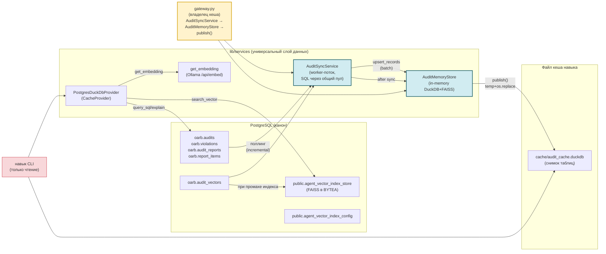
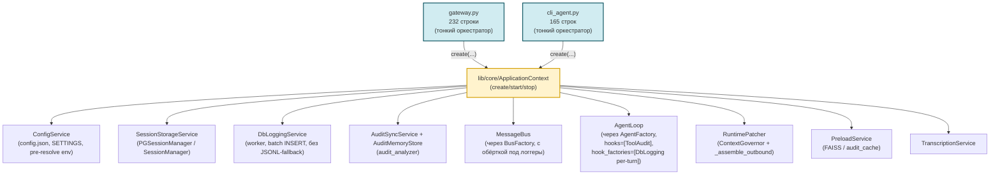
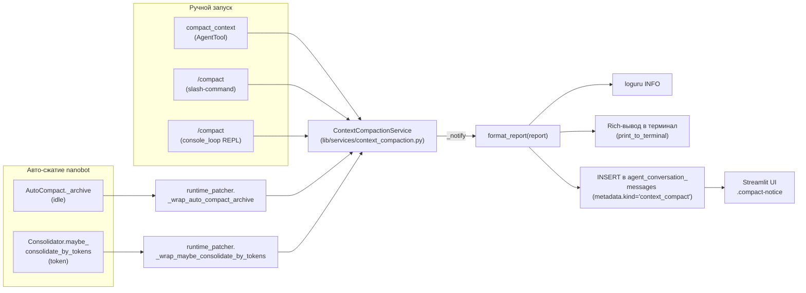

# Разработка nanobot: audit_analyzer и универсальный слой данных

> **Назначение:** техническая документация для разработчиков. Описывает архитектуру
> навыка `audit_analyzer`, универсальный инфраструктурный слой данных
> (`lib/services`), а также **bootstrap-слой** (`lib/core/ApplicationContext`,
> `lib/lifecycle/`, `lib/cli/`, `lib/services/DbLoggingService`/`RuntimePatcher`/...)
> — общий для `gateway.py` и `cli_agent.py`. Управление DuckDB-кешем,
> векторными индексами и SQL-скрипты для развёртывания нужных таблиц.
> Пользовательская документация навыка — [`workspace/skills/audit_analyzer/SKILL.md`](workspace/skills/audit_analyzer/SKILL.md).
> Обзор проекта — [`README.md`](README.md).

---

## 📋 Оглавление

1. [Архитектура](#архитектура)
2. [Сервисный слой (ApplicationContext + lib/)](#сервисный-слой-applicationcontext--lib)
   - [Управление сжатием контекста: `ContextCompactionService`](#управление-сжатием-контекста-contextcompactionservice)
     - [`metadata` JSONB в `agent_conversation_messages`: полный справочник](#metadata-jsonb-в-agent_conversation_messages-полный-справочник)
3. [Структура проекта](#структура-проекта)
4. [Универсальный слой данных lib/services](#универсальный-слой-данных-libservices)
5. [Конфигурация навыка](#конфигурация-навыка)
6. [CLI навыка: режимы](#cli-навыка-режимы)
7. [Жизненный цикл кеша](#жизненный-цикл-кеша)
   - [Управление синхронизацией](#управление-синхронизацией)
8. [Векторная индексация](#векторная-индексация)
9. [SQL-скрипты: создание таблиц](#sql-скрипты-создание-таблиц)
10. [Структура проекта](#структура-проекта)
11. [Тестирование](#тестирование)
12. [Изменения и миграции](#изменения-и-миграции)
13. [Конфигурация `tools.exec` (запуск команд)](#конфигурация-tools-exec)

---

## 🏗 Архитектура

Инфраструктура (DuckDB-кеш, векторные индексы, эмбеддинги) вынесена из навыка
в **универсальный слой** `lib/services` — он не завязан на предметную область
«аудит» и может переиспользоваться любым навыком. Навык `audit_analyzer` остался
тонким CLI: он конфигурирует провайдера из своих настроек и работает с ним
напрямую (без промежуточных обёрток-шимов).



**Потоки данных**

- `gateway.py` — единственный владелец файла кеша навыка. `AuditSyncService`
  (worker-поток, единственное подключение к PG) инкрементально синхронизирует
  таблицы в `AuditMemoryStore` (чисто in-memory DuckDB), а после каждого цикла
  `store.publish()` атомарно записывает снимок (temp + `os.replace`) в файл
  кеша навыка (`in_memory_cache_path`).
- Навык CLI (`predefined`/`sql`) — запросы выполняются по опубликованному кешу
  (или напрямую по PG, если кеш выключен). Создание/обновление кеша его не
  касается. Единый интерфейс бэкенда: `get_schema / query_sql / explain`.
- `--mode vector` — семантический поиск по FAISS-индексу: провайдер загружает
  индекс из `public.agent_vector_index_store` (BYTEA), при промахе пересобирает из
  `oarb.audit_vectors`, эмбеддинг запроса получает через Ollama.

---

## Сервисный слой (ApplicationContext + lib/)

После выделения сервисного слоя gateway и cli_agent сократились с 696/865 до 132/165 строк за счёт
вынесения всей инициализации в `ApplicationContext` (см. подробности в
Подробности в `CHANGELOG.md`. Этот раздел — про
**внутреннее устройство** нового слоя, нужно при добавлении новых
сервисов или изменении lifecycle.

### Точки входа → общий bootstrap



### `lib/core/` (ApplicationContext + фабрики)

- **`application_context.py:ApplicationContext`** — единственный класс,
  собирающий все общие сервисы. Поля (помимо путей и конфига):
  `bus`, `agent`, `tool_audit_hook`, `hooks`, `session_manager`,
  `storage_mode`, `db_logging_service`, `audit_sync_service`,
  `audit_memory_store`, `config_service`, `runtime_patcher`,
  `transcription_service`, `subprocess_manager`, `preload_service`.
  Метод `start()` использует `ShutdownCoordinator` для регистрации
  сервисов; `stop()` — LIFO graceful shutdown.
  **Graceful degradation:** если БД недоступна, сервис остаётся `None`,
  gateway/cli работают без него (с предупреждением в логах).
- **`agent_factory.py:AgentFactory`** — `create(config, bus, session_manager=...,
  cron_service=..., db_logging_service=..., project_hooks=...)` → `(agent, hooks,
  hook_factories)`. `project_hooks` (плагины `workspace/hooks/`) ставятся
  ПЕРЕД `ToolAuditHook` в `hooks=`; агент создаётся ровно один раз.
  `DatabaseLoggingHook` подключается НЕ как общий инстанс, а как фабрика
  оборота (`make_db_logging_hook_factory` в `hook_factories=`) — фреймворк
  создаёт свежий инстанс на каждый оборот, изолируя состояние вопроса между
  конкурентными сессиями (см. `database_logging_hook.py`).
  Lazy-import `lib.hooks.database_logging_hook` через try/except
  (если модуль не подключён — фабрика просто не создаётся).
  Флаг `print_llm_calls` пробрасывается в фабрику оборота: при `True`
  хук печатает в терминал токены каждой LLM-итерации (включается всегда
  в CLI-режиме через `cli_agent.py`; в gateway — опцией
  `gateway.print_llm_calls`).
- **`bus_factory.py:BusFactory`** — `create()` возвращает `MessageBus`,
  опционально обернув `publish_inbound`/`publish_outbound` async-логгерами
  из `db_logging_bus.py`. **Без monkey-patch'ей**: оригинальные методы
  шины сохраняются в замыкании.

### `lib/services/`

Полный список модулей — см. раздел [«Структура проекта»](#структура-проекта) ниже. Здесь — только
**Новые**, с краткой мотивацией:

| Сервис | Мотивация (почему выделен) |
|--------|---------------------------|
| `config_service.py` | Дубликат `_load_runtime_config` + `SETTINGS`-аксессора между gateway и cli. Pre-resolve `${PROVIDER_API_KEY}` от .secrets.env (см. ниже). |
| `session_storage.py` | Выбор `PGSessionManager` / `SessionManager` (auto / postgres / file) с поддержкой `session_manager.json` override. |
| `runtime_patcher.py` | Все monkey-patch'и фреймворка в одном классе с fallback при изменении API nanobot: `ContextGovernor.normalize_tool_result` (persist больших результатов), `AgentLoop._save_turn` (архивация вместо усечения, см. «Ликвидация потери данных»), ограничения вывода exec/tool (`patch_exec_limits`/`patch_tool_limits`), `agent._assemble_outbound` (внедрение `_tool_audit`). |
| `channel_factory.py` | `ChannelManager` + Redis + Postgres каналы + транскрипция (вынесено из gateway). Конструктор принимает `print_worker_activity` (пробрасывается в `PostgresChannel` из `gateway.print_worker_activity`). |
| `transcription_service.py` | openai/groq key/URL/language (вынесено из gateway). |
| `subprocess_manager.py` | Streamlit spawn + terminate/kill. |
| `preload_service.py` | Разделяет FAISS preload (gateway) и audit_cache refresh (cli). |
| `db_logging_service.py` | **Новый** — структурированный журнал агента в `gateway_logs`. |
| `db_logging_bus.py` | **Новый** — обёртки `publish_inbound`/`publish_outbound` для `DbLoggingService`. |

### Pre-resolve `${VAR}` от `.secrets.env`

`nanobot._load_runtime_config` резолвит `${LLM_API_KEY}` только из
`os.environ` и при отсутствии падает `ValueError`. Между тем `config.py`
для провайдерских ключей использует провайдер-скоупинг формат
`.secrets.env`:

```
# providers: llm
api_key=XavGPsHjtNt3uOtFGUhabUuad5PRm2D0W
```

— в `os.environ` это не попадает как `LLM_API_KEY`. Решение
(`ConfigService._pre_resolve_env_refs`): прочитать `config.json`,
найти `${VAR}` плейсхолдеры, для каждого `*_API_KEY` без env — достать
ключ из `SETTINGS.providers.<любой>.api_key` (туда `config.py` уже
подставил значение) и положить в `os.environ` ДО `_load_runtime_config`.
**Gateway больше НЕ требует `export LLM_API_KEY=...` в shell.**

> **Миграция с исторического имени:** в старых конфигах `.secrets.env` мог
> быть `# providers: mistral`. Логика остаётся обратно совместимой: ключ
> из любой непустой секции `providers.*` подставляется как `LLM_API_KEY`.
> Достаточно переименовать секцию в `# providers: llm` для ясности.

### Единый резолв LLM-конфигурации: `lib/services/llm_config.py`

Резолв провайдера/модели/ключа вынесен в общий модуль
`lib/services/llm_config.py::resolve_llm_config()`: дефолт берётся из
`agents.defaults` (модель/провайдер) и `providers.<provider>`
(`apiBase`/`apiKey`) уже-резолвнутых `SETTINGS`, переопределения
(например, `skills.audit_analyzer.llm_*`) передаются через `overrides`.

Используется единообразно:
* навыком `audit_analyzer` — `scripts/skill_config.py::get_llm_config()`;
* бенчмарками — `benchmarks/runner.py::_run_suite()` (без хардкода
  провайдера при `--model`; `ensure_llm_env()` гарантирует
  `LLM_API_KEY` в env для резолва `${LLM_API_KEY}`).

Так смена модели/провайдера/ключа агента автоматически меняет LLM и в
навыке, и в бенчмарке — без дублирования секретов в трёх местах.

### Race-condition fix: callbacks ДО `ctx.start()`

`AuditSyncService` — worker-поток, который делает `initial_load` сразу
после `start()`. Если `set_on_new_records_callback(upsert_records)` ещё
не вызван к этому моменту, `_dispatch` скипает записи → DuckDB остаётся
пустым → `preload_vector_indexes` видит "нет данных" несмотря на
данные в `oarb.audit_vectors`. **Fix:** в `gateway.py:main()` callbacks
устанавливаются **ДО** `ctx.start()`. Тогда worker-тред при первом
`_do_initial_load` уже видит настроенные callbacks → `upsert_records`
вызывается → FAISS preload находит данные.

### Конкурентно-безопасное БД-логирование: per-turn инстанс `DatabaseLoggingHook`

Обороты разных сессий (вопросов) обрабатываются конкурентно
(`AgentLoop._dispatch` → `_concurrency_gate`, дефолт
`NANOBOT_MAX_CONCURRENT_REQUESTS=3`). Проблема: фреймворковый
`AgentRunHookContext` (для `after_run`) **не содержит `session_key`** —
контекст вопроса приходится хранить в самом хуке.

**Исторический баг:** один общий инстанс `DatabaseLoggingHook` на все
сессии, контекст в плоских полях (`_run_session_key`/`_request_id`).
При конкурентном переплетении оборотов чужой вопрос перезаписывал
поля между `before_`/`after_execute_tool`, и:
  * `log_tool_result` / `run_finished` получали request_id чужого вопроса;
  * `after_run` мог `finish_request`/`clear_request` чужую сессию.

**Решение — фабрика оборота.** `DatabaseLoggingHook` создаётся на
КАЖДЫЙ оборот через `make_db_logging_hook_factory(db_logging_service,
agent_id)` (`lib/hooks/database_logging_hook.py`). Фабрика получает
`AgentTurnHookContext` (там есть `session_key`), резолвит `request_id`
через `service.get_request_id(session_key)` и запекает оба значения в
конструкторе — состояние вопроса изолировано между сессиями, гонки нет.

`AgentFactory.create` передаёт фабрику в `AgentLoop` через
`hook_factories=[...]` (а не общий инстанс в `hooks=...`). `ToolAuditHook`
остаётся в `hooks=` — он bucket-безопасен по `session_key`.

`RuntimePatcher.patch_subagent_logging` использует тот же паттерн:
каждый `_SubagentLoggingHook` создаёт СВОЙ `_db_hook` на запуск
подагента (class-level shared `_db_hook` давал ту же гонку между
конкурентными субагентами).

Регрессионный тест: `tests/test_hooks_database_logging.py →
TestDatabaseLoggingHookFactory.test_concurrent_sessions_do_not_mix_request_id`
(переплетение двух сессий → `log_tool_result`/`after_run` несут свой
`request_id`).

### Метрика занятости контекстного окна (`metadata.context_window`)

**Задача.** Видеть в UI, сколько процентов контекстного окна модели
занято финальным запросом — и обновлять это пока агент ещё думает
(живое обновление processing-строки), не дожидаясь конца оборота.

**Решение — три компонента + мост:**

1. **Мост per-iteration usage** (`lib/hooks/database_logging_hook.py`).
   Потокобезопасный словарь `_CONTEXT_BRIDGE: dict[str, dict]` под
   `threading.Lock`. Ключ = `session_key` (`postgres:<chat_id>`), чтобы
   конкурентные сессии не «перепутались». Публичные функции:
   * `seed_context_window(session_key, limit=, model=)` — патч на
     старте оборота кладёт лимит окна и модель (знает только агент).
   * `DatabaseLoggingHook.after_iteration` → `_store_iteration_usage`
     пишет СВЕЖИЙ по-итерационный `context.usage` (именно последняя
     итерация — то, что модель реально видела в финальном запросе).
   * `_store_context_window` — финальный готовый блок, его кладёт
     `_attach_context_window` (патч 2a).
   * `get_context_window(session_key)` — канал читает для live-update;
     предпочитает готовый блок, иначе собирает на лету из
     usage+limit.
   * `pop_context_bridge(session_key)` — анти-stale, чистится при
     `_finalize_turn` и `_mark_failed`.

2. **Патчи `RuntimePatcher`** (`lib/services/runtime_patcher.py`):
   * `patch_context_bridge_seed` (патч 2b) — оборачивает
     `agent._state_build`: на старте оборота сеет лимит/модель в мост
     (best-effort, ошибки не мешают обороте).
   * `_attach_context_window` в `_wrap` `_assemble_outbound` (патч 2a)
     собирает блок `{used: int, limit: int, pct: float (4 знака, clamp 0..1),
     model: str}` из usage последней итерации ÷ лимит окна и кладёт в
     `result.metadata["context_window"]`. Готовый блок дополнительно
     кладётся в мост для канала. Если мост пуст (DB-логирование
     выключено), фолбэк на `agent._last_usage` (сумма по итерациям —
     завышает, но лучше чем ничего).

3. **Живое обновление в канале** (`lib/channels/postgres_channel.py`):
   `_flush_live_context` в `_flush_reasoning_loop` (каждые
   `_flush_interval` секунд) читает `get_context_window(session_key)` и
   пишет блок в `metadata.context_window` processing-ассистент строки
   в БД. UI (Streamlit) видит его через свой поллинг
   `metadata.context_window` и рисует прогресс-бар, который
   заполняется «вживую» по мере роста промпта. После финализации
   оборота `_drop_context_bridge(chat_id)` снимает мост.

**Место хранения:** `metadata.context_window` в JSONB
`agent_conversation_messages` (S1). Без миграций: канал уже сливает
`metadata` целиком в `_finalize_turn`.

**UI:**
* **Streamlit** (`streamlit_app.py`): `_render_context_window(block)` —
  `st.progress(pct, text="Контекст: used / limit · NN% · model")`.
  Рисуется один раз для финальной строки (после загрузки истории)
  и live для processing-строки (каждый poll). Метка `metadata.kind ==
  "context_compact"` (ContextCompactionService) даёт отдельный стиль
  `.compact-notice`.
* **CLI** (`lib/cli/console_loop.py`): `_print_context_window(block)` —
  одна строка `[dim]📊 Контекст: used / limit · NN% · model[/dim]`
  после `_typewriter(content)`. Гейт `cfg.show_context_window`
  (по умолчанию `true`).

**Конфигурация** (`project.json`):
* `cli.show_context_window` (bool, дефолт `true`) — печатать в CLI.
  В `REQUIRED_KEYS` (`tests/test_config_keys.py`).

**Что не делается (явные «нет»):**
* Не суммируется usage по итерациям — `agent._last_usage` слишком
  завышает занятость на многоитеративных оборотах (токены
  накапливаются, но окно модели — снапшот последней итерации).
* Не рисуется в UI из `agent._last_usage` (только из моста) — иначе
  будет рассинхрон с финальным блоком.
* Нет auto-tighten окна (сжатие) — это задача
  `ContextCompactionService` (`lib/services/context_compaction.py`),
  отдельный поток.

**Тесты:** `tests/test_database_logging_bridge.py` (мост),
`tests/test_runtime_patcher.py::TestPatchContextBridgeSeed` (патч 2b),
`tests/test_postgres_channel.py::TestPostgresChannelContextWindow`
(live-update + drop), `tests/test_streamlit_app.py::TestRenderContextWindow`
(UI), `tests/test_console_loop.py::TestPrintContextWindow` (CLI).

### Управление сжатием контекста: `ContextCompactionService`

**Задача.** Дать пользователю и оператору видимый след любого сжатия
контекста диалога — и ручного (``/compact``, ``compact_context``),
и автоматического (idle, token-budget). Один и тот же формат,
один и тот же путь записи.

**Архитектура (один путь — три входа):**



**Точки входа:**

1. **Настоящая slash-команда ``/compact``** —
   `lib/commands/compact_command.py::cmd_compact`, регистрируется
   `RuntimePatcher.patch_compact_command` в `agent.commands`
   (`CommandRouter`), где это единственный путь, общий для всех каналов
   (postgres, streamlit, telegram). В `run()` зарегистрированные команды
   перехватываются **до** LLM (``_dispatch_command_inline`` /
   ``_state_command``), поэтому сжатие срабатывает детерминированно и
   безоговорочно, а не «по усмотрению» модели. Handler ставит
   ``FINAL_TURN_KEY="_final_turn"`` в outbound (см. «Воркеры не берут
   задачи»), зовёт ``svc.compact(session_key=ctx.key, idle=..., force=True)``.

2. **CLI-команда ``/compact``** (`lib/cli/console_loop.py::_run_cli_compact`).
   Приватный путь REPL: в `run_repl` после проверки `_is_exit_command`
   перехват ``if command == "/compact" or command.startswith("/compact ")``.
   Создаёт локальный `ContextCompactionService(agent, settings=None)`
   (в CLI нет `SETTINGS`, но `_write_history_notice` сам отключается —
   нет `channels.postgres.dsn`), зовёт
   ``svc.compact(session_key="cli:<chat_id>", force=True)``, печатает
   отчёт Rich-цветом (cyan/yellow). Флаги `idle` / `--idle` / `-i`
   допустимы для совместимости, поведение не меняют (``force=True``
   уже подразумевает жёсткое idle-сжатие).

3. **Tool ``compact_context``** (`workspace/tools/compact_context.py`),
   регистрируется `RuntimePatcher.patch_project_tools` в `apply_all`
   (см. `lib/services/runtime_patcher.py`). Параметры:
   `session_key: str | None` (по умолчанию — текущая из
   `current_request_session_key()`), ``idle: bool=False``, ``force: bool=True``.
   Пустой вызов ``compact_context({})`` (= ручная просьба пользователя)
   трактуется как ``force=True`` — жёсткое сжатие независимо от порога
   токенов (JSON-schema-дефолт nanobot не применяется, значение подставляет
   Python-сигнатура). Явный ``force=False`` возвращает в token-budget режим.

4. **Авто-сжатие** — обёртки `patch_compaction_tracking` в
   `runtime_patcher`:
   * `_wrap_auto_compact_archive` (`agent.auto_compact._archive`) —
     перед/после вызова замеряет `last_consolidated` и `tokens`,
     если курсор сдвинулся и `result` непустой — зовёт
     `svc.record_external_compaction(...)`.
   * `_wrap_maybe_consolidate_by_tokens`
     (`agent.consolidator.maybe_consolidate_by_tokens`) — то же:
     diff `last_consolidated` до/после; если сдвинулся — пишет
     заметку через `record_external_compaction`.

Ручной вход ``/compact`` имеет два обработчика одного слова: slash-команда
в ``CommandRouter`` (сетевые каналы) и перехват в REPL. Оба ставят
``force=True``.

**Семантика ``force``.** ``ContextCompactionService.compact(session_key, *,
idle=False, force=False, max_suffix=8)``: если ``idle or force`` — идёт
жёсткое усечение ``consolidator.compact_idle_session``, иначе — token-budget
``maybe_consolidate_by_tokens`` (пропустит сессию ниже ``consolidationRatio``).
``force=True`` выражает явное пользовательское действие (``/compact`` или
ручной вызов tool'а) и игнорирует порог токенов. Ручные пути (slash-команда,
CLI, пустой вызов tool'а) всегда ``force=True``; только явный
``force=False`` возвращает в token-budget режим.

**Оценка размера сессии.** ``_estimate`` зовёт нативный
``consolidator.estimate_session_prompt_tokens`` (может быть sync или async).
Если он бросил исключение — ``_estimate_fallback`` даёт грубую оценку по
``~4 символа = 1 токен`` из ``session.messages`` (chain-строка помечается
``[fallback]``), чтобы отчёт/логи не писали «0 токенов» при реальном размере
в десятки тысяч. Fallback-значение идёт и в ``tokens_before``/``tokens_after``,
и в заметку ``metadata.compact``.

**Единый путь записи.** Ручной запуск зовёт `compact()`, авто —
`record_external_compaction(...)`. Оба заканчиваются вызовом
`ContextCompactionService._notify(report)`:

```python
async def _notify(self, session_key, report):
    text = self.format_report(report)
    logger.info("Context compaction [{}] {}: archived={}, tokens {}→{}", ...)
    if self.print_to_terminal:
        Console().print(f"[dim]🗜️ {text}[/dim]")
    if self.notify_in_history:
        await self._write_history_notice(session_key, report)
```

`format_report`, loguru-строка и `_write_history_notice` — **общие**
для всех путей. Ручное и автоматическое сжатие неразличимы по
формату и по содержимому в БД/логах/консоли.

**Формат `format_report`** (`ContextCompactionService.format_report`):

Для ``archived > 0``:

```
<текст LLM-сводки (если есть)>

Итог: заархивировано N сообщений (осталось K), BEFORE → AFTER токенов (экономия ≈P%).
```

Для ``archived == 0`` (сжатие не потребовалось):

```
Сжатие сессии «<key>» не потребовалось: контекст уже в пределах бюджета (N токенов).
```

Для ошибки:

```
Сжатие не выполнено: <причина>
```

**Что пишется в `agent_conversation_messages`:**

| Поле | Значение |
|---|---|
| `chat_id` | из `session_key` (`postgres:<chat>` или `streamlit:<chat>`) |
| `role` | `assistant` |
| `status` | `completed` |
| `content` | результат `format_report(report)` (полный текст) |
| `metadata.kind` | `context_compact` (метка для UI/аналитики) |
| `metadata.compact` | весь `report` (archived_msgs, kept_msgs, tokens, summary, mode) |

Поддерживаются **только** префиксы `postgres:` и `streamlit:` — это
единственные каналы с таблицей обмена. Для CLI-сессий (`cli:`)
запись пропускается: REPL сам показывает отчёт в терминале, в БД
идти нечему.

**Почему `agent_conversation_messages`, а не `agent_session_messages`:**
контекст промпта строится из `PGSessionManager` (таблица
`agent_session_messages`). Если бы заметка попадала туда — она бы
съедала токены, которые сжатие только что освободило. Заметка
видна в чате, но не загружается в LLM-промпт.

**Конфигурация** (`project.json` → `gateway.compact.*`, все ключи
опциональны, дефолты прямо в коде):

| Ключ | Дефолт | Эффект |
|---|---|---|
| `gateway.compact.enabled` | `true` | Регистрировать tool `compact_context`, slash-команду `/compact` и обрабатывать `/compact` в CLI. При `false` патчи пропускаются, все пути возвращают «отключено». |
| `gateway.compact.notify_in_history` | `true` | Писать заметки в `agent_conversation_messages` (ручные и авто). |
| `gateway.compact.print_to_terminal` | `false` | Дублировать отчёт в Rich-вывод gateway (по образцу `print_worker_activity`). |

На уровне nanobot (`config.json`) поведение сжатия управляется
стандартными ключами `consolidationRatio` (дефолт `0.5`) и
`idleCompactAfterMinutes` (в этом проекте `0` — auto-compact idle
выключен; см. `nanobot/config/schema.py:151-163`). См. также
**[Конфигурация](#конфигурация-навыка)** и
**[Структура проекта](#структура-проекта)**.

**Защита от `list_sessions`-шторма при выключенном idle-компакте**
(`runtime_patcher.patch_auto_compact_idle_guard`): `AgentLoop.run` при
отсутствии входящих раз в секунду зовёт `AutoCompact.check_expired()`
(`nanobot/agent/loop.py:1034`), а тот даже при `idleCompactAfterMinutes=0`
делает `sessions.list_sessions()` — дорогой N+1 (перечисление всех сессий +
отдельный запрос превью каждой). При сотне сессий это ~150 запросов/сек
вхолостую. Патч при `auto_compact._ttl <= 0` заменяет `check_expired` на
no-op — сбрасывая load практически до нуля (остаётся только легитимный
поллинг каналов). При `ttl > 0` патч пропускается.

**UI:**

* **Streamlit** (`streamlit_app.py`):
  * `_load_chat_history` поднимает флаг `compact_notice=True`, если
    `metadata.kind == "context_compact"`.
  * В рендере (строка ~290): ``<div class="compact-notice">🗜️ {content}</div>``
    через CSS-стиль — жёлтый фон, левая полоска `#f0c040`,
    мелкий шрифт, отступы. Не путается с обычными
    assistant-сообщениями.
* **CLI** (`lib/cli/console_loop.py`): `_run_cli_compact` печатает
  через Rich: `[cyan]🗜️ {text}[/cyan]` при успехе, `[yellow]🗜️ ...`
  при ошибке.
* **Терминал gateway** (`lib/services/context_compaction.py`):
  если `print_to_terminal=true`, Rich-вывод `[dim]🗜️ {text}[/dim]`
  (по образцу `print_worker_activity`).
* **loguru**: всегда пишется INFO-строка вида
  `Context compaction [token] postgres:streamlit: archived=12, tokens 34500→12300`
  (и аналогично для авто — `Auto context compaction [idle] ...`).

**Что не делается (явные «нет»):**

* Не добавляются служебные сообщения в `session.messages` при
  ручном `/compact` — это намеренно: иначе освобождённые токены
  сразу бы съела новая запись в истории. Состояние сессии
  (`last_consolidated`, `_last_summary`) правит штатный
  `Consolidator` nanobot (`memory.py::_persist_last_summary`),
  а наш сервис лишь пишет UI-заметку.
* Не отправляется пользователю уведомление через cron/heartbeat —
  сжатие не требует реакции.
* Не суммируется экономия по сессиям в отдельную таблицу — для
  аудита достаточно `metadata.compact` в `agent_conversation_messages`
  и loguru-логов.

**Безопасность:** вся блокировка уже внутри консолидатора
(`Consolidator.get_lock(session_key)`) — параллельные сжатия одной
сессии serialized. Обёртки `runtime_patcher` не добавляют
синхронизации и не делают двойных вызовов.

**Тесты:** `tests/test_context_compaction.py` (41 тест):

* `TestFormatReport` — формат отчёта: failure, idle-no-archive,
  with-archive+summary, summary-truncation, summary-`nothing`-marker,
  archive-no-summary.
* `TestEstimateFallback` — `_estimate_fallback` по символам, пустые
  сообщения, использование fallback, когда нативный метод падает.
* `TestCompact` — ручной путь: disabled-failure, missing-session-key,
  token-compaction-archives-and-reports, idle-mode, idle-no-archive,
  compactor-failure, session-state-relies-on-nanobot-consolidator,
  no-extra-message-in-session.
* `TestCmdCompact` — `cmd_compact` (slash-команда): возвращает
  `OutboundMessage` с `_final_turn`, всегда `force=True`, парсит `idle`,
  почитает `enabled=false`, прокидывает `settings` через `partial`.
* `TestCompactContextTool` — `CompactContextTool.enabled`/`create`/`execute`
  (стандартный nanobot-паттерн, читает `gateway.compact.*` через
  `ctx._settings_ref`).
* `TestCompactContextToolRegistered` — `patch_project_tools` реально
  регистрирует `compact_context` в `agent.tools`.
* `TestRecordExternalCompaction` — единый путь записи:
  `_write_history_notice` зовётся с правильным report,
  skip при `archived=0`, skip при `notify_in_history=false`.
* `TestPatchCompactionTracking` — `patch_compaction_tracking`:
  skip при `enabled=false` / `notify_in_history=false`,
  archive-wrapper зовёт `record_external_compaction`,
  skip когда авто не архивирует,
  maybe-consolidate-wrapper зовёт `record_external_compaction`.

#### Переопределение шаблонов nanobot: `workspace/overrides/`

`lib/services/consolidator_locale.py` подкладывает каталог `workspace/overrides/`
в Jinja2-loader шаблонов nanobot на старте приложения (`ApplicationContext.start()`),
поэтому любой системный промпт можно переопределить без правки пакета.

**Механизм.** `nanobot.utils.prompt_templates._environment()` кэшируется
`@lru_cache` и возвращает один и тот же `Environment`; `apply_template_overrides()`
меняет у него `loader` на `ChoiceLoader`, который сначала ищет файл в
`workspace/overrides/`, затем в штатных `templates/`. Мутация того же объекта
видна всем `render_template(...)`, патчить функцию не нужно. Идемпотентен;
при отсутствии каталога — no-op (используются штатные шаблоны).

**Правило размещения.** Файлы кладутся под
`workspace/overrides/<имя шаблона, как оно передаётся в render_template>`,
например `workspace/overrides/agent/consolidator_archive.md` переопределяет
`agent/consolidator_archive.md`.

**Сейчас в `workspace/overrides/`:**

* `agent/consolidator_archive.md` — русскоязычная инструкция Consolidator
  (базовая часть шаблона + правило «пиши факты на языке диалога»). Без него
  Consolidator извлекал бы факты на английском даже из русских диалогов.
  Это делает его единственным источником инструкции для
  `Consolidator.compact_idle_session` / `maybe_consolidate_by_tokens`
  (render `nanobot/agent/memory.py` при каждом сжатии).

**Тесты:** `tests/test_consolidator_locale.py` — приоритет override-файла,
fallback на штатный шаблон при отсутствии файла, идемпотентность, no-op при
отсутствии каталога, корректный путь по умолчанию.

#### `metadata` JSONB в `agent_conversation_messages`: полный справочник

`metadata` — JSONB-колонка таблицы обмена. Это **основной канал
передачи сервисных данных от бэкенда к UI** (помимо `content`,
`media`, `buttons`, `reply_to`). Любой UI, читающий
`agent_conversation_messages`, может отличить служебные записи
от обычных диалоговых по `metadata.kind`.

DDL: `metadata JSONB DEFAULT '{}'::jsonb` (см.
`sql/channels/create_public_agent_conversation_messages.sql`).
Чтение — `_decode_jsonb(metadata)` (из `utils.jsonb`).

##### 1. Жизненный цикл `metadata` одной строки

Одна строка проходит несколько фаз, в каждой из которых
`metadata` дополняется:

```
INSERT (user/assistant placeholder, status='pending'/'processing')
   │   metadata = {}   (или raw_meta от UI — см. §3)
   ▼
status='processing' (работает канал PostgresChannel)
   │   metadata += {message_id, answer_id, session_key, retry_count}
   │   metadata += {reasoning}            (live, в процессе оборота)
   │   metadata += {context_window}       (live, каждые flush_interval)
   ▼
status='completed'   (финал оборота)
   │   metadata += {_tool_audit}          (в патче _assemble_outbound)
   │   metadata уже содержит reasoning, context_window, message_id, answer_id
   ▼
статус меняется: error/failed (см. §4)
   │   metadata += {error: <reason>}      (только error/failed)
   │   metadata.retry_count инкрементируется
```

То есть в `metadata` **накапливаются** ключи от разных подсистем;
UI читает то, что есть, и не обязан понимать каждый ключ.

##### 2. Все ключи `metadata` — таблица

| Ключ | Тип значения | Где создаётся | Где обновляется | Удаляется? | Назначение |
|---|---|---|---|---|---|
| `kind` | `str` | `ContextCompactionService._write_history_notice` | — | никогда | Маркер «служебная заметка». Сейчас единственное значение — `"context_compact"`. Используется UI для условного рендера. |
| `compact` | `dict` | `ContextCompactionService._write_history_notice` | — | никогда | Словарь со статистикой сжатия. Только при `kind == "context_compact"`. См. подсекцию ниже. |
| `message_id` | `str` (UUID) | `PostgresChannel._poll_once` (в `meta` для assistant-placeholder) | — | никогда | ID user-сообщения, на которое это assistant-сообщение — ответ. Пара `message_id ↔ answer_id` (взаимные ссылки в соседних строках). |
| `answer_id` | `str` (UUID) | `PostgresChannel._poll_once` (в `meta` для user-строки) | — | никогда | ID assistant-placeholder, созданного сразу при клейме. Позволяет каналу находить строку для обновления. |
| `session_key` | `str` | Передаётся в `raw_meta` (UI/внешний клиент) | — | никогда | Полный ключ сессии nanobot, формат `<channel>:<chat_id>`. Если не передан в raw_meta, канал подставляет `f"postgres:{chat_id}"` (см. `postgres_channel.py:718`). |
| `retry_count` | `int` | `PostgresChannel._reclaim_and_heal` / `_mark_failed` | инкрементируется при каждом `error`/`stuck` | никогда | Сколько раз задача была в `error`. При `>= max_stuck_retries` → `failed`. |
| `error` | `str` | `PostgresChannel._mark_failed` | — | никогда | Только в строках со статусом `error` или `failed`. Краткое описание причины: `"dispatch_error"`, `"write_error"`. |
| `reasoning` | `str` | `PostgresChannel._flush_reasoning` (live) + `_finalize_turn` (atomic append) | дописывается через `_reasoning_io_lock` | никогда | Полный текст рассуждений модели (chain-of-thought). Может быть очень длинным. |
| `context_window` | `dict` | `PostgresChannel._flush_live_context` (live) | перезаписывается каждые `_flush_interval` сек | никогда | Метрика занятости контекстного окна: `{used: int, limit: int, pct: float (0..1, 4 знака), model: str}`. См. подсекцию «Метрика занятости контекстного окна» выше. |
| `_tool_audit` | `list[dict]` | `RuntimePatcher.patch_assemble_outbound` (финальный outbound) | — | никогда | Массив записей вызовов инструментов за оборот. Рендерится в UI (Streamlit) и CLI. |

**Не пишется в `metadata`:** `_final_turn` (флаг протокола канала,
в БД не пишется как значимое поле), `latency_ms` (для логов).

##### 3. `raw_meta` от UI (что кладёт источник)

Когда внешний клиент (Streamlit, REST, Telegram-бот) пишет
**новое** user-сообщение, он может положить любые поля в `metadata`
INSERT-а. Канал их читает и мерджит с собственными ключами:

```python
# postgres_channel.py:711-716
raw_meta = _decode_jsonb(row["metadata"])
# ...
meta: dict[str, Any] = {
    "message_id": user_msg_id,
    "answer_id": assistant_msg_id,
    **raw_meta,
}
```

**Конвенция** для `raw_meta` от UI: только поля, описывающие
маршрутизацию. Сейчас в проекте используется `session_key`
(потенциально; Streamlit-INSERT не пишет `metadata` — DEFAULT `'{}'`).
Любые `kind`/`compact`/`reasoning`/`context_window` от UI
**игнорируются** (будут перезаписаны каналом/патчами на следующих
стадиях жизненного цикла).

Пример валидного `raw_meta` для внешнего клиента:
```json
{"session_key": "telegram:123456", "client_meta": {"thread": "..."}}
```

##### 4. Кто пишет и когда

| Источник | Файл | Когда | Что пишет в `metadata` |
|---|---|---|---|
| UI (INSERT) | `streamlit_app.py:567` и аналоги | при отправке user-сообщения | `raw_meta` (опционально, `session_key` и прочее) |
| `PostgresChannel._poll_once` | `lib/channels/postgres_channel.py:758` | при клейме задачи | `message_id` (в assistant-строке), `answer_id` (в user-строке) |
| `PostgresChannel._flush_reasoning` | `postgres_channel.py:530` | live, каждые `_flush_interval` сек | `reasoning` (дописывается) |
| `PostgresChannel._finalize_turn` | `postgres_channel.py:1156` | на `_turn_end` | `reasoning` (atomic append остатков) |
| `PostgresChannel._flush_live_context` | `postgres_channel.py:560-570` | live, каждые `_flush_interval` сек | `context_window` (перезаписывается) |
| `PostgresChannel._reclaim_and_heal` | `postgres_channel.py:347-348` | lease-loop, истёк lease | `retry_count++` (затем `status='error'` или `'failed'`) |
| `PostgresChannel._mark_failed` | `postgres_channel.py:835-836` | ошибка диспетчера/записи | `retry_count++`, `error=<reason>` |
| `RuntimePatcher.patch_assemble_outbound` | `lib/services/runtime_patcher.py:730, 722, 96` | на финальном outbound | `_tool_audit` (если есть), `_final_turn: true` (внутренний протокол), `context_window` (если есть) |
| `ContextCompactionService._write_history_notice` | `lib/services/context_compaction.py:332` | после успешного сжатия (ручного или авто) | `kind: "context_compact"`, `compact: {…}` |

##### 5. Маркер `metadata.kind` — версионирование служебных заметок

`metadata.kind` — **точка расширения**: если в будущем добавятся
другие типы служебных заметок (например, `metrics_summary`,
`compaction_failure`, `tool_error_highlight`), они идут по тому же
контракту:

```json
{"kind": "<type>", "<type>": {<payload>}, "...": "..."}
```

**Конвенция:**

* `kind` — короткая строка-идентификатор, `lower_snake_case`.
* `<type>` (то же имя в `payload` ключе) — основной машино-читаемый
  блок.
* `content` строки — уже отформатированный человеком текст для
  показа. UI может рендерить **только** `content` без чтения payload.
* Для UI-клиента: `if metadata.get("kind") == "X": render_special()`
  иначе обычное сообщение.

**Версионирование:** при изменении формата payload — менять `kind`
на `<type>_v2`. Старые записи остаются с `kind = "<type>"` для
обратной совместимости. UI читает обе версии.

**Сейчас единственное значение `kind` — `"context_compact"`.**

##### 6. `metadata.compact` — payload для `kind == "context_compact"`

Только при `kind == "context_compact"`. Записывается
`ContextCompactionService._write_history_notice` после успешного
ручного или автоматического сжатия.

| Поле | Тип | Описание |
|---|---|---|
| `session_key` | `str` | Полный ключ сессии (например, `postgres:streamlit`) |
| `mode` | `"token"` \| `"idle"` | Режим: token-budget (`maybe_consolidate_by_tokens`) или idle (`compact_idle_session`) |
| `ok` | `bool` | `true` если сжатие успешно |
| `archived_msgs` | `int` | Сколько сообщений заархивировано (≥ 1 для записи) |
| `kept_msgs` | `int` | Сколько сообщений осталось в сессии |
| `tokens_before` | `int` | Размер промпта до сжатия (estimated) |
| `tokens_after` | `int` | Размер промпта после сжатия (estimated) |
| `summary` | `str \| null` | Текст LLM-сводки (если был; при `raw_dump=true` — отсутствует) |
| `raw_dump` | `bool` | `true` если LLM-саммарайзер упал, сделана raw-выгрузка без сводки |

**Правила:**

* `archived_msgs > 0` — иначе заметка **не пишется** (нет смысла).
* `metadata.compact.session_key` есть, даже если в `content` не упомянут.
* Для UI-клиента: `pct = (1 - compact.tokens_after / compact.tokens_before) * 100`
  — процент экономии.

##### 7. Примеры UI-логики

**Streamlit** (`streamlit_app.py`) — три места с условным рендером:

```python
# _load_chat_history (строки 89, 96, 100)
if metadata.get("kind") == "context_compact":
    msg_entry["compact_notice"] = True
if isinstance(metadata.get("context_window"), dict):
    msg_entry["context_window"] = metadata["context_window"]
if role == "assistant" and metadata.get("reasoning"):
    msg_entry["reasoning"] = metadata["reasoning"]

# _check_response (строка 157-159) — для одного ответа
metadata = _decode_jsonb(row["metadata"])
result = {"content": row["content"] or "", "metadata": metadata, "media": media}

# _get_processing_state (строки 175-177) — для live-обновления
meta = _decode_jsonb(row["metadata"])
return {"content": ..., "reasoning": meta.get("reasoning", "")}
```

UI читает **только** то, что знает (`reasoning`, `context_window`,
`kind`/`compact_notice`). Не знакомые ключи просто игнорируются.

**React/Telegram-бот — минимальный рендер `kind`:**

```tsx
{msg.metadata?.kind === "context_compact" ? (
  <div className="compact-notice">
    <span>🗜️</span>
    <span>{msg.content}</span>
    {msg.metadata.compact.archived_msgs > 0 && (
      <span className="badge">
        -{Math.round(
          (1 - msg.metadata.compact.tokens_after /
               msg.metadata.compact.tokens_before) * 100
        )}%
      </span>
    )}
  </div>
) : (
  <div className="message">{msg.content}</div>
)}
```

```python
# Telegram-бот
if row["metadata"].get("kind") == "context_compact":
    compact = row["metadata"].get("compact", {})
    pct = (1 - compact.get("tokens_after", 0) /
                max(compact.get("tokens_before", 1), 1)) * 100
    await bot.send_message(
        chat_id,
        f"🗜️ {row['content']}\n\n_экономия ≈{pct:.0f}%_",
        parse_mode="Markdown",
    )
else:
    await bot.send_message(chat_id, row["content"])
```

**Стиль в Streamlit** для `compact_notice`:

* CSS-класс `.compact-notice` — жёлтый фон `#fff8e1`,
  левая полоска `#f0c040`, мелкий шрифт, скругления. Определён в
  `<style>` блоке.
* В `_load_chat_history` поднимается флаг `compact_notice=True`.
* В цикле рендера — отдельный HTML-блок
  `<div class="compact-notice">🗜️ {content}</div>` через
  `st.markdown(..., unsafe_allow_html=True)`. Без акцента текст
  заметки читаем, но визуально сливается с обычными ответами.

##### 8. Что НЕ делается (явные «нет»)

* **Нет глобальной схемы** — `metadata` это JSONB, схема **описывается
  в коде и в этой документации**, а не в DDL. Дрейф возможен —
  при появлении нового ключа обновляйте эту секцию.
* **Нет валидации** на стороне записи — UI может положить любые
  поля в `raw_meta` (см. §3), но канал/патчи перезапишут конфликтующие
  ключи своими значениями.
* **`_final_turn` в БД не сохраняется** — это флаг протокола
  (`OutboundMessage.metadata["_final_turn"] = True`), используется
  каналом для решения «merge vs finalize». При записи в БД он
  не несёт полезной нагрузки и не документируется как часть
  контракта.
* **Заметка `kind == "context_compact"` не сортируется отдельно** от
  обычных сообщений — она появляется в `created_at` хронологии,
  как любой `assistant`-ответ. Если UI хочет группировать
  «последний сжатый ответ отдельно» — это на стороне UI.
* **Заметка `kind == "context_compact"` не фильтруется по `role`**
  — она `assistant`, как обычные ответы. UI, которые ограничивают
  `role IN ('user', 'assistant')`, покажут её автоматически.

##### 9. Совместимость и обратная совместимость

* Если `metadata` не содержит ключа, который UI ожидает — UI должен
  обрабатывать отсутствие (`metadata.get("X")` / `?.` / `metadata?.X`).
* `metadata.reasoning` может быть очень длинным — UI может рендерить
  свёрнутым `<details>` (как делает Streamlit).
* `metadata.context_window.pct` уже clamp 0..1, 4 знака — можно
  умножать на 100 сразу, не нормализуя.
* `metadata.compact.tokens_before/after` — `0` допустимо (если
  замер не удался, `_estimate` вернул `(0, "")`); UI должен делить
  осторожно (`max(compact.tokens_before, 1)` для pct).
* Старые строки в `agent_conversation_messages` без `metadata.kind`
  — это нормально, читается как `null` → рендер как обычное сообщение.

##### 10. Тесты

* `tests/test_postgres_channel.py::TestPostgresChannelReasoning` —
  `reasoning` live + atomic append в `_finalize_turn`.
* `tests/test_postgres_channel.py::TestPostgresChannelContextWindow` —
  `context_window` live-update + drop.
* `tests/test_streamlit_app.py::TestRenderContextWindow` —
  UI-рендер `context_window`.
* `tests/test_console_loop.py::TestPrintContextWindow` —
  CLI-рендер `context_window`.
* `tests/test_context_compaction.py` — запись `kind == "context_compact"`,
  `compact`-payload, skip-правила.
* `tests/test_runtime_patcher.py::TestPatchAssembleOutbound` —
  внедрение `_tool_audit` в `metadata`.

### Ликвидация потери данных при усечении больших результатов инструментов

**Проблема.** Результаты больших инструментов терялись на нескольких уровнях:

1. **exec/shell**: nanobot режет вывод команды до
   `MAX_OUTPUT_CHARS = 50K` символов и вставляет маркер
   `... (19,761 chars truncated) ...` (`nanobot/agent/tools/shell.py`,
   `exec_session.py`), отбрасывая середину. Persist потом сохраняет
   «голову+хвост» — данные теряются безвозвратно.
2. **История сессии**: `AgentLoop._save_turn` усекает строковый результат
   инструмента до `max_tool_result_chars = 16K` символов, если результат не
   ушёл в persist раньше (в первую очередь это `read_file`).
3. **Вторичные инструменты** (`read_file`/`grep`/`list_dir`) имеют свои
   потолки с маркерами `truncated`.

**Решение (все уровни закрыты патчами `RuntimePatcher`):**

| Патч | Что делает |
|------|-----------|
| `patch_exec_limits` | Поднимает `MAX_OUTPUT_CHARS` (дефолт 500K), `DEFAULT_MAX_OUTPUT_CHARS` (100K), `ExecTool._MAX_OUTPUT`, а также подменяет `maximum` в JSON-Schema параметра `max_output_chars`/`max_output_tokens` (модель может запросить вывод >50K). Безопасно для контекста: вывод exec не exempt в persist → >`persist_threshold` уходит полным файлом в `data_store`, в контекст — ссылка. |
| `patch_tool_limits` | Поднимает `ReadFileTool._MAX_CHARS` (512K), `search._DEFAULT_HEAD_LIMIT` / `_DEFAULT_FILE_HEAD_LIMIT` (500/400), `GrepTool._MAX_FILE_BYTES` (20MB), `ListDirTool._DEFAULT_MAX` (500). |
| `patch_save_turn` | Оборачивает `AgentLoop._save_turn`: любой большой результат `role == "tool"` (строка или JSON-сериализуемый список) пишется **полным** файлом в `data_store` через `SessionFileStore` (суффикс `__<hash>` — dedupe), в историю кладётся ссылка `[Result saved to data_store/<path> (<size> KB)]` — тот же формат, что кастомный persist. Оригинальный `_save_turn` вызывается с копией сообщений, логика nanobot не дублируется. |
| `save(..., dedupe=True)` | Новый параметр `SessionFileStore.save`: повторное сохранение того же содержимого (sha1, первые 12 hex) возвращает уже существующий файл (`deduped=True`), чтобы повторные/конкурентные обороты не плодили копии. |

**Конфигурация** — `gateway.tool_result_limits` в `project.json`
(все ключи опциональны, дефолты в коде):

```jsonc
"tool_result_limits": {
  "exec_max_output_chars": 500000,
  "exec_default_output_chars": 100000,
  "read_file_max_chars": 512000,
  "grep_head_limit": 500,
  "grep_file_head_limit": 400,
  "grep_max_file_bytes": 20000000,
  "list_dir_max_entries": 500
}
```

**Fallback-поведение**: каждый патч в try/except; при изменении API nanobot —
`(False, <причина>)` в `PatchReport`, процесс не падает. `_save_turn`-обёртка
при `OSError` в persist грейсит — вызывает оригинал (поведение «как раньше»).
`read_file` остаётся exempt в `normalize_tool_result` (избегаем
read→persist→read петли).

**Реальные проверки** — `tests/test_runtime_patcher_e2e.py` (9 тестов):
настоящий `ExecTool` исполняет команду с выводом >лимита и проверяет
отсутствие маркера `chars truncated` после патча; настоящий `ReadFileTool`
читает файл >дефолтного потолка целиком; `_save_turn`-обёртка и
`ContextGovernor.normalize_tool_result` пишут **полные** файлы на диск в
`data_store/` и подменяют историю ссылкой. Каждый тест сам восстанавливает
состояние фреймворка в `finally`.

---

## Сервисный слой (MessageExchange + LLM-клиент + утилиты)

Этот раздел добавляет поверх сервисного слоя набор общих модулей, чтобы
устранить дрейф поведения между каналами, навыками и CLI-инструментами.

### `lib/channels/message_exchange.py` — общий движок каналов

`MessageExchange` — единая точка кодирования/декодирования `InboundMessage` /
`OutboundMessage`, поллинга и публикации outbound, фильтрации служебных
сообщений. `PostgresChannel` и `RedisChannel` — тонкие обёртки над ним,
`streamlit_app.py` использует тот же движок для чтения истории. Запрещено
дублировать логику polling/encoding в новых каналах — только через
`MessageExchange`.

Зависимости модуля:
- `lib/utils/media.py` — кодек media (AW-формат `{filename, file_id, mime_type,
  file_size}` + обратная совместимость со старым `{filename, data}` и
  data-URL).
- `lib/utils/media_jsonb.py` — JSONB-декодер media для PG.
- `lib/utils/outbound_filter.py` — единый фильтр служебных outbound
  (`system`, `audit`, `tool_audit`, `_assemble_outbound`-артефакты).
- `SessionFileStore` (`lib/utils/session_file_store.py`) — общий стор
  вложений под `data_store/cache/sessions/<key>/attachments/`.

При добавлении нового канала: наследовать `nanobot.channels.base.BaseChannel`
и делегировать `start/stop/send/send_delta/poll_once` в `MessageExchange`.
Подробнее — [`lib/channels/README.md`](lib/channels/README.md).

### Мульти-машинный пул воркеров (аренда задач через `agent_worker_claims`)

`PostgresChannel` разворачивается на нескольких машинах как полный gateway,
читающий одну таблицу `public.agent_conversation_messages`. Чтобы одна задача
(сообщение веб-чата) физически не обрабатывалась двумя воркерами, введена
таблица аренд `public.agent_worker_claims` (`sql/workers/`, DDL — см.
`sql/README.md`). Эксклюзивность гарантирует **UNIQUE PK `(task_id)`, а не
MVCC/`UPDATE ... WHERE status='pending'`**: два `INSERT` с одним `task_id`
невозможны, второй падает на unique-индексе.

**Инвариант:** `status='processing' ⇔ существует ровно одна claim-запись с
живым lease` для этого `task_id`.

**Статусы задач:**

| Статус | Значение | Повторяется? |
|---|---|---|
| `pending` | готова к обработке | да, сразу |
| `processing` | в работе воркера (держит claim) | нет — защищена lease |
| `error` | повторяемая ошибка | да, после `error_retry_delay` |
| `failed` | терминальный (не меняется) | нет — окончательно |
| `completed` | успешно завершена | — |

`error` и `failed` разведены: `error` (retry-каунтер в `metadata.retry_count`
не исчерпан) возвращается в пул после паузы; `failed` — immutable-терминал.
Раньше обе ситуации сводились к `failed`, и web-клиент ждал оконное время на
«появление в работе», которое могло никогда не наступить.

**Клейм (`_claim_one`) — одна транзакция:**
1. `SELECT` самого старого кандидата (`pending` или `error` с истёкшим
   backoff) без активного claim и из чата без активной `user`-задачи
   (`status='processing'`);
2. `INSERT INTO agent_worker_claims ...` — арбитр эксклюзивности; при
   `UniqueViolation` транзакция откатывается и выбирается следующий кандидат;
3. `UPDATE messages SET status='processing'` — владелец задачи живёт только
   в `agent_worker_claims.worker_id`, колонка в сообщениях не используется.

**Lease и heartbeat:** срок аренды = `processing_timeout`. Фоновая задача
`_lease_loop` каждые `lease_interval` продлевает `lease_until` своим арендам и
запускает `_reclaim_and_heal`. Это **единственный** источник reclaim/heal —
из горячего пути опроса (`poll_inbound`) транзакция убрана, чтобы не гонять
4 UPDATE/DELETE на каждом тике `poll_interval`. Перед запуском
`_reclaim_and_heal` `_lease_loop` проверяет быстрый гейт `_reclaim_needed`
(есть ли хоть одна `processing`-строка или хоть один claim): на пустом столе
транзакция пропускается целиком (ред. один `SELECT ... EXISTS` на тик).

**`_reclaim_and_heal` (одна транзакция):**
1. `DELETE FROM claims WHERE lease_until < NOW()` — «мёртвый» воркер
   освобождает задачи: задача → `pending` (или `failed` при исчерпании
   `max_stuck_retries`), assistant-placeholder удаляется;
2. `processing`-без-claim → `error` (аномалия, повторится после backoff);
3. orphaned assistant-placeholder (без user-пары) → `failed`;
4. висячая аренда (claim есть, а задача не в `processing`) — удаляется.

**Освобождение аренды:** `send()` (только на финальном outbound) /
`send_delta(stream_end)` / `_mark_failed` удаляют claim в той же транзакции,
что и запись `completed`/`error`/`failed`. `stop()` возвращает незавершённые
задачи в пул (`_release_all_leases`).

**Промежуточные публикации тула `message(...)` vs финал оборота.**
`MessageTool` в nanobot публикует свой outbound через шину **в момент
исполнения тула**, т.е. до завершения оборота. `send()` финализирует оборот
(claim + слот + `_msg_ctx`) **только** на маркере `metadata["_final_turn"]`
(или legacy `_turn_end` / `latency_ms`), который ставит патч
`RuntimePatcher.patch_assemble_outbound` (при подавленном финале — синтетическим
outbound). Все остальные сообщения `send()` merge'ит в assistant-строку
(`_merge_tool_delivery`): накопление `content` + media без дублей, status
остаётся `processing`, слот/claim/аренда не трогаются. Это исключает ситуацию,
когда оборот «завершался» на промежуточной публикации, а затем уходил в
`failed` через reclaim. Маркер объявлен в `lib/utils/outbound_meta.py` как
`FINAL_TURN_KEY` (не входит в `OUTBOUND_DROPPED_KEYS`, чтобы потоковые каналы
вроде Redis передавали финальный ответ как обычно). `_release_slot` в
финализации вызывается после успешной записи, а не до неё — иначе задача
снималась с heartbeat, пока claim ещё жив, и другой воркер мог её reclaim-нуть.

**Конфиг (`channels.postgres`):** `worker_id` (пусто → авто
`{hostname}:{pid}:{rand8}`, идентификация воркера в claims), `claims_table`,
`lease_interval`, `error_retry_delay`. **`streamlit.error_window_sec`** — окно
ожидания повтора `error`-задач (быв. `failed_window_sec`).

Этот режим включается через `channels.postgres.claim_strategy="worker_pool"`.
По умолчанию `claim_strategy="single"` (см. следующую секцию) — захват
без таблицы `agent_worker_claims`, как в v2.3.1.

### Режим аренды задач (`channels.postgres.claim_strategy`)

`channels.postgres.claim_strategy` — настройка режима аренды задач в
`PostgresChannel`. Управляет только арендой, не затрагивая `max_concurrent`
(локальная конкуренция через `asyncio.Semaphore` в `MessageExchange`).

| Значение | Описание |
|---|---|
| `"single"` (дефолт) | Один инстанс gateway. Захват задачи через `UPDATE ... RETURNING` (как в v2.3.1). `agent_worker_claims` НЕ используется, lease-loop не запускается. Защита от зависших `processing` — `_unstick_processing` на каждом poll. |
| `"worker_pool"` | Мульти-машинный пул. Захват через `INSERT INTO agent_worker_claims` + lease/heartbeat (см. предыдущую секцию «Мульти-машинный пул воркеров»). Используется, если запущено несколько инстансов gateway с общей таблицей `agent_conversation_messages`. |

**Когда переключать:**

* Один инстанс gateway (типичный деплой) — оставьте `single` (дефолт).
  Это ровно поведение v2.3.1, минус лишние SQL-запросы к `agent_worker_claims`.
* Несколько инстансов — поставьте `worker_pool`. Тогда захват задач между
  инстансами координируется через `agent_worker_claims` (UNIQUE PK +
  lease/heartbeat).

**Реализация (`lib/channels/postgres_channel.py`):**

* `claim_strategy` читается в `__init__` из конфига канала (по умолчанию
  `"single"`).
* `_claim_one` ветвится: в `single` делегирует в `_claim_one_single` (один
  `UPDATE ... RETURNING` через `fetchone`); в `worker_pool` — старая логика
  с `INSERT INTO claims` + `UPDATE`.
* `_delete_claim(conn, task_id)` — единая точка гарда: в `single` — no-op,
  в `worker_pool` пишет DELETE.
* `_lease_loop` / `_reclaim_needed` / `_reclaim_and_heal` — гарды в начале:
  в `single` сразу `return` / `return False`.
* В `single` `_lease_task` не создаётся в `start()`, а в `poll_inbound`
  вызывается `_unstick_processing` для отката зависших `processing`.

**Поток данных в single-режиме:**

1. `PostgresChannel._poll_once()` → `_claim_one()` → `_claim_one_single()`
   (один `UPDATE ... RETURNING` через `fetchone`, без INSERT в claims).
2. После обработки `_finalize_turn()` → `UPDATE SET status='completed'` и
   `_delete_claim(conn, msg_id)` (no-op в single).
3. На каждом poll `poll_inbound` вызывает `_unstick_processing()` —
   откат зависших `processing` (retry/failed счётчик в metadata).

**Поток данных в worker_pool** — см. предыдущую секцию «Мульти-машинный пул
воркеров»; `claim_strategy="worker_pool"` восстанавливает эту логику 1-в-1.

Все 5 точек `DELETE FROM agent_worker_claims` в `_poll_once`, `_mark_failed`,
`_finalize_turn`, `send_delta`, `_release_all_leases` проходят через
`_delete_claim` — единую точку гарда. В single-режиме они физически
не выполняются.

**Когда включать `worker_pool`:** несколько инстансов gateway читают общую
таблицу `agent_conversation_messages`. `UNIQUE PK (task_id)` в
`agent_worker_claims` гарантирует, что одна задача не обрабатывается двумя
инстансами одновременно; lease/heartbeat (`lease_interval`) подхватывает
мёртвые воркеры; `_reclaim_and_heal` чинит рассинхроны инварианта
`processing ⇔ claim`.

**Когда использовать single:** один инстанс на машину, простые деплои,
горизонтальное масштабирование не планируется — выигрываем на одном
SQL-запросе (INSERT в claims) на каждое сообщение.

**Диагностика:** `tools/check_worker_pool_integrity.py --fix` — read-only отчёт
об инварианте `processing ⇔ claim` (или repair). Ключевой гейт — оптимизированный
интеграционный тест `tests/integration/test_worker_pool_concurrency.py`
(кейсы C1–C5, opt-in через `NANOBOT_INTEGRATION=1`).

#### Воркеры не берут задачи — «зависшая» `processing`-задача блокирует чат

**Симптом.** `очередь: pending=1, pending=2, …` растёт, но в логе нет строки
`→ worker … взял задачу`, и задачи не уходят из `pending`.

**Первопричина.** `_claim_one` выбирает кандидата только из чата БЕЗ активной
`user`-задачи в статусе `processing` (условие `NOT EXISTS (... m2.status='processing'
в том же chat_id)`, `postgres_channel.py`). Если в чате застряла хоть одна задача в
`processing`, **весь чат блокируется** — все его новые `pending`-сообщения не берутся.

**Почему задача зависает в `processing`:**
- воркер (gateway-процесс) был убит жёстко (`Ctrl+Break`, `kill -9`, отвал хоста),
  не успев `_release_all_leases`/`_finalize_turn` — claim остался живым на время
  `processing_timeout` (lease ещё не истёк), задача висит `processing`;
- shortcut slash-команда (например, `/compact`), которая **минует**
  `_assemble_outbound`, не кладётся `_final_turn` и не финализируется →
  `send()` merge'ит ответ, `status` остаётся `processing`, claim не освобождается.

**Важно про `check_worker_pool_integrity.py`.** Он находит рассинхроны инварианта
`processing ⇔ claim` и **истёкшие** lease. Случай «живой lease мёртвого воркера» он
НЕ видит: инвариант соблюдён (задача `processing`, claim есть, lease не истёк), поэтому
отчитывается `[OK]`, хотя чат фактически заблокирован. Только после истечения lease
`_reclaim_and_heal` вернёт задачу в пул и разблокирует чат (до `processing_timeout`).

**Найти заблокированный чат (read-only):**
```sql
-- какие user-задачи висят в processing и у кого их claim
SELECT id, chat_id FROM public.agent_conversation_messages
WHERE role='user' AND status='processing';

SELECT c.task_id, c.worker_id, c.lease_until > NOW() AS live_lease, c.lease_until
FROM public.agent_worker_claims c ORDER BY c.claimed_at DESC;
```
Если `live_lease = true` у claim, чей `worker_id` — уже несуществующий процесс
(мёртвый gateway), значит воркер не вернёт его, пока lease не истёк.

**Разблокировать сейчас (сброс зависшей задачи в пул, заменяет ожидание lease):**
```sql
-- 1. снять claim мёртвого воркера
DELETE FROM public.agent_worker_claims WHERE task_id = '<task_id>';
-- 2. вернуть задачу в пул, чтобы её репроцессил живый воркер
UPDATE public.agent_conversation_messages
SET status='pending', updated_at=NOW() WHERE id = '<task_id>';
```
После этого живой воркер возьмёт задачу в течение `poll_interval`, и чат разблокируется.

**Профилактика (правило `_final_turn`).** Любой обработчик, возвращающий финальный
`OutboundMessage` в обход `_assemble_outbound` (shortcut-команда, синтетический финал),
обязан ставить в `metadata` `FINAL_TURN_KEY="_final_turn"` (из `lib/utils/outbound_meta.py`).
Иначе `postgres_channel.send()` трактует ответ как промежуточную публикацию и НЕ
финализирует оборот → `status='completed'` не ставится, claim/слот не освобождаются,
чата блокируется. Пример корректного паттерна — `lib/commands/compact_command.py`
(ставит `_final_turn` во все свои `OutboundMessage`).

### `lib/services/llm_client.py` — единая точка вызова LLM

Единственное место, откуда делаются запросы к LLM-провайдеру: ретраи,
таймауты, логирование через `loguru`, redaction секретов. Параметры
(API-ключ, base URL, модель) — через `config.require_setting("providers",
"llm")`. Используется навыком `audit_analyzer`, утилитой `tools/build_vectors.py`
и другими потребителями. Прямые `httpx`-вызовы к LLM в новом коде запрещены.

### `lib/utils/node_access.py` — обход настроек

Хелперы для безопасного обхода `SETTINGS` / `config.json` / `project.json`
с поддержкой `require_setting` (строгий) и `get_setting` (с fallback).
Удаляет ad-hoc `cfg.get("a", {}).get("b", default)` по кодовой базе. Потребители:
`audit_settings.py`, `application_context.py`, `cache_provider_impl.py`.

### `lib/utils/logging_utils.py` — настройка `loguru`

Один модуль с пресетами `setup(level=..., json=..., redact_keys=...)`,
вызываемый из `ApplicationContext.create()` и CLI-цикла. Гарантирует
одинаковый формат логов и redaction секретов во всех точках входа
(`gateway.py`, `cli_agent.py`, `streamlit_app.py`).

### `lib/utils/project_version.py` — версия проекта

`project_version()` возвращает версию текущего проекта. Канонический источник —
`project.json` → `project.version` (актуальный релизный тег `vX.Y.Z` без префикса
`v`), закоммичен на `master` и распространяется во все релизные ветки.
Git-теги и CHANGELOG для этого ненадёжны: релизные ветки `release/vX.Y`
ответвляются от `master` и не мержатся обратно, поэтому `git describe` и первый
релизный блок `CHANGELOG.md` на `master` отстают от актуального тега.
Fallback при отсутствии ключа — `git describe --tags`, затем `"dev"`.
Используется в стартовом баннере `gateway.py`, чтобы показать версию проекта
рядом с версией библиотеки nanobot (`__version__`).

### `lib/utils/outbound_filter.py` — фильтрация outbound

Скрывает internal-сообщения из пользовательского потока. Раньше фильтр
был в каждом канале свой → поведение в Streamlit расходилось с
Postgres/Redis. Теперь — один, через `MessageExchange`.

### `scripts/backfill_media_aw.py` — миграция media в AW-формат

Утилита для существующих развёртываний: читает `agent_conversation_messages`,
конвертирует старые `{filename, data}` в `{filename, file_id, mime_type,
file_size}` (payload → `data_store/cache/sessions/_shared/attachments/`,
в БД — только `file_id`). Идемпотентна: записи с уже проставленным
`file_id` пропускаются, HTTP/HTTPS-ссылки не трогает. CLI:
`python scripts/backfill_media_aw.py [--dry-run]`.

---

## 📁 Структура проекта

```
nanobot/
├── DEVELOPMENT.md                        # этот документ
├── tools/                                # инфраструктурные CLI-утилиты
│   └── build_vectors.py                  #   сборка векторных индексов (вне навыка)
├── sql/                                  # DDL сгруппированы по доменам
│   ├── README.md                          #   порядок применения, каталог
│   ├── session/                           #   session_meta + session_messages
│   ├── channels/                          #   seed_messages.sql (тестовые данные)
│   ├── logs/                              #   gateway_logs (DbLoggingService)
│   ├── audit_analyzer/                    #   домен oarb.* + векторы (GP)
│   ├── benchmarks/                        #   agent_benchmark_runs + agent_benchmark_results
│   └── migrations/                        #   инкрементальные миграции (например, logs)
│
├── lib/                                  # сервисный слой
│   ├── core/                             #   bootstrap ApplicationContext + фабрики
│   │   ├── application_context.py        #     create/start/stop, связывает все общие сервисы
│   │   ├── agent_factory.py              #     AgentLoop + ToolAudit hook + фабрика DatabaseLogging (per-turn)
│   │   └── bus_factory.py                #     MessageBus + обёртки publish_inbound/outbound
│   ├── services/                         #   сервисный слой
│   │   ├── config_service.py             #    SETTINGS-аксессор + pre-resolve env + таймауты
│   │   ├── session_storage.py            #    выбор PGSessionManager / SessionManager
│   │   ├── runtime_patcher.py            #    все monkey-patch'и (ContextGovernor + _assemble_outbound)
│   │   ├── channel_factory.py            #    ChannelManager + Redis/Postgres каналы
│   │   ├── transcription_service.py      #    openai/groq key/URL/language
│   │   ├── subprocess_manager.py         #    Streamlit spawn + terminate/kill
│   │   ├── preload_service.py            #    FAISS preload + audit_cache refresh
│   │   ├── db_logging_service.py         #    worker, batch INSERT, без JSONL-fallback, get_stats()
│   │   ├── db_logging_bus.py             #    обёртки publish_inbound/outbound
│   │   ├── llm_config.py                 #    resolve_llm_config() — общий резолв LLM для навыка/бенчмарка
│   │   ├── audit_memory_store.py         #     in-memory DuckDB-зеркало + атомарный publish()
│   │   ├── audit_sync_service.py         #     фоновый поллинг PG (worker-поток)
│   │   ├── cache_provider.py             #     интерфейс CacheProvider + SearchResult
│   │   ├── cache_provider_impl.py        #     PostgresDuckDbProvider + фабрика и модульные функции
│   │   ├── text_splitter.py              #     чанкование текстов для индексаторов
│   │   # DDL для DbLoggingService (gateway_logs) — в sql/logs/
│   ├── cli/                              #  вынесено из cli_agent.py
│   │   ├── console_loop.py               #   REPL + typewriter + consume_outbound
│   │   ├── display_config.py             #   DisplayConfig
│   │   └── hook_loader.py                #   сканирование workspace/hooks/*.py
│   ├── hooks/                            #  фреймворковые хуки (не плагины)
│   │   ├── base_tool_tracking_hook.py    #     общий каркас для tool-хуков
│   │   ├── tool_audit_hook.py            #     хук аудита вызовов инструментов
│   │   └── database_logging_hook.py      #     AgentHook для tool-событий + run_finished в БД; per-turn инстанс через make_db_logging_hook_factory
│   ├── lifecycle/                        #  цикл запуска и graceful shutdown
│   │   ├── gateway_runner.py             #   run_forever с exponential backoff (1с → 30с)
│   │   └── shutdown_coordinator.py       #   LIFO graceful shutdown
│   ├── channels/                         #   каналы
│   │   ├── postgres_channel.py           #     канал через таблицу agent_conversation_messages
│   │   └── redis_channel.py              #     канал через Redis-очереди (BRPOP/LPUSH)
│   ├── session/                          #   хранилище сессий
│   │   └── pg_session_manager.py         #     хранение сессий в PostgreSQL (без JSONL)
│   └── (см. lib/core/, lib/cli/, lib/lifecycle/ выше)
│
├── workspace/                            # runtime-данные и плагины-хуки
│   ├── hooks/                            # плагины: самодостаточные AgentHook (cls(workspace_dir=...))
│   │   ├── session_file_redirect_hook.py #     перенаправление write/edit + media тула message в data_store/cache/sessions/
│   │   └── recent_files_hook.py          #     сбор созданных файлов для auto-attach в media
│   ├── skills/audit_analyzer/            # навык: тонкий CLI поверх провайдера
│   │   ├── SKILL.md                      #   пользовательская документация
│   │   ├── audit_analyze.bat / .sh       #   точки входа
│   │   ├── scripts/
│   │   │   ├── cli.py                    #   парсинг аргументов, маршрутизация режимов
│   │   │   ├── skill_config.py           #   конфиг из SETTINGS + build_cache_provider()
│   │   │   ├── database.py               #   Database (прямой PG, fallback) + QueryBackend
│   │   │   ├── sql_mode.py               #   режим sql: LLM → SQL → EXPLAIN → выполнение
│   │   │   ├── predefined_mode.py        #   режим predefined: готовые SQL-шаблоны
│   │   │   ├── predefined.py             #   резолв параметров (+ векторный поиск по source)
│   │   │   ├── scripts_registry.py       #   ScriptDefinition / ParamDefinition / реестр
│   │   │   ├── llm.py                    #   LLM-клиент (OpenAI-compatible HTTP)
│   │   │   └── output.py                 #   форматирование JSON-вывода
│   │   └── tests/
│   │       └── e2e_test.py               #   сквозной тест навыка (нужна живая БД)
│   └── skills/office_files/              # навык: чтение docx/xlsx/xls/pdf/pptx/csv/txt
│       ├── SKILL.md                      #   пользовательская документация
│       └── (utils: workspace/utils/office_files.py)
│
├── gateway.py                            #  тонкий оркестратор
├── cli_agent.py                          #  тонкий оркестратор
├── streamlit_app.py                      # [web-клиент, не через ApplicationContext]
├── config.py                             # SETTINGS (project.json + config.json + .secrets.env)
└── project.json                          # конфигурация (channels.*, skills.*, gateway, cli, logging.db)
```

---

## ⚙️ Конфигурация `tools.exec` (запуск команд)

Секция `tools.exec` в `config.json` управляет инструментом `exec` (запуск shell-команд).
Реализация — `nanobot/agent/tools/shell.py` (`ExecTool`, `ExecToolConfig`), точка запуска
процесса — `ExecTool._spawn()` (shell.py:515), сборка окружения — `_build_env()`
(shell.py:695).

### Как процесс реально запускается

- **Windows**: `exec` не наследует окружение родителя целиком — запускается
  `pwsh`/`powershell` через `asyncio.create_subprocess_exec(..., env=env)` (shell.py:548).
  `env` — **минимальный** набор: `SYSTEMROOT`, `COMSPEC`, `USERPROFILE`, `TEMP`, `PATHEXT`,
  `PATH`, `PYTHONUNBUFFERED` и т.д. (shell.py:706), плюс переменные из `allowedEnvKeys`
  (shell.py:726).
- **Linux**: запускается `bash -c "<command>"` (shell.py:556). Linux-ветка `_build_env()`
  (shell.py:731) передаёт **ещё меньше**: только `HOME`, `LANG`, `TERM`, `PYTHONUNBUFFERED`
  + `allowedEnvKeys`. Родительский `PATH` и прочие переменные **не пробрасываются**.
- Привязка к конкретному Python-окружению — через `pathPrepend` + `allowedEnvKeys`
  (на Linux), либо `login: true` для pyenv/conda (bash с `-l` прочитает профиль юзера,
  shell.py:559).

### Параметры (JSONC `config.json`, `tools.exec`)

| Ключ | Тип / дефолт | Назначение |
|---|---|---|
| `enable` | `bool` (`true`) | Включает/отключает `exec`. `false` — модель не запускает команды (`ExecTool.enabled`, shell.py:176). |
| `timeout` | `int` (`60`) | Жёсткий таймаут команды в секундах; `0` — без лимита (`_resolve_timeout`, shell.py:400). Таймаут по вызову модели капится до 600 (shell.py:247), конфиговый капки не имеет. |
| `pathPrepend` | `str` (`""`) | Дополняет `PATH` в **начале**. Linux: инъекция `export PATH="<prepend>:$PATH"` в команду (`_wrap_path_export`, shell.py:502); Windows: дописывает в `env["PATH"]` (`_compose_path`, shell.py:474). |
| `pathAppend` | `str` (`""`) | Дополняет `PATH` в **конце** (`$NANOBOT_PATH_APPEND`). |
| `sandbox` | `str` (`""`) | Обёртка команды в песочницу через `wrap_command` (shell.py:31, 467). На Windows не поддерживается — логируется warning, запуск без песочницы (shell.py:460). |
| `allowedEnvKeys` | `list[str]` (`[]`) | Какие переменные из окружения родителя дописать в минимальное `env` субпроцесса. На Linux почти ничего не наследуется, поэтому сюда передают `VIRTUAL_ENV`, `PYTHONPATH`, секреты (`DATABASE_URL`) и т.д. Секреты вне списка в субпроцесс не попадают (изоляция, shell.py:703). |
| `allowPatterns` | `list[str]` (`[]`) | Regex-паттерны команд, **явно разрешённые**. Приоритет над `denyPatterns`. Если задан — команда выполняется только когда **каждый** топ-сегмент (`&&`, `||`, `;`, `|`) матчится под один из паттернов (shell.py:761). |
| `denyPatterns` | `list[str]` (`[]`) | Regex-паттерны запрещённых команд (RE-search по команде в нижнем регистре, shell.py:766). Добавляются к жёстко зашитому дефолтному списку (`rm -rf`, `del /f`, `mkfs`, `dd if=`, `shutdown`, fork bomb и т.д., shell.py:214-232). |

### Пример: привязка к конкретному venv (Linux)

```json
"exec": {
  "enable": true,
  "timeout": 120,
  "pathPrepend": "/home/user/venv/bin",
  "pathAppend": "",
  "sandbox": "",
  "allowedEnvKeys": ["DATABASE_URL", "VIRTUAL_ENV", "PYTHONPATH"],
  "allowPatterns": [],
  "denyPatterns": []
}
```

- `pathPrepend` → `python`/`pip`/`activate` резолвятся из `/home/user/venv/bin`.
- `allowedEnvKeys` → в субпроцесс попадают `VIRTUAL_ENV`, `PYTHONPATH`, `DATABASE_URL`.
- Для pyenv/conda, где PATH собирается в профиле, надёжнее `login: true` (bash с `-l`,
  shell.py:559) — но отдельного конфиг-ключа нет, нужна правка `ExecToolConfig`.

### Примеры `allowPatterns` / `denyPatterns`

- `allowPatterns`: `["^git .*", "^python .*", "^ls .*"]` — пропускает цепочки вида
  `git add . && python run.py` (оба сегмента матчатся); `python run.py && rm -rf x`
  **заблокируется**, т.к. `rm` нет в allowlist.
- `denyPatterns`: `["rm -rf /", "drop database", "curl http://"]` — запрещает конкретные
  команды в дополнение к встроенному списку.

---

## 🛠 Кастомные tool'ы (`workspace/tools/*.py`)

Кастомные tool'ы проекта следуют конвенциям **встроенного nanobot** —
без отдельного базового класса и без своей обёртки над `Tool`. Это
намеренно: чтобы добавить новый tool, нужно скопировать шаблон и
переименовать класс — как и для встроенных `ExecTool`/`ImageGenerationTool`.

### Контракт tool-класса

* Наследник `nanobot.agent.tools.base.Tool`.
* `config_key = "<name>"` — секция в `config.json` (`tools.<name>.*`).
* `config_cls()` возвращает pydantic-модель секции (`BaseModel`).
* `enabled(ctx)` читает `ctx.config.<name>.enable`.
* `create(ctx)` собирает инстанс через DI из `ToolContext` (см. ниже).
* `name` / `description` / `parameters` — стандартные абстрактные проперти.
* `async execute(...)` возвращает `str` или `ToolResult.error(...)`.

Reference: `nanobot/agent/tools/image_generation.py`
(`ImageGenerationTool` — самый полный пример) и
`workspace/tools/example.py` (минимальный шаблон).

### Где живут tool'ы

| Источник | Как подхватывается |
|---|---|
| **`workspace/tools/*.py`** | `RuntimePatcher.patch_project_tools` — auto-discover через `pkgutil.iter_modules` + `importlib.util.spec_from_file_location` (т.к. `workspace/` не Python-пакет, без `__init__.py`). |
| **Внешние pip-плагины** | `entry_points(group="nanobot.tools")` в `pyproject.toml` пакета. Встроенный `ToolLoader._discover_plugins` (`nanobot/agent/tools/loader.py:62`) подхватывает их автоматически. |
| **Тесты/явная регистрация** | `agent.tools.register(MyTool(...))` напрямую (для unit-тестов или особых сценариев DI). |

### `ToolContext` и DI

`RuntimePatcher.patch_project_tools` собирает `ToolContext` из полей
`AgentLoop` тем же способом, что `AgentLoop._register_default_tools`
(`loop.py:597-630`):

```python
ctx = ToolContext(
    config=agent.tools_config,                   # секции config.tools.*
    workspace=str(agent.workspace),
    bus=agent.bus,
    subagent_manager=agent.subagents,
    cron_service=agent.cron_service,
    exec_session_manager=agent._exec_session_manager,
    sessions=agent.sessions,
    file_state_store=agent.file_states,
    provider_snapshot_loader=agent.provider_snapshot_loader,
    image_generation_provider_configs=agent._image_generation_provider_configs,
    timezone=agent.context.timezone or "UTC",
    workspace_sandbox=agent.workspace_scopes.sandbox_status,
    runtime_events=agent.runtime_events,
)
setattr(ctx, "_agent_ref", agent)   # для tool'ов, которым нужен AgentLoop
```

В вашей версии nanobot `ToolContext.__init__` **не принимает `metadata`**,
поэтому `agent` пробрасывается отдельным атрибутом `_agent_ref`. Tool
получает его через `getattr(ctx, "_agent_ref", None)` (пример —
`CompactContextTool.create`).

### Окружение и лимиты

У tool'а **нет** своих встроенных политик (timeout, env-фильтр, sandbox)
— это in-process Python-coroutine в event-loop gateway/CLI. Если нужны
лимиты, оборачивайте вручную:

* `asyncio.wait_for(...)` — таймаут.
* Обрезка длинного вывода — общий `ContextGovernor.normalize_tool_result`
  (патч `patch_context_governor`) с лимитом `gateway.tool_result_limits.*`
  (см. `project.json` → `gateway.tool_result_limits.*`).
* Sandbox/allow-deny — если tool дёргает subprocess, наследуйте политики
  `tools.exec.*` через явный `subprocess.run` с собственными аргументами.

### Конфликты имён

`patch_project_tools` пропускает tool, если `agent.tools.get(name)`
уже возвращает не-`None` (т.е. встроенный loader его зарегистрировал
первым через `_register_default_tools`). Это страхует от случайного
затирания встроенных tool'ов.

### Пример: минимальный tool

```python
# workspace/tools/my_tool.py
from nanobot.agent.tools.base import Tool, tool_parameters
from pydantic import BaseModel


class MyToolConfig(BaseModel):
    enable: bool = True
    max_chars: int = 8_000


@tool_parameters({
    "type": "object",
    "properties": {"text": {"type": "string"}},
    "required": ["text"],
})
class MyTool(Tool):
    config_key = "my_tool"

    @classmethod
    def config_cls(cls): return MyToolConfig

    @classmethod
    def enabled(cls, ctx): return ctx.config.my_tool.enable

    @classmethod
    def create(cls, ctx): return cls(config=ctx.config.my_tool)

    def __init__(self, *, config: MyToolConfig) -> None:
        self.config = config

    @property
    def name(self) -> str: return "my_tool"

    @property
    def description(self) -> str: return "Что делает tool (LLM видит это)."

    async def execute(self, *, text: str, **_kwargs):
        result = text.upper()
        return result[:self.config.max_chars]
```

Конфиг в `config.json`:

```jsonc
{
  "tools": {
    "myTool": {            // config_key="my_tool" → tools.my_tool в config
      "enable": true,
      "maxChars": 8000
    }
  }
}
```

### Отладка

`RuntimePatcher.apply_all` пишет результат `patch_project_tools` в
`PatchReport` (логируется через loguru): `"3 project tools
registered: foo, bar, baz; skipped: qux (disabled by config)"`.

Если tool не регистрируется — проверьте:
1. `cls.__module__` начинается с `workspace.tools.` (имена в
   `importlib.util.spec_from_file_location`).
2. `cls.enabled(ctx)` возвращает `True` для текущего конфига.
3. `agent.tools.get(tool.name)` возвращает `None` (нет коллизии
   с встроенным tool).
4. У класса нет `__abstractmethods__` (все абстрактные методы
   `Tool` реализованы).

### Зарегистрированные tool'ы проекта

| Tool | Файл | Действие | Конфиг |
|---|---|---|---|
| `compact_context` | `workspace/tools/compact_context.py` | ручное сжатие контекста | `gateway.compact.*` (project.json) |
| `audit_run_predefined_script` | `workspace/tools/audit_analyzer_tool.py` | выполнить готовый SQL-скрипт по имени | `gateway.audit_predefined.*` (project.json) |
| `audit_search_vector` | `workspace/tools/audit_analyzer_tool.py` | семантический поиск по FAISS-индексу | `gateway.audit_vector.*` (project.json) |
| `example_tool` | `workspace/tools/example.py` | шаблон (по умолчанию `enable=false`) | `tools.example.*` (config.json) |

Оба audit-tool'а наследуют приватный `_AuditToolBase` (см. файл) — он
делит загрузку модулей skill'а и хелпер `_truncate`. По конвенции
nanobot (см. `_FsTool` в `nanobot/agent/tools/filesystem.py`) один tool =
одно действие, поэтому `audit_run_predefined_script` и `audit_search_vector`
разделены.

### Runtime-context provider для `audit_run_predefined_script`

`AuditRunPredefinedScriptTool` экспортирует
:meth:`runtime_context_provider`, возвращающий класс
`_PredefinedScriptsProvider`. Это **не** tool, а `RuntimeContextProvider`
(см. `nanobot/runtime_context.py:47-49` — `async (RequestContext) ->
RuntimeContextBlock | sequence | None`).

`AgentLoop._build_runtime_context` (`nanobot/agent/loop.py:744-752`)
собирает блоки провайдеров и добавляет их в system prompt
**каждый turn** (см. `tools.get_runtime_context_providers()` в
`registry.py:44-51`). LLM видит список скриптов **до** любого вызова:

```text
[Runtime Context — metadata only, not instructions]
Доступные predefined SQL-скрипты для audit_run_predefined_script:
- top_audited_objects: Топ проверяемых объектов | параметры: date_from, limit
- violations_by_type: Статистика нарушений | параметры: date_from, violation_code
- ...
[/Runtime Context]
```

**Преимущества перед отдельным tool `audit_list_predefined_scripts`:**

1. Нет лишнего round-trip (LLM вызывает основной tool сразу).
2. LLM **всегда** знает актуальный список (не может галлюцинировать имя).
3. Tool остаётся чистым — schema с одним действием (`script`+`params`).

**Кеш:** список скриптов загружается один раз через
``list_all_scripts()`` (skill'овский реестр) и кешируется на уровне
класса. Сбросить: ``tool.invalidate_scripts_cache()``.

**sql-режим** (LLM-генерация SELECT) **не** перенесён в tool — он требует
retry-цикл с валидацией и EXPLAIN, что естественнее делать через skill/CLI,
а не как один вызов tool'а.

---

## 🔌 Универсальный слой данных lib/services

**Интерфейс** — `lib/services/cache_provider.py`:

- `CacheProvider` (ABC): `is_ready()`, `refresh()`, `check_stale()`,
  `preload_indexes()`, `search_vector()`, `query_sql()`, `explain()`,
  `get_schema()`, `close()`.
- `SearchResult` (dataclass): `content`, `score`, `source`, `table`, `pk_value`,
  `chunk`, `matched_chunks`, `row`.

**Реализация** — `lib/services/cache_provider_impl.py`:

- `PostgresDuckDbProvider` — единый провайдер: DuckDB-кеш + векторные индексы.
  Конструктор принимает только конфигурацию (схему, таблицы, пути, модель
  эмбеддинга) — без привязки к «аудиту».
- Модульные функции: `get_embedding()` (Ollama `/api/embed`),
  `load_cache_from_postgres(cache_path, db_config)`, `check_cache_stale(...)`,
  `read_vector_index_config(cfg)` (конфиг индексов — только из БД,
  `agent_vector_index_config`), `read_embedding_config(cfg)` (через
  `audit_vector_settings()`), `build_cache_provider(cfg, base_dir)` (фабрика
  провайдера из конфиг-секции навыка).
- Тяжёлые зависимости (`duckdb`, `psycopg2`, `faiss`, `numpy`, `pyarrow`, `httpx`)
  импортируются **лениво** внутри методов — импорт модуля остаётся лёгким,
  и gateway может управлять жизненным циклом без побочных эффектов.
- Если передан `dsn` — провайдер сам вызывает `utils.db.configure(dsn)`
  (идемпотентно), поэтому пригоден для использования автономно.

**Единый интерфейс бэкенда запросов.** `Database` (прямой PG) и
`PostgresDuckDbProvider` (кеш) реализуют одинаковые методы
`get_schema / query_sql / explain` (протокол `QueryBackend` в
`scripts/database.py`), поэтому режимы `predefined`/`sql` работают с любым
бэкендом без ветвлений.

**Фабрика провайдера** — универсальная `lib.services.cache_provider_impl.build_cache_provider(cfg, base_dir)`
собирает провайдера из конфиг-секции навыка (DuckDB-кеш, индексы, эмбеддинг).
Навык делегирует ей через `scripts/skill_config.build_cache_provider()`, тот же
набор настроек читает `gateway.py::_build_audit_services()` и индексатор
`tools/build_vectors.py`.

## 🔌 Единый пул соединений PostgreSQL (`workspace/utils/db.py`)

Чтобы на сервере никогда не было десятков параллельных подключений к PG
(проблема «too many connections» решается на уровне архитектуры, а не ретраями),
все подсистемы пользуются **одним общим пулом** соединений:

- **Одна job-очередь + пул воркеров** (по умолчанию `min_conn=1`, `max_conn=4`).
  Каждый воркер — поток, владеющий ровно одним psycopg2-соединением; он берёт
  задачи из общей очереди и выполняет их последовательно.
- **Публичный API** сохраняется: `execute/fetch/fetchone/fetchval`, async-варианты
  через `asyncio.to_thread`, `transaction()/async_transaction()`,
  `configure/resolve_dsn/run/set_pool_config/get_stats/start/shutdown`.
  Дополнительно: `probe_connections(count=None, timeout=None)` — «прогрев» пула:
  отправляет `count` (по умолчанию `min_conn`) лёгких задач, чтобы воркеры
  реально попытались подключиться к БД (ленивые воркеры иначе видны как
  0 живых соединений до первой задачи). Ошибки подключений наружу не бросаются —
  их состояние читается через `get_stats()`.
- **`get_stats()`** дополнительно отдаёт живые счётчики состояния воркеров:
  `connected_workers` (воркеры с живым соединением в этот момент) и
  `failed_workers` (воркеры, чья последняя попытка подключения завершилась
  ошибкой — «запустились с ошибкой»).
- **Активность пула в терминал** — ключ конфига пула `print_activity`
  (флаг подключается из `gateway.print_db_activity` через
  `ApplicationContext` → `_configure_db_pool`). При включении каждый db-воркер
  печатает `[db-worker] ... взял job / ... закончил job (Nms)` и текущий размер
  очереди `[очередь-БД] N` — по образцу активности воркеров задач канала
  `[task-worker]` / `[очередь-задач]` (флаг `gateway.print_worker_activity`).
  Приоритет вывода — rich-консоль, при сбое — обычный `print`. Названия строк
  писан латиницей (`db-worker`), очереди — по-русски; юникодные стрелки
  `←/→` заменяются на ASCII `<-/->` (cp1251-консоль Windows их не кодирует),
  а квадратные скобки меток выводятся через `markup=False` чтобы rich не
  трактовал их как стили.
- **Кто ходит в БД** — каждая задача несёт метку вызывающего (`Job.tag`):
  публичные функции `db.execute/fetch/fetchone/fetchval` (sync/async),
  `db.run`, транзакции begin/end и `probe_connections` помечают себя
  `файл:строка` через `_caller_tag(frames_back=2)`, внутренние
  прокси транзакций — цепочку `файл:строка <- файл:строка …` (4-й кадр + chain
  до 8). Метка печатается в лог активности (`взял job [...путь...] N`) и в
  loguru-строке воркера. По ней видно, какой модуль генерирует запрос (например,
  постоянный поток `nanobot/agent/loop.py` → `list_sessions` — см. §
  «Управление сжатием контекста»). Метка `[unknown]` остаётся только при
  сбое разрешения кадров стека (патологический случай) — в штатном режиме
  каждая задача несёт тег вызывающей стороны.
- **Транзакции — эксклюзивная аренда соединения** (`lease_id`): пока `with
  transaction()` жив, воркер первого вызова выполняет только задачи этой
  транзакции, а свободные воркеры продолжают обслуживать обычные задачи.
  Транзакция работает через прокси-объекты `_ConnectionProxy/_CursorProxy`
  (поддерживают справочные атрибуты psycopg2 — `autocommit`, `closed`,
  `commit()/rollback()/cursor()` и т.п.).
- **Транзакции честно ждут в очереди.** Если все воркеры заняты лизами,
  транзакция НЕ падает с ошибкой через `pool_timeout`, а ждёт освобождения
  воркера (как обычные job-ы). `pool_timeout` — порог диагностического
  warning («no free worker for lease …»), а не лимит ожидания. Если воркер
  был зализован, а `begin`-задача упала (обрыв соединения, полная очередь),
  lease гарантированно возвращается в пул (в `_acquire_lease` — `try/except`).
- **Реконнект с backoff** — внутри воркера: при обрыве соединение закрывается
  и пересоздаётся с экспоненциальной паузой (`reconnect_backoff_sec` →
  `reconnect_backoff_max_sec`); retry-able задачи переподнимаются до
  `job_max_retries`. После `connect_max_retries` неудачных подключений воркер
  сдаётся с ошибкой — сервисы, ждущие `run()`, не блокируются навсегда.
- **Неподключённые воркеры уступают очередь подключённым.** Если часть
  воркеров не смогла установить соединение (например, исчерпан лимит
  `CONNECTION LIMIT` роли или БД недоступна), они не отнимают задачи у живых:
  в `_take_job` такой воркер берёт обычную задачу, только когда в пуле нет ни
  одного воркера с живым соединением. Пока хотя бы один воркер подключён —
  вся очередь обслуживается им, неподключённые не тратят время на
  retry-connect. При полной недоступности БД задачи быстро падают с ошибкой
  подключения, а не висят в очереди вечно. Транзакции (`lease_id != 0`) на
  это правило не влияют — их воркер забирает безусловно.
- **Настройка** — `project.json → channels.postgres.pool`:
  `min_conn`, `max_conn`, `pool_timeout`, `queue_maxsize`,
  `reconnect_backoff_sec`, `reconnect_backoff_max_sec`, `connect_max_retries`,
  `idle_timeout_sec`, `job_max_retries`. `ApplicationContext.create()` читает эту
  секцию и применяет через `set_pool_config()`; `ctx.start()/stop()` вызывают
  `utils.db.start()/shutdown()`.

**Кто ходит в БД через пул:** `DbLoggingService`, `AuditSyncService`,
`PGSessionManager`, `PostgresChannel`, `session_storage`, `streamlit_app.py`,
инструменты и `cache_provider_impl` (bulk-load снимает соединение пула на всё
время копирования). Ни один сервис-поток не держит собственного psycopg2-
соединения — соединение выдаёт пул на время запроса/транзакции.

**Санитизация NUL-байта.** PostgreSQL не принимает NUL (0x00) в text-литералах,
а psycopg2 не любит литеральные escape `\u0000`..`\u0003` — такой контент
(бинарь из `exec`/`read_file` или LLM-вывод) валит запись сессии
(`A string literal cannot contain NUL (0x00) characters.`). Вычистка идёт на
двух уровнях:
  1. **на источнике** — патч `RuntimePatcher.patch_session_content_cleanup`
     оборачивает `Session.add_message` и чистит контент через канонический
     `workspace/utils/clean_text.py`;
  2. **страховка на границе БД** — `utils.db._sanitize_param` (все параметры
     `execute`/`mogrify`, включая `execute_values`) тоже прогоняет значение через
     `clean_text`, чтобы обойдённая живым патчем строка не упала на записи.

---

## ⚙️ Конфигурация навыка

Секция `skills.audit_analyzer` в `project.json`:

| Ключ | Назначение | Значение / по умолчанию |
|------|-----------|-------------|
| `llm_provider` / `llm_model` / `llm_api_base` | LLM для генерации SQL | `minimax` / `MiniMax-M3` / `https://api.minimax.io/v1` (единая с агентом; любой OpenAI-compatible: Mistral, OpenAI, MiniMax, Ollama, vLLM) |
| `llm_max_tokens` / `llm_temperature` | Параметры генерации | `8192` / `0.1` |
| `db_schema` | Схема с таблицами аудита | `oarb` |
| `db_tables` | Таблицы, доступные агенту | `audit_reports, audits, report_items, violations` (значение project.json; код по умолч. — пустой список) |
| `in_memory_enabled` | Включить DuckDB-кеш | `true` |
| `in_memory_engine` | Движок кеша | `duckdb` |
| `in_memory_cache_path` | Путь к файлу кеша (отн. навыка) | `cache/audit_cache.duckdb` |
| `poll_interval_sec` | Период инкрементального поллинга PG в `AuditSyncService` | `60` |
| `full_resync_every` | Полная перезагрузка таблицы каждые N циклов (сверка удалений) | `10` |
| `embedding_base_url` | Ollama `/api/embed` | `http://localhost:11434/api/embed` |
| `embedding_model` | Модель эмбеддинга | `mxbai-embed-large:latest` |
| `embedding_dimension` | Размерность вектора | `1024` |
| `mode_vector_db_table` | Таблица сырых векторов (источник индекса) | `oarb.audit_vectors` (значение project.json; код по умолч. — пусто) |
| `mode_vector_store_table` | Таблица сериализованных FAISS-индексов | `public.agent_vector_index_store` |
| `cli_default_mode` | Режим по умолчанию (резерв; CLI требует `--mode`) | `predefined` |
| `cli_max_retries` | Ретраи HTTP-запросов LLM-клиента (`llm.py`) | `3` |
| `cli_timeout_sec` | Таймаут запроса к LLM (`llm.py`) | `60` |

> Примечание: ретраи *генерации* SQL в режиме `sql` захардкожены в
> `sql_mode.py` (`MAX_RETRIES = 2` → до 3 попыток) и от `cli_max_retries`
> не зависят.

DSN подключается только через `channels.postgres.dsn` в `project.json`
(обычно `"${DATABASE_URL}"` из `.secrets.env`) через `utils.db.resolve_dsn()`.
Подключение возможно только через полный DSN (`channels.postgres.dsn`
в `project.json`, обычно `"${DATABASE_URL}"` из `.secrets.env` через
`utils.db.resolve_dsn()`). Частичные ключи `host`/`port`/`dbname`/`user`
не поддерживаются. Навык собственного DSN не хранит.

---

## 🚀 CLI навыка: режимы

Точка входа: `workspace/skills/audit_analyzer/audit_analyze.bat` (или
`.sh`), либо `python scripts/cli.py`.

```
audit_analyze --mode {predefined,sql,vector} [опции]
```

| Режим | Назначение | Ключевые флаги |
|-------|-----------|----------------|
| `predefined` | Выполнение готовых SQL-шаблонов из реестра | `--script`, `--params` |
| `sql` | Генерация SELECT через LLM по текстовому запросу | `--query`, `--context` |
| `vector` | Семантический поиск по FAISS-индексу | `--query`, `--index-name`, `--top-k`, `--threshold`, `--vector-index` |

Примеры:

```bash
# predefined — готовый шаблон с параметрами
audit_analyze --mode predefined --script analytics_by_year_month --params '{"year": 2024}'

# sql — генерация SQL через LLM и выполнение
audit_analyze --mode sql --query 'сколько аудитов было в 2024 по месяцам'

# vector — топ-3 по схожести
audit_analyze --mode vector --query 'пожарная безопасность' --index-name audits_index --top-k 3

# vector — всё выше порога 0.7
audit_analyze --mode vector --query 'статусы аудитов' --index-name audits_index --threshold 0.7
```

**Как выбирается бэкенд запросов:** если `in_memory_enabled: true` — CLI строит
провайдера (`build_cache_provider()`), открывает DuckDB-кеш на чтение и работает
по нему; иначе — `Database` (прямой PostgreSQL). Кеш создаёт и обновляет
**gateway** (см. раздел «Жизненный цикл кеша»); CLI про это не знает. Если файла
кеша нет — CLI завершается с `FileNotFoundError`: «Кеш создаёт и обновляет
gateway автоматически — запустите его (python gateway.py)».

**Векторный поиск в predefined:** строковые параметры с
`validation.vector_source` (например, `violation_code`, `auditee_entity`,
`audit_type`) резолвятся через семантический поиск — провайдер подставляет
лучшее совпадение из индекса `{source}_index`.

---

## 🔄 Жизненный цикл кеша

**Владелец файла кеша навыка — `gateway.py`.** Навык (CLI) про создание и
обновление кеша больше не знает: `--force` удалён.

Пара сервисов строится в `gateway.py::_build_audit_services()` (возвращает
`(None, None)`, если `in_memory_enabled` выключен, нет DSN или таблиц):

- **`AuditSyncService`** — единственный владелец подключения к PostgreSQL
  (worker-поток). При старте выполняет полную загрузку таблиц, далее каждые
  `poll_interval_sec` (по умолч. 60 с) инкрементально опрашивает таблицы по
  track-колонке (`updated_at`; для `audit_vectors` — `id`). Новые/изменённые
  строки передаёт в callback `on_new_records` → `AuditMemoryStore.upsert_records`.
  Структуру таблиц собирает из PG `information_schema` (+ `pg_description`):
  колонки, типы, NOT NULL, комментарии → callback `on_schema` →
  `AuditMemoryStore.ensure_schema` (создание пустых таблиц, типы из PG).
  Каждые `full_resync_every` циклов (по умолч. 10) делает полную перезагрузку
  таблицы через `on_replace_records` → `AuditMemoryStore.replace_records`
  (сверка удалённых строк; курсор поллинга не откатывается).
- **`AuditMemoryStore`** — живое зеркало в чисто in-memory DuckDB
  (`cache_path=""`) + FAISS-индексы. `ensure_schema()` создаёт таблицы с типами
  из PG и сохраняет комментарии + исходные PG-типы в мета-таблицу
  `__nanobot_meta.__schema_meta` (входит в снимок). `get_schema()` возвращает
  исходные PG-типы и комментарии (без них — DuckDB-тип из information_schema).
  `publish()` атомарно записывает снимок таблиц (ATTACH во временный файл →
  `os.replace`) в `publish_path` = `in_memory_cache_path` навыка. Без изменений
  (`_dirty` = False) файл не перезаписывается; если снимок занят читателем
  (CLI) — публикация откладывается до следующего цикла, ошибка не теряет данные.

Схема в `gateway.py::run()`:

```
_build_audit_services() ──► (store, sync_service)
sync_service.set_on_new_records_callback(store.upsert_records)
sync_service.set_on_replace_records_callback(store.replace_records)
sync_service.set_on_schema_callback(store.ensure_schema)
sync_service.set_on_sync_callback(store.publish)     # снимок после каждого цикла
sync_service.start(initial_load=True)                # полная загрузка + поллинг
_preload_vector_indexes(store)                       # прогрев FAISS в память
...
(finally) store.publish() → store.close()            # финальный снимок при выходе
```

**Правило одного писателя.** DuckDB допускает только один процесс-писатель на
файл, поэтому gateway никогда не открывает целевой файл на запись: он пишет во
временный файл и атомарно подменяет его `os.replace()`. Навык (CLI) открывает
опубликованный снимок только на чтение и видит целостные данные в любой момент.

**cli_agent.py** по-прежнему содержит унаследованную фоновую загрузку/свежесть
кеша (`load_cache_from_postgres` / `check_cache_stale`) как резерв; основной
владелец и источник снимка — `gateway.py`.

### 🔧 Управление синхронизацией

#### Полный цикл обновления данных (что происходит по шагам)

1. **Старт gateway** (`gateway.py::run()`): `_build_audit_services()` читает
   секцию `skills.audit_analyzer` из `project.json`. Сервисы создаются, только
   если `in_memory_enabled: true`, задан DSN и есть таблицы; иначе — `(None, None)`
   и синхронизация не запускается.
2. **Initial load**: `AuditSyncService._do_initial_load()` для каждой таблицы из
   `db_tables` (+ таблица векторов) делает:
   - `_fetch_schema()` — запрос структуры из PG `information_schema.columns`
     + `pg_description` (колонки, типы, NOT NULL, комментарии таблиц/колонок);
   - `_ensure_table_schema()` → колбека `on_schema` → `store.ensure_schema()` —
     создаёт таблицу в in-memory DuckDB **с типами из PG** (включая пустые);
   - `_fetch_all()` → `SELECT *` → колбека `on_new_records` → `store.upsert_records()`.
3. **Поллинг**: worker-поток каждые `poll_interval_sec` вызывает
   `_poll_table()`: `SELECT * WHERE "<track>" > <последняя_метка>`. Track-колонка:
   `updated_at` (доменные таблицы) или `id` (`audit_vectors`). Новые/изменённые
   строки → `upsert_records()` (upsert по `id`: DELETE + INSERT).
4. **Публикация снимка**: после initial load и каждого цикла поллинга
   `_fire_sync_callback()` → `store.publish()` — атомарный снимок (ATTACH во
   временный файл → `os.replace`) в файл кеша навыка. `publish()` — no-op, если
   данных не менялось (`_dirty = False`) или `publish_path` пуст.
5. **Полная пересинхронизация** (сверка удалений): каждые `full_resync_every`
   циклов поллинга `_poll_table()` вместо инкрементального запроса делает
   `_fetch_all()` + `_dispatch_replace()` → `store.replace_records()` — таблица
   перезаписывается целиком (структура и типы сохраняются), удалённые в PG
   строки исчезают. Курсор поллинга не откатывается (новое значение только если
   больше текущего).
6. **Завершение**: при остановке gateway `sync_service.stop()` дописывает
   очередь, затем в `finally` — финальный `store.publish()` и `store.close()`.

#### Как связаны компоненты (callbacks)

Колбеки подключаются в `gateway.py::run()` (строки ~608-613) — это единственная
точка связывания `AuditSyncService` и `AuditMemoryStore`:

| Событие в AuditSyncService | Колбека | Метод store | Что делает |
|---------------------------|---------|-------------|-----------|
| новые/изменённые строки | `set_on_new_records_callback` | `upsert_records` | инкрементальный апдейт |
| полная перезагрузка таблицы | `set_on_replace_records_callback` | `replace_records` | сверка удалений |
| структура из PG | `set_on_schema_callback` | `ensure_schema` | типы, NOT NULL, комментарии |
| завершение цикла | `set_on_sync_callback` | `publish` | публикация снимка для CLI |

Чтобы изменить поведение (например, публиковать снимок реже или дополнительно
инвалидировать индексы) — правишь именно эту секцию `gateway.py`.

#### Управляющие ключи (`skills.audit_analyzer` в `project.json`)

| Ключ | Где читается | По умолч. | Эффект |
|------|-------------|-----------|--------|
| `in_memory_enabled` | `gateway.py:511` | `false` | Выключает весь кеш и синхронизацию: CLI ходит напрямую в PG. `true` — включает |
| `in_memory_cache_path` | `gateway.py:524` | `cache/audit_cache.duckdb` | Куда публикуется снимок (отн. `workspace/skills/audit_analyzer/`). Меняя — меняешь файл, который читает CLI |
| `db_schema` / `db_tables` | `gateway.py:516-518` | `oarb` / 4 таблицы | Какие таблицы синхронизировать. Список — массив строк; добавил таблицу → она появится в кеше после следующего цикла |
| `poll_interval_sec` | `gateway.py:549` | `60` | Частота инкрементального поллинга, сек. Меньше → свежее кеш, больше запросов к PG |
| `full_resync_every` | `gateway.py:552` | `10` | Полная перезагрузка таблиц каждые N циклов поллинга. `0` — отключить (удалённые строки останутся в кеше) |
| `mode_vector_db_table` | `gateway.py:517` | `oarb.audit_vectors` | Таблица векторов, включается в синхронизацию и прогревается в FAISS |

`config.py` мержит `project.json` в `SETTINGS`; после правки `project.json`
перезапуск gateway обязателен.

#### Требования к таблицам источника

- Колонка `id` (для upsert `DELETE + INSERT` по ключу; если её нет — таблица
  пересоздаётся из батча целиком).
- Колонка `updated_at` (инкрементальный поллинг). Для `audit_vectors` — `id`.
  Тип track-колонки должен быть сравнимым (`>`) — `timestamp`/`bigint`.
- Безопасность поллинга: строки, изменённые **и** удалённые между циклами,
  подхватятся полной пересинхронизацией (`full_resync_every`).

#### Практические сценарии

- **Свежее кеш, чаще опрос**: `poll_interval_sec: 15`.
- **Меньше нагрузки на PG**: `poll_interval_sec: 300`, `full_resync_every: 5`
  (реже опрос, но регулярная сверка удалений).
- **Не нужна сверка удалений / большие таблицы**: `full_resync_every: 0`.
- **Выключить кеш совсем**: `in_memory_enabled: false` (CLI → прямой PG).
- **Добавить таблицу в анализ**: вставить её имя в `db_tables` и перезапустить
  gateway.

#### Мониторинг

- `AuditMemoryStore.get_stats()`: `tables` (кол-во строк), `dirty`,
  `upserts`, `publishes`, `publish_errors`, `last_upsert_at`, `last_publish_at`,
  `last_error`, `indexes_in_memory`, `vector_sources`.
- `AuditSyncService.get_stats()`: `polls`, `full_resyncs`, `reconnects`,
  `errors`, `queue_size`, `last_sync` (метка на таблицу), `connected`.
- Внешние признаки работы: mtime файла кеша
  (`workspace/skills/audit_analyzer/cache/audit_cache.duckdb`) обновляется после
  каждого publish; лог gateway: `audit_analyzer sync started (in-memory cache +
  vectors, публикация кеша навыка: <path>)`.

---

## 🔍 Векторная индексация

> **Исчерпывающий гайд:** как устроены индексы, как их создавать, обновлять,
> добавлять новые, отлаживать, и какие таблицы/файлы задействованы.

### Архитектура

```
┌──────────────────────────────────────────────────────────────────────┐
│ 1. Конфиг (public.agent_vector_index_config)                                  │
│    - задаёт какие таблицы индексировать, какие колонки эмбеддить,    │
│      параметры чанкования, track-колонку                             │
└──────────────────────────────────────────────────────────────────────┘
                              ↓
┌──────────────────────────────────────────────────────────────────────┐
│ 2. Источники (oarb.audits, oarb.violations, oarb.audit_reports, …)   │
│    - читаются через SELECT * + track_column для инкрементального     │
│      сравнения с уже собранными векторами                            │
└──────────────────────────────────────────────────────────────────────┘
                              ↓
┌──────────────────────────────────────────────────────────────────────┐
│ 3. tools/build_vectors.py (сборщик)                                   │
│    - NEW/CHANGED/DELETED классификация по (source, pk_value)         │
│    - чанкование длинных текстов (lib/services/text_splitter.py)      │
│    - батчевый эмбеддинг через Ollama /api/embed                       │
│    - INSERT в oarb.audit_vectors + rebuild FAISS в public.agent_vector_index_store
└──────────────────────────────────────────────────────────────────────┘
                              ↓
┌──────────────────────────────────────────────────────────────────────┐
│ 4. Хранилище                                                         │
│    - oarb.audit_vectors:  эмбеддинги REAL[] + метаданные             │
│    - public.agent_vector_index_store: сериализованный FAISS BYTEA (для поиска)│
└──────────────────────────────────────────────────────────────────────┘
                              ↓
┌──────────────────────────────────────────────────────────────────────┐
│ 5. Поиск (audit_analyzer --mode vector)                              │
│    - PostgresDuckDbProvider.search_vector()                          │
│    - десериализует FAISS из public.agent_vector_index_store, ищет в памяти,  │
│      при промахе пересобирает из oarb.audit_vectors                  │
└──────────────────────────────────────────────────────────────────────┘
```

### Таблицы

| Таблица | Назначение | Кто пишет | Кто читает |
|---------|-----------|-----------|-----------|
| `public.agent_vector_index_config` | Конфиг индексов (имя, источник, колонки, чанки, track_column, enabled) | `seed_default_indexes.sql` (вручную) | `tools/build_vectors.py` |
| `oarb.audit_vectors` | Сырые эмбеддинги `REAL[]` + метаданные (chunk_index/count, content_hash, row_data JSONB, synced_at) | `tools/build_vectors.py` | `lib/services/cache_provider_impl.py:PostgresDuckDbProvider` (агент читает только через DuckDB-снимок `audit_cache.duckdb`; канон — PG) |
| `public.agent_vector_index_store` | Сериализованный FAISS `BYTEA` + метаданные (dimension, vector_count, updated_at) | `provider.rebuild_and_store_index()` | `provider._INDEX_CACHE` (in-memory после preload) |

DDL: `sql/audit_analyzer/create_public_agent_vector_index_config.sql`, `sql/audit_analyzer/create_oarb_audit_vectors.sql`.

### Дефолтные индексы

В `sql/audit_analyzer/seed_default_indexes.sql` (idempotent):

| index_name | Источник | content_cols | embedding_cols | Чанкование |
|------------|----------|--------------|----------------|------------|
| `audits_index` | `oarb.audits` | `title, audit_type, auditee_entity, status` | те же 4 колонки | нет |
| `violations_index` | `oarb.violations` | `description, recommendation, violation_code, severity` | `description` (chunked 500/80) + `violation_code` | да |
| `audit_reports_index` | `oarb.audit_reports` | `full_text, title, report_number, report_date` | `full_text` (chunked 500/80) + `title` | да |

Применение: `psql "$DATABASE_URL" -f sql/audit_analyzer/seed_default_indexes.sql`

### Шпаргалка: что делать в каком случае

| Цель | Команда | Что происходит |
|------|---------|---------------|
| **Добавить новый индекс** | 1. INSERT в `public.agent_vector_index_config`<br>2. `--index <name> --full-rebuild` | Создаётся конфиг, собираются вектора + FAISS |
| **Обновить один индекс (новые строки)** | `--index <name>` | Инкрементально: NEW/CHANGED/DELETED по `content_hash` |
| **Обновить один индекс (изменился конфиг)** | UPDATE конфига + `--index <name> --full-rebuild` | TRUNCATE индекса + все строки заново |
| **Обновить все индексы (новые строки)** | `build_vectors.py` (без флагов) | Все индексы из конфига, инкрементально |
| **Обновить все индексы (после изменений конфига)** | `--full-rebuild` | Все индексы, TRUNCATE + заново |
| **Проверить что всё актуально (без записей)** | `--check` | Сравнивает сигнатуру, обновляет только diff |
| **Обновить индекс после DDL таблицы** | `--index <name> --full-rebuild` | Схема таблицы изменилась → нужен полный пересчёт |
| **Изменилась модель эмбеддинга** | UPDATE `embedding_*` в `project.json` + `--full-rebuild` | Старые FAISS с неправильной размерностью пересоберутся |
| **Отключить индекс (без удаления данных)** | `UPDATE ... SET enabled = false` | `build_vectors` пропустит, вектора остаются |
| **Удалить индекс полностью** | DELETE из 3 таблиц (`audit_vectors`, `agent_vector_index_store`, `agent_vector_index_config`) | Полное удаление |
| **Удалить все индексы разом** | `TRUNCATE oarb.audit_vectors, public.agent_vector_index_store` + `DELETE FROM public.agent_vector_index_config` | Полная очистка |
| **Восстановить случайно удалённый индекс** | Заново INSERT + `--full-rebuild` | Полная пересборка из источника |
| **Сценарий «один и тот же текст в разных индексах»** | Два индекса с разными `index_name` на одной таблице | Поддерживается, поиск по `index_name` |
| **Embedding провайдер недоступен** | `--check` (быстрее падает), проверить Ollama | Все строки → `errors=N` |
| **Performance для 100k+ строк** | `--batch-size 8 --chunk-size 300` | Меньше памяти Ollama, дольше |

### Как добавить новый индекс

**1. Опишите индекс в `public.agent_vector_index_config`:**

```sql
INSERT INTO public.agent_vector_index_config
    (index_name, source_table, src_table, pk_column,
     content_cols, embedding_cols, track_column, enabled)
VALUES (
    'objects_index',                        -- уникальное имя (используется в CLI --index-name)
    'objects',                              -- короткое имя (идёт в column "source" таблицы audit_vectors)
    'oarb.objects',                         -- полное имя исходной таблицы
    'id',                                   -- колонка первичного ключа
    ARRAY['name', 'description']::TEXT[],   -- колонки для content (отображение в результатах поиска)
    '[
        {"column": "description", "chunk": true, "chunk_size": 500, "chunk_overlap": 80},
        "name"
    ]'::JSONB,                              -- колонки для эмбеддинга (с чанкованием или без)
    'updated_at',                           -- track_column: должен быть monotonic, тип timestamp/bigint
    true
)
ON CONFLICT (index_name) DO UPDATE SET ...;  -- для идемпотентного повторного применения
```

**2. Проверьте:**

```bash
python tools/build_vectors.py --status
# Должен появиться objects_index со счётчиком 0
```

**3. Соберите вектора:**

```bash
# Только новый индекс
python tools/build_vectors.py --index objects_index --full-rebuild

# Или все индексы из конфига
python tools/build_vectors.py --full-rebuild
```

**4. Проверьте FAISS:**

```bash
python tools/build_vectors.py --status
# objects_index: 100 векторов, размерность 1024

psql -c "SELECT source, dimension, vector_count, updated_at FROM public.agent_vector_index_store ORDER BY source"
# objects_index | 1024 | 100 | 2026-08-12 ...
```

**5. Используйте в CLI:**

```bash
audit_analyze.bat --mode vector --query "объект с нарушениями" --index-name objects_index --top-k 5
```

### Как обновить существующий индекс

#### Сценарий A: новые/изменённые/удалённые строки в источнике (типичный случай)

```bash
# Один индекс — инкрементально (быстро, классификация NEW/CHANGED/DELETED по content_hash)
python tools/build_vectors.py --index audits_index

# Все индексы — инкрементально
python tools/build_vectors.py

# Быстрая проверка: обновить только если сигнатура изменилась (для cron)
python tools/build_vectors.py --check
```

`--check` сравнивает `(count, MAX(track_column))` источника с `oarb.audit_vectors`. Если совпадает — пропускает; если различается — запускает инкрементальную сборку.

**Когда `--check` не помогает:** если меняли `embedding_cols` (сигнатура та же), или добавляли колонку в источник.

#### Сценарий B: изменился список embedding_cols или content_cols

```sql
UPDATE public.agent_vector_index_config
SET embedding_cols = '["title", "description", {"column":"body","chunk":true}]'::jsonb,
    content_cols = ARRAY['title', 'description']::text[],
    updated_at = NOW()
WHERE index_name = 'audits_index';
```

```bash
python tools/build_vectors.py --index audits_index --full-rebuild
# Контент изменился → content_hash другой → все строки пересоздаются
```

**Без `--full-rebuild`** нельзя: `content_hash` изменится для всех строк → `build_vectors` увидит CHANGED → DELETE + INSERT (это эквивалентно `--full-rebuild` для индекса, но медленнее — без TRUNCATE). Используйте `--full-rebuild` явно.

#### Сценарий C: изменилась модель эмбеддинга или размерность

`project.json → skills.audit_analyzer.embedding_*`:

```json
{
  "embedding_model": "nomic-embed-text:latest",
  "embedding_dimension": 768
}
```

**Обязательная последовательность:**

```bash
# 1. Удалить старые FAISS — у них неправильная размерность
psql -c "DELETE FROM public.agent_vector_index_store"

# 2. Удалить старые вектора — у них неправильная размерность
psql -c "TRUNCATE oarb.audit_vectors"

# 3. Пересобрать с новой моделью
python tools/build_vectors.py --full-rebuild

# 4. Проверить размерность
python tools/build_vectors.py --status
# dim должен быть 768, не 1024
```

**Альтернатива (быстрее, но менее надёжно):** оставить `audit_vectors` без изменений, но тогда `provider.search_vector()` может получить `RuntimeError: dimension mismatch` (Ollama вернёт 768, FAISS ожидает 1024). Чистая пересборка безопаснее.

#### Сценарий D: добавилась новая колонка в источнике (DDL)

**Если колонка НЕ используется в embedding_cols** — просто запустите без `--full-rebuild`:

```bash
python tools/build_vectors.py --index audits_index
```

**Если колонка добавляется в embedding_cols** — это сценарий B (UPDATE конфига + `--full-rebuild`).

**Если изменился тип колонки** (varchar→text, bigint→int) — `--full-rebuild` обязателен.

**Если колонка переименована** — старые вектора ссылаются на старое имя через `row_data` (JSONB). В поиске будут видны старые имена; новый `--full-rebuild` обновит.

#### Сценарий E: DDL-изменения в исходной таблице (DROP COLUMN, RENAME, ALTER TYPE)

```bash
# Полная перестройка индекса на этой таблице
python tools/build_vectors.py --index audits_index --full-rebuild
```

**Если `embedding_cols` ссылается на колонку, которой больше нет** — будет ошибка `column "X" does not exist`. Решение: сначала обновите конфиг (`UPDATE public.agent_vector_index_config SET embedding_cols = '[...]'::jsonb WHERE ...`), затем `--full-rebuild`.

**Если DROP COLUMN `track_column`** (`updated_at`) — все индексы на этой таблице перестанут обновляться инкрементально. Решение: добавить новую `updated_at` + обновить конфиг.

#### Сценарий F: исходная таблица пуста (TRUNCATE в источнике)

```bash
# После очистки источника вручную:
psql -c "TRUNCATE oarb.audits"

# build_vectors увидит: source rows = 0, audit_vectors > 0 → все строки DELETED
python tools/build_vectors.py --index audits_index
# Все вектора индекса будут удалены
```

Или принудительно:

```bash
python tools/build_vectors.py --index audits_index --full-rebuild
# TRUNCATE индекса + нет строк для добавления → 0 векторов в индексе
```

#### Сценарий G: добавлен новый индекс (см. «Как добавить новый индекс» выше)

#### Сценарий H: обновить ВСЕ индексы разом

```bash
# Все индексы, инкрементально (без --full-rebuild)
python tools/build_vectors.py

# Все индексы, полная перестройка
python tools/build_vectors.py --full-rebuild

# Все индексы, только проверка сигнатуры
python tools/build_vectors.py --check
```

**Порядок обработки:** `audits_index` → `violations_index` → `audit_reports_index` (по алфавиту `index_name`).

#### Сценарий I: остановить и продолжить обновление (mid-build)

`build_vectors.py` — **идемпотентен**. Если прервать (Ctrl-C) посередине `--full-rebuild`:

```bash
# Что произошло: DELETE FROM oarb.audit_vectors WHERE source = X выполнен
# INSERT выполнен частично
# Что делать:
python tools/build_vectors.py --index X --full-rebuild
# DELETE повторится (безопасно, ничего не изменит), INSERT добьёт
```

**Не нужно:** `TRUNCATE` вручную — `--full-rebuild` уже сделал DELETE.

#### Сценарий J: ошибка во время обновления

См. [Edge cases → Что делать при ошибке посреди --full-rebuild](#что-делать-при-ошибке-посреди---full-rebuild) ниже.

### Как отключить/удалить индекс

#### Отключить (без удаления собранных векторов)

```sql
UPDATE public.agent_vector_index_config SET enabled = false WHERE index_name = 'audits_index';
```

`build_vectors.py` пропустит его при следующем запуске. Вектора остаются в `oarb.audit_vectors` и `public.agent_vector_index_store`.

**Когда использовать:** временно не нужен (например, на время миграции источника), но потом восстановим.

**Что произойдёт в навыке:** `--mode vector --index-name audits_index` **продолжит работать** — провайдер читает FAISS из `agent_vector_index_store`, а не из конфига.

#### Удалить полностью (один индекс)

```sql
-- 1. Удалить собранные вектора (каскадно по source)
DELETE FROM oarb.audit_vectors WHERE source = 'audits_index';
DELETE FROM public.agent_vector_index_store WHERE source = 'audits_index';

-- 2. Удалить конфиг
DELETE FROM public.agent_vector_index_config WHERE index_name = 'audits_index';
```

После этого `audit_analyze.bat --mode vector --index-name audits_index` вернёт **пустой результат** (нет FAISS-индекса). Чтобы восстановить — INSERT конфига + `--full-rebuild`.

**Что НЕ удаляется:**
- Исходная таблица `oarb.audits` — не трогается.
- Другие индексы — не затрагиваются.

#### Удалить все индексы разом (полная очистка)

```sql
-- Все собранные вектора + FAISS + конфиги
TRUNCATE oarb.audit_vectors;
TRUNCATE public.agent_vector_index_store;
TRUNCATE public.agent_vector_index_config CASCADE;
```

После этого `audit_analyze --mode vector` **вернёт ошибку** «нет конфигурации индексов». Восстановление:

```bash
# 1. Применить seed заново
psql -f sql/audit_analyzer/seed_default_indexes.sql

# 2. Пересобрать
python tools/build_vectors.py --full-rebuild
```

#### Удалить один индекс через `TRUNCATE` (быстро, но задевает всё)

**Не рекомендуется** — `TRUNCATE oarb.audit_vectors` без `WHERE` очищает ВСЕ индексы. Если нужно очистить только один:

```sql
-- Найти pk_value, которые принадлежат этому индексу
DELETE FROM oarb.audit_vectors
WHERE source = 'audits_index';

DELETE FROM public.agent_vector_index_store
WHERE source = 'audits_index';
```

Это эквивалентно первому варианту, но с явным указанием колонки. Используйте `DELETE FROM ... WHERE source = X`, а не `TRUNCATE` — без `WHERE` очистите всё.

#### Восстановление (recovery) после случайного удаления

**Если удалили только конфиг (`DELETE FROM agent_vector_index_config`):**

```bash
# 1. Восстановить конфиг (можно взять из бэкапа или из seed_default_indexes.sql)
psql -f sql/audit_analyzer/seed_default_indexes.sql
# Отредактируйте если нужен был другой конфиг

# 2. Вектора и FAISS остались в БД — НЕ пересобирайте, просто проверить
python tools/build_vectors.py --status
# Если FAISS нет — нужно --full-rebuild
```

**Если удалили вектора (`DELETE FROM audit_vectors`):**

```bash
# Вектора потеряны, FAISS остался но невалиден
python tools/build_vectors.py --full-rebuild
# TRUNCATE индекса + полная пересборка
```

**Если `TRUNCATE` всех таблиц:**

```bash
psql -f sql/audit_analyzer/create_oarb_audit_vectors.sql
psql -f sql/audit_analyzer/create_public_agent_predefined_scripts.sql
psql -f sql/audit_analyzer/create_public_agent_vector_index_config.sql
psql -f sql/audit_analyzer/create_public_agent_vector_index_store.sql
psql -f sql/audit_analyzer/seed_default_indexes.sql
python tools/build_vectors.py --full-rebuild
```

#### Что будет если `--index-name` указывает на несуществующий индекс

```bash
audit_analyze.bat --mode vector --query "..." --index-name does_not_exist
# "Индекс 'does_not_exist' не найден или отключён"
```

Вектора в БД не затрагиваются. Ошибка показывается пользователю.

#### Что будет если удалить индекс, а в `audit_analyze.bat` ссылка

**Если индекс был в реестре предопределённых скриптов (`predefined.py`):** поиск перестанет находить `vector_source` параметры для этого индекса (ошибка `CacheProvider.search_vector` → `[]`).

**Если индекс был в `predefined.py` через `validation.vector_source`:** скрипт вернёт ошибку `vector_source not configured` или пустой результат.

**Чистый CLI:** `--mode vector --index-name X` — пустой результат без падения.

#### Удалить через `psql` cascade (осторожно)

```sql
-- Удалить только конфиг одного индекса (без удаления векторов)
DELETE FROM public.agent_vector_index_config WHERE index_name = 'audits_index';
-- Вектора остаются, но build_vectors не будет их пересобирать
-- (новые строки в источнике не подхватятся — нужен заново INSERT конфига)
```

#### Что удалять нельзя

- `public.agent_vector_index_config` целиком `TRUNCATE ... CASCADE` — удалит все индексы разом (см. выше как восстановить).
- `oarb.audit_vectors` без `WHERE` — удалит ВСЕ вектора всех индексов.
- `public.agent_vector_index_store` без `WHERE` — удалит ВСЕ FAISS-индексы.

Если удалили случайно — см. **«Восстановление после случайного удаления»** выше.

#### Автоматизация удаления в cron / CI

```bash
# Временно отключить индекс (без потери данных)
psql -c "UPDATE public.agent_vector_index_config SET enabled = false WHERE index_name = 'audit_reports_index'"

# Полностью удалить индекс + пересобрать остальные
psql -c "DELETE FROM oarb.audit_vectors WHERE source = 'audit_reports_index'"
psql -c "DELETE FROM public.agent_vector_index_store WHERE source = 'audit_reports_index'"
psql -c "DELETE FROM public.agent_vector_index_config WHERE index_name = 'audit_reports_index'"
python tools/build_vectors.py --full-rebuild  # пересоберёт оставшиеся 2
```

### Алгоритм сборки одного индекса

`tools/build_vectors.py:build_index(index_name, index_cfg, db_table, ...)`:

1. **Загрузить текущее состояние** из `oarb.audit_vectors` по `(source, pk_value)`.
2. **Прочитать все строки** из исходной таблицы через `SELECT *`.
3. **Посчитать `content_hash`** для каждой строки (MD5 от search_text).
4. **Классифицировать:**
   - **NEW** — строки, которых нет в `audit_vectors` → INSERT
   - **CHANGED** — `content_hash` изменился → DELETE + INSERT
   - **DELETED** — строки, удалённые из источника → DELETE
5. **Разбить на чанки** через `lib/services/text_splitter.py:build_chunks` (только колонки с `chunk: true`).
6. **Батчами отправить в Ollama** (`embedding_base_url` из project.json).
7. **INSERT в `oarb.audit_vectors`** (один INSERT на чанк).
8. **Пересобрать FAISS**: `provider.invalidate_cache(index)` + `provider.rebuild_and_store_index(index, db_table)`.

### Параметры конфигурации (public.agent_vector_index_config)

| Поле | Тип | Назначение |
|------|-----|-----------|
| `index_name` | TEXT PK | Уникальное имя индекса (audits_index, violations_index, …). Используется в CLI `--index-name`. |
| `source_table` | TEXT | Короткое имя для `column "source"` в `audit_vectors` (например `audits`, `violations`). |
| `src_table` | TEXT | Полное имя исходной таблицы (`schema.table`). |
| `pk_column` | TEXT | Колонка первичного ключа (по умолч. `id`). |
| `content_cols` | TEXT[] | Колонки для `content` (полный текст для отображения в результатах поиска). |
| `embedding_cols` | JSONB | Колонки для эмбеддинга. Формат: `["col"]` или `[{"column":"col","chunk":true,"chunk_size":500,"chunk_overlap":80}]`. |
| `track_column` | TEXT | Колонка для инкрементальной выборки. Должна быть сравнимой (`>`): `timestamp`, `bigint`. |
| `enabled` | BOOLEAN | Активен ли индекс при следующем запуске `build_vectors.py`. |

### Формат `embedding_cols`

Два варианта в одном массиве (можно смешивать):

```jsonc
// Только имена колонок — простой случай
["title", "audit_type", "status"]

// С чанкованием для длинных текстов
[
  {"column": "description", "chunk": true, "chunk_size": 500, "chunk_overlap": 80},
  "violation_code"
]

// Микс — некоторые с чанкованием, некоторые без
[
  {"column": "full_text", "chunk": true, "chunk_size": 800, "chunk_overlap": 150},
  {"column": "summary", "chunk": false},
  "title"
]
```

**Когда использовать чанкование:**
- Текст >1000 символов → да (по умолчанию chunk_size=500).
- Структурированные поля (код, статус, тип) → нет.
- Короткие тексты (title, summary до 200 символов) → нет (чанки будут по 1).

### Требования к исходной таблице

| Требование | Зачем | Как проверить |
|-----------|-------|---------------|
| Колонка `pk_column` существует | Для `DELETE + INSERT` (upsert) | `SELECT pk FROM table LIMIT 1` |
| Колонка `track_column` монотонна | Для инкрементального опроса | Должна быть `TIMESTAMP` или `BIGINT`, обновляться при UPDATE |
| Все `content_cols` и `embedding_cols` существуют | Для чтения | `SELECT col1, col2 FROM table LIMIT 1` |
| Доступ на `SELECT` | Сборщик должен читать | `GRANT SELECT ON table TO <user>` |
| Доступ на `INSERT`/`DELETE` в `oarb.audit_vectors` | Запись результатов | `GRANT INSERT, DELETE ON oarb.audit_vectors` |
| Доступ на `INSERT`/`UPDATE`/`DELETE` в `public.agent_vector_index_store` | FAISS-сериализация | `GRANT ... ON public.agent_vector_index_store` |

### Алгоритм чанкования

`lib/services/text_splitter.py:build_chunks(row, embedding_cols, chunk_size, chunk_overlap)`:

1. Если **все** колонки короче `chunk_size` → один чанк.
2. Иначе → самая длинная колонка дробится рекурсивно через `split_text()`:
   - Разделители (по приоритету): `\n\n` → `\n` → `.!?` → `,;` → пробел → символ.
   - Чанки склеиваются с перекрытием `chunk_overlap`.
3. В `search_text` каждого чанка добавляется метка `[N/M]`.
4. В `content` (для отображения) добавляется суффикс ` [ч. N/M]`.

**Поведение при поиске:** если несколько чанков одного документа попали в top-K, возвращается только один с наивысшим score, остальные доступны через `matched_chunks`.

### Мониторинг

**Статусы через CLI:**

```bash
python tools/build_vectors.py --status
# index_name: vector_count, dimension, src_rows, last_sync
```

**SQL-запросы:**

```sql
-- Сколько векторов в каждом индексе
SELECT source, COUNT(*) AS cnt, MAX(synced_at) AS last
FROM oarb.audit_vectors
GROUP BY source
ORDER BY source;

-- Состояние FAISS-индексов
SELECT source, dimension, vector_count, updated_at
FROM public.agent_vector_index_store
ORDER BY source;

-- Сколько чанков у одного документа (для отладки)
SELECT pk_value, COUNT(*) AS chunks
FROM oarb.audit_vectors
WHERE source = 'violations_index'
GROUP BY pk_value
ORDER BY chunks DESC
LIMIT 10;

-- Вектора без FAISS-индекса (несоответствие)
SELECT v.source, COUNT(*) AS orphan_vectors
FROM oarb.audit_vectors v
LEFT JOIN public.agent_vector_index_store s ON s.source = v.source
WHERE s.source IS NULL
GROUP BY v.source;
```

### Типичные проблемы

#### Ошибки при запуске

| Симптом | Причина | Что делать |
|---------|---------|-----------|
| `ModuleNotFoundError: No module named 'faiss'` | Не установлен `faiss-cpu` | `pip install faiss-cpu numpy` |
| `ModuleNotFoundError: No module named 'numpy'` | Не установлен `numpy` | `pip install numpy` |
| `FAISS-индекс не собран` warning | `faiss` или `numpy` отсутствуют | Установить, перезапустить `--full-rebuild` |
| `ImportError: No module named 'utils'` или `No module named 'lib'` | Скрипт не из корня проекта | Запускать из корня: `cd /path/to/nanobot && python tools/build_vectors.py` |
| `psycopg2.OperationalError: connection refused` | Неверный DSN или PostgreSQL не запущен | Проверьте `channels.postgres.{host,port,user,dbname}` в `project.json` + `DB_PASSWORD` в `.secrets.env`; `pg_isready` |
| `psql: command not found` | Нет `psql` в PATH (только для seed/DDL) | Установите PostgreSQL client или используйте `python -c "from workspace.utils.db import execute; execute(open('sql/...').read())"` |
| `permission denied for table public.agent_vector_index_store` | Не хватает GRANT | `GRANT INSERT, UPDATE, DELETE ON public.agent_vector_index_store TO <user>` |
| `--status` показывает 0 индексов | `public.agent_vector_index_config` пуст | Применить `sql/audit_analyzer/seed_default_indexes.sql` |
| `ERROR: таблица oarb.audit_vectors не создана` | DDL не применён | `psql -f sql/audit_analyzer/create_oarb_audit_vectors.sql` |

#### Ошибки при сборке

| Симптом | Причина | Что делать |
|---------|---------|-----------|
| `TypeError: cannot use 'dict' as a dict key` | `embedding_cols` содержит dict-объекты без нормализации | Уже исправлено в `_normalize_cols()` (`tools/build_vectors.py`); если повторилось — обновите код |
| `column "description" does not exist` | Колонка указана в `embedding_cols`, но отсутствует в источнике | Проверьте `\d oarb.violations`; удалите колонку из конфига или ALTER TABLE |
| `column "updated_at" does not exist` (при `_filter_unchanged`) | `track_column` отсутствует в источнике | Укажите существующую колонку или добавьте `updated_at` через `ALTER TABLE ... ADD COLUMN updated_at TIMESTAMPTZ DEFAULT NOW()` |
| `psycopg2.errors.StringDataRightTruncation` при INSERT | Длина `search_text` > ограничения TEXT | Это не должно происходить (TEXT без лимита); если происходит — `ALTER TABLE oarb.audit_vectors ALTER COLUMN search_text TYPE TEXT` |
| `duplicate key value violates unique constraint` | Параллельный запуск `build_vectors.py` | Запускайте только один экземпляр; для cron используйте flock |
| `httpx.ConnectError: [Errno 111] Connection refused` | Ollama не запущена | `systemctl start ollama` (или запустить вручную); проверить `curl http://localhost:11434` |
| `httpx.HTTPStatusError: 404 Not Found` от Ollama | Модель не загружена | `ollama pull mxbai-embed-large:latest` |
| `httpx.HTTPStatusError: 500 Internal Server Error` | Ollama не справилась с запросом (длинный текст, OOM) | Уменьшите `--batch-size`, разбейте длинные тексты чанками меньшего размера |
| Все строки в `errors`, 0 вставлено | Ollama возвращает ошибку на каждый запрос | Проверьте `ollama logs`; возможно, текст содержит невалидные символы или модель не загружена |
| `Все индексы актуальны, синхронизация не требуется` (а должна быть) | Сигнатура совпадает: `COUNT + MAX(track_column)` одинаковые | Проверьте: `SELECT COUNT(*), MAX(updated_at) FROM oarb.<table>` — если `MAX` старее последнего изменения, добавьте триггер `BEFORE UPDATE` на обновление `updated_at` |
| Бесконечный `Retry N/3 через Nс` | Ollama недоступна, retry безуспешны | Проверьте Ollama; `--check` лучше `--full-rebuild` для cron |
| `Ошибка удаления pk=X` при инкрементальной сборке | Строки были удалены из источника и из `audit_vectors`, но транзакция прервалась | Запустите снова: идемпотентно, дойдёт до консистентного состояния |
| `psycopg2.errors.InvalidTextRepresentation` | Невалидный UTF-8 в строке источника | Очистите данные в источнике: `UPDATE oarb.<table> SET col = regexp_replace(col, '[\\x00-\\x08\\x0B-\\x1F]', '', 'g')` |

#### Проблемы с FAISS-поиском

| Симптом | Причина | Что делать |
|---------|---------|-----------|
| `RuntimeError: Error in faiss::IndexFlat::search: index has 0 vectors` | FAISS-индекс пуст | `python tools/build_vectors.py --status` — если `vector_count=0`, пересоберите `--full-rebuild` |
| `RuntimeError: Error in faiss::IndexFlat::add: dimension mismatch` | Размерность FAISS ≠ размерности эмбеддинга запроса | Модель Ollama изменилась, а конфиг/project.json — нет. Обновите `embedding_dimension` и `--full-rebuild` |
| Все результаты с `score=0.000` | FAISS устарел (новые вектора в `audit_vectors` не пересобраны в FAISS) | `python tools/build_vectors.py --full-rebuild` |
| Все результаты возвращают `row_data=None` | Поле `row_data` не пишется в INSERT | Проверьте `INSERT` в `tools/build_vectors.py:392-405`; у вас должна быть колонка `row_data JSONB` |
| Поиск возвращает результаты из другой таблицы | `embedding_cols` конфликтуют между индексами (один и тот же текст в разных таблицах) | Используйте разные `index_name` и проверьте через `SELECT DISTINCT source FROM oarb.audit_vectors` |
| Поиск по `violations_index` возвращает нарушения из всех проверок сразу | Индекс не фильтрует по `audit_id` | По умолчанию семантический поиск не фильтрует; для фильтрации нужен префикс в `--query` (например, `audit_id:5 ...`) — **это расширение, не реализовано** |
| Поиск очень медленный (>1 сек на запрос) | FAISS не в памяти, пересобирается из БД каждый раз | `provider._INDEX_CACHE` пуст; gateway должен делать `preload_indexes()` при старте |

#### Проблемы с конфигурацией индексов

| Симптом | Причина | Что делать |
|---------|---------|-----------|
| `embedding_cols` содержит `[]` (пустой массив) | Все строки молча игнорируются (нет search_text) | Заполните конфиг: `UPDATE ... SET embedding_cols = '["title"]'::jsonb` |
| `embedding_cols` содержит колонку с NULL для всех строк | `_build_search_text` возвращает `""` → строка пропускается | Проверьте `SELECT col, COUNT(*) FROM table GROUP BY col`; используйте только заполненные колонки |
| `content_cols` пуст | INSERT упадёт или `content` будет NULL | Заполните `content_cols` хотя бы одной колонкой |
| `pk_column` — UUID или TEXT | `pk_value INTEGER` в `oarb.audit_vectors` не вместит | Сейчас поддерживается только INTEGER; для UUID нужен ALTER: `ALTER TABLE oarb.audit_vectors ALTER COLUMN pk_value TYPE TEXT USING pk_value::TEXT` |
| `track_column = NULL` для всех строк | `_filter_unchanged` пропускает индекс | Используйте другую track_column или добавьте заполнение: `UPDATE table SET updated_at = NOW() WHERE updated_at IS NULL` |
| В конфиге 2 индекса на одну таблицу с разными `embedding_cols` | Поддерживается, но FAISS общий | Создайте два индекса с разными `index_name`, проверьте через `provider.search_vector(index_name=...)` |
| DROP COLUMN в источнике | `embedding_cols` ссылается на несущую колонку → ошибка чтения | Обновите конфиг: `UPDATE ... SET embedding_cols = '[...]'::jsonb WHERE index_name = '...'` |
| `updated_at` не обновляется при UPDATE | Нет триггера `BEFORE UPDATE` | `CREATE OR REPLACE FUNCTION touch_updated_at() RETURNS TRIGGER AS $$ BEGIN NEW.updated_at = NOW(); RETURN NEW; END $$ LANGUAGE plpgsql; CREATE TRIGGER ... BEFORE UPDATE ON oarb.<table> FOR EACH ROW EXECUTE FUNCTION touch_updated_at();` |

#### Размерность и совместимость моделей

| Модель Ollama | Размерность | По умолчанию в конфиге |
|---------------|-------------|------------------------|
| `mxbai-embed-large:latest` | 1024 | да (дефолт) |
| `nomic-embed-text:latest` | 768 | нет |
| `all-minilm:latest` | 384 | нет |
| `snowflake-arctic-embed:latest` | 1024 | нет |
| `bge-m3` | 1024 | нет |

**Если меняете модель:**

```jsonc
// project.json
"embedding_model":     "nomic-embed-text:latest",  // было mxbai-embed-large:latest
"embedding_dimension": 768,                          // было 1024
```

После смены **обязательно**:
```bash
# 1. Удалить старые FAISS (они имеют старую размерность)
psql -c "DELETE FROM public.agent_vector_index_store"
psql -c "TRUNCATE oarb.audit_vectors"

# 2. Пересобрать с новой моделью
python tools/build_vectors.py --full-rebuild

# 3. Проверить что размерности совпадают
python tools/build_vectors.py --status
# dim должен быть 768
```

**Если размерность в конфиге не совпадает с реальной Ollama** — FAISS будет собран с правильной размерностью, но `--status` покажет неправильную. Проверяйте вручную:

```bash
curl -X POST http://localhost:11434/api/embed \
     -d '{"model":"<model>","input":["test"]}' | jq '.embeddings[0] | length'
```

### Расширенные сценарии

**Добавить колонку для индексации без пересоздания:**

```sql
UPDATE public.agent_vector_index_config
SET embedding_cols = embedding_cols || '["new_column"]'::jsonb
WHERE index_name = 'audits_index';
```

Затем **обязательно** `--full-rebuild` (т.к. изменился `content_hash` → все строки CHANGED).

**Полная очистка и пересоздание:**

```sql
TRUNCATE oarb.audit_vectors;
TRUNCATE public.agent_vector_index_store;
```

```bash
python tools/build_vectors.py --full-rebuild
```

**Массовое обновление embedding_cols:**

```sql
-- Увеличить размер чанка для всех индексов с чанкованием
UPDATE public.agent_vector_index_config
SET embedding_cols = jsonb_set(
    embedding_cols,
    '{0,chunk_size}',
    '800',
    false
)
WHERE jsonb_typeof(embedding_cols->0) = 'object'
  AND embedding_cols->0->>'column' IN ('description', 'full_text');
```

После — `--full-rebuild` для затронутых индексов.

### Edge cases и редкие сценарии

#### Несколько индексов на одну таблицу

Поддерживается. Например, `audits_summary_index` (только title) и `audits_full_index` (description чанковано):

```sql
INSERT INTO public.agent_vector_index_config (..., index_name, embedding_cols, enabled) VALUES
('audits_summary_index', 'audits', 'oarb.audits', 'id',
 ARRAY['title']::text[],
 '["title"]'::jsonb, 'updated_at', true),
('audits_full_index', 'audits', 'oarb.audits', 'id',
 ARRAY['title','description']::text[],
 '[{"column":"description","chunk":true,"chunk_size":500,"chunk_overlap":80},"title"]'::jsonb,
 'updated_at', true);
```

Поиск: `audit_analyze.bat --mode vector --query "..." --index-name audits_full_index --top-k 5`.

#### Инкрементальная сборка vs `--check` — разница

| Сценарий | Команда | Что делает |
|----------|---------|-----------|
| Быстрая проверка без записей | `python tools/build_vectors.py --check` | Сравнивает сигнатуру `(count, MAX(track))` → запускает инкрементальную сборку только если diff |
| Полная проверка и сборка | `python tools/build_vectors.py` (без флагов) | Загружает все строки, классифицирует NEW/CHANGED/DELETED, собирает |
| Принудительная полная перестройка | `python tools/build_vectors.py --full-rebuild` | TRUNCATE индекса + все строки заново |

**`--check` НЕ помогает, если изменения в embedding_cols** (сигнатура источника не меняется). Используйте `--full-rebuild` или `--index <name> --full-rebuild` после изменения конфига.

**`--check` пропускает индекс если `track_column` NULL** (MAX возвращает NULL → сравнение `0|` с `0|` = совпадение). Используйте непустую track_column.

#### Параллельный запуск (concurrency)

`build_vectors.py` использует `DELETE + INSERT` без блокировок. Параллельный запуск на одном индексе приведёт к:

- `psycopg2.errors.UniqueViolation` на `id SERIAL`
- Потерянным изменениям (один из процессов перезатрёт другого)

**Решения:**

```bash
# Через flock (cron-friendly)
flock -n /var/lock/build_vectors.lock python tools/build_vectors.py --full-rebuild

# Через .pid файл
[ -f /tmp/build_vectors.pid ] && kill -0 $(cat /tmp/build_vectors.pid) 2>/dev/null && exit 1
echo $$ > /tmp/build_vectors.pid
python tools/build_vectors.py --full-rebuild
rm /tmp/build_vectors.pid
```

Параллельная сборка **разных** индексов безопасна (разные `source`).

#### Миграция со старого формата (FAISS-файлы)

Если у вас остались FAISS-индексы в файлах `.faiss` (не в БД) — мигрируйте:

```bash
# 1. Применить новые DDL (если ещё не)
psql -f sql/audit_analyzer/create_oarb_audit_vectors.sql
psql -f sql/audit_analyzer/create_public_agent_vector_index_config.sql
psql -f sql/audit_analyzer/create_public_agent_vector_index_store.sql

# 2. Зарегистрировать индексы в public.agent_vector_index_config
psql -f sql/audit_analyzer/seed_default_indexes.sql

# 3. Пересобрать (старые файлы .faiss будут проигнорированы)
python tools/build_vectors.py --full-rebuild

# 4. Удалить старые файлы
rm -rf ~/.nanobot/workspace/skills/audit_analyzer/cache/*.faiss
```

#### Что делать при ошибке посреди `--full-rebuild`

`--full-rebuild` сначала делает `DELETE FROM oarb.audit_vectors WHERE source = X` (строка 308-316), затем собирает. Если сборка упадёт посередине (например, Ollama недоступна) — индекс окажется в неполном состоянии.

**Решение:**

```bash
# Просто перезапустить — операция идемпотентна:
python tools/build_vectors.py --index audits_index --full-rebuild
# Сначала TRUNCATE, потом заново INSERT
```

**Не нужно:** `TRUNCATE oarb.audit_vectors` — `--full-rebuild` уже делает DELETE перед сборкой.

#### Один и тот же текст в нескольких индексах

Если `oarb.violations.description` индексируется и в `violations_index`, и в `audit_full_index` — FAISS-поиск может вернуть один и тот же документ дважды. **Дедупликация по `pk_value + source`** — ответственность вызывающего кода.

#### Эмбеддинг для разных моделей

Каждый индекс эмбеддится **одной моделью** (из `project.json → skills.audit_analyzer.embedding_*`). Разные модели для разных индексов **не поддерживаются** через конфиг — только глобально.

Если нужна разная размерность для разных индексов — нужен рефакторинг `cache_provider_impl.py:PostgresDuckDbProvider` (per-index `embedding_base_url/model`).

#### Обновление без пересборки (in-place)

Если хотите обновить FAISS в памяти после изменения `audit_vectors` без полного пересбора:

```python
from workspace.skills.audit_analyzer.scripts.skill_config import build_cache_provider
provider = build_cache_provider()

# Сбросить in-memory FAISS для одного индекса (перечитает из public.agent_vector_index_store)
provider.invalidate_cache('audits_index')

# Принудительно пересобрать (заново прочитает audit_vectors и сериализует)
provider.rebuild_and_store_index('audits_index', 'oarb.audit_vectors')
```

#### Graceful degradation в навыке

`audit_analyzer` (CLI `--mode vector`) при сбое эмбеддинга возвращает `[]` без падения:

```python
embedding = get_embedding(query, url, model)
if embedding is None:
    return []   # ← здесь
```

Если в логах навыка видите `Ошибка эмбеддинга после 3 попыток` — ищите проблему в Ollama, а не в навыке.

#### Большие источники и память Ollama

| Размер источника | `--batch-size` | Время Ollama | Память |
|-----------------|----------------|-------------|--------|
| <1000 строк | 16 (дефолт 10) | минуты | <2 GB |
| 1k–10k строк | 16 | десятки минут | 2–4 GB |
| 10k–100k строк | 8 + `--chunk-size 300` | часы | 4–8 GB |
| >100k строк | 4 + `--chunk-size 200` | дни | 8+ GB |

**Мониторинг во время сборки:**

```bash
# Размер загруженных моделей Ollama
ollama ps

# Логи Ollama (в реальном времени)
journalctl -u ollama -f
```

#### Что если Ollama медленная?

`-chunk-size 200 -batch-size 4 -overlap 50` — снижает нагрузку.

#### Параллельные запуски в gateway

`AuditSyncService` и `build_vectors.py` могут работать одновременно. Они **не конфликтуют** (разные таблицы: `oarb.audit_vectors` и доменные таблицы аудита), но:

- Если источник (`oarb.audits`) сильно меняется во время `--full-rebuild` — могут появиться пропущенные строки (сигнатура уже посчитана).
- Решение: запускать `build_vectors.py` в период минимальной нагрузки (ночью).

#### Когда `--full-rebuild` медленный

- **Ollama медленная** → уменьшите batch-size.
- **Источник огромный** → запускайте по одному индексу: `--index <name> --full-rebuild`.
- **Сеть до PostgreSQL медленная** → проверьте DSN, используйте локальную БД.
- **Disk I/O на запись в `audit_vectors`** → 100k+ строк = много INSERT; используйте `--batch-size` побольше (32-64) для меньшего числа батчей (но больше памяти Ollama).

#### Когда НЕ нужен `--full-rebuild`

Если добавилась **одна колонка** в источник и она в `embedding_cols` — без `--full-rebuild` строки не пересоберутся (content_hash изменится, но `tools/build_vectors.py` сравнивает по `(source, pk_value)` и content_hash — он увидит diff и обработает). **Проверьте:** добавьте колонку, запустите без `--full-rebuild`, проверьте `audit_vectors.content_hash`.

#### Особые случаи с Ollama моделями

| Проблема | Решение |
|----------|---------|
| Модель `mxbai-embed-large` не поддерживает батчи >32 | `--batch-size 16` (уже дефолт) |
| Модель требует префикс `query:` или `passage:` (ColBERT-style) | Добавьте префикс в `_build_search_text()` перед отправкой |
| Модель возвращает разные размерности для разных текстов | Не поддерживается; проверьте `len(data["embeddings"][0])` — должно быть константой |
| Ollama отвечает `embedding: null` (модель не загружена) | `ollama pull mxbai-embed-large:latest` |
| Ollama требует больше памяти (большие чанки) | Уменьшите `--chunk-size` или `--batch-size` |

#### Совместимость с PostgreSQL 13+

`oarb.audit_vectors.embedding REAL[]` — нативный PostgreSQL массив. Работает на 9.4+. На Greenplum 6.25 — поддерживается.

Если мигрируете на старый PG 9.4 — может потребоваться замена `REAL[]` на `numeric[]` или `double precision[]` (см. DDL).

#### JSONB в Greenplum 6.25

`embedding_cols JSONB` и `row_data JSONB` работают на GP 6+. Если на старом GP (5.x) — нужна миграция на `TEXT`.

#### Безопасность и секреты

`build_vectors.py` использует `DATABASE_URL` через `utils.db.resolve_dsn()` — никаких секретов в коде или логах.

Логи `build_vectors.py` могут содержать **содержимое строк** (превью `content[:60]`) — если источник содержит PII (персональные данные), это утечка. Решение — закомментируйте превью в `_get_embeddings` или обфусцируйте.

#### Когда все сломалось — пересоздание с нуля

```bash
# 1. Удалить конфиг индексов
psql -c "TRUNCATE public.agent_vector_index_config CASCADE"

# 2. Удалить собранные вектора
psql -c "TRUNCATE oarb.audit_vectors"
psql -c "TRUNCATE public.agent_vector_index_store"

# 3. Заново применить seed
psql -f sql/audit_analyzer/seed_default_indexes.sql

# 4. Пересобрать
python tools/build_vectors.py --full-rebuild
```

---

## 🛠 tools/ — инфраструктурные утилиты

В корне `tools/` живут CLI-утилиты, **отдельные от навыков** — инфраструктура, не аналитика.

### `tools/build_vectors.py`

Перестроение векторных индексов из PostgreSQL-данных. **Полная документация — в [Векторная индексация](#векторная-индексация)**, включая:

- как добавить/обновить/удалить индекс,
- формат `embedding_cols` (с чанкованием и без),
- алгоритм сборки и классификации NEW/CHANGED/DELETED,
- типичные проблемы и их решения,
- мониторинг через SQL-запросы.

Краткая шпаргалка по флагам:

```bash
# Статус без изменений
python tools/build_vectors.py --status

# Полная перестройка всех индексов (осторожно: долго + нагрузка на Ollama)
python tools/build_vectors.py --full-rebuild

# Только проверка сигнатуры (COUNT + MAX track_column) — для cron
python tools/build_vectors.py --check

# Один индекс
python tools/build_vectors.py --index audits_index

# Dry-run без записи в БД
python tools/build_vectors.py --dry-run

# Параметры эмбеддинга (пауза между запросами + ожидание перед повтором при ошибке)
python tools/build_vectors.py --batch-size 32 --chunk-size 500 --chunk-overlap 80
python tools/build_vectors.py --pause-sec 3 --embedding-retry-wait 5

# Другая таблица векторов
python tools/build_vectors.py --db-table my_app.vectors

# Подробный лог (DEBUG): конфиг, каждый чанк/строка — для диагностики
python tools/build_vectors.py --verbose
```

| Флаг | Дефолт | Описание |
|------|--------|----------|
| *(без флагов)* | — | Инкрементальная синхронизация (NEW / CHANGED / DELETED) |
| `--full-rebuild` | — | Полная перестройка (TRUNCATE индекса + все строки) |
| `--check` | — | Сравнить сигнатуру (count distinct pk + max track); синхронизировать только при diff |
| `--status` | — | Сводное состояние индексов без синхронизации |
| `--dry-run` | — | План без записей в БД |
| `--index <name>` | все | Собрать только индекс `name` |
| `--db-table` | `oarb.audit_vectors` | Таблица сырых векторов |
| `--batch-size` | 10 | Батч эмбеддинга |
| `--chunk-size` | 500 | Размер чанка в символах |
| `--chunk-overlap` | 80 | Перекрытие чанков |
| `--embedding-retry-wait` | 5 | При ошибке получения эмбеддинга: ждать это время (сек) и повторить один раз |
| `--verbose` | — | Подробный лог каждого чанка/строки (уровень DEBUG) |

**Логирование.** Все сообщения идут через `loguru` в stderr (без ANSI-цветов,
удобно при `>> build.log 2>&1`) и разбиты по этапам: конфиг → состояние
БД/источника → классификация (новые/изменённые/удалённые) → удаление →
чанки → эмбеддинг с прогрессом → пересборка FAISS → итог. Ошибка любого
этапа печатается с traceback, поэтому падение без причины маловероятно;
сбой отдельного индекса не роняет весь прогон (фиксируется в сводке `ИТОГО`).

**Гарантии инкрементальной сборки:**
- `pk_value` сравнивается как строка (`TEXT` в БД vs числовой PK в источнике
  нормализуются через `_norm_pk`) — детект CHANGED/DELETED работает, а не
  переписывает индекс на каждом запуске.
- CHANGED-строки: сначала вставляются новые чанки, старые удаляются
  **после** успешной вставки (`DELETE ... content_hash <> <new>`). Если
  эмбеддинг упал — старый вектор сохраняется (без потери данных).
- Быстрая проверка `--check` использует `COUNT(DISTINCT pk_value)`, поэтому
  чанкование (несколько чанков на строку) не заставляет `--check` всегда
  запускать синхронизацию.

**Важно:** при первом запуске проверить, что установлены зависимости FAISS:
`pip install faiss-cpu numpy`. Без них вектора вставляются в `audit_vectors`,
но `public.agent_vector_index_store` остаётся пустой, и `--mode vector` поиск
через `lib/services/cache_provider_impl.py` не работает.

**Типичные сценарии:**
- **После изменений в DDL таблиц** — `--full-rebuild`.
- **Проверка готовности системы** (cron / healthcheck) — `--check`.
- **Мониторинг без записи** — `--status`.
- **Большой источник + экономия памяти Ollama** — `--batch-size 8` + `--chunk-size 300`.

## 🗃 SQL-скрипты: создание таблиц

Все DDL собраны в корневом каталоге [`sql/`](sql/). Каталог, порядок применения, совместимость — в [`sql/README.md`](sql/README.md). Здесь только краткая сводка по новой структуре v2.

### Совместимость с Greenplum 6.5+

Таблицы `oarb.audit_vectors` и `oarb.vector_index_*` разработаны для полной совместимости с **Greenplum 6.5** (PostgreSQL 9.4 ядро): `BIGINT GENERATED BY DEFAULT AS IDENTITY` для PK (нет переполнения), `TEXT` для `pk_value` (UUID/BIGINT), `DISTRIBUTED BY (source)` / `REPLICATED` для управляемой сегментации.

**Использование:**

| СУБД | Файлы |
|------|-------|
| Все (PG/GP) | `sql/audit_analyzer/create_<schema>_<table>.sql` — один файл на таблицу, Greenplum 6.5 (`DISTRIBUTED BY`) |

**Миграция со старой версии:** скрипты миграции векторов удалены (см. `CHANGELOG.md`).
Примените актуальные DDL из `sql/audit_analyzer/` и пересоберите индексы:
`python tools/build_vectors.py --full-rebuild`.

⚠️ Миграция удаляет данные в `audit_vectors` и `agent_vector_index_store`. После ОБЯЗАТЕЛЬНО:

```bash
python tools/build_vectors.py --full-rebuild
```

### Структура (DDL)

```sql
-- PG 13+ вариант
public.agent_vector_index_config (
    index_name      TEXT PRIMARY KEY,         -- + 8 полей
    embedding_cols  JSONB NOT NULL,
    ...
);

public.agent_vector_index_store (
    source       TEXT PRIMARY KEY,
    index_binary BYTEA NOT NULL,
    ...
);

oarb.audit_vectors (
    id             BIGINT IDENTITY PRIMARY KEY,
    pk_value       TEXT,                     -- было INTEGER
    embedding      REAL[] NOT NULL,
    source         TEXT NOT NULL,
    ... + 3 индекса
);
```

```sql
-- GP 6.5 вариант — добавляется распределение:
DISTRIBUTED BY (index_name);     -- agent_vector_index_config
DISTRIBUTED REPLICATED;          -- agent_vector_index_store (полная копия на каждом сегменте)
DISTRIBUTED BY (source);         -- audit_vectors
```

### Ограничения GP 6.5

- **BYTEA**: до ~1GB на сегмент. Для индексов >1M векторов × 1024 dim = ~400MB OK.
  Для >2.5M × 1024 dim — нужен партиционирование (выходит за рамки).
- **REAL[]**: до ~1GB на массив. Для 1024-dim = ~1M векторов на сегмент OK.
- **`bigserial`**: не поддерживается, используйте `BIGINT IDENTITY`.

### Известные несовместимости с PG

- `DISTRIBUTED BY` — только GP. PG падает с `syntax error at or near "DISTRIBUTED"`.
- `DISTRIBUTED REPLICATED` — только GP. PG не поддерживает.
- `GENERATED BY DEFAULT AS IDENTITY` — PG 10+. Старые PG 9.4-9.6 нуждаются в `SERIAL`.

---

## 🧪 Тестирование

Полный текущий набор — через `pytest -q` (см. `tests/`).
Разбивка по категориям и командам — в `README.md` (раздел «Тестирование»),
там же список test-файлов.

```bash
# Юнит-тесты сервисного слоя (не требуют БД)
python -m pytest tests/test_config_service.py tests/test_session_storage.py \
                    tests/test_runtime_patcher.py tests/test_transcription_service.py \
                    tests/test_channel_factory.py tests/test_subprocess_manager.py \
                    tests/test_preload_service.py tests/test_db_logging_service.py \
                    tests/test_hooks_database_logging.py tests/test_bus_factory.py \
                    tests/test_agent_factory.py tests/test_gateway_runner.py \
                    tests/test_shutdown_coordinator.py tests/test_console_loop.py \
                    tests/test_application_context.py -q

# Пул соединений (mock psycopg2, БД не нужна)
python -m pytest tests/test_utils_db.py -q

# Тесты воркеров (некоторые требуют БД)
python -m pytest tests/test_pg_session_manager.py -q

# Юнит-тесты audit/кэша (sync+memory)
python -m pytest tests/test_audit_memory_store.py tests/test_audit_sync_service.py -q

# Полный набор (без БД)
python -m pytest tests -q

# Сквозной тест навыка (требует живого PostgreSQL)
python workspace/skills/audit_analyzer/tests/e2e_test.py

# Live e2e media-фикса (реальный gateway + живая БД + живой LLM)
# Опт-ин: без NANOBOT_LIVE_E2E=1 тест пропускается. Пишет в изолированную
# таблицу public.agent_conversation_messages_e2e (боевая очередь не трогается).
$env:NANOBOT_LIVE_E2E="1"; python -m pytest tests/test_gateway_live_media_e2e.py -q
```

E2E проверяет все режимы: predefined (реальный SQL по шаблонам), sql
(LLM → EXPLAIN → выполнение), vector (FAISS + Ollama embedding), а также
резолв параметров через семантический поиск.

> **Стандарт качества тестов (QA-чистка 2026-08-18).** Набор проревизован —
> each test должен давать реальную проверку, а не «галочку». Не оставляем:
> smoke-тесты без `assert` (одно «не должно упасть»), тесты, пересказывающие
> дефолты датаклассов/конструкторов, и тесты, мокающие саму тестируемую
> функцию. Удалено 42 таких теста, исправлен `assert ... if False else True`.
> `test_db_loader.py` намеренно использует `pytest.skip` без DuckDB-кэша —
> это портабельный guard интеграционных тестов, не заглушка.

---

## ➕ Добавление новой настройки

Если вы вводите новый параметр, который раньше был литералом в коде, следуйте правилу:

1. **Объявите ключ в `project.json`** (JSONC, с дефолтом и комментарием) — в подходящей секции (`channels.*`, `skills.*`, `cli`, `gateway`, `logging.db` и т.п.).
2. **Для обязательных настроек навыка `audit_analyzer` используйте
   `lib/services/audit_settings.py` (`require_setting` → `ConfigurationError`)**
   — это единый источник правды без литералов в коде. Для необязательных —
   `config.get_setting(*keys, default=...)`. **Не хардкодьте литерал.**
3. **Добавьте ключ в `REQUIRED_KEYS` в `tests/test_config_keys.py`** — иначе CI не поймает случайное удаление/переименование.
4. **Перезапустите gateway / CLI** после правки `project.json`.

Пример (вынос `max_stuck_retries`):

```json
// project.json
"channels": {
  "postgres": {
    "max_stuck_retries": 3   // Лимит retry зависшего сообщения
  }
}
```

```python
# lib/channels/postgres_channel.py
from config import get_setting
max_retries = get_setting("channels", "postgres", "max_stuck_retries", default=3)
```

```python
# tests/test_config_keys.py → REQUIRED_KEYS
("channels.postgres.max_stuck_retries", 3),
```

Используйте `get_setting()` для вложенных ключей с дефолтом; `SETTINGS.x.y.z` — для горячего чтения без дефолта (если ключ гарантированно есть). Избегайте `cfg.get("key", "default")` без явного пути — это маскирует orphan-ключи.

## 📝 Изменения и миграции

Краткий таймлайн релизов — в [CHANGELOG.md](CHANGELOG.md). Этот раздел — только то, что **требует ручных действий при миграции**.

### Миграция 1.5.0 → 2.0.0

**Конфигурация:**

| Изменение | Действие |
|-----------|----------|
| `.env` → `project.json` + `.secrets.env` | Скопировать секции `channels.*`, `skills.*`, `cli`, `benchmark`, `streamlit`, `gateway` в `project.json` (JSONC). Секреты — в `.secrets.env` с провайдер-скоупинг форматом |
| Провайдерские ключи больше не через `export` | Секция `# providers: llm` с `api_key=...` в `.secrets.env`. `ConfigService._pre_resolve_env_refs` подставит в `os.environ` автоматически (env-переменная — каноническая `LLM_API_KEY`) |
| `vector_indexes` / `mode_vector_index_path` в `config.json` | Удалить; теперь в `public.agent_vector_index_config` (см. [DEVELOPMENT.md → Векторная индексация](#векторная-индексация)) |
| DuckDB-кеш audit_analyzer | CLI запускал загрузку | gateway-only — CLI читает готовый снимок |
| `data-analyzer`, `html_presentation_generator` | Удалены. Убрать из импортов и `config.json` |
| `pg_agent_worker.py` | Удалён. Использовать `streamlit_app.py` + `PostgresChannel` |

**Код (если вы форкали):**

| Что | Изменение |
|-----|-----------|
| `gateway.py` | Было 696 строк, стало 132. Вся инициализация — в `lib/core/ApplicationContext`. Свой код инициализации → переносить в `ApplicationContext.create()` или в новый сервис в `lib/services/` |
| `cli_agent.py` | Было 865 строк, стало 165. То же самое |
| `RuntimePatcher` | Оба monkey-patch'а (`ContextGovernor.normalize_tool_result`, `agent._assemble_outbound`) теперь в `lib/services/runtime_patcher.py` с fallback при изменении API nanobot |
| `DbLoggingService` | Новый. Если раньше логировали вызовы иначе — мигрировать на `lib/services/db_logging_service.py` + `lib/hooks/database_logging_hook.py` |
| Хуки | `lib/hooks/database_logging_hook.py` встроен в `AgentLoop` через `AgentFactory`: общий инстанс заменён на per-turn фабрику `hook_factories=` (см. `database_logging_hook.py:make_db_logging_hook_factory`) |

**Данные:**

- **Сессии** (`public.agent_session_meta`, `public.agent_session_messages`) —
  схема та же. DDL: `sql/session/create_public_agent_session_meta.sql`,
  `sql/session/create_public_agent_session_messages.sql`.
- **Канал** (`public.agent_conversation_messages`) — без миграции (имя уже актуально).
  DDL: `sql/channels/create_public_agent_conversation_messages.sql`.
- **`audit_cache.duckdb`** — gateway пересоздаст автоматически (in-memory → новый snapshot).
- **Векторные индексы** (`oarb.audit_vectors`, `public.agent_vector_index_store`,
  `public.agent_vector_index_config`) — без миграции (1.5.0 уже хранил их в БД);
  DDL в `sql/audit_analyzer/`.
- **Бенчмарки** (`public.agent_benchmark_runs`, `public.agent_benchmark_results`) — без миграции;
  DDL в `sql/benchmarks/`.
- **`agent_gateway_logs` / `agent_question_runs`** — новые таблицы:
  `sql/logs/create_public_agent_gateway_logs.sql`,
  `sql/logs/create_public_agent_question_runs.sql`.

**Что НЕ изменилось:**

- API точек входа: `python gateway.py`, `python cli_agent.py -P`.
- Имена таблиц БД.
- `benchmarks/items/*.yaml` — формат совместим.
- `audit_analyzer` режимы `predefined` / `sql` / `vector`.
- Параметры CLI `audit_analyzer` (`--top-k`, `--threshold`, `--index-name`).

Краткий таймлайн релизов — в [CHANGELOG.md](CHANGELOG.md).
