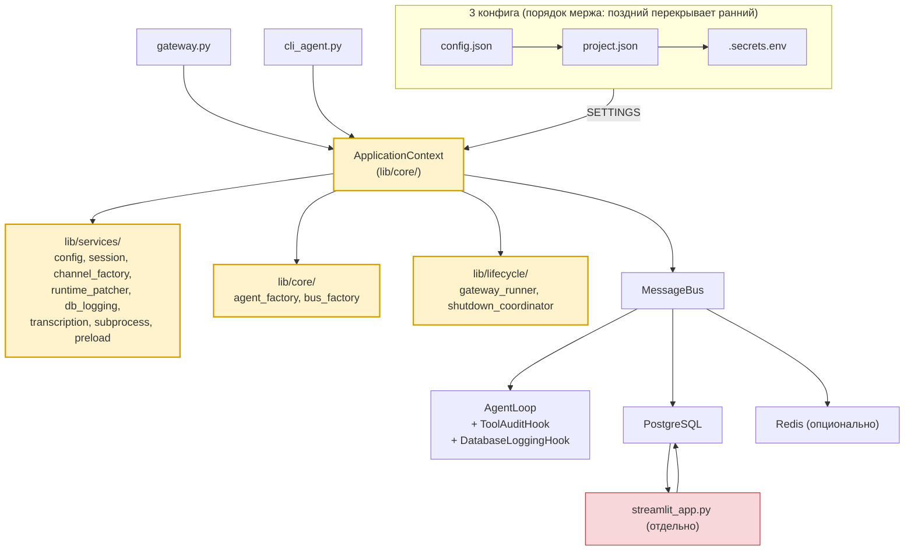

# nanobot — Personal AI Agent (Deployment)

Локальная инсталляция фреймворка **[nanobot-ai](https://github.com/HKUDS/nanobot)**
(PyPI: `nanobot-ai`) с кастомными доработками: PostgreSQL-каналы, Redis, Streamlit UI,
бенчмарки, навыки `audit_analyzer` и `office_files`.

> **Агент:** Aura (🐈) · **Модель:** OpenAI-compatible · **ОС:** Windows · **Язык:** RU/EN

## 🚀 Быстрый старт

```bash
python -m venv .venv && .venv\Scripts\activate
pip install nanobot && pip install -r requirements.txt
copy .secrets.env.example .secrets.env   # cp на Linux
# Отредактируйте .secrets.env: DB_PASSWORD=... и # providers: llm / api_key=...
python tools/migrate.py --apply         # применить миграции схемы
python gateway.py                        # AgentLoop + Postgres/Redis каналы + Streamlit :8501
# или:
python cli_agent.py -P -s dev           # REPL в patched-режиме (PostgreSQL)
```

Минимальный набор таблиц (если нет `migrate.py`):

```bash
psql -d nanobot -f sql/session/create_public_agent_session_meta.sql
psql -d nanobot -f sql/session/create_public_agent_session_messages.sql
psql -d nanobot -f sql/channels/create_public_agent_conversation_messages.sql
```

Полный список DDL — в [`sql/README.md`](sql/README.md).

## 🛠 Команды

```bash
python gateway.py                                                 # долгоживущий сервер
python cli_agent.py                          # REPL vanilla (JSONL)
python cli_agent.py -P -s my-session         # REPL patched (PGSessionManager + хуки)
python workspace/skills/audit_analyzer/scripts/cli.py \
    --mode vector --query "..." --index-name violations_index    # навык audit_analyzer
python benchmarks/runner.py --tags simple                         # оценка качества
python tools/build_vectors.py --full-rebuild                      # перестроение FAISS-индексов
python tools/build_vectors.py --status                            # текущее состояние
python tools/check_worker_pool_integrity.py --fix                 # диагностика пула воркеров
python tools/migrate.py --apply                                   # миграции схемы
```

Подробности по каждой команде — в [docs/INTERNAL_API.md](docs/INTERNAL_API.md) и
[docs/TROUBLESHOOTING.md](docs/TROUBLESHOOTING.md).

## 🏗 Архитектура



**Поток:** 3 конфига → `config.py: SETTINGS` → `ApplicationContext.create()` →
`MessageBus` → `AgentLoop` → `gateway.py`/`cli_agent.py` запускают каналы + lifecycle.
Полная таблица связей — в [docs/ARCHITECTURE.md](docs/ARCHITECTURE.md).

## 📁 Структура проекта

```
nanobot/
├── README.md  DEVELOPMENT.md  CHANGELOG.md  AGENTS.md
├── config.json  project.json  config.py        # 3 конфига
├── gateway.py  cli_agent.py  streamlit_app.py  # точки входа
├── lib/                          # сервисный слой: core, services, cli, hooks,
│                                 #   lifecycle, channels, session
├── workspace/                    # runtime, hooks-плагины, skills, memory
├── tests/  benchmarks/  tools/  sql/  docs/  requirements.txt
```

Подробное дерево — в [docs/ARCHITECTURE.md → Структура проекта](docs/ARCHITECTURE.md#структура-проекта).
Навигация по `docs/` — в [docs/README.md](docs/README.md).

## 🗃 База данных

DDL в `sql/<domain>/create_<schema>_<table>.sql` (один файл = одна таблица).
Миграции — `python tools/migrate.py --apply`. Слои:

- **Сессии:** `public.agent_session_meta`, `public.agent_session_messages`
- **Канал:** `public.agent_conversation_messages`
- **Журнал:** `public.agent_gateway_logs`, `public.agent_question_runs` (UUID + JSONB)
- **Домен audit_analyzer:** `oarb.audits/violations/audit_reports/report_items` (REFERENCE)
- **Векторы:** `oarb.audit_vectors`, `public.agent_vector_index_config/store` (FAISS BYTEA)
- **Predefined scripts:** `public.agent_predefined_scripts`
- **Воркер-пул:** `public.agent_worker_claims` (UNIQUE PK, lease)
- **Бенчмарки:** `public.agent_benchmark_runs/results`

Реестр таблиц PG → DuckDB — в [docs/table-registry.md](docs/table-registry.md).

## 🧪 Тестирование

**1480 unit-тестов** (22 интеграционных пропущены без живого PostgreSQL/LLM).

```bash
pytest tests/ -q
pytest tests/ --cov=lib --cov-report=term-missing
```

Группы: `test_application_context.py` + `test_*_factory.py` · `test_runtime_patcher.py`
+ `test_utils_db.py` · `test_*_service.py` (db_logging, audit, transcription) ·
`test_pg_session_manager.py` + `test_*_channel.py` · `test_hooks_*.py` +
`test_recent_files_hook.py` + `test_office_files.py` · `test_benchmarks_*.py` +
`test_gateway*.py` + `test_cli_agent.py`.

## ⏰ Heartbeat и cron

`nanobot gateway` запускает встроенный heartbeat-cron, который периодически проверяет
`HEARTBEAT.md` (`gateway.heartbeat.enabled=true`, `intervalS: 1800`). Не дублируйте его.

- Периодическая проверка → правьте `HEARTBEAT.md`.
- Одноразовое напоминание → встроенный `cron` tool opencode.
- Политика storage и cron для агента — в [`workspace/AGENTS.md`](workspace/AGENTS.md).

> [!WARNING]
> Не пишите напоминания только в `MEMORY.md` — это не вызывает уведомлений.

## 📚 Документация

| Документ | Назначение |
|---|---|
| **[DEVELOPMENT.md](DEVELOPMENT.md)** | Навигационный хаб разработчика (компактный); вся глубокая документация — в `docs/` |
| **[CHANGELOG.md](CHANGELOG.md)** | История релизов (Keep a Changelog / SemVer) |
| **[TARGET_ARCHITECTURE.md](TARGET_ARCHITECTURE.md)** | Целевая архитектура |
| **[docs/README.md](docs/README.md)** | Навигационный индекс каталога `docs/` |
| **[docs/TROUBLESHOOTING.md](docs/TROUBLESHOOTING.md)** | Диагностический runbook |
| **[docs/MIGRATION.md](docs/MIGRATION.md)** | Сводка изменений между релизами + breaking changes |
| **[docs/table-registry.md](docs/table-registry.md)** | Реестр таблиц PG → DuckDB |
| **[docs/skill-tool-architecture.md](docs/skill-tool-architecture.md)** | Контракт Skill ↔ Tool |
| **[docs/architecture/](docs/architecture/)** | Инвентаризация зависимостей и monkey-patch'ей |
| **[benchmarks/README.md](benchmarks/README.md)** | Бенчмарки: модели, YAML, веса |
| **[lib/channels/README.md](lib/channels/README.md)** | Каналы (Postgres/Redis): DDL, поток, конфиг |
| **[lib/session/README.md](lib/session/README.md)** | `PGSessionManager`: схема, graceful degradation |
| **workspace/skills/*/SKILL.md** | Документация навыков |
| **workspace/AGENTS.md** | Инструкции для агента |

## 🆕 Что нового в v2.4.0

**MINOR поверх v2.3.1, 2026-08-20.** Метрика контекстного окна (`metadata.context_window`),
ручное сжатие `/compact` (slash + CLI + tool, `ContextCompactionService`), мульти-машинный
пул воркеров (`agent_worker_claims`, `claim_strategy: single | worker_pool`), кастомные
tool'ы из `workspace/tools/` (`compact_context`), полное логирование промпта/ответа LLM,
закрыта потеря данных при усечении больших результатов инструментов (`patch_save_turn` →
полный файл в `data_store`), оптимизация БД-пула, кастомизация шаблонов через
`workspace/overrides/`.

Полный changelog — в [CHANGELOG.md → 2.4.0](CHANGELOG.md#240--2026-08-20).
Сводка breaking changes — в [docs/MIGRATION.md](docs/MIGRATION.md).

## 🛡 Зависимости и лицензия

`nanobot`, `psycopg2-binary`, `redis`, `streamlit`, `loguru`, `httpx`, `duckdb`,
`faiss-cpu`, `numpy`, `pyarrow`, `PyYAML` — точные версии в `requirements.txt`.

**Лицензия:** MIT.
