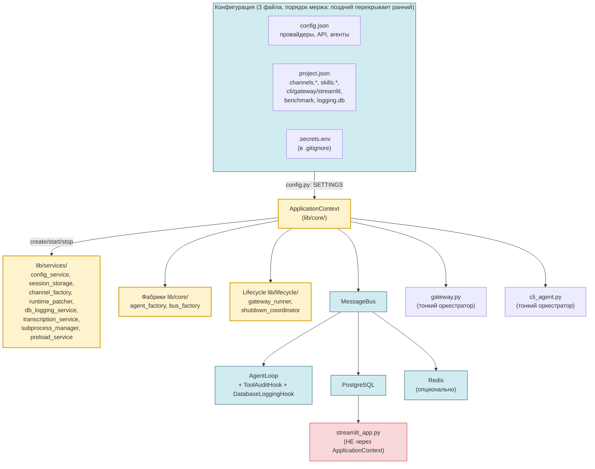

# nanobot — Personal AI Agent (Deployment)

Локальная инсталляция фреймворка **[nanobot-ai](https://github.com/HKUDS/nanobot)** (PyPI: `nanobot-ai`) — персонального AI-агента, запущенного с **кастомными доработками**: PostgreSQL-каналы, Redis-интеграция, Streamlit UI, система бенчмарков и пользовательский навык audit_analyzer.

> **Имя агента:** Aura (🐈)  
> **Базовая модель:** OpenAI-compatible (задаётся в `config.json`/`project.json`)  
> **ОС:** Windows  
> **Язык:** Русский / English

---

## Содержание

1. [Быстрый старт](#быстрый-старт)
2. [Переменные окружения](#переменные-окружения)
3. [Запуск](#запуск)
4. [Архитектура](#архитектура)
5. [Структура проекта](#структура-проекта)
6. [Компоненты](#компоненты)
7. [База данных](#база-данных)
8. [Векторные индексы](#векторные-индексы)
9. [Тестирование](#тестирование)
10. [Heartbeat и cron](#heartbeat-и-cron)
11. [Troubleshooting](#troubleshooting)
12. [Миграция с 1.5.0](#миграция-с-150-на-200)
13. [Документация](#документация)
14. [Зависимости и лицензия](#зависимости-и-лицензия)

---

## Быстрый старт

### 1. Установка зависимостей

```bash
python -m venv .venv
.venv\Scripts\activate
pip install nanobot
pip install -r requirements.txt
```

### 2. Настройка окружения

```bash
copy .secrets.env.example .secrets.env   # Windows
# или: cp .secrets.env.example .secrets.env
```

Отредактируйте `.secrets.env` (он в `.gitignore`):

```ini
# Пароль БД (host/port/dbname/user — в project.json → channels.postgres)
DB_PASSWORD=ваш_пароль_БД

# providers: llm
api_key=ваш_LLM_API_KEY

# Skills: audit_analyzer
llm_api_key=ваш_LLM_API_KEY
```

Полный список переменных и куда они подставляются — в [Переменные окружения](#переменные-окружения).

Все остальные настройки лежат в конфигурационных файлах:

| Файл | Что хранит |
|------|-----------|
| `config.json` | Настройки nanobot: агенты, провайдеры, каналы, инструменты, API, gateway |
| `project.json` | Настройки проекта: `channels.*` (postgres: host/port/dbname/user + dsn override, redis), `skills.*`, `cli`, `gateway`, `streamlit`, `benchmark`, `logging.db` |
| `.secrets.env` | Секреты (API-ключи, `DB_PASSWORD`) — подставляются в конфиг через `${VAR}` или собираются в DSN |

`config.py` мержит их в `SETTINGS` в порядке: `project.json → config.json → .secrets.env` (поздний перекрывает ранний). `project.json` поддерживает JSONC-комментарии (`//` и `/* */`).

### 3. База данных

```bash
# Таблицы сессий (PGSessionManager)
psql -d nanobot -f sql/session/create_session_tables.sql
# Для Greenplum:
psql -d nanobot -f sql/session/create_session_tables_gp.sql

# Таблица канала (PostgresChannel) — создаётся автоматически
psql -d nanobot -f sql/channels/seed_messages.sql   # тестовые данные
```

Полный список DDL — в [DEVELOPMENT.md → SQL-скрипты](DEVELOPMENT.md#sql-скрипты-создание-таблиц).

### 4. Запуск

```bash
# CLI-агент (patched-режим с PostgreSQL)
python cli_agent.py -P -s dev

# Gateway + Streamlit UI
python gateway.py
```

Подробности и все CLI-флаги — в [Запуск](#запуск).

---

## Переменные окружения

Конфиг в `config.json`/`project.json` может ссылаться на переменные окружения через `${VAR}`. `ConfigService._pre_resolve_env_refs` подставляет их ДО `_load_runtime_config`, поэтому **export в shell не обязателен** — gateway берёт ключи из `.secrets.env`.

### Формат `.secrets.env`

Файл поддерживает **провайдер-скоупинг** (секции `# providers:`, `# Skills:` и т.п.):

```ini
# Пароль БД (host/port/dbname/user — в project.json → channels.postgres)
DB_PASSWORD=ваш_пароль_БД

# providers: llm
api_key=XavGPsHjtNt3uOtFGUhabUuad5PRm2D0W

# Skills: audit_analyzer
llm_api_key=...llm_api_key...
```

В одной секции `# providers: <name>` ключи попадают в `SETTINGS.providers.<name>.<key>`. Секция `# Skills: <skill>` — в `SETTINGS.skills.<skill>.<key>`.

### Распознаваемые переменные

| Переменная | Куда попадает | Назначение |
|-----------|---------------|-----------|
| `DB_PASSWORD` / `PGPASSWORD` | `channels.postgres` (host/port/dbname/user из project.json + пароль) | Пароль PostgreSQL/Greenplum |
| `DATABASE_URL` / `PG_DSN` | `channels.postgres.dsn` (override-полный DSN) | Полный DSN PostgreSQL/Greenplum (legacy) |
| `REDIS_URL` / `REDIS_PASSWORD` | `channels.redis.*` | DSN и пароль Redis |
| `LLM_API_KEY` | `providers.<любой>.api_key` (через pre-resolve) | Ключ LLM-провайдера |
| `<provider>_API_KEY` | `providers.<lower>.api_key` | Ключ произвольного провайдера (legacy-fallback) |

**DSN собирается так** (`utils.db.resolve_dsn()`, приоритет по убыванию):

1. `configure(dsn)` — явный вызов при старте.
2. `channels.postgres.dsn` — полный DSN в `project.json` (override).
3. `channels.postgres.{host,port,dbname,user}` + `DB_PASSWORD` — собрать из частей.
4. `DATABASE_URL` / `PG_DSN` из `os.environ` — legacy-fallback.

Если переменная не задана ни в `.secrets.env`, ни в `os.environ`, а в конфиге есть `${VAR}` — `nanobot._load_runtime_config` упадёт `ValueError`.

### Поддержка JSONC

`project.json` парсится как JSONC — можно использовать `//` и `/* */` комментарии. Все строки (включая DSN с `?`) сохраняются как есть.

---

## Запуск

### `gateway.py` (долгоживущий сервер) {#gatewaypy}

```bash
python gateway.py
```

Что делает `gateway.py` (тонкий оркестратор, 132 строки):
- `ApplicationContext.create(...)` — собирает конфиг, сессии, агента, аудит-сервисы, БД-логирование.
- Регистрирует callbacks на `AuditSyncService` **ДО** `ctx.start()` — иначе FAISS preload видит «нет данных» (race condition).
- `ChannelFactory.create_all()` — `ChannelManager` + Redis + Postgres каналы + транскрипция.
- `SubprocessManager.spawn_streamlit()` — запуск Streamlit UI на `:8501` (логи: `logs/streamlit.log`).
- `GatewayRunner().run_forever()` — главный цикл с exponential backoff (1с → 30с) при падении.
- Shutdown: `channels.stop_all()` → Streamlit `terminate_all()` → `agent.close_mcp()/stop()` → `agent.sessions.flush_all()`.

### `cli_agent.py` (REPL) {#cliagentpy}

| Режим | Флаг | Хранилище | Хуки |
|-------|------|-----------|------|
| **vanilla** | (по умолчанию) | JSONL-файлы | ToolAuditHook |
| **patched** | `--patched / -P` | PGSessionManager (или file) | ToolAuditHook + из `workspace/hooks/` |

```bash
python cli_agent.py                           # vanilla
python cli_agent.py -P                        # patched, авто-storage
python cli_agent.py -P -s my-session          # patched + именованная сессия
python cli_agent.py -P -S postgres            # patched, принудительно PostgreSQL
python cli_agent.py -S file                   # patched, принудительно JSONL
```

### `audit_analyzer` (навык) {#audit-analyzer}

Точка входа: `workspace/skills/audit_analyzer/audit_analyze.bat` (Windows) или `audit_analyze.sh` (Linux). **CLI требует `--mode` явно.** Пользовательская документация навыка — `workspace/skills/audit_analyzer/SKILL.md`.

| Режим | Описание | Пример |
|-------|----------|--------|
| `predefined` | Готовые SQL-скрипты из реестра | `--mode predefined --script analytics_by_year_month --params year=2024` |
| `sql` | LLM генерирует SELECT по текстовому запросу | `--mode sql --query "топ-10 объектов по нарушениям"` |
| `vector` | Семантический поиск по FAISS-индексу | `--mode vector --query "финансовые нарушения" --index-name violations_index --top-k 3` |

> **Внимание:** DuckDB-кеш создаёт и обновляет `gateway.py` автоматически. Запустите gateway перед CLI — иначе `FileNotFoundError`.

Параметры векторного поиска:
- `--top-k N` — ровно N лучших результатов (по умолчанию 5).
- `--threshold X` — все результаты выше порога X (0.0–1.0); если задан, `--top-k` игнорируется.

### `benchmarks/runner.py`

```bash
python benchmarks/runner.py --tags simple
python benchmarks/runner.py --compare runs/run1 runs/run2
python benchmarks/runner.py --dry-run --tags hard
```

Подробности — в [`benchmarks/README.md`](benchmarks/README.md).

### `tools/build_vectors.py`

Инфраструктурная утилита для перестроения FAISS-индексов:

```bash
python tools/build_vectors.py --status
python tools/build_vectors.py --full-rebuild
python tools/build_vectors.py --check          # например, при старте контейнера
python tools/build_vectors.py --index audits_index
```

Подробности — в [DEVELOPMENT.md → Векторная индексация](DEVELOPMENT.md#векторная-индексация).

---

## Архитектура



**Поток инициализации:** 3 конфига → `config.py` собирает `SETTINGS` → `ApplicationContext.create()` инициализирует и связывает общие сервисы → `MessageBus` → `AgentLoop` с хуками → `gateway.py`/`cli_agent.py` запускают каналы и lifecycle.

**Полная таблица связей** между `lib/core/`, `lib/services/`, `lib/cli/`, `lib/lifecycle/` — в [DEVELOPMENT.md → Полная таблица связей](DEVELOPMENT.md#полная-таблица-связей-между-файлами-v200).

---

## Структура проекта

```
nanobot/
├── README.md               # этот файл
├── DEVELOPMENT.md          # техническая документация (lib/, audit_analyzer, SQL, миграции)
├── CHANGELOG.md            # история релизов (keep-a-changelog)
│
├── config.json             # nanobot: агенты, провайдеры, API
├── project.json            # проект: channels.*, skills.*, cli, gateway, logging.db
├── config.py               # сборка SETTINGS (JSONC + .secrets.env)
│
├── gateway.py              # 132 строки, тонкий оркестратор
├── cli_agent.py            # 165 строк, тонкий оркестратор
├── streamlit_app.py        # [web-клиент, не через ApplicationContext]
│
├── lib/                    # v2.0.0: сервисный слой
│   ├── core/               #   ApplicationContext + фабрики
│   ├── services/           #   сервисы (db_logging, audit, channels, ...)
│   ├── cli/                #   REPL/typewriter/hook_loader
│   ├── lifecycle/          #   gateway_runner + shutdown_coordinator
│   ├── channels/           #   postgres_channel, redis_channel
│   └── session/            #   pg_session_manager
├── workspace/              # runtime-данные, hooks/, skills/, memory/
├── tests/                  # 683 unit-теста (после v2.0.0)
├── benchmarks/             # YAML-тесты, runner, scorer, reporter
├── tools/                  # инфраструктурные CLI (build_vectors.py)
├── sql/                    # DDL всех таблиц
├── requirements.txt
```

Подробное дерево с описанием каждого модуля — в [DEVELOPMENT.md → Структура проекта](DEVELOPMENT.md#структура-проекта).

---

## Компоненты

### 1. CLI Agent (`cli_agent.py`)

См. [Запуск → cli_agent.py](#cliagentpy).

### 2. Gateway (`gateway.py`)

См. [Запуск → gateway.py](#gatewaypy).

### 3. ApplicationContext (`lib/core/application_context.py`)

Единый bootstrap всех общих сервисов. Создаёт и связывает:
- `ConfigService` + `RuntimeConfig`
- `SessionStorageService` → `PGSessionManager`/`SessionManager`
- `DbLoggingService` (если `enable_db_logging=True` и есть DSN)
- `AuditSyncService` + `AuditMemoryStore` (если `enable_audit=True`)
- `MessageBus` (с обёрткой под логгеры, если есть `DbLoggingService`)
- `AgentLoop` (через `AgentFactory`) с `ToolAuditHook` + `DatabaseLoggingHook`
- `RuntimePatcher.apply_all()` — все monkey-patch'и в одном месте
- `PreloadService`, `TranscriptionService`

**Флаги:** `enable_db_logging`, `enable_audit`, `enable_cron`, `storage_override`. Graceful degradation: если БД недоступна, сервис остаётся `None`, gateway/cli работают без него (с предупреждением в логах).

**Публичный API:**
```python
ctx = ApplicationContext.create(script_dir, workspace_dir, enable_db_logging=True)
ctx.start()           # запустить фоновые сервисы
ctx.stop()            # LIFO graceful shutdown через ShutdownCoordinator
```

### 4. DbLoggingService (`lib/services/db_logging_service.py`)

Структурированный журнал событий агента в PostgreSQL (`gateway_logs`). Worker-поток с **единственным** psycopg2-соединением, неблокирующая очередь, batch INSERT через `psycopg2.extras.execute_batch`. При недоступности БД — fallback в JSONL.

**Методы:** `log_inbound`, `log_outbound` (`kind="outbound_final"` / `"outbound_delta"`), `log_tool_call`, `log_tool_result` (с `latency_ms`), `log_error`. Все вызовы `O(1)` — `True` (в очереди) или `False` (очередь полная).

**Мониторинг:** `get_stats()` → `written`, `failed`, `queue_size`, `fallback_written`, `connected`, `last_error`.

**DDL:** `sql/logs/create_logs_table.sql` (UUID, JSONB, индексы по `timestamp` / `session_id` / `event_type` / `level`).

**Полезные SQL:**
```sql
-- Последние 10 событий
SELECT timestamp, level, event_type, session_id, summary
FROM gateway_logs ORDER BY timestamp DESC LIMIT 10;

-- Статистика по типам за час
SELECT event_type, COUNT(*) FROM gateway_logs
WHERE timestamp > NOW() - INTERVAL '1 hour'
GROUP BY event_type ORDER BY 2 DESC;

-- Самые медленные инструменты за сутки
SELECT payload->>'tool' AS tool,
       AVG((metadata->>'latency_ms')::float) AS avg_ms,
       COUNT(*) AS calls
FROM gateway_logs
WHERE event_type = 'tool_result' AND timestamp > NOW() - INTERVAL '24 hours'
GROUP BY payload->>'tool' ORDER BY avg_ms DESC;
```

### 5. PGSessionManager (`lib/session/pg_session_manager.py`)

Хранит сессии в PostgreSQL в двух таблицах: `session_meta` и `session_messages`. При недоступности БД — graceful degradation на JSONL-файлы.

**Полная документация:** [`lib/session/README.md`](lib/session/README.md) — схема таблиц, методы, graceful degradation, безопасность.

### 6. PostgresChannel (`lib/channels/postgres_channel.py`)

Канал через таблицу `agent_conversation_messages`: поллинг новых сообщений (`status='pending'`), потоковая запись reasoning в `metadata.reasoning`, автоматическая разблокировка зависших сообщений (retry до 3 раз), медиа-файлы через data URL.

**Полная документация:** [`lib/channels/README.md`](lib/channels/README.md) — диаграмма потоков, DDL колонок, конфигурация, инструкция «как добавить новый канал».

### 7. RedisChannel (`lib/channels/redis_channel.py`)

Канал через Redis-списки:
- **Inbox:** `BRPOP nanobot:inbox`
- **Outbox:** `LPUSH nanobot:outbox:{chat_id}`
- Формат JSON повторяет `InboundMessage`/`OutboundMessage`.

**Полная документация:** [`lib/channels/README.md`](lib/channels/README.md).

### 8. TranscriptionService (`lib/services/transcription_service.py`)

Сервис транскрибации аудио: OpenAI Whisper, Groq Whisper, локальные модели (опционально). Настройки через `transcription.*` в `project.json`.

### 9. Streamlit UI (`streamlit_app.py`)

Тонкий web-клиент, **не через `ApplicationContext`**:
- INSERT в `agent_conversation_messages` (`status='pending'`).
- Блокирующий поллинг ответа с отображением reasoning в реальном времени.
- Загружается gateway как subprocess на `:8501`, логи в `logs/streamlit.log`.

Конфигурация — `streamlit.*` в `project.json` (`max_wait`, `poll_interval`).

### 10. Skills

Подробная документация навыков и режимов — в:
- `workspace/skills/audit_analyzer/SKILL.md` — пользовательская документация навыка.
- [DEVELOPMENT.md → audit_analyzer и lib/services](DEVELOPMENT.md) — архитектура и жизненный цикл кеша.

### 11. Benchmarks (`benchmarks/`)

Автоматическая оценка качества агента. YAML-определения тестов (difficulty 1–10), типы `single` и `multi_step`, скоринг по ключевым словам/файлам/инструментам/LLM-судье, сохранение в JSON/Markdown/PostgreSQL, сравнение прогонов (`--compare`).

**Полная документация:** [`benchmarks/README.md`](benchmarks/README.md) — 764 строки: модели данных, формат YAML, веса проверок, CLI-флаги, диагностика.

---

## База данных

Все DDL — в корневом `sql/` с подкаталогами по доменам: `sql/session/`, `sql/channels/`, `sql/logs/`, `sql/audit_analyzer/`, `sql/benchmarks/`, `sql/migrations/`. **Применяются вручную** — никаких `ensure_tables()` в коде больше нет. Полный каталог и порядок применения — в [`sql/README.md`](sql/README.md).

| Слой | Файл | Таблицы | Статус |
|------|------|---------|--------|
| **Сессии** | `sql/session/create_session_tables.sql` | `session_meta`, `session_messages` | рабочий (PG 9.4+) |
| **Сессии (GP)** | `sql/session/create_session_tables_gp.sql` | то же + `DISTRIBUTED BY (session_key)` | рабочий (GP 6.25) |
| **Канал** | создаётся автоматически | `agent_conversation_messages` | авто |
| **Seed канала** | `sql/channels/seed_messages.sql` | 14 user + 4 assistant сообщений | тестовые данные |
| **DbLoggingService** | `sql/logs/create_logs_table.sql` | `gateway_logs` (UUID, JSONB) | рабочий |
| **Домен audit_analyzer (PG)** | `sql/audit_analyzer/create_audit_source_tables.sql` | `oarb.audits/violations/audit_reports/report_items` | REFERENCE — уточняет владелец данных |
| **Домен audit_analyzer (GP)** | `sql/audit_analyzer/create_audit_source_tables_gp.sql` | то же + `DISTRIBUTED BY` | REFERENCE для GP 6.5 |
| **Векторы (PG)** | `sql/audit_analyzer/create_audit_vectors_table.sql` | `oarb.audit_vectors` (BIGINT IDENTITY, TEXT pk_value) + 3 индекса | рабочий (PG 13+) |
| **Векторы (GP)** | `sql/audit_analyzer/create_audit_vectors_table_gp.sql` | то же + `DISTRIBUTED BY (source)` | рабочий (GP 6.5) |
| **Конфиг индексов (PG)** | `sql/audit_analyzer/create_agent_vector_index_config.sql` | `public.agent_vector_index_config` | рабочий (PG 13+) |
| **Конфиг индексов (GP)** | `sql/audit_analyzer/create_agent_vector_index_config_gp.sql` | то же + `DISTRIBUTED BY` | рабочий (GP 6.5) |
| **Бенчмарки** | `sql/benchmarks/create_benchmark_tables.sql` | `agent_benchmark_runs`, `agent_benchmark_results` | рабочий (PG 9.4+) |
| **Бенчмарки (GP)** | `sql/benchmarks/create_benchmark_tables_gp.sql` | то же + `DISTRIBUTED BY` | рабочий (GP 6.25) |

Полный DDL с комментариями — в [DEVELOPMENT.md → SQL-скрипты](DEVELOPMENT.md#sql-скрипты-создание-таблиц).

---

## Векторные индексы

**v1.5.0:** Векторные индексы перенесены из файлов `.faiss` в PostgreSQL. Файловый мигратор удалён как legacy — новые индексы создаются сразу в БД.

**v2.0.0:** Конфигурация индексов — в `public.agent_vector_index_config` (БД), а не в `project.json`. Управление через SQL.

| Таблица | Назначение |
|---------|-----------|
| `oarb.audit_vectors` | Сырые эмбеддинги `REAL[]` + метаданные (строит `tools/build_vectors.py`) |
| `public.agent_vector_index_store` | Сериализованный FAISS-индекс `BYTEA` (ищет провайдер `lib/services`) |
| `public.agent_vector_index_config` | Конфигурация индексов (таблицы/колонки, чанкование, автосинхронизация) |

### Дефолтные индексы

В `sql/audit_analyzer/seed_default_indexes.sql` зарегистрированы 3 индекса:

| Имя | Источник | Чанкование |
|-----|----------|------------|
| `audits_index` | `oarb.audits` | нет (композит из 4 коротких колонок) |
| `violations_index` | `oarb.violations` | да (`description` 500/80) |
| `audit_reports_index` | `oarb.audit_reports` | да (`full_text` 500/80) |

### Создание с нуля

```bash
# 1. DDL (таблицы домена + векторные таблицы + конфиг)
psql -d nanobot -f sql/audit_analyzer/create_audit_source_tables_gp.sql
psql -d nanobot -f sql/audit_analyzer/create_audit_vectors_table_gp.sql
psql -d nanobot -f sql/audit_analyzer/create_agent_vector_index_config_gp.sql

# 2. Зарегистрировать 3 дефолтных индекса
psql -d nanobot -f sql/audit_analyzer/seed_default_indexes.sql

# 3. Зависимости для FAISS (если ещё не установлены)
pip install faiss-cpu numpy

# 4. Сборка векторов
python tools/build_vectors.py --full-rebuild
```

### Поиск

См. [Запуск → audit_analyzer](#audit-analyzer), режим `vector`.

### Параметры CLI `--top-k` / `--threshold`

Задаются **аргументами**, а не в `project.json`:
- `--top-k N` — ровно N лучших (по умолчанию 5).
- `--threshold X` — все результаты выше X (0.0–1.0); если задан, `--top-k` игнорируется.

### Добавить/обновить/удалить индекс

**Исчерпывающий гайд** (как устроены индексы, как создать новый, как обновить при изменении источника/модели/колонок, формат `embedding_cols` с чанкованием, требования к таблицам, мониторинг, типичные проблемы) — в [DEVELOPMENT.md → Векторная индексация](DEVELOPMENT.md#векторная-индексация).

---

## Тестирование

**683 unit-теста** в `tests/` (после удаления `test_pg_agent_worker.py` в v2.0.0).

### Запуск

```bash
pytest tests/ -q
pytest tests/test_db_logging_service.py -v
pytest tests/ --cov=lib --cov-report=term-missing
```

### Структура

| Файл | Что тестирует |
|------|--------------|
| `test_application_context.py` | `ApplicationContext` — bootstrap всех сервисов, lifecycle |
| `test_agent_factory.py` | `AgentFactory` — создание `AgentLoop` с хуками |
| `test_bus_factory.py` | `BusFactory` — `MessageBus` + обёртки логгеров |
| `test_config_service.py` | `ConfigService` — загрузка конфига, pre-resolve env, таймауты |
| `test_session_storage.py` | `SessionStorageService` — выбор PG/File/auto |
| `test_runtime_patcher.py` | `RuntimePatcher` — оба monkey-patch'а, fallback |
| `test_transcription_service.py` | `TranscriptionService` — openai/groq |
| `test_channel_factory.py` | `ChannelFactory` — Redis/Postgres каналы |
| `test_subprocess_manager.py` | `SubprocessManager` — Streamlit spawn/terminate |
| `test_preload_service.py` | `PreloadService` — FAISS + audit_cache |
| `test_db_logging_service.py` | `DbLoggingService` — worker, batch, fallback |
| `test_hooks_database_logging.py` | `DatabaseLoggingHook` — AgentHook для tool-событий |
| `test_gateway_runner.py` | `GatewayRunner` — exponential backoff |
| `test_shutdown_coordinator.py` | `ShutdownCoordinator` — LIFO graceful shutdown |
| `test_console_loop.py` | REPL/typewriter/print_tool_events |
| `test_cli_agent.py` | CLI-агент (vanilla/patched) |
| `test_gateway.py` | Gateway-оркестратор (под `ApplicationContext`) |
| `test_pg_session_manager.py` | `PGSessionManager` (сессии в БД) |
| `test_postgres_channel.py` | `PostgresChannel` (поллинг, streaming) |
| `test_redis_channel.py` | `RedisChannel` (BRPOP/LPUSH) |
| `test_audit_memory_store.py` / `test_audit_sync_service.py` | `AuditMemoryStore`, `AuditSyncService` |
| `test_benchmarks_*.py` | Бенчмарки (loader, evaluator, scorer, reporter, runner, db) |
| `test_utils_db.py` | Утилиты БД (sync/async коннекторы, retry) |
| `test_hooks_tool_audit_hook.py` | `ToolAuditHook` |

---

## Heartbeat и cron

`nanobot gateway` регистрирует **защищённый heartbeat-cron job**, который периодически проверяет `HEARTBEAT.md`. Не дублируйте его другим cron-job'ом, если не отключили встроенный.

| Файл | Назначение |
|------|-----------|
| `HEARTBEAT.md` | Список задач для периодической проверки |
| `workspace/AGENTS.md` | Политика storage, cron/heartbeat инструкции для агента |
| `workspace/SOUL.md` | Личность/стиль агента |
| `workspace/USER.md` | Долговременные факты о пользователе |
| `workspace/TOOLS.md` | Описание доступных инструментов |
| `workspace/cron/jobs.json` | Ручные cron-задачи |
| `memory/MEMORY.md` | Долговременная память агента |

**Использование:**
- Периодическая проверка с уведомлением только при изменениях → `HEARTBEAT.md`.
- Одноразовое напоминание → встроенный `cron` tool.
- **Не пишите напоминания только в `MEMORY.md`** — это не вызывает уведомлений.

---

## Troubleshooting

### `ValueError: LLM_API_KEY not set` / `ApiKey not found`

Причина: ключ провайдера не подставился в `os.environ`. Проверьте `.secrets.env`:

```ini
# providers: llm   ← секция обязательна
api_key=XavGPsHjtNt3uOtFGUhabUuad5PRm2D0W
```

Если секция и значение на месте, но ошибка остаётся — `ConfigService._pre_resolve_env_refs` не нашёл ключ. Проверьте `config.json`: имя провайдера должно совпадать с секцией в `.secrets.env` (case-insensitive). Имя env-переменной теперь каноническое — `LLM_API_KEY` (вместо исторического `MISTRAL_API_KEY`).

### `psycopg2.OperationalError: connection refused`

1. PostgreSQL/Greenplum запущен? `pg_isready` или `pg_lsclusters`.
2. DSN правильный? `psql "$DATABASE_URL"` работает?
3. На Greenplum 6.25 — `gssencmode=disable` (`ConfigService` уже выставляет его через kwargs `connect()`, но если проблема — проверьте).
4. На PG 9.4 — минимум 3 retry, для GP — 50.

### `too many connections` (Greenplum)

`pool_max_conn = 1` в `PGSessionManager`. Если не хватает — уменьшите `AuditSyncService.poll_interval_sec` (меньше опрос → меньше пиков). Мониторинг: `AuditSyncService.get_stats().reconnects`.

### `FileNotFoundError: cache/audit_cache.duckdb`

DuckDB-кеш `audit_analyzer` создаётся **только gateway'ом**. Запустите `python gateway.py` и подождите первого цикла синхронизации (см. `in_memory_enabled: true` в `project.json`).

### `FAISS preload: no data in cache`

Race condition: callbacks на `AuditSyncService` установлены **после** `ctx.start()`. Уже исправлено в `gateway.py:main()` (callbacks идут до `start()`). Если столкнулись — проверьте, что ваш код вызывает `set_on_*_callback` ДО `ctx.start()`.

### `match_type: llm_judge` всегда даёт 0.5

LLM-судья — заглушка (`evaluator.py:_check_llm_judge()` возвращает 0.5). Используйте `match_type: "keyword"` или реализуйте судью.

### Файл `.yaml` в `benchmarks/items/` игнорируется

Файлы, начинающиеся с `_` (например `_template.yaml`), пропускаются загрузчиком. Уберите `_` из имени.

### `Streamlit` ждёт ответ бесконечно

С v2.0.0 streamlit-цикл не имеет таймаута: на статусе `failed` он делает re-check 5 минут, далее ждёт возврата в `processing` бесконечно. Это сделано умышленно (обход `st.rerun maxReruns`). Если поведение не устраивает — меняйте `streamlit_app.py`.

### `--params year=2024` не работает в PowerShell

PowerShell интерпретирует `=` по-своему. Используйте кавычки: `"year=2024"` или `'{"year":2024}'` (Linux-формат).

### Тесты падают на импорте `nanobot`

`nanobot>=0.2.2` нужен. Проверьте: `pip show nanobot`. Если ниже — `pip install --upgrade nanobot`.

### JSONC в `project.json` не парсится

Только `//` и `/* */` поддерживаются. Хэштеги `#` — нет. Кавычки в DSN не должны пересекаться с комментариями.

---

## Миграция с 1.5.0 на 2.0.0

v2.0.0 — крупное обновление. Изменения в конфигурации и структуре:

### Конфигурация

| Что | Было (1.5.0) | Стало (2.0.0) |
|-----|---------------|----------------|
| Формат конфига | `.env` (только переменные) | `project.json` (JSONC) + `config.json` + `.secrets.env` |
| Секции проекта | смешаны в `.env` | `channels.*`, `skills.*`, `cli`, `benchmark`, `streamlit`, `gateway`, `logging.db` — в `project.json` |
| API-ключи | `.env` | `.secrets.env` (в `.gitignore`) |
| DSN провайдеров | `LLM_API_KEY` в shell | `# providers: llm` секция в `.secrets.env` (pre-resolve через `ConfigService`) |
| Параметры векторов | `vector_indexes.*`, `mode_vector_index_path` в `config.json` | `public.agent_vector_index_config` в БД (таблица) |
| DuckDB-кеш audit_analyzer | CLI запускал загрузку | gateway-only — CLI читает готовый снимок |
| Навыки `data-analyzer`, `html_presentation_generator` | присутствовали | удалены |
| `pg_agent_worker.py` | standalone DB API server | удалён |

### Действия при обновлении

1. **Перенесите секреты** из `.env` в `.secrets.env` (формат секций `# providers: <name>`).
2. **Создайте `project.json`** из секций `.env` (`channels.*`, `skills.*`, `cli`, ...). JSONC — можно копировать `project.json` из этого репо.
3. **Удалите** `vector_indexes` / `mode_vector_index_path` из конфигов — теперь в `public.agent_vector_index_config`.
4. **Удалите** `data-analyzer`, `html_presentation_generator`, `pg_agent_worker.py` из импортов и конфигов.
5. **Перезапустите gateway** — `ConfigService._pre_resolve_env_refs` подставит ключи в `os.environ` автоматически.
6. **Проверьте health** — `gateway_logs` пустая, но `AuditSyncService.polls` > 0.

### Что НЕ изменилось

- API точек входа: `python gateway.py`, `python cli_agent.py -P`.
- Имена таблиц БД: `session_meta`, `session_messages`, `agent_conversation_messages`, `oarb.audit_vectors`, `public.agent_vector_index_store`, `benchmark_runs`, `benchmark_results`.
- `benchmarks/items/*.yaml` — формат совместим.
- `audit_analyzer` режимы `predefined` / `sql` / `vector` — без изменений.

Полный changelog — в [CHANGELOG.md](CHANGELOG.md).

---

## Документация

| Файл | Назначение |
|------|-----------|
| **[README.md](README.md)** | этот файл: обзор, запуск, troubleshooting, миграции |
| **[DEVELOPMENT.md](DEVELOPMENT.md)** | тех. документация: архитектура сервисного слоя v2.0.0, audit_analyzer, жизненный цикл кеша, DDL, **где что править**, полная таблица связей |
| **[CHANGELOG.md](CHANGELOG.md)** | история релизов (Keep a Changelog / SemVer) |
| **[benchmarks/README.md](benchmarks/README.md)** | система бенчмарков: модели, формат YAML, веса, диагностика |
| **[lib/channels/README.md](lib/channels/README.md)** | каналы (Postgres/Redis): DDL, поток сообщений, конфиг |
| **[lib/session/README.md](lib/session/README.md)** | `PGSessionManager`: схема, graceful degradation, методы |
| **workspace/skills/audit_analyzer/SKILL.md** | пользовательская документация навыка |
| **workspace/AGENTS.md** | инструкции для агента: storage, cron, heartbeat |
| **.secrets.env.example** | шаблон переменных окружения |

---

## Зависимости и лицензия

### Зависимости

- **nanobot** — фреймворк (`pip install nanobot`)
- **psycopg2-binary** — PostgreSQL/Greenplum
- **redis** — Redis-канал
- **streamlit** — веб-чат
- **loguru** — логирование
- **httpx** — HTTP-клиент (Ollama эмбеддинги)
- **duckdb** — встраиваемая аналитическая БД (audit_analyzer)
- **faiss-cpu**, **numpy**, **pyarrow** — векторный поиск и bulk-вставка в DuckDB (audit_analyzer)
- **PyYAML** — конфиги бенчмарков

Версии — точные `=X.Y.Z` в `requirements.txt` для полной воспроизводимости.

### Лицензия

MIT License