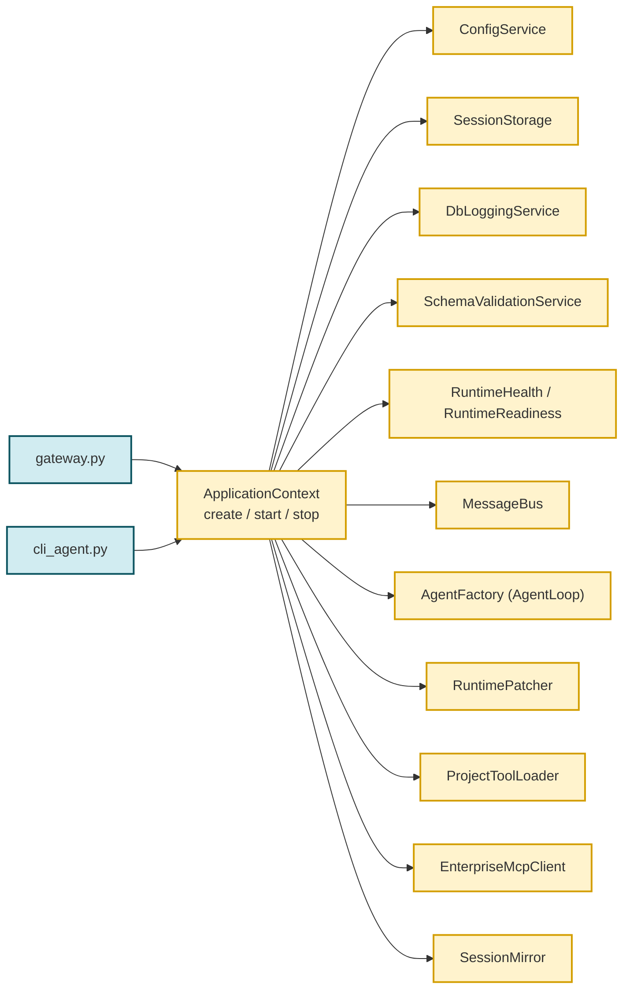
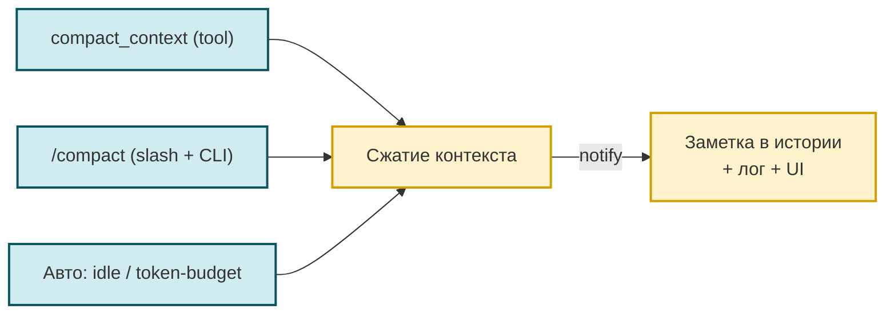
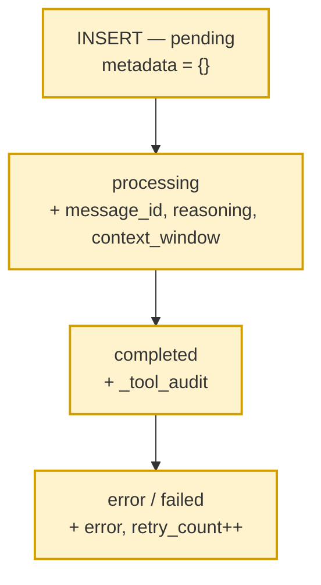

# 🏗 Архитектура и сервисный слой

> Навигационный индекс каталога `docs/` — в [`README.md`](README.md). Этот документ —
> самодостаточное описание подсистемы.
>
> **Это описание текущей реализации («as-is»).** Нормативная целевая архитектура
> (принципы, invariant'ы, anti-patterns, decision-чеклист) — отдельный контракт
> [TARGET_ARCHITECTURE.md](TARGET_ARCHITECTURE.md). Правила и «как должно быть»
> ищите там; здесь — только то, как оно работает сейчас.

## 🏗 Архитектура

Агент — тонкий оркестратор оборота: каналы, сессии, журнал, вызовы tool'ов.
Данных он не держит. Всё, что раньше составляло «инфраструктурный слой агента»
(DuckDB-снимок, векторные индексы, эмбеддинги, HTTP-вызов к провайдеру
модели), живёт в отдельном процессе `enterprise-mcp` и доступно агенту только
операциями по протоколу MCP: клиент — `lib/services/enterprise_mcp_client.py`,
объявление сервера — `config.json` → `gateway.agent.enterprise_mcp`
объявление сервера — `config.json` → `gateway.agent.enterprise_mcp` (обслуживает фоновые службы агента) **и** `config.json` → `tools.mcpServers.enterprise` — второе объявление читает штатный `MCPProvider` нанобота и отдаёт модели 8 операций как `mcp_enterprise_*`. Поэтому процессов платформы два, и это объявлено, а не вышло случайно; секция не пуста. Транспорт процесса выбирает **блок настроек агента** (`lib/services/agent_settings.py`, единственный аргумент запуска — `--agent-settings-file`): `stdio` по умолчанию либо `streamable-http` на `/mcp` (`mcp-platform/servers/enterprise/http_transport.py`). Адрес и порт приезжают блоком, а не `argv` и не `platform.json`; не-loopback адрес и `::1` отвергаются, фактический адрес сообщается в унаследованный дескриптор, а не в stdout.

> **Об именах таблиц и индексов.** Все имена таблиц/индексов, упомянутые ниже, —
> **не зашитые константы**, а значения текущей инсталляции, и объявляет их
> владелец. Состав данных аудита и векторной инфраструктуры объявляет платформа
> в `mcp-platform/platform.json` (`audit.tables`, `vectors.storage_table`,
> `vectors.indexes`, `data.snapshot_path`); путь к снимку и режим доступа к нему —
> тоже её (`data.snapshot_path`), потому что файлом владеет capability `data`.
> Свои runtime-таблицы агент по-прежнему объявляет у себя в `config.json`:
> `channels.postgres.table_name` / `messages_table` / `meta_table`,
> `logging.db.table_name` / `question_runs_table`. Точный список и дефолты — в
> [TARGET_ARCHITECTURE.md](TARGET_ARCHITECTURE.md) и [AGENTS.md](../AGENTS.md).
> Таблицы бенчмарков (`agent_benchmark_runs` / `agent_benchmark_results`) и
> настройка `benchmark.*` удалены в фазе 1 миграции `enterprise-mcp-platform`.

```mermaid
flowchart LR
    PG[("PostgreSQL<br/>(источник истины)") --> SNAP[("Снимок DuckDB<br/>cache.duckdb")]
    LOAD["Операторская загрузка<br/>load_snapshot"] --> SNAP
    SNAP --> DATA["capability data<br/>открывает файл на время операции"]
    DATA --> VEC["capability vectors<br/>FAISS в памяти, сборка на старте"]
    AGENT["Агент / Навык"] -->|MCP stdio-сессия| MCP["enterprise-mcp"]
    MCP --> AUDIT["capability audit<br/>данные аудита"]
    MCP --> DATA
    MCP --> VEC
    MCP --> LLM["capability llm<br/>единственный вызов провайдера"]
    classDef core fill:#fff3cd,stroke:#d39e00,stroke-width:2px
    classDef infra fill:#d4edda,stroke:#1b7a3d,stroke-width:2px
    class AGENT,MCP,AUDIT,DATA,VEC,LLM core
    class PG,SNAP,LOAD infra

```

**Потоки данных**

- Снимок `cache.duckdb` агент **не открывает и не наполняет**. Владелец файла —
  capability `data` платформы (`mcp-platform/libs/enterprise_data/snapshot/`),
  путь к нему объявлен в `mcp-platform/platform.json` → `data.snapshot_path`.
  Соединение открывается на время операции и закрывается сразу, поэтому файл
  физически свободен между запросами — в том числе пока его читает соседний
  процесс.
- Загрузка снимка — **операторская процедура, а не работа агента**:
  `python -m servers.enterprise.load_snapshot` (библиотека —
  `SnapshotLoadService` в `mcp-platform/libs/enterprise_data/loader.py`).
  Это не capability: операций у него нет и модель его не видит. События
  `cache_load_started` / `cache_load_done` пишет он, а не агент.
- Данные аудита агент берёт операциями capability `audit`, семантический поиск —
  операцией `vectors.vector_search` у capability `vectors`. Агентских tool'ов
  `duckdb_query` / `vector_search` в `workspace/tools/` больше нет; вход агента к
  данным аудита — операции `mcp_enterprise_*` capability `audit`.
- Векторные индексы capability `vectors` собирает **на старте сервера платформы**,
  до event loop (`server.py::_prepare_capabilities` → `ensure_index` по объявленным
  и включённым индексам); состояние индекса (`missing` / `building` / `ready` /
  `error`) возвращается в ответе, поэтому «индекс не поднят» наблюдаемо, а не
  спрятано за пустой выдачей. На старте **gateway** выполняется по одной дешёвой
  пробной операции на capability (`gateway._report_enterprise_mcp_health`:
  `vectors.list_indexes` / `data.schema_check` / `audit.list_scripts`), и её результат печатается
  вердиктом — то есть подъём шлюза индексы не пересобирает, а сверяет состояние.
- Навык `audit_analyzer` — тонкий: в `workspace/skills/audit_analyzer/` остался
  только `SKILL.md`, своего CLI у него больше нет.

---

## Сервисный слой (ApplicationContext + lib/)

После выделения сервисного слоя gateway и cli_agent сократились и вся инициализация вынесена в `ApplicationContext`
(см. подробности в `CHANGELOG.md`). Этот раздел — про
**внутреннее устройство** нового слоя, нужно при добавлении новых
сервисов или изменении lifecycle.

### Точки входа → общий bootstrap



Проверки `duckdb_cache` и `vector_search` из снятого локального кэша в
readiness не входят: снимком и индексами владеет платформа, а не агент, и их
состояние агент наблюдает через пробные операции capability, а не через свои
компоненты.

### `lib/core/` (ApplicationContext + фабрики)

- **`application_context.py:ApplicationContext`** — единственный класс,
  собирающий все общие сервисы. Поля (помимо путей и конфига):
  `bus`, `agent`, `tool_audit_hook`, `hooks`, `session_manager`,
  `storage_mode`, `db_logging_service`, `config_service`, `runtime_patcher`,
  `runtime_health`, `runtime_readiness`, `session_storage_service`,
  `hook_factories`, `runtime_events_subscriber`, `lib/gateway/mirror/`,
  `usage_store`, `enterprise_mcp`.
  Полей `cache_loader` / `cache_provider` / `cache_store` / `sync_service` /
  `transcription_service` в dataclass нет: снятый локальный кэш не входит в
  состав агента (владелец снимка — capability `data` платформы).
  Метод `start()` использует `ShutdownCoordinator` для регистрации
  сервисов; `stop()` — LIFO graceful shutdown.
  **Graceful degradation:** если БД недоступна, сервис остаётся `None`,
  gateway/cli работают без него (с предупреждением в логах).
- **`agent_factory.py:AgentFactory`** — `create(config, bus, session_manager=...,
  cron_service=..., db_logging_service=..., project_hooks=...)` → `(agent, hooks,
  hook_factories)`. `project_hooks` (плагины `workspace/hooks/`) ставятся
  ПЕРЕД `ToolAuditHook` в `hooks=`; агент создаётся ровно один раз.
  `DatabaseLoggingHook` подключается НЕ как общий инстанс, а как фабрика
  оборота (`make_db_logging_hook_factory` в `hook_factories=`) — фреймворк
  создаёт свежий инстанс на каждый оборот, изолируя состояние вопроса между
  конкурентными сессиями (см. `database_logging_hook.py`).
  Lazy-import `lib.hooks.database_logging_hook` через try/except
  (если модуль не подключён — фабрика просто не создаётся).
  Флаг `print_llm_calls` пробрасывается в фабрику оборота: при `True`
  хук печатает в терминал токены каждой LLM-итерации (включается всегда
  в CLI-режиме через `cli_agent.py`; в gateway — опцией
  `gateway.print_llm_calls`).
- **Шина** — `application_context._create_bus()` возвращает `MessageBus`,
  опционально обернув `publish_inbound`/`publish_outbound` async-логгерами
  из `db_logging_bus.py` (`_wrap_bus_publish`). **Без monkey-patch'ей**:
  оригинальные методы шины сохраняются в замыкании. Отдельного
  `bus_factory.py` в `lib/core/` нет.

### `lib/services/`

Полный список модулей — см. раздел [«Структура проекта»](#структура-проекта) ниже. Здесь — только
**Новые**, с краткой мотивацией:

| Сервис | Мотивация (почему выделен) |
|--------|---------------------------|
| `config_service.py` | Дубликат `_load_runtime_config` + `SETTINGS`-аксессора между gateway и cli. Pre-resolve `${PROVIDER_API_KEY}` от .secrets.env (см. ниже). |
| `session_storage.py` | Выбор режима хранения сессий (auto / postgres / file) с поддержкой `session_manager.json` override. `postgres` означает включённое холодное зеркало сессий; менеджер сессий во всех режимах — класс библиотеки `SessionManager` поверх `SanitizingSessionStore`. |
| `runtime_patcher.py` | Все 6 monkey-patch'ей upstream `nanobot.agent.loop.AgentLoop` в одном классе с fallback при изменении API nanobot. Применяется через `apply_all()` из `ApplicationContext.create()`. **НЕ** занимается регистрацией project tools (вынесено в `project_tool_loader.py`). Полный каталог — `docs/architecture/runtime-patcher-inventory.md`. |
| `project_tool_loader.py` | Stateless helper для регистрации кастомных tool'ов из `workspace/tools/*.py`. Единственный публичный контракт: `register_project_tools(...) -> ProjectToolsLoadResult`. Вызывается из `ApplicationContext.create()` сразу после `apply_all()` как независимый stage composition root'а. **НЕ** компонент (нет lifecycle/state/config — критерии `openspec/specs/architecture/component-model/spec.md`). |
| `channel_factory.py` | `ChannelManager` + Postgres-канал (второй транспорт, Redis, снят — один канал, PostgreSQL). Конструктор принимает `print_worker_activity` (пробрасывается в `PostgresChannel` из `gateway.print_worker_activity`). |
| ~~`transcription_service.py`~~ | **Удалён.** Голос разбирает базовый класс библиотеки (`BaseChannel.transcribe_audio()`, `audio/transcription*.py`), а канал пробрасывал ему четыре атрибута, которых в `PostgresChannel` не было. Канонические настройки — в верхнеуровневой секции `transcription` файла `config.json`. |
| ~~`preload_service.py`~~ | **Удалён 2026-10-01.** FAISS-preload и чистая функция `compute_index_health` живут в `mcp-platform/libs/vectors/preload.py`. Прогон индекса **не отменён** — его зовёт платформа: `servers/enterprise/server.py::_prepare_capabilities` вызывает `ensure_index` для каждого объявленного и включённого индекса **до старта event loop**, так что к моменту обслуживания запросов FAISS уже в памяти. Агентский preload вызывался из runtime только для собственного кэша, а снимок теперь открывает capability `data` (`mcp-platform/libs/enterprise_data/snapshot/store.py`). Standalone-утилиты сборки индексов в агенте нет — она уехала на платформу (`mcp-platform/servers/enterprise/build_index.py`). |
| `db_logging_service.py` | **Новый** — структурированный журнал агента в `agent_gateway_logs` (имя настраивается через `logging.db.table_name`). |
| `db_logging_bus.py` | **Новый** — обёртки `publish_inbound`/`publish_outbound` для `DbLoggingService`. |
| ~~`schema_formatter.py`~~ | **Удалён** — internal service для формирования описания схемы БД. Использовался только `NlSqlRunner`'ом, который тоже удалён. Доменную схему теперь знает платформа: её объявляет capability `audit` (`mcp-platform/platform.json` → `audit.tables`) и отдаёт операцией `data.schema_check`. |
| ~~`nl_sql_runner.py`~~ | **Удалён** — общая логика NL→SELECT pipeline, равно как и CLI навыка `audit_analyzer` (в `workspace/skills/audit_analyzer/` остался только `SKILL.md`). Замена: SQL к данным аудита формирует агент сам либо операция capability `audit`; доступ к данным дают операции `mcp_enterprise_*`, объявленные в `config.json → tools.mcpServers`. |

### Pre-resolve `${VAR}` от `.secrets.env`

`nanobot._load_runtime_config` резолвит `${LLM_API_KEY}` только из
`os.environ` и при отсутствии падает `ValueError`. Между тем `config.py`
для провайдерских ключей использует провайдер-скоупинг формат
`.secrets.env`:

```
# providers: llm
api_key=XavGPsHjtNt3uOtFGUhabUuad5PRm2D0W
```

— в `os.environ` это не попадает как `LLM_API_KEY`. Решение
(`ConfigService._pre_resolve_env_refs`): прочитать `config.json`,
найти `${VAR}` плейсхолдеры, для каждого `*_API_KEY` без env — достать
ключ из `SETTINGS.providers.<любой>.api_key` (туда `config.py` уже
подставил значение) и положить в `os.environ` ДО `_load_runtime_config`.
**Gateway больше НЕ требует `export LLM_API_KEY=...` в shell.**

> **Миграция с исторического имени:** в старых конфигах `.secrets.env` мог
> быть `# providers: mistral`. Логика остаётся обратно совместимой: ключ
> из любой непустой секции `providers.*` подставляется как `LLM_API_KEY`.
> Достаточно переименовать секцию в `# providers: llm` для ясности.

### Настройки LLM принадлежат платформе: `mcp-platform/platform.json` (секция `llm`)

Резолв провайдера/модели/ключа больше не в агенте. Единственный источник —
реестр платформы (`libs/enterprise_common/settings`) и секция `llm` в
`mcp-platform/platform.json`; ключ провайдера лежит там как подстановка
`${LLM_API_KEY}` и разворачивается из `mcp-platform/.secrets.env`. Окружение
процесса остаётся запасным источником и имеет приоритет, поэтому развёртывание
с `ENTERPRISE_LLM_*` вручную работает как раньше.

Почему перенос, а не дублирование: пока резолв жил в агенте, выбор модели был
в двух местах — `agents.defaults`/`providers.*` и `platform.json` — и они
разъезжались при первой же смене модели. Теперь выбор один, и агент о нём не
знает вообще: `EnterpriseMcpClient._child_env()` ничего о провайдере не
передаёт, поэтому ключ не попадает и в окружение процессов скиллов.

Агентский резолв снят вместе с агентским клиентом: ни выбора модели, ни ключа,
ни функции `get_llm_config()` в runtime API для skill'ов в агенте не осталось.
Эмбеддер исключением не является — он платформенный тоже
(`mcp-platform/platform.json` → `llm.embed_*`, HTTP-вызов делает
`mcp-platform/libs/llm/embeddings.py`). Агентские `ENTERPRISE_EMBED_*`
не просто не нужны: подпись индекса считает `libs.vectors.signature` в том же
процессе платформы, поэтому объявление модели эмбеддера в чужом окружении
означало бы, что половина подписи живёт здесь, а половина там, и расхождение
видно только как «индекс STALE».

### Конкурентно-безопасное БД-логирование: per-turn инстанс `DatabaseLoggingHook`

Обороты разных сессий (вопросов) обрабатываются конкурентно
(`AgentLoop._dispatch` → `_concurrency_gate`, дефолт
`NANOBOT_MAX_CONCURRENT_REQUESTS=3`). Проблема: фреймворковый
`AgentRunHookContext` (для `after_run`) **не содержит `session_key`** —
контекст вопроса приходится хранить в самом хуке.

**Исторический баг:** один общий инстанс `DatabaseLoggingHook` на все
сессии, контекст в плоских полях (`_run_session_key`/`_request_id`).
При конкурентном переплетении оборотов чужой вопрос перезаписывал
поля между `before_`/`after_execute_tool`, и:
  * `log_tool_result` / `run_finished` получали request_id чужого вопроса;
  * `after_run` мог `finish_request`/`clear_request` чужую сессию.

**Решение — фабрика оборота.** `DatabaseLoggingHook` создаётся на
КАЖДЫЙ оборот через `make_db_logging_hook_factory(db_logging_service,
agent_id)` (`lib/hooks/database_logging_hook.py`). Фабрика получает
`AgentTurnHookContext` (там есть `session_key`), резолвит `request_id`
через `service.get_request_id(session_key)` и запекает оба значения в
конструкторе — состояние вопроса изолировано между сессиями, гонки нет.

`AgentFactory.create` передаёт фабрику в `AgentLoop` через
`hook_factories=[...]` (а не общий инстанс в `hooks=...`). `ToolAuditHook`
остаётся в `hooks=` — он bucket-безопасен по `session_key`.

`RuntimePatcher.patch_subagent_logging` использует тот же паттерн:
каждый `_SubagentLoggingHook` создаёт СВОЙ `_db_hook` на запуск
подагента (class-level shared `_db_hook` давал ту же гонку между
конкурентными субагентами).

Регрессионный тест: `tests/test_hooks_database_logging.py →
TestDatabaseLoggingHookFactory.test_concurrent_sessions_do_not_mix_request_id`
(переплетение двух сессий → `log_tool_result`/`after_run` несут свой
`request_id`).

### Единый конвейер structured-логирования (`DbLoggingService`)

PG→DuckDB sync-путь пишет события (`sync_service_started`,
`sync_initial_load_done`, `sync_table_loaded`, `sync_publish_ok`/
`sync_publish_empty`/`sync_publish_failed`, …) и compaction-события
(`context_compacted`) в `agent_gateway_logs` **единым способом** —
через `DbLoggingService` (см. `lib/services/db_logging_service.py`).

**`DbLoggingService` — единственный runtime writer
`agent_gateway_logs` и `agent_question_runs`.** Любой structured event
передаётся через:

- `db_logging_service.log_event(LogEvent(...))` — основной путь
  (асинхронный, через пул-воркер; `timestamp` проставляется на flush,
  `flush_interval_sec=5`). `log_event` — **единственная точка входа**, и
  именно она проставляет событию его собственное время (см. «Время события
  и порядок» ниже);
- `DbLoggingService.try_log_event(svc, log_event, *, producer, event_type)`
  — defensive helper для producer'ов (контракт WARNING при
  недоступности сервиса, no-op for business). Это контрактно
  единый уровень для всех producer'ов — никаких per-producer уровней
  или fallback-INSERT'ов.

#### Время события и порядок

`agent_gateway_logs.timestamp` — **момент ЗАПИСИ** строки: его ставит база
(`DEFAULT CURRENT_TIMESTAMP`) в момент батч-сброса. Он честно отвечает на
вопрос «когда строка легла», но **не отвечает на вопрос «когда событие
произошло»**: весь батч получает одну метку, поэтому по этой колонке не
считается длительность ни одного этапа.

Поэтому событие получает собственное время в писателе — в момент, когда
`DbLoggingService` его принимает, — и оно переживает батчирование, потому
что едет вместе с событием в JSONB `metadata`. В `metadata` значения
**транспорт**: таблицу читают и фильтруют по колонкам, а разбирает
`metadata` в колонки единственный табличный писатель (у агента —
`_insert_batch`, у платформы — операция `data.log_events`).

| Поле | Смысл | Читаемо как |
|---|---|---|
| `timestamp` | момент **записи** (сброс батча, ставит база) | `ORDER BY timestamp` |
| `occurred_at` (колонка) | момент **события**, то же мгновение, что `seq` | `ORDER BY occurred_at`, окно времени |
| `seq` (колонка) | тот же момент в наносекундах — **ключ порядка** | `ORDER BY seq, id` |
| `metadata->>'occurred_at'` | читаемая копия момента (тот же мгновенный снимок) | только для чтения глазами |
| `metadata->>'seq'` | читаемая копия ключа (та же величина) | только для чтения глазами |

Ключ порядка выводится из системных часов, а не из локального счётчика
процесса: журнал пишут **два** процесса — агент и отдельный subprocess
`enterprise-mcp`, и только часы у них общие (плотный счётчик «1, 2, 3» на
оборот потребовал бы разделяемого аллокатора — нового владельца состояния
в горячем пути — и всё равно не покрыл бы события MCP-процесса). Внутри
процесса порядок строго монотонен: пол `_SEQ_FLOOR` не даёт часам уйти
назад (шаг NTP) перевернуть порядок двух событий.

`occurred_at` пишется не в колонку `timestamp`, потому что обе колонки
заполняют два писателя, а платформенная операция `data.log_events` пишет
в `timestamp` `now()` в SQL
(`mcp-platform/servers/enterprise/capabilities/data/service/main.py`).
Если бы агент писал туда момент события, одна колонка означала бы разное в
зависимости от того, кто её заполнил, и читатель не смог бы это отличить.
У `seq`/`occurred_at` такой неоднозначности нет: их ставит **писатель
события** (агент — для своих строк, платформа — для своих), а база только
принимает.

**Решение о хранении принято замером, а не вкусом.** На 48 979 боевых
строках колонка выиграла 3 сценария из 3 (0.242 против 0.384 мс; 0.197
против 0.275 мс; 5.548 против 5.905 мс). JSONB отпадает и по существу:
`(metadata->>'occurred_at')::timestamptz` не индексируется (текст→timestamptz
это STABLE, а индекс требует IMMUTABLE), а сортировка ISO-строкой не
сохраняет хронологию (`…33.261Z` встаёт после `…33.261000Z`). Метод и
цифры — `openspec/specs/logging-db/spec.md`, требование «Хранение момента
события и идентификатора оборота выбрано замером плана запроса».

- каноническое выражение порядка объявлено **ровно в одном месте** —
  `db_logging_service.TURN_ORDER_BY_SQL` (`seq, id`); читатели переиспользуют
  его, а не вписывают заново (любое переписывание молча превращает
  индексное чтение в полный скан 784 МБ таблицы);
- колонки добавлены миграцией
  `sql/migrations/V008__agent_gateway_logs_event_time_columns.sql` в порядке
  «nullable → backfill → очистка строк без ключа → `SET NOT NULL»»; обратный
  порядок ломает существующие строки;
- **индексы под колонки ещё не созданы** — это отдельный заход и только
  после backfill: индекс по колонке, в которой ключа ещё нет, бесполезен;
- отсутствие ключа порядка **определено и не молчит**: строки с
  `seq IS NULL` (включая `metadata IS NULL`) не попадают в порядок, а
  считаются отдельным счётчиком — `db_logging_service.order_turn_rows()`.
  После `NOT NULL` отсутствие ключа означает уже отказ записи партии, и
  такой отказ обязан быть виден, а не растворяться в «всё в порядке»;
- присутствие события признака источника: каждая строка агента несёт
  `metadata.source = "nanobot"`.

Оборот читается по `request_id`:

```sql
SELECT event_type, occurred_at, seq, metadata->>'latency_ms'
FROM agent_gateway_logs
WHERE request_id = '<id>'
ORDER BY seq, id;
```

**Прямой SQL INSERT в журнал запрещён** — это invariant архитектуры,
защищён `tests/test_unified_event_logging_pipeline.py::TestNoProductionDirectWriters`
(AST + ownership guard).

Producer'ы (с обязательным keyword-only DI через `db_logging_service=`):

| Producer | События | DI |
|---|---|---|
| `ContextCompactionService` | `context_compacted` | параметр конструктора из composition root; событие приводит `lib/services/compaction_event_subscriber.py` |
| `DatabaseLoggingHook` (AgentLoop) | `agent.started`/`agent.completed`/`agent.failed`, `llm.requested`/`llm.completed`, `tool_call`/`tool_result`/`llm_call`/`run_finished`/`turn_failed` | kwarg `db_logging_service` |
| `PostgresChannel` | `channel_poll_error` / `channel_lease_error` / `channel_unstick_error` | kwarg `db_logging_service` (через `ChannelFactory`) |
| `RuntimeEventsSubscriber` | turn-метрики runtime-событий nanobot | kwarg `db_logging_service` |
| `DbLoggingBus` | входящие/исходящие сообщения шины + регистрация контекста вопроса | kwarg `db_logging_service` (через `_create_bus`) |

Снятый локальный кэш унёс с собой и своих producer'ов: события `cache_load_*`,
`sync_publish_*`, `sync_skipped_*`, `vector_preload_error`,
`vector_index_build_failed` и `vector_index_preload_health` агент больше не
пишет — ни одного из этих имён в коде не осталось. `cache_load_started` и
`cache_load_done` публикует теперь загрузчик снимка на платформе
(`mcp-platform/libs/enterprise_data/loader.py`, `SnapshotLoadService`) через
подключённый приёмник событий; имена сохранены намеренно, чтобы один словарь
журнала не разошёлся на два.

Имена `agent.*`/`llm.*` взяты из словаря платформы
(`mcp-platform/libs/enterprise_common/eventing/types.py`): агент ходит к
платформе по протоколу MCP и не импортирует её код, поэтому имена
объявлены литералами в `database_logging_hook`, а соответствие словарю
проверяет тест `tests/test_turn_observability_events.py::TestEventVocabulary`.
Читатель платформы (`_observe_event_type`) такие имена принимает молча —
они в словаре, поэтому ни предупреждения, ни счётчика «тип вне словаря» на
них не возникает.

DI поднимается через параметры composition root'ов — `run_repl(...)` в
`lib/cli/console_loop.py` и сборку `ApplicationContext`; для события сжатия путь
иной: `CompactionEventSubscriber` получает `ContextCompactionEvent` из
`OutboundMessage` и зовёт `notify_session_compacted()`.
**Никаких DI-полей на `agent`** (ни `_db_logging_service`, ни
`db_logging_service`) — это историческая ошибка, исправленная в коммите
`1893b17`.

**Skill invocation is out of scope.** Skills не имеют dedicated
runtime `event_type`; загрузка `SKILL.md` в context не порождает event;
вызов Skill-скриптов через `tools.exec` логируется как штатная пара
`tool_call`/`tool_result`; `DbLoggingService.log_skill_call` НЕ
вводится; `event_type="skill_call"` НЕ эмитится. См.
`openspec/specs/logging-db/spec.md` requirement «Skill invocation
is out of scope».

**Зачем единый конвейер (историческая проблема).** Раньше события
писались двумя путями с разной семантикой времени: `DbLoggingService`
буферизовал батчи и проставлял `timestamp` на flush
(`flush_interval_sec=5`), а `workspace.utils.event_log.record_sync_event`
делал прямой INSERT с мгновенным `NOW()`. Из-за этого
`sync_publish_ok` мог получить время РАНЬШЕ `sync_service_started` —
ложная хронология в журнале. После унификации (change
`unify-agent-event-logging-pipeline`) все события идут через
`DbLoggingService`/`try_log_event`, хронология — одним потоком.

**Удалённый модуль.** `workspace/utils/event_log.py` (197 строк,
`record_event`/`record_sync_event`/`emit_sync_event`) удалён в коммите
`1893b17`. Прямой INSERT bypass ликвидирован. Тесты
`tests/test_event_log.py` (83 строки) тоже удалены.

### Видимость «тихих» ошибок: preload векторов и канал

Общий принцип: проблемы, которые раньше молча проглатывались, должны
попадать в `agent_gateway_logs` (post-factum, `data.history_search`) и в
терминал gateway (мгновенно). Два источника «тихих» сбоев подняты на
этот уровень:

**1. Векторные индексы — состояние видно на старте, и сборка там же.**
Прогон FAISS переехал к новому владельцу: снятый агентский `preload_indexes`
принадлежал локальному кэшу агента, а capability `vectors` прогревает индексы на
старте платформы, до event loop (`_prepare_capabilities`). Наблюдаемость переехала
на другую сторону той же границы:

* `vectors.list_indexes` у capability `vectors` отдаёт состояние каждого индекса
  (`missing` / `building` / `ready` / `error`), поэтому «индекс не поднят» —
  это поле в ответе, а не пустая выдача;
* на старте gateway выполняет по одной дешёвой пробной операции на capability
  (`gateway._report_enterprise_mcp_health`): `vectors → vectors.list_indexes`,
  `data → data.schema_check`, `audit → audit.list_scripts`. По индексам печатается
  `N/M ready` с перечислением неготовых (`_indexes_line`), то есть расхождение
  «объявлено, но не собрано» видно на старте, а не после первого поиска;
* отказ **одной** пробы не роняет старт — платформа отвечает, а неполнота
  отдельного capability разбирается отдельно. Отказ рукопожатия, наоборот,
  печатается вердиктом и уходит в `GatewayRunner` (перезапуск с backoff).

**1.1. Health-summary declared vs runtime (vector index discovery)**.
Прежний агентский `PreloadService.preload_vector_indexes` после прогона считал
явное расхождение между **declared** (объявлением индексов) и **runtime**
(снимком) и печатал его в stderr. Класс `PreloadService` на платформу не
портирован намеренно: в capability вызова на старте нет и быть не должно
(ленивый прогрев), а прежним вызывающим был агентский процесс. Остались
чистые функции, весь диагностический смысл которых в них и состоит:

  * `compute_index_health(declared, loaded, runtime_rows)` классифицирует
    каждое имя индекса: `missing` — объявлено, но в снимке нет; `orphan` —
    строки в снимке есть, а объявления нет; `stale` — строки есть, но
    сигнатура не совпадает с текущим объявлением;
  * `format_index_health_lines(...)` собирает из этого текстовую сводку
    (без ANSI — гарантии у MCP-клиентов нет).

  Живут они в `mcp-platform/libs/vectors/preload.py`, состояние снимка читает
  `mcp-platform/libs/vectors/runtime.py::list_runtime_vector_indexes()`, а
  страж перенесён на платформу —
  `mcp-platform/tests/test_vectors_index_health.py` (5 тестов, 5/5 мутаций).
  Вызывающей стороны в runtime у них нет: единственные потребители —
  платформенные тесты и ре-экспорт из `libs/vectors`.

**2. PostgresChannel — циклы опроса БД.** Ошибки
`poll_inbound`/`_poll_once`, `_lease_loop`, `_unstick_loop` раньше шли
только в `self.logger.error` (loguru, терминал). Теперь каждая
дублируется в `agent_gateway_logs` через метод `_journal_event`
(`PostgresChannel`), событие-типы `channel_poll_error` /
`channel_lease_error` / `channel_unstick_error` (payload:
`component`/`error_type`/`error`). `_journal_event` — no-op без
запущенного `DbLoggingService` (тесты/standalone пишут без сервиса);
внутренние ошибки журналирования глотаются.

`DbLoggingService` инжектится в `PostgresChannel` по цепочке:
`gateway._run` → `ChannelFactory(db_logging_service=ctx.db_logging_service)`
→ `create_all` → `PostgresChannel(config, bus, db_logging_service=...)`.

### Метрика занятости контекстного окна (`metadata.context_window`)

**Задача.** Видеть в UI, сколько процентов контекстного окна модели
занято финальным запросом — и обновлять это пока агент ещё думает
(живое обновление processing-строки), не дожидаясь конца оборота.

**Решение — три компонента + мост:**

1. **Мост per-iteration usage** (`lib/hooks/database_logging_hook.py`).
   Потокобезопасный словарь `_CONTEXT_BRIDGE: dict[str, dict]` под
   `threading.Lock`. Ключ = `session_key` (`postgres:<chat_id>`), чтобы
   конкурентные сессии не «перепутались». Публичные функции:
   * `seed_context_window(session_key, limit=, model=)` — патч на
     старте оборота кладёт лимит окна и модель (знает только агент).
   * `DatabaseLoggingHook.after_iteration` → `_store_iteration_usage`
     пишет СВЕЖИЙ по-итерационный `context.usage` (именно последняя
     итерация — то, что модель реально видела в финальном запросе).
   * `_store_context_window` — финальный готовый блок, его кладёт
     `_attach_context_window` (патч 2a).
   * `get_context_window(session_key)` — канал читает для live-update;
     предпочитает готовый блок, иначе собирает на лету из
     usage+limit.
   * `pop_context_bridge(session_key)` — анти-stale, чистится при
     `_finalize_turn` и `_mark_failed`.

2. **Патчи `RuntimePatcher`** (`lib/services/runtime_patcher.py`):
   * `patch_context_bridge_seed` (патч 2b) — оборачивает
     `agent._state_build`: на старте оборота сеет лимит/модель в мост
     (best-effort, ошибки не мешают обороте).
   * `_attach_context_window` в `_wrap` `_assemble_outbound` (патч 2a)
     собирает блок `{used: int, limit: int, pct: float (4 знака, clamp 0..1),
     model: str}` из usage последней итерации ÷ лимит окна и кладёт в
     `result.metadata["context_window"]`. Готовый блок дополнительно
     кладётся в мост для канала. Если мост пуст (DB-логирование
     выключено), фолбэк на `agent._last_usage` (сумма по итерациям —
     завышает, но лучше чем ничего).

3. **Живое обновление в канале** (`lib/channels/postgres_channel.py`):
   `_flush_live_context` в `_flush_reasoning_loop` (каждые
   `_flush_interval` секунд) читает `get_context_window(session_key)` и
   пишет блок в `metadata.context_window` processing-ассистент строки
   в БД. Внешний UI видит его через свой поллинг
   `metadata.context_window` и рисует прогресс-бар, который
   заполняется «вживую» по мере роста промпта. После финализации
   оборота `_drop_context_bridge(chat_id)` снимает мост.

**Место хранения:** `metadata.context_window` в JSONB
`agent_conversation_messages` (S1). Без миграций: канал уже сливает
`metadata` целиком в `_finalize_turn`.

**UI:**
* **Streamlit удалён в фазе 1** (`streamlit_app.py` и префикс сессий
  `streamlit:` больше не существуют). Описанное ниже поведение — историческая
  справка о том, чем рисовался прогресс контекста; живые поверхности —
  консольный вывод и каналы.
  Исторически: `_render_context_window(block)` —
  `st.progress(pct, text="Контекст: used / limit · NN% · model")`.
  Рисуется один раз для финальной строки (после загрузки истории)
  и live для processing-строки (каждый poll). Метка `metadata.kind ==
  "context_compact"` (ContextCompactionService) даёт отдельный стиль
  `.compact-notice`.
* **CLI** (`lib/cli/console_loop.py`): `_print_context_window(block)` —
  одна строка `[dim]📊 Контекст: used / limit · NN% · model[/dim]`
  после `_typewriter(content)`. Гейт `cfg.show_context_window`
  (по умолчанию `true`).

**Конфигурация** (`config.json`):
* `cli.show_context_window` (bool, дефолт `true`) — печатать в CLI.
  В `REQUIRED_KEYS` (`tests/test_config_keys.py`).

**Что не делается (явные «нет»):**
* Не суммируется usage по итерациям — `agent._last_usage` слишком
  завышает занятость на многоитеративных оборотах (токены
  накапливаются, но окно модели — снапшот последней итерации).
* Не рисуется в UI из `agent._last_usage` (только из моста) — иначе
  будет рассинхрон с финальным блоком.
* Нет auto-tighten окна (сжатие) — это задача
  `ContextCompactionService` (`lib/services/context_compaction.py`),
  отдельный поток.

**Тесты:** `tests/test_database_logging_bridge.py` (мост),
`tests/test_runtime_patcher.py::TestPatchContextBridgeSeed` (патч 2b),
`tests/test_postgres_channel.py::TestPostgresChannelContextWindow`
(live-update + drop),
`tests/test_console_loop.py::TestPrintContextWindow` (CLI).

### Управление сжатием контекста: `ContextCompactionService`

**Задача.** Дать пользователю и оператору видимый след любого сжатия
контекста диалога — и ручного (``/compact``, ``compact_context``),
и автоматического (idle, token-budget). Один и тот же формат,
один и тот же путь записи.

**Архитектура (один путь — три входа):**



**Точки входа:**

1. **Настоящая slash-команда ``/compact``** —
   upstream `nanobot/command/builtin.py::cmd_compact`. Патча-обёртки нет и не
   было: `compact_command` остался DEPRECATED-остатком от `nanobot-035-upgrade`
   (drift между `_PATCH_SPECS` и `apply_all()` — фактически не вызывался, см.
   `docs/architecture/runtime-patcher-inventory.md` § «Удалённые патчи»), а
   наблюдение ведёт `lib/services/compaction_event_subscriber.py` по событию
   `ContextCompactionEvent` на `OutboundMessage` — публичный путь
   `notify_session_compacted()`, общий для всех каналов
   (postgres, redis, telegram). В `run()` зарегистрированные команды
   перехватываются **до** LLM (``_dispatch_command_inline`` /
   ``_state_command``), поэтому сжатие срабатывает детерминированно и
   безоговорочно, а не «по усмотрению» модели. Handler ставит
   ``FINAL_TURN_KEY="_final_turn"`` в outbound (см. «Воркеры не берут
   задачи»), зовёт ``svc.compact(session_key=ctx.key, idle=..., force=True)``.

2. **CLI-команда ``/compact``** (`lib/cli/console_loop.py::_run_cli_compact`).
   Приватный путь REPL: в `run_repl` после проверки `_is_exit_command`
   перехват ``if command == "/compact" or command.startswith("/compact ")``.
   Создаёт локальный `ContextCompactionService(agent, settings=None)`
   (в CLI нет `SETTINGS`, но `_write_history_notice` сам отключается —
   нет `channels.postgres.dsn`), зовёт
   ``svc.compact(session_key="cli:<chat_id>", force=True)``, печатает
   отчёт Rich-цветом (cyan/yellow). Флаги `idle` / `--idle` / `-i`
   допустимы для совместимости, поведение не меняют (``force=True``
   уже подразумевает жёсткое idle-сжатие).

3. **Tool ``compact_context``** (`workspace/tools/compact_context.py`),
   регистрируется `lib/services/project_tool_loader.py::register_project_tools`
   (стандартный путь; регистрация project tools в `RuntimePatcher` запрещена —
   см. `docs/architecture/runtime-patcher-inventory.md` п. 5). Параметры:
   `session_key: str | None` (по умолчанию — текущая из
   `current_request_session_key()`), ``idle: bool=False``, ``force: bool=True``.
   Пустой вызов ``compact_context({})`` (= ручная просьба пользователя)
   трактуется как ``force=True`` — жёсткое сжатие независимо от порога
   токенов (JSON-schema-дефолт nanobot не применяется, значение подставляет
   Python-сигнатура). Явный ``force=False`` возвращает в token-budget режим.

4. **Авто-сжатие** — патча нет: upstream сам пишет событие
   `ContextCompactionEvent` на `OutboundMessage`, а
   `lib/services/compaction_event_subscriber.py::CompactionEventSubscriber.feed()`
   читает его и зовёт `notify_session_compacted()`. Механизм один и для idle,
   и для token-budget сжатия — различать их не нужно: событие уже пришло.
   (`compact_tracking` остался DEPRECATED-остатком от `nanobot-035-upgrade` и
   никогда не применялся; `Consolidator.maybe_consolidate_by_tokens` в 0.3.5
   отсутствует — отсюда и смысл перехода на событие.)

Ручной вход ``/compact`` имеет два обработчика одного слова: slash-команда
в ``CommandRouter`` (сетевые каналы) и перехват в REPL. Оба ставят
``force=True``.

**Семантика ``force``.** ``ContextCompactionService.compact(session_key, *,
idle=False, force=False, max_suffix=8)``: если ``idle or force`` — идёт
жёсткое усечение ``consolidator.compact_idle_session``, иначе — token-budget
``maybe_consolidate_by_tokens`` (пропустит сессию ниже ``consolidationRatio``).
``force=True`` выражает явное пользовательское действие (``/compact`` или
ручной вызов tool'а) и игнорирует порог токенов. Ручные пути (slash-команда,
CLI, пустой вызов tool'а) всегда ``force=True``; только явный
``force=False`` возвращает в token-budget режим.

**Оценка размера сессии.** ``_estimate`` зовёт нативный
``consolidator.estimate_session_prompt_tokens`` (может быть sync или async).
Если он бросил исключение — ``_estimate_fallback`` даёт грубую оценку по
``~4 символа = 1 токен`` из ``session.messages`` (chain-строка помечается
``[fallback]``), чтобы отчёт/логи не писали «0 токенов» при реальном размере
в десятки тысяч. Fallback-значение идёт и в ``tokens_before``/``tokens_after``,
и в заметку ``metadata.compact``.

**Единый путь записи.** Ручной запуск зовёт `compact()`, авто —
`record_external_compaction(...)`. Оба заканчиваются вызовом
`ContextCompactionService._notify(report)`:

```python
async def _notify(self, session_key, report):
    text = self.format_report(report)
    logger.info("Context compaction [{}] {}: archived={}, tokens {}→{}", ...)
    if self.print_to_terminal:
        Console().print(f"[dim]🗜️ {text}[/dim]")
    if self.notify_in_history:
        await self._write_history_notice(session_key, report)
```

`format_report`, loguru-строка и `_write_history_notice` — **общие**
для всех путей. Ручное и автоматическое сжатие неразличимы по
формату и по содержимому в БД/логах/консоли.

**Формат `format_report`** (`ContextCompactionService.format_report`):

Для ``archived > 0``:

```
<текст LLM-сводки (если есть)>

Итог: заархивировано N сообщений (осталось K), BEFORE → AFTER токенов (экономия ≈P%).
```

Для ``archived == 0`` (сжатие не потребовалось):

```
Сжатие сессии «<key>» не потребовалось: контекст уже в пределах бюджета (N токенов).
```

Для ошибки:

```
Сжатие не выполнено: <причина>
```

**Что пишется в `agent_conversation_messages`:**

| Поле | Значение |
|---|---|
| `chat_id` | из `session_key` (`postgres:<chat>`) |
| `role` | `assistant` |
| `status` | `completed` |
| `content` | результат `format_report(report)` (полный текст) |
| `metadata.kind` | `context_compact` (метка для UI/аналитики) |
| `metadata.compact` | весь `report` (archived_msgs, kept_msgs, tokens, summary, mode) |

Поддерживается **только** префикс `postgres:` — единственный канал с
таблицей обмена (Streamlit-UI и его префикс `streamlit:` удалены в фазе 1
миграции `enterprise-mcp-platform`). Для CLI-сессий (`cli:`)
запись пропускается: REPL сам показывает отчёт в терминале, в БД
идти нечему.

**Почему `agent_conversation_messages`, а не `agent_session_messages`:**
контекст промпта строится из менеджера сессий (таблица
`agent_session_messages` в холодном зеркале). Если бы заметка попадала туда — она бы
съедала токены, которые сжатие только что освободило. Заметка
видна в чате, но не загружается в LLM-промпт.

**Конфигурация** (`config.json` → `gateway.compact.*`, все ключи
опциональны, дефолты прямо в коде):

| Ключ | Дефолт | Эффект |
|---|---|---|
| `gateway.compact.enabled` | `true` | Регистрировать tool `compact_context`, slash-команду `/compact` и обрабатывать `/compact` в CLI. При `false` патчи пропускаются, все пути возвращают «отключено». |
| `gateway.compact.notify_in_history` | `true` | Писать заметки в `agent_conversation_messages` (ручные и авто). |
| `gateway.compact.print_to_terminal` | `false` | Дублировать отчёт в Rich-вывод gateway (по образцу `print_worker_activity`). |

На уровне nanobot (`config.json`) поведение сжатия управляется
стандартными ключами `consolidationRatio` (дефолт `0.5`) и
`idleCompactAfterMinutes` (в этом проекте `0` — auto-compact idle
выключен; см. `nanobot/config/schema.py:151-163`). См. также
**[Конфигурация навыка](DATABASE.md#конфигурация-навыка)** и
**[Структура проекта](#структура-проекта)**.

**Защита от `list_sessions`-шторма при выключенном idle-компакте**
(`runtime_patcher.patch_auto_compact_idle_guard`): `AgentLoop.run` при
отсутствии входящих раз в секунду зовёт `AutoCompact.check_expired()`
(`nanobot/agent/loop.py:1034`), а тот даже при `idleCompactAfterMinutes=0`
делает `sessions.list_sessions()` — дорогой N+1 (перечисление всех сессий +
отдельный запрос превью каждой). При сотне сессий это ~150 запросов/сек
вхолостую. Патча `idle_guard` нет: его функционал живёт в upstream
`AutoCompact._is_expired`, который при `_ttl <= 0` не поллит сессии — практически
до нуля (остаётся только легитимный поллинг каналов).

**UI:**

* **CLI** (`lib/cli/console_loop.py`): `_run_cli_compact` печатает
  через Rich: `[cyan]🗜️ {text}[/cyan]` при успехе, `[yellow]🗜️ ...`
  при ошибке.
* **Терминал gateway** (`lib/services/context_compaction.py`):
  если `print_to_terminal=true`, Rich-вывод `[dim]🗜️ {text}[/dim]`
  (по образцу `print_worker_activity`).
* **loguru**: всегда пишется INFO-строка вида
  `Context compaction [token] postgres:chat_42: archived=12, tokens 34500→12300`
  (и аналогично для авто — `Auto context compaction [idle] ...`).

**Что не делается (явные «нет»):**

* Не добавляются служебные сообщения в `session.messages` при
  ручном `/compact` — это намеренно: иначе освобождённые токены
  сразу бы съела новая запись в истории. Состояние сессии
  (`last_consolidated`, `_last_summary`) правит штатный
  `Consolidator` nanobot (`memory.py::_persist_last_summary`),
  а наш сервис лишь пишет UI-заметку.
* Не отправляется пользователю уведомление через cron/heartbeat —
  сжатие не требует реакции.
* Не суммируется экономия по сессиям в отдельную таблицу — для
  аудита достаточно `metadata.compact` в `agent_conversation_messages`
  и loguru-логов.

**Безопасность:** вся блокировка уже внутри консолидатора
(`Consolidator.get_lock(session_key)`) — параллельные сжатия одной
сессии serialized. Обёртки `runtime_patcher` не добавляют
синхронизации и не делают двойных вызовов.

**Тесты:** `tests/test_context_compaction.py` (41 тест):

* `TestFormatReport` — формат отчёта: failure, idle-no-archive,
  with-archive+summary, summary-truncation, summary-`nothing`-marker,
  archive-no-summary.
* `TestEstimateFallback` — `_estimate_fallback` по символам, пустые
  сообщения, использование fallback, когда нативный метод падает.
* `TestCompact` — ручной путь: disabled-failure, missing-session-key,
  token-compaction-archives-and-reports, idle-mode, idle-no-archive,
  compactor-failure, session-state-relies-on-nanobot-consolidator,
  no-extra-message-in-session.
* `TestCmdCompact` — `cmd_compact` (slash-команда): возвращает
  `OutboundMessage` с `_final_turn`, всегда `force=True`, парсит `idle`,
  почитает `enabled=false`, прокидывает `settings` через `partial`.
* `TestCompactContextTool` — `CompactContextTool.enabled`/`create`/`execute`
  (стандартный nanobot-паттерн, читает `gateway.compact.*` через
  `ctx._settings_ref`).
* `TestCompactContextToolRegistered` — регистрация через
  `register_project_tools` реально
  регистрирует `compact_context` в `agent.tools`.
* `TestRecordExternalCompaction` — единый путь записи:
  `_write_history_notice` зовётся с правильным report,
  skip при `archived=0`, skip при `notify_in_history=false`.
* `TestPatchCompactionTracking` — **плейсхолдер со `@pytest.mark.skip`**
  (`tests/test_context_compaction.py`): патч `compact_tracking` удалён ещё в
  `nanobot-035-upgrade` (`Consolidator.maybe_consolidate_by_tokens` в 0.3.5
  отсутствует), тесты отключены. Проверки, которые он описывал, живут в тестах
  `CompactionEventSubscriber` — по событию, а не по патчу.

#### Переопределение шаблонов nanobot: `workspace/overrides/`

`lib/services/consolidator_locale.py` подкладывает каталог `workspace/overrides/`
в Jinja2-loader шаблонов nanobot на старте приложения (`ApplicationContext.start()`),
поэтому любой системный промпт можно переопределить без правки пакета.

**Механизм.** `nanobot.utils.prompt_templates._environment()` кэшируется
`@lru_cache` и возвращает один и тот же `Environment`; `apply_template_overrides()`
меняет у него `loader` на `ChoiceLoader`, который сначала ищет файл в
`workspace/overrides/`, затем в штатных `templates/`. Мутация того же объекта
видна всем `render_template(...)`, патчить функцию не нужно. Идемпотентен;
при отсутствии каталога — no-op (используются штатные шаблоны).

**Правило размещения.** Файлы кладутся под
`workspace/overrides/<имя шаблона, как оно передаётся в render_template>`,
например `workspace/overrides/agent/consolidator_archive.md` переопределяет
`agent/consolidator_archive.md`.

**Сейчас в `workspace/overrides/`:**

* `agent/consolidator_archive.md` — русскоязычная инструкция Consolidator
  (базовая часть шаблона + правило «пиши факты на языке диалога»). Без него
  Consolidator извлекал бы факты на английском даже из русских диалогов.
  Это делает его единственным источником инструкции для
  `Consolidator.compact_idle_session` / `maybe_consolidate_by_tokens`
  (render `nanobot/agent/memory.py` при каждом сжатии).

**Тесты:** `tests/test_consolidator_locale.py` — приоритет override-файла,
fallback на штатный шаблон при отсутствии файла, идемпотентность, no-op при
отсутствии каталога, корректный путь по умолчанию.

#### `metadata` JSONB в `agent_conversation_messages`: полный справочник

`metadata` — JSONB-колонка таблицы обмена. Это **основной канал
передачи сервисных данных от бэкенда к UI** (помимо `content`,
`media`, `buttons`, `reply_to`). Любой UI, читающий
`agent_conversation_messages`, может отличить служебные записи
от обычных диалоговых по `metadata.kind`.

DDL: `metadata JSONB DEFAULT '{}'::jsonb` (см.
`sql/channels/create_public_agent_conversation_messages.sql`).
Чтение — `_decode_jsonb(metadata)` (из `utils.jsonb`).

##### 1. Жизненный цикл `metadata` одной строки

Одна строка проходит несколько фаз, в каждой из которых
`metadata` дополняется:



То есть в `metadata` **накапливаются** ключи от разных подсистем;
UI читает то, что есть, и не обязан понимать каждый ключ.

##### 2. Все ключи `metadata` — таблица

| Ключ | Тип значения | Где создаётся | Где обновляется | Удаляется? | Назначение |
|---|---|---|---|---|---|
| `kind` | `str` | `ContextCompactionService._write_history_notice` | — | никогда | Маркер «служебная заметка». Сейчас единственное значение — `"context_compact"`. Используется UI для условного рендера. |
| `compact` | `dict` | `ContextCompactionService._write_history_notice` | — | никогда | Словарь со статистикой сжатия. Только при `kind == "context_compact"`. См. подсекцию ниже. |
| `message_id` | `str` (UUID) | `PostgresChannel._poll_once` (в `meta` для assistant-placeholder) | — | никогда | ID user-сообщения, на которое это assistant-сообщение — ответ. Пара `message_id ↔ answer_id` (взаимные ссылки в соседних строках). |
| `answer_id` | `str` (UUID) | `PostgresChannel._poll_once` (в `meta` для user-строки) | — | никогда | ID assistant-placeholder, созданного сразу при клейме. Позволяет каналу находить строку для обновления. |
| `session_key` | `str` | Передаётся в `raw_meta` (UI/внешний клиент) | — | никогда | Полный ключ сессии nanobot, формат `<channel>:<chat_id>`. Если не передан в raw_meta, канал подставляет `f"postgres:{chat_id}"` (см. `postgres_channel.py:718`). |
| `retry_count` | `int` | Операция платформы `data.fail_task` (`capabilities/data/service/main.py`) | инкрементируется при каждом `error`/`stuck` | никогда | Сколько раз задача была в `error`. При `>= max_stuck_retries` → `failed`. Инкремент делает платформа: канал получает готовый `retry_count` в ответе операции (`lib/channels/postgres_channel.py:1225`). |
| `error` | `str` | `PostgresChannel._mark_failed` | — | никогда | Только в строках со статусом `error` или `failed`. Краткое описание причины: `"dispatch_error"`, `"write_error"`. |
| `reasoning` | `str` | `PostgresChannel._flush_reasoning` (live) + `_finalize_turn` (atomic append) | дописывается через `_reasoning_io_lock` | никогда | Полный текст рассуждений модели (chain-of-thought). Может быть очень длинным. |
| `context_window` | `dict` | `PostgresChannel._flush_live_context` (live) | перезаписывается каждые `_flush_interval` сек | никогда | Метрика занятости контекстного окна: `{used: int, limit: int, pct: float (0..1, 4 знака), model: str}`. См. подсекцию «Метрика занятости контекстного окна» выше. |
| `_tool_audit` | `list[dict]` | `RuntimePatcher.patch_assemble_outbound` (финальный outbound) | — | никогда | Массив записей вызовов инструментов за оборот. Рендерится в CLI и в канале PostgreSQL. |

**Не пишется в `metadata`:** `_final_turn` (флаг протокола канала,
в БД не пишется как значимое поле), `latency_ms` (для логов).

##### 3. `raw_meta` от UI (что кладёт источник)

Когда внешний клиент (REST, Telegram-бот) пишет
**новое** user-сообщение, он может положить любые поля в `metadata`
INSERT-а. Канал их читает и мерджит с собственными ключами:

```python
# postgres_channel.py:711-716
raw_meta = _decode_jsonb(row["metadata"])
# ...
meta: dict[str, Any] = {
    "message_id": user_msg_id,
    "answer_id": assistant_msg_id,
    **raw_meta,
}
```

**Конвенция** для `raw_meta` от UI: только поля, описывающие
маршрутизацию. Сейчас в проекте используется `session_key`
(потенциально; INSERT от UI не пишет `metadata` — DEFAULT `'{}'`).
Любые `kind`/`compact`/`reasoning`/`context_window` от UI
**игнорируются** (будут перезаписаны каналом/патчами на следующих
стадиях жизненного цикла).

Пример валидного `raw_meta` для внешнего клиента:
```json
{"session_key": "telegram:123456", "client_meta": {"thread": "..."}}
```

##### 4. Кто пишет и когда

| Источник | Файл | Когда | Что пишет в `metadata` |
|---|---|---|---|
| Внешний UI (INSERT) | web-клиент при отправке user-сообщения | при INSERT | `raw_meta` (опционально, `session_key` и прочее) |
| `PostgresChannel._poll_once` | `lib/channels/postgres_channel.py:758` | при клейме задачи | `message_id` (в assistant-строке), `answer_id` (в user-строке) |
| `PostgresChannel._flush_reasoning` | `postgres_channel.py:530` | live, каждые `_flush_interval` сек | `reasoning` (дописывается) |
| `PostgresChannel._finalize_turn` | `postgres_channel.py:1156` | на `_turn_end` | `reasoning` (atomic append остатков) |
| `PostgresChannel._flush_live_context` | `postgres_channel.py:560-570` | live, каждые `_flush_interval` сек | `context_window` (перезаписывается) |
| Операция платформы `data.unstick_tasks` | `capabilities/data/service/main.py` | `_unstick_loop`, истёк `processing_timeout` | `retry_count++` (затем `status='error'` или `'failed'`). Агентский `_reclaim_and_heal` удалён вместе с протоколом lease. |
| `PostgresChannel._mark_failed` | `postgres_channel.py:835-836` | ошибка диспетчера/записи | `retry_count++`, `error=<reason>` |
| `RuntimePatcher.patch_assemble_outbound` | `lib/services/runtime_patcher.py:730, 722, 96` | на финальном outbound | `_tool_audit` (если есть), `_final_turn: true` (внутренний протокол), `context_window` (если есть) |
| `ContextCompactionService._write_history_notice` | `lib/services/context_compaction.py:332` | после успешного сжатия (ручного или авто) | `kind: "context_compact"`, `compact: {…}` |

##### 5. Маркер `metadata.kind` — версионирование служебных заметок

`metadata.kind` — **точка расширения**: если в будущем добавятся
другие типы служебных заметок (например, `metrics_summary`,
`compaction_failure`, `tool_error_highlight`), они идут по тому же
контракту:

```json
{"kind": "<type>", "<type>": {<payload>}, "...": "..."}
```

**Конвенция:**

* `kind` — короткая строка-идентификатор, `lower_snake_case`.
* `<type>` (то же имя в `payload` ключе) — основной машино-читаемый
  блок.
* `content` строки — уже отформатированный человеком текст для
  показа. UI может рендерить **только** `content` без чтения payload.
* Для UI-клиента: `if metadata.get("kind") == "X": render_special()`
  иначе обычное сообщение.

**Версионирование:** при изменении формата payload — менять `kind`
на `<type>_v2`. Старые записи остаются с `kind = "<type>"` для
обратной совместимости. UI читает обе версии.

**Сейчас единственное значение `kind` — `"context_compact"`.**

##### 6. `metadata.compact` — payload для `kind == "context_compact"`

Только при `kind == "context_compact"`. Записывается
`ContextCompactionService._write_history_notice` после успешного
ручного или автоматического сжатия.

| Поле | Тип | Описание |
|---|---|---|
| `session_key` | `str` | Полный ключ сессии (например, `postgres:chat-42`) |
| `mode` | `"token"` \| `"idle"` | Режим: token-budget (`maybe_consolidate_by_tokens`) или idle (`compact_idle_session`) |
| `ok` | `bool` | `true` если сжатие успешно |
| `archived_msgs` | `int` | Сколько сообщений заархивировано (≥ 1 для записи) |
| `kept_msgs` | `int` | Сколько сообщений осталось в сессии |
| `tokens_before` | `int` | Размер промпта до сжатия (estimated) |
| `tokens_after` | `int` | Размер промпта после сжатия (estimated) |
| `summary` | `str \| null` | Текст LLM-сводки (если был; при `raw_dump=true` — отсутствует) |
| `raw_dump` | `bool` | `true` если LLM-саммарайзер упал, сделана raw-выгрузка без сводки |

**Правила:**

* `archived_msgs > 0` — иначе заметка **не пишется** (нет смысла).
* `metadata.compact.session_key` есть, даже если в `content` не упомянут.
* Для UI-клиента: `pct = (1 - compact.tokens_after / compact.tokens_before) * 100`
  — процент экономии.

##### 7. Примеры UI-логики

Внешний web-клиент — три места с условным рендером
(в агент UI-кода нет; показываю как контракт `metadata`):

```python
# _load_chat_history (строки 89, 96, 100)
if metadata.get("kind") == "context_compact":
    msg_entry["compact_notice"] = True
if isinstance(metadata.get("context_window"), dict):
    msg_entry["context_window"] = metadata["context_window"]
if role == "assistant" and metadata.get("reasoning"):
    msg_entry["reasoning"] = metadata["reasoning"]

# _check_response (строка 157-159) — для одного ответа
metadata = _decode_jsonb(row["metadata"])
result = {"content": row["content"] or "", "metadata": metadata, "media": media}

# _get_processing_state (строки 175-177) — для live-обновления
meta = _decode_jsonb(row["metadata"])
return {"content": ..., "reasoning": meta.get("reasoning", "")}
```

UI читает **только** то, что знает (`reasoning`, `context_window`,
`kind`/`compact_notice`). Не знакомые ключи просто игнорируются.

**React/Telegram-бот — минимальный рендер `kind`:**

```tsx
{msg.metadata?.kind === "context_compact" ? (
  <div className="compact-notice">
    <span>🗜️</span>
    <span>{msg.content}</span>
    {msg.metadata.compact.archived_msgs > 0 && (
      <span className="badge">
        -{Math.round(
          (1 - msg.metadata.compact.tokens_after /
               msg.metadata.compact.tokens_before) * 100
        )}%
      </span>
    )}
  </div>
) : (
  <div className="message">{msg.content}</div>
)}
```

```python
# Telegram-бот
if row["metadata"].get("kind") == "context_compact":
    compact = row["metadata"].get("compact", {})
    pct = (1 - compact.get("tokens_after", 0) /
                max(compact.get("tokens_before", 1), 1)) * 100
    await bot.send_message(
        chat_id,
        f"🗜️ {row['content']}\n\n_экономия ≈{pct:.0f}%_",
        parse_mode="Markdown",
    )
else:
    await bot.send_message(chat_id, row["content"])
```

**Стиль UI** для `compact_notice` (реализация была в Streamlit, удалён
вместе с ним; контракт `metadata` сохранён):

* CSS-класс `.compact-notice` — жёлтый фон `#fff8e1`,
  левая полоска `#f0c040`, мелкий шрифт, скругления. Определён в
  `<style>` блоке.
* В `_load_chat_history` поднимается флаг `compact_notice=True`.
* В цикле рендера — отдельный HTML-блок
  `<div class="compact-notice">🗜️ {content}</div>` через
  `st.markdown(..., unsafe_allow_html=True)`. Без акцента текст
  заметки читаем, но визуально сливается с обычными ответами.

##### 8. Что НЕ делается (явные «нет»)

* **Нет глобальной схемы** — `metadata` это JSONB, схема **описывается
  в коде и в этой документации**, а не в DDL. Дрейф возможен —
  при появлении нового ключа обновляйте эту секцию.
* **Нет валидации** на стороне записи — UI может положить любые
  поля в `raw_meta` (см. §3), но канал/патчи перезапишут конфликтующие
  ключи своими значениями.
* **`_final_turn` в БД не сохраняется** — это флаг протокола
  (`OutboundMessage.metadata["_final_turn"] = True`), используется
  каналом для решения «merge vs finalize». При записи в БД он
  не несёт полезной нагрузки и не документируется как часть
  контракта.
* **Заметка `kind == "context_compact"` не сортируется отдельно** от
  обычных сообщений — она появляется в `created_at` хронологии,
  как любой `assistant`-ответ. Если UI хочет группировать
  «последний сжатый ответ отдельно» — это на стороне UI.
* **Заметка `kind == "context_compact"` не фильтруется по `role`**
  — она `assistant`, как обычные ответы. UI, которые ограничивают
  `role IN ('user', 'assistant')`, покажут её автоматически.

##### 9. Совместимость и обратная совместимость

* Если `metadata` не содержит ключа, который UI ожидает — UI должен
  обрабатывать отсутствие (`metadata.get("X")` / `?.` / `metadata?.X`).
* `metadata.reasoning` может быть очень длинным — UI может рендерить
  свёрнутым `<details>` (так делал Streamlit UI).
* `metadata.context_window.pct` уже clamp 0..1, 4 знака — можно
  умножать на 100 сразу, не нормализуя.
* `metadata.compact.tokens_before/after` — `0` допустимо (если
  замер не удался, `_estimate` вернул `(0, "")`); UI должен делить
  осторожно (`max(compact.tokens_before, 1)` для pct).
* Старые строки в `agent_conversation_messages` без `metadata.kind`
  — это нормально, читается как `null` → рендер как обычное сообщение.

##### 10. Тесты

* `tests/test_postgres_channel.py::TestPostgresChannelReasoning` —
  `reasoning` live + atomic append в `_finalize_turn`.
* `tests/test_postgres_channel.py::TestPostgresChannelContextWindow` —
  `context_window` live-update + drop.
* `tests/test_console_loop.py::TestPrintContextWindow` —
  CLI-рендер `context_window`.
* `tests/test_context_compaction.py` — запись `kind == "context_compact"`,
  `compact`-payload, skip-правила.
* `tests/test_runtime_patcher.py::TestPatchAssembleOutbound` —
  внедрение `_tool_audit` в `metadata`.

### Ликвидация потери данных при усечении больших результатов инструментов

**Проблема.** Результаты больших инструментов терялись на нескольких уровнях:

1. **exec/shell**: nanobot режет вывод команды до
   `MAX_OUTPUT_CHARS = 50K` символов и вставляет маркер
   `... (19,761 chars truncated) ...` (`nanobot/agent/tools/shell.py`,
   `exec_session.py`), отбрасывая середину. Persist потом сохраняет
   «голову+хвост» — данные теряются безвозвратно.
2. **История сессии**: `AgentLoop._save_turn` усекает строковый результат
   инструмента до `max_tool_result_chars = 16K` символов, если результат не
   ушёл в persist раньше (в первую очередь это `read_file`).
3. **Вторичные инструменты** (`read_file`/`grep`/`list_dir`) имеют свои
   потолки с маркерами `truncated`.

**Решение (2026-10-03 изменено):**

| Уровень | Чем закрыт |
|------|-----------|
| `exec` | дефолтами nanobot: `ExecTool._MAX_OUTPUT` **10 000** и потолок `MAX_OUTPUT_CHARS` **50 000**. Патч `patch_exec_limits`, поднимавший их до 100K/500K, **снят** — настраивать нечем, нативной конфигурации лимитов в 0.3.5 нет |
| `read_file` | дефолтом `ReadFileTool._MAX_CHARS` **128 000**, обрезается хвост с маркером `(Showing lines …)`. Патч `patch_tool_limits`, поднимавший до 512K, **снят** |
| `grep` | дефолтами 250/200 и `GrepTool._MAX_FILE_BYTES` **2 МБ**. Файлы крупнее пропускаются целиком: grep возвращает «No matches found», а уведомление `(skipped N large files)` идёт в хвосте — то есть тихое ложное отрицание. **Это самая дорогая регрессия сноса** |
| `list_dir` | дефолтом `ListDirTool._DEFAULT_MAX` **200**, с маркером `(truncated, showing first N of M entries)` |
| persist больших результатов | штатным `maybe_persist_tool_result` (change `use-upstream-tool-result-persist`), порог — `agents.defaults.max_tool_result_chars` |

Секция `gateway.tool_result_limits` удалена из `config.json`: её больше не
читает ни один патч, и оставить её значило бы оставить настройку, которая
выглядит действующей, не будучи ею. Потолки не перекрываются ничем, поэтому
единственная защита от их тихой смены апгрейдом — стражи
`tests/test_runtime_patcher.py::TestToolLimitPatchesAreGone` и e2e-класс
`TestGrepBlindToLargeFilesE2E`. Подробности — в
[`runtime-patcher-inventory.md`](architecture/runtime-patcher-inventory.md) § «Снятые патчи».

**Fallback-поведение**: каждый патч в try/except; при изменении API nanobot —
`(False, <причина>)` в `PatchReport`, процесс не падает. `_save_turn`-обёртка
при `OSError` в persist грейсит — вызывает оригинал (поведение «как раньше»).
`read_file` остаётся exempt в `normalize_tool_result` (избегаем
read→persist→read петли).

**Реальные проверки** — `tests/test_runtime_patcher_e2e.py` (9 тестов):
настоящий `ExecTool` исполняет команду с выводом >лимита и проверяет
отсутствие маркера `chars truncated` после патча; настоящий `ReadFileTool`
читает файл >дефолтного потолка целиком; `_save_turn`-обёртка и
`ContextGovernor.normalize_tool_result` пишут **полные** файлы на диск в
`data_store/` и подменяют историю ссылкой. Каждый тест сам восстанавливает
состояние фреймворка в `finally`.

### Защитник от повторных вызовов — `gateway.repeat_guard.*`

Единственный защитник от деградирующих циклов одинаковых tool-вызовов —
`RepeatGuardHook` (`lib/hooks/repeat_guard_hook.py`). Он держит скользящее
окно последних `window_size` вызовов оборота и, когда одна и та же пара
`(tool_name, canonical_args)` встречается `max_repeats_in_window` раз,
действует по режиму:

- `off` — ничего не делает. **Дефолт**: деплой без правок `config.json`
  ведёт себя ровно как раньше.
- `warn` — ровно одно событие `tool_repeat_warned` в `agent_gateway_logs`
  на момент пересечения порога; вызов выполняется.
- `block` — вызов не выполняется, модель получает обычную ошибку
  инструмента и может попробовать иначе.

Сравнение идёт по **точному равенству** канонического JSON аргументов
(`sort_keys=True` на всех уровнях вложенности). 8-символьный
`blake2b`-digest в `payload.fingerprint_hash` — только идентификатор для
журнала, в детекции он не участвует, поэтому коллизия не может ни дать
ложного срабатывания, ни пропустить настоящее.

Отличие от узких upstream-throttles (`repeated_external_lookup_error` для
web-fetch/search, `repeated_workspace_violation_error`): те — модульные
константы и покрывают только свои два случая, этот — общий, с
настраиваемым окном и порогом.

```jsonc
"repeat_guard": {
  "mode": "off",                    // off | warn | block
  "window_size": 20,                // размер скользящего окна вызовов
  "max_repeats_in_window": 3,       // столько одинаковых вызовов = повтор
  "exempt_tools": []                // ТОЧНЫЕ имена инструментов, без * и ?
}
```

`exempt_tools` сопоставляется точным равенством; glob/regex отвергаются на
старте с `ConfigurationError`. Шаблон в молчаливом исполнении выглядел бы
как «исключить read_file», а на деле исключил бы несуществующий инструмент.
Дефолтный список пуст — какие инструменты нельзя проверять, решает
оператор (например, инструмент с ручным вызовом пользователя или
идемпотентный опрос статуса). Это иллюстрация, а не `must`-семантика.

**Как работает `block`.** Hook-API nanobot не умеет «мягко» отклонить
вызов: у `AgentHook` нет возвращаемого значения, которое читает раннер, а
`before_execute_tool` в `_execute_tool_call` вызывается **вне** `try`,
который ловит ошибки инструмента. Поэтому хук поднимает
`RepeatGuardBlocked`, а его перехватывает патч `repeat_guard_block`
(`RuntimePatcher.patch_repeat_guard_block`) и возвращает синтетический
результат того же вида, что и штатная ошибка инструмента. Без патча
`block` был бы либо молчаливым no-op (исключение глотает
`_for_each_hook_safe`), либо обрывом оборота с отменой соседних вызовов
батча. Патч ловит **только** `RepeatGuardBlocked` — чужие ошибки хуков
остаются видимыми.

**Наблюдаемость.** Срабатывания идут в `agent_gateway_logs` с
`event_type IN ('tool_repeat_blocked', 'tool_repeat_warned')`; в
`payload` — `tool`, `attempt`, `window_size`, `max_repeats_in_window`,
`mode`, `fingerprint_hash`. Журналирование не влияет на детект: сбой
`DbLoggingService` логируется WARNING'ом и не отключает защитник.

Спека: `openspec/specs/runtime/anti-loop/spec.md` (в каноне; change
`repeat-guard-hook` в дереве отсутствует — ни активный, ни архивный, 0
совпадений по имени каталога).

---

## Сервисный слой (MessageExchange + LLM-клиент + утилиты)

Этот раздел добавляет поверх сервисного слоя набор общих модулей, чтобы
устранить дрейф поведения между каналами, навыками и CLI-инструментами.

### `lib/channels/message_exchange.py` — общий движок каналов

`MessageExchange` — единая точка кодирования/декодирования `InboundMessage` /
`OutboundMessage`, поллинга и публикации outbound, фильтрации служебных
сообщений. `PostgresChannel` и `RedisChannel` — тонкие обёртки над ним. Запрещено
дублировать логику polling/encoding в новых каналах — только через
`MessageExchange`.

Зависимости модуля:
- `workspace/utils/media.py` — кодек media (AW-формат `{filename, file_id, mime_type,
  file_size}` + обратная совместимость со старым `{filename, data}` и
  data-URL).
- `workspace/utils/jsonb.py` — JSONB-декодер media для PG.
- `lib/utils/outbound_meta.py` — единый фильтр служебных outbound
  (`system`, `audit`, `tool_audit`, `_assemble_outbound`-артефакты).
- `SessionFileStore` (`workspace/utils/session_file_store.py`) — общий стор
  вложений в `data_store/sessions/<key>/files/attachments/` (рядом `files/results/` —
  выгрузки инструментов). Каталог сессии даёт резолвер
  `lib/services/session_files.py`; собственную раскладку хранилище больше не выводит.

При добавлении нового канала: наследовать `nanobot.channels.base.BaseChannel`
и делегировать `start/stop/send/send_delta/poll_once` в `MessageExchange`.
Подробнее — [`../lib/channels/README.md`](../lib/channels/README.md).

### Захват задач и статусы (`agent_conversation_messages`)

Захват задачи (сообщения веб-чата) делает **платформа**: канал вызывает
операцию `data.claim_task` через `QueueOps` (`lib/channels/queue_ops.py`), а SQL
живёт в `mcp-platform/servers/enterprise/capabilities/data/service/main.py`
(`claim_task`). В `lib/channels/postgres_channel.py` нет ни `psycopg2`, ни
`fetchval`, ни `execute(` — ноль совпадений по каждому из трёх; контракт
вызова проверяет `tests/test_postgres_channel_claim_contract.py`.

```sql
-- платформенный SQL, main.py:1554. {table} приходит из profile-оверлея.
UPDATE {table}
   SET status = 'processing', updated_at = NOW()
 WHERE id IN (
     SELECT picked.id FROM (
         SELECT DISTINCT ON (chat_id) id, chat_id, created_at
         FROM {table}
         WHERE role = 'user'
           AND (status = 'pending'
                OR (status = 'error'
                    AND updated_at + interval '1 second' * %s < NOW()))
           AND status != 'cancelled'
           AND NOT EXISTS (
               SELECT 1 FROM {table} m2
               WHERE m2.chat_id = {table}.chat_id
                 AND m2.role = 'user'
                 AND m2.status = 'processing')
         ORDER BY chat_id, created_at ASC, id ASC
     ) picked ORDER BY picked.created_at ASC, picked.id ASC
     LIMIT %s
 )
   -- Внешний AND намеренно повторяет условие подзапроса целиком: без
   -- этого повтор после error_retry_delay был бы недостижим (исправлено).
   AND (status = 'pending'
        OR (status = 'error'
            AND updated_at + interval '1 second' * %s < NOW()))
   AND status != 'cancelled'
 RETURNING id, chat_id, user_id, content, media, metadata, created_at
```

Операция **батчевая**: `claim_tasks(batch=, cursor=) -> ClaimedBatch(tasks,
next_cursor)`, а `claim_task()` — представление `batch=1` для одиночного
клейма. `batch` урезается потолком платформы `_max_rows`; `batch < 1` —
`InvalidRequestError`, а не «ничего не брать»: молчаливая потеря очереди хуже
ошибки. `cursor` выдаётся только по полному батчу. `DISTINCT ON (chat_id)`
гарантирует не более одной задачи на чат за захват.

**Инвариант:** захват эксклюзивен, потому что внешний `AND` делает повторный
UPDATE нерабочим. Если задачу уже взял другой захват, её статус не `pending`,
UPDATE не срабатывает, вторая обработка невозможна. Это MVCC-перепроверка
UPDATE, а не UNIQUE-индекс.

Таблицы аренды `public.agent_worker_claims` **нет** — она удалена миграцией
`sql/migrations/V006__drop_agent_worker_claims.sql`, вместе с настройками
`claims_table`, `claim_strategy`, `lease_interval`. Протокол lease/heartbeat
(`_lease_loop`, `_reclaim_needed`, `_reclaim_and_heal`, `_delete_claim`) удалён
из канала. Состояние захвата хранится в самой строке задачи.

**Почему не `FOR UPDATE SKIP LOCKED`.** План перехода предполагал заменить опрос
на `SELECT ... FOR UPDATE SKIP LOCKED`. Это сознательно не сделано: проект
разворачивается на Greenplum 6.5 (ядро PostgreSQL 9.4 — см. `sql/README.md`),
где `SKIP LOCKED` (появился в PostgreSQL 9.5) недоступен, а Greenplum при
`SELECT ... FOR UPDATE` берёт блокировку уровня **таблицы** — такой захват
заблокировал бы всех читателей и писателей `agent_conversation_messages`.
Корректности `SKIP LOCKED` здесь и не нужен: он даёт только снижение задержки
при конкурентных захватах, а эксклюзивность обеспечивает внешний `AND`,

**Статусы задач:**

| Статус | Значение | Повторяется? |
|---|---|---|
| `pending` | готова к обработке | да, сразу |
| `processing` | в работе (задачу взял инстанс) | нет |
| `error` | повторяемая ошибка | заявлен повтор после `error_retry_delay` |
| `failed` | терминальный (не меняется) | нет — окончательно |
| `completed` | успешно завершена | — |

`error` и `failed` разведены: `error` (retry-каунтер в `metadata.retry_count`
не исчерпан) должен вернуться в пул после паузы; `failed` — immutable-терминал.

**Как читать ответ агента (контракт потребителя).** Assistant-строка
создаётся **до** генерации: `_insert_assistant_message` вставляет
`role='assistant'`, `content=''`, `status='processing'` в момент захвата
задачи — чтобы веб-сервер мог начать опрашивать ответ, пока агент ещё
работает. `content` и `metadata` заполняются только в конце оборота
(`send()` → `UPDATE ... SET content = %s`). Поэтому **пустая
`processing`-строка — это норма, а не «агент не ответил»**.

Правильный предикат готового ответа:

```sql
WHERE role = 'assistant' AND status = 'completed' AND content <> ''
```

Читать по `reply_to = <id пользовательского сообщения>`. Ожидание
`status='completed'` **без** проверки непустого `content` даёт гонку: строка
уже существует, но ещё пуста. Наблюдалось при прогонах на реальных данных —
опросчик успевал увидеть пустой ответ раньше, чем его пропатчил канал.

> **Дефект повтора `error` исправлен.** До 2026-10-04 внешний
> `AND status = 'pending'` отсекал строку, выбранную подзапросом по
> `status = 'error'`: задача оставалась в `error` навсегда, а механизм за
> `error_retry_delay` был недостижим. Теперь внешний `AND` повторяет условие
> подзапроса целиком, поэтому повтор работает. Проверка —
> `mcp-platform/tests/test_data_task_queue.py`.

**Возврат зависших задач в пул.** Единственный механизм — фоновая
`_unstick_loop` с интервалом `unstick_interval` (по умолчанию
`max(60, processing_timeout/5)` = 120 сек). `_unstick_processing` возвращает
`processing`-строки с `updated_at` старше `processing_timeout` в `pending`
(или в `failed`, если исчерпан `max_stuck_retries`) и чистит assistant-placeholder.
Отдельный таймер вместо вызова на каждом poll-тике — чтобы не делать
`SELECT`+`UPDATE` каждые `poll_interval` на пустом столе. При `stop()`
незавершённые задачи возвращает `_return_claimed_to_pool`.

**Что это значит по мульти-машинности.** Несколько инстансов gateway на общей
таблице по-прежнему не схлопываются в двойную обработку (это гарантирует
MVCC-перепроверка UPDATE), но HA-механизма больше нет: упавший инстанс не
отдаёт задачу, пока её не вернёт `_unstick_loop` соседнего. Отказоустойчивость
уровня HA сознательно потеряна.

**Промежуточные публикации тула `message(...)` vs финал оборота.**
`MessageTool` в nanobot публикует свой outbound через шину **в момент
исполнения тула**, т.е. до завершения оборота. `send()` финализирует оборот
(слот + `_msg_ctx`) **только** на маркере `metadata["_final_turn"]`
(или legacy `_turn_end` / `latency_ms`), который ставит патч
`RuntimePatcher.patch_assemble_outbound` (при подавленном финале — синтетическим
outbound). Все остальные сообщения `send()` merge'ит в assistant-строку
(`_merge_tool_delivery`): накопление `content` + media без дублей, status
остаётся `processing`, слот не трогается. Это исключает ситуацию, когда оборот
«завершался» на промежуточной публикации. Маркер объявлен в
`lib/utils/outbound_meta.py` как `FINAL_TURN_KEY` (не входит в
`OUTBOUND_DROPPED_KEYS`, чтобы потоковые каналы вроде Redis передавали
финальный ответ как обычно). `_release_slot` в финализации вызывается после
успешной записи, а не до неё.

**Конфиг (`channels.postgres`):** `table_name` (таблица канала, дефолт
`agent_conversation_messages`), `messages_table` / `meta_table` (таблицы
сессий), `poll_interval`, `flush_interval`, `max_concurrent`,
`processing_timeout`, `unstick_interval`, `max_stuck_retries`,
`error_retry_delay`, `worker_id` (пусто → авто `{hostname}:{pid}:{rand8}`;
участвует только в логах и выводе активности).

**Поток данных:**

1. `PostgresChannel._poll_once()` → `_claim_one()` → `QueueOps.claim_task()` —
   вызов операции платформы, ответ — список строк (`ClaimedBatch.tasks`).
2. После обработки `_finalize_turn()` → `UPDATE SET status='completed'`,
   снятие слота и `_claimed_ids`.
3. Раз в `unstick_interval` сек `_unstick_loop` → `_unstick_processing()` —
   откат зависших `processing` (retry/failed счётчик в `metadata`).

### Priority polling path (для priority-команд nanobot)

**Задача.** Slash-команды, зарегистрированные как priority в
`nanobot.command.router.CommandRouter` (`/stop`, `/restart`, `/status`),
должны доходить до AgentLoop даже когда все обычные слоты заняты
активной задачей той же сессии — иначе пользователь не может прервать
долгий turn.

**Решение.** `MessageExchange._poll_loop` сначала вызывает опциональный
хук канала `poll_priority_inbound`, и только если тот вернул `False`
(нет priority-кандидатов) — переходит к обычному `poll_inbound` с
проверкой `is_slot_free()`. Канал (PostgresChannel) сам решает, какие
сообщения считать priority-кандидатами. Список priority-команд
читается через `lib.channels.priority_commands.get_priority_commands()`
(из `CommandRouter._priority` с fallback на захардкоженный
`_DEFAULT_PRIORITY_COMMANDS`). Claim фильтрует через
`AND content = ANY(%s)` — параметризованный список, не хардкод.

**Решение.** `MessageExchange._poll_loop` сначала вызывает опциональный
хук канала `poll_priority_inbound`, и только если тот вернул `False`
(нет priority-кандидатов) — переходит к обычному `poll_inbound` с
проверкой `is_slot_free()`. Канал (PostgresChannel) сам решает, какие
сообщения считать priority-кандидатами (для транспорта через таблицу
`agent_conversation_messages` это `content = '/stop'`), и реализует
`poll_priority_inbound` через параметризованный claim:

```
MessageExchange._poll_loop:
    poll_priority = getattr(channel, "poll_priority_inbound", None)
    while running:
        if poll_priority:
            handled = await poll_priority(exchange)
            if handled:
                await asyncio.sleep(0)   # yield, не busy-loop
                continue
        if exchange.is_slot_free():
            handled = await channel.poll_inbound(exchange)
            ...
```

**Граница ответственности:**

- `MessageExchange` знает только: «есть priority inbound path».
- `PostgresChannel.poll_priority_inbound` знает: как искать priority
  кандидатов в БД (через `_claim_one(priority_contents=...)`,
  где `priority_contents` — список всех priority-команд из
  `nanobot.command.router.CommandRouter`).
- `nanobot.command.router.CommandRouter.is_priority` и
  `nanobot.command.builtin.cmd_stop` знают: что делать с командой
  после её доставки через `bus.publish_inbound` → `AgentLoop.run()`.

Это сохраняет архитектурную границу: `MessageExchange` не знает
конкретных команд, канал не знает как они обрабатываются, библиотека
nanobot не знает откуда они пришли.

**Priority polling — независим от обычных слотов:**

- **Не вызывает `exchange.acquire_slot()`** — обычный semaphore не
  затрагивается; priority-команды не считаются «занятыми слотами».
- **Не вызывает `exchange.add_inflight()`** — `_inflight` остаётся
  нетронутым (для других каналов это индикатор занятости).
- **Не добавляет в `_chat_inflight`** — даже если chat активен
  обычной задачей, priority команда всё равно проходит (это та самая
  задача, которую нужно прервать).
- **Не создаёт assistant-placeholder** — priority команда не
  возвращает контент пользователю (это управляющая команда).
- **Не вызывает `_release_slot`** — slot не занимался.

После `_handle_message` priority path освобождает локальные ресурсы:
`_claimed_ids.discard`, `_msg_ctx.pop`, `_msg_chat.pop`.
Сама отмена активной задачи происходит **внутри** AgentLoop через
библиотечный `cmd_stop` → `_cancel_active_tasks(effective_key)` —
priority polling доставляет `/stop` в шину, дальше работает
стандартный механизм nanobot.

**Двойная защита — DB safety net.** Помимо priority polling path,
`_claim_one` содержит фильтр
`AND status != 'cancelled'` в WHERE (2 места — основной WHERE и
подзапрос по соседним задачам). Если пользователь
помечает сообщение как `cancelled` ДО того, как polling его
захватил — polling его пропускает (race-free по `UPDATE ... WHERE
id IN (...)`). После claim — повторная проверка статуса операцией
`data.get_message` (`PostgresChannel._status_of`); если между выбором кандидата и
polling не диспатчит и освобождает claim. В `_finalize_turn` —
ещё один re-check: если user стал cancelled пока LLM работала,
финальный ответ не публикуется, освобождаются слот и контекст.

**Сценарии:**

| Состояние | Поведение |
|---|---|
| `max_concurrent=1`, A работает, A `/stop` | priority polling доставляет `/stop` → `cmd_stop` отменяет A **до** завершения LLM |
| `max_concurrent=2`, A+B работают, A `/stop` | priority polling доставляет `/stop` → отменяется A, B продолжает |
| A–J работают, F `/stop` | priority polling доставляет `/stop` → отменяется только F, остальные 9 не задеты |
| row cancelled до claim | polling skip через `AND status != 'cancelled'` |
| row cancelled после claim (race) | re-check `data.get_message` → drop + cleanup |
| row cancelled во время LLM | `_finalize_turn` drop response, slot released |

Тесты: `tests/test_user_stop_signal.py` (DB safety net + race checks),
`tests/test_user_stop_signal_priority.py` (priority polling path +
структурные проверки `_poll_loop`).

**Модель захвата — одна.** Таблицы аренды `agent_worker_claims` больше нет
(удалена миграцией `sql/migrations/V006__drop_agent_worker_claims.sql`),
протокол lease/heartbeat/reclaim снят из канала. Захват задачи — одна
операция платформы `data.claim_task` (внутри — `UPDATE ... RETURNING`, батчем по
`batch`): состояние захвата хранится в самой строке задачи
(`status='processing'`). Эксклюзивность обеспечивает внешний `AND`,
повторяющий условие подзапроса: если задачу уже взял другой захват,
повторный UPDATE не срабатывает, двойная обработка невозможна.

**Что это значит по мульти-машинности.** Несколько инстансов gateway на общей
таблице по-прежнему не схлопываются в двойную обработку (это гарантирует
MVCC-перепроверка UPDATE), но HA-механизма больше нет: упавший инстанс не
отдаёт задачу, пока её не вернёт `_unstick_loop`. Отказоустойчивость уровня HA
сознательно потеряна.

**Почему не `FOR UPDATE SKIP LOCKED`.** План перехода предполагал заменить опрос
на `SELECT ... FOR UPDATE SKIP LOCKED`. Это не сделано: проект разворачивается на
Greenplum 6.5 (ядро PostgreSQL 9.4, см. `sql/README.md`), где `SKIP LOCKED`
(появился в PostgreSQL 9.5) недоступен, а Greenplum при `SELECT ... FOR UPDATE`
берёт блокировку уровня **таблицы** — такой захват заблокировал бы всех
читателей и писателей `agent_conversation_messages`. Корректности `SKIP LOCKED`
здесь и не нужен: он даёт только снижение задержки при конкурентных захватах,
а эксклюзивность обеспечивает `AND status = 'pending'`.

**Диагностика.** Ключевой гейт — `tests/test_postgres_channel.py`
(lifecycle-инвариант) и `tests/test_single_mode_audit.py` (runtime-перехват SQL:
в single-режиме не выполняется ни одного обращения к таблице аренды).

#### Воркеры не берут задачи — «зависшая» `processing`-задача блокирует чат

**Симптом.** `очередь: pending=1, pending=2, …` растёт, но в логе нет строки
`→ worker … взял задачу`, и задачи не уходят из `pending`.

**Первопричина.** `_claim_one` выбирает кандидата только из чата БЕЗ активной
`user`-задачи в статусе `processing` (условие `NOT EXISTS (... m2.status='processing'
в том же chat_id)`, `postgres_channel.py`). Если в чате застряла хоть одна задача в
`processing`, **весь чат блокируется** — все его новые `pending`-сообщения не берутся.

**Почему задача зависает в `processing`:**
- воркер (gateway-процесс) был убит жёстко (`Ctrl+Break`, `kill -9`, отвал хоста),
  не успев `_return_claimed_to_pool`/`_finalize_turn` — задача висит `processing`,
  пока её не вернёт в пул `_unstick_loop` (интервал `unstick_interval`,
  по умолчанию `max(60, processing_timeout/5)` = 120 сек);
- shortcut slash-команда (например, `/compact`), которая **минует**
  `_assemble_outbound`, не кладётся `_final_turn` и не финализируется →
  `send()` merge'ит ответ, `status` остаётся `processing`, задача не финализируется.

**Кто вернёт задачу в пул.** Таблицы аренды больше нет, поэтому и диагностировать
нечего: единственный механизм — `_unstick_loop` с интервалом
`unstick_interval` (по умолчанию 120 сек), который возвращает `processing`-строки
с `updated_at` старше `processing_timeout` в `pending` (или в `failed`, если исчерпан
`max_stuck_retries`). Пока цикл не прошёл, задача остаётся `processing` — это
ожидаемое окно, а не признак поломки.

**Найти заблокированный чат (read-only):**
```sql
-- какие user-задачи висят в processing и как долго
SELECT id, chat_id, status, updated_at, NOW() - updated_at AS age
FROM public.agent_conversation_messages
WHERE role='user' AND status='processing'
ORDER BY updated_at ASC;
```
Строка с `age` больше `processing_timeout` — её вернёт следующий тик `_unstick_loop`.

**Разблокировать сейчас (не дожидаясь цикла):**
```sql
-- вернуть задачу в пул, чтобы её репроцессил живой воркер
UPDATE public.agent_conversation_messages
SET status='pending', updated_at=NOW() WHERE id = '<task_id>';
```
После этого живой воркер возьмёт задачу в течение `poll_interval`, и чат разблокируется.

**Профилактика (правило `_final_turn`).** Любой обработчик, возвращающий финальный
`OutboundMessage` в обход `_assemble_outbound` (shortcut-команда, синтетический финал),
обязан ставить в `metadata` `FINAL_TURN_KEY="_final_turn"` (из `lib/utils/outbound_meta.py`).
Иначе `postgres_channel.send()` трактует ответ как промежуточную публикацию и НЕ
финализирует оборот → `status='completed'` не ставится, слот не освобождается,
чат блокируется. Пример корректного паттерна — обработчик compact-команды
(upstream `cmd_compact`, ставит `_final_turn` во все свои
`OutboundMessage`).

### Lifecycle-инвариант оборота (PostgresChannel)

Жизненный цикл одной задачи в `PostgresChannel` от claim до terminal status
описан инвариантом:

> **Каждая захваченная задача имеет ровно один завершённый lifecycle:
> `claim → processing → terminal status → release local state`.**

После ответа агента должны быть закрыты:

* user-сообщение: `processing → completed | error | failed`;
* assistant-сообщение: `processing → completed` (или удалено в `error`/`failed`);
* `_msg_ctx`, `_msg_chat`, `_chat_inflight`, `_claimed_ids`, `exchange._inflight`
  — все пусты для этого `user_msg_id`/`chat_id`.

Ключевые инварианты реализации:

1. **DB-first порядок в `_finalize_turn`** (`postgres_channel.py:_finalize_turn`).
   Сначала выполняется транзакция (UPDATE assistant → UPDATE user), и
   только после успешного commit снимаются
   `_msg_ctx`, `_claimed_ids`, `_release_slot`. Раньше `pop`/`release` шли
   до транзакции, и при ошибке БД локальное состояние рассинхронизировалось
   с БД.
2. **Единый резолвер `_resolve_turn_context`**. Один источник истины для `user_msg_id` /
   `assistant_msg_id` / `chat_id`:
   `origin_message_id` → `message_id` → `_msg_ctx` →
   `answer_id → SELECT assistant.reply_to`. Заменяет разбросанные fallback'ы.
3. **`send_delta(stream_end=True)` делегирует в `_finalize_turn`**.
   Синтетический `OutboundMessage` с накопленным буфером пробрасывается
   в общий финализатор. `stream_end` всегда завершает lifecycle, даже
   при пустом `delta` (раньше при пустом буфере DB-финализация
   пропускалась из-за `if content and assistant_msg_id:`, и задача
   оставалась в `processing` → polling зависал).
4. **Детерминированный failed при нерезолвенном контексте
   (`_cleanup_unresolvable_turn`)** — если outbound с `_final_turn`
   не содержит ни одного id и `_msg_ctx` пуст, канал маркирует задачу
   failed и снимает локальные хвосты. Раньше такие аномалии делали
   silent no-op, оставляя `_inflight` занятым.
5. **`_unstick_processing` возвращает список восстановленных `user_msg_id`** —
   `_unstick_loop` чистит локальное состояние для каждого.
   Раньше восстановление БД не синхронизировалось с `_inflight`,
   и воркер продолжал считать слот занятым.
6. **Lifecycle-логи `_lifecycle_log(phase, ...)`** — каждая фаза
   (`claimed`, `assistant_created`, `final_received`, `db_committed`,
   `local_released`, `failed`, `unresolvable_cleanup`) пишет одну
   строку `TASK lifecycle task=<id> phase=<phase> ...`. По ним можно
   реконструировать сценарий зависшего процесса.

Тесты:

* `tests/test_postgres_channel.py::TestPostgresChannelTurnLifecycle` —
  7 unit-тестов на lifecycle (включая `stream_end` с пустым delta
  и восстановление по `answer_id`).
* `tests/test_postgres_channel.py::TestPostgresChannelLifecycleDiagnostics` —
  проверяет наличие `final_received`/`db_committed`/`local_released` в DEBUG-логе.
* `tests/integration/test_postgres_channel_lifecycle_stress.py` —
  opt-in (под `NANOBOT_INTEGRATION=1`) integration-тест против
  реальной PostgreSQL: серия из 4 разных финалов + проверка,
  что `exchange.inflight` пуст и `_claim_one` поднимает
  следующую задачу без перезапуска процесса.

### Провайдер LLM: единственная точка вызова — `mcp-platform/libs/llm`

HTTP-вызовы к провайдеру модели делает только платформа. Слой состоит из
резолва настроек (`config.py`), вызова (`client.py`, `embeddings.py`) и
**внутреннего сервиса** (`gateway.py`) — простого метода отправки и получения
ответа:

```
llm.ask("вопрос")        → str
llm.ask_json("вопрос")   → dict | None
llm.send(messages)       → str        # готовая история диалога
llm.embed("текст")       → list[float]
llm.describe()           → dict       # что настроено, без ключа
```

Сервис один на процесс и получает реестр настроек сборки сервера, поэтому у
настройки один источник и один ответ на вопрос «какая модель сейчас
настроена». Ошибки наружу — доменные (`InfrastructureError`,
`InvalidRequestError`): `httpx` на проводе конверта означал бы
`internal_error` вместо `upstream_unavailable`. Бизнес-логики в слое нет: сервис
не строит промпты и не разбирает доменный ответ — это проверяется тестом.

Агентских копий нет: `lib/services/llm_client.py` (удалён) и
`lib/services/llm_config.py` (удалён) сняты 2026-10-02. Навыки, работающие
отдельными процессами, ходят в модель через
`mcp-platform/libs/enterprise_client/llm.py` — клиент платформы, который
поднимает лёгкий экземпляр сервера (`--capabilities llm`, без доступа к
данным, поэтому не становится вторым владельцем пула PostgreSQL и блокировки
файла снимка) и держит одну сессию на процесс.

### `lib/utils/node_access.py` — обход настроек

Хелперы для безопасного обхода `SETTINGS` / `config.json`
с поддержкой `require_setting` (строгий) и `get_setting` (с fallback).
Удаляет ad-hoc `cfg.get("a", {}).get("b", default)` по кодовой базе. Потребители:
`config_service.py`, `channel_factory.py`, `runtime_patcher.py`.

### `lib/utils/logging_utils.py` — настройка `loguru`

Один модуль с пресетами `setup(level=..., json=..., redact_keys=...)`,
вызываемый из `ApplicationContext.create()` и CLI-цикла. Гарантирует
одинаковый формат логов и redaction секретов во всех точках входа
(`gateway.py`, `cli_agent.py`).

### `lib/utils/project_version.py` — версия проекта

`project_version()` возвращает версию текущего проекта. Канонический источник —
`config.json` → `project.version` (актуальный релизный тег `vX.Y.Z` без префикса
`v`), закоммичен на `master` и распространяется во все релизные ветки.
Git-теги и CHANGELOG для этого ненадёжны: релизные ветки `release/vX.Y`
ответвляются от `master` и не мержатся обратно, поэтому `git describe` и первый
релизный блок `CHANGELOG.md` на `master` отстают от актуального тега.
Fallback при отсутствии ключа — `git describe --tags`, затем `"dev"`.
Используется в стартовом баннере `gateway.py`, чтобы показать версию проекта
рядом с версией библиотеки nanobot (`__version__`).

### `lib/utils/outbound_meta.py` — фильтрация outbound

Скрывает internal-сообщения из пользовательского потока. Раньше фильтр
был в каждом канале свой → поведение UI расходилось с
Postgres/Redis. Теперь — один, через `MessageExchange`.

### `scripts/backfill_media_aw.py` — миграция media в AW-формат

Утилита для существующих развёртываний: читает `agent_conversation_messages`,
конвертирует старые `{filename, data}` в `{filename, file_id, mime_type,
file_size}` (payload → `data_store/sessions/<key>/files/attachments/`,
в БД — только `file_id`). Идемпотентна: записи с уже проставленным
`file_id` пропускаются, HTTP/HTTPS-ссылки не трогает. CLI:
`python scripts/backfill_media_aw.py [--dry-run]`.

### `lib/services/runtime_health.py` — Health / Readiness

`RuntimeHealth` (liveness) и `RuntimeReadiness` (готовность с учётом
зависимостей) дают операционную картину процесса. Это не HTTP-эндпойнт —
используется в `ApplicationContext.start()` (логирует итоговый readiness)
и аварийными script'ами после deploy.

- **Health (liveness):** `RuntimeHealth.is_alive()` / `status()` — процесс жив,
  asyncio-loop работает, не в shutdown. Пульс отвечает всегда.
- **Readiness:** `RuntimeReadiness.register(name, fn, required=True)` — каждый чек
  это быстрый идемпотентный предикат (`ComponentStatus` или `None` = UP);
  `check()` прогоняет все check'и в `try/except` и сводит в `ReadinessReport`.
- **Статусы:** `READY` (required + optional UP), `DEGRADED` (required OK, optional
  DOWN), `NOT_READY` (required DOWN). Сводное правило — `compute_overall_status`.
- **Компоненты:** `postgres` и `enterprise_mcp`. Проверки
  `duckdb_cache` и `vector_search` сняты в фазе 5 (п. 5.8) вместе со снимком
  в агенте; Redis-канал удалён. Здоровье снимка и векторных индексов отвечает
  платформа (capability `data` / `vectors`).
- **Required-ness `postgres` выводится из конфига:** БД required, если включён
  `channels.postgres` **или** `storage_mode == "postgres"`. Если канал выключен и
  storage в file-режиме, недоступность БД — `DEGRADED`, а не `NOT_READY`.
  Здоровье определяется ping'ом по пулу: имя класса менеджера сессий как признак
  не годится, потому что `build_session_manager` возвращает библиотечный
  `SessionManager` (не подкласс), и гейт по имени `PG`/`Postgres` не срабатывал
  никогда.
- **Компонент `enterprise_mcp`** проверяется по результату последней пробы
  наблюдателя `lib/gateway/mcp_health.py`, а не по наличию сессии клиента.
  Проверка синхронна и должна быть быстрой, поэтому ходить в процесс ей нельзя;
  свежесть наблюдения видна в `detail` (возраст последней пробы). Required-ness
  тот же, что у `postgres`: через платформу идут **все** выходы к данным —
  журнал (`data.log_events`), очередь (`data.claim_task`), зеркало, — поэтому её
  недоступность останавливает работу, а не ухудшает её.
- **Наблюдение, а не разовая проверка.** Рукопожатие `_connect_enterprise_mcp`
  подтверждает подъём процесса на старте и ничего не говорит о его дальнейшей
  жизни: объект сессии переживает смерть процесса, поэтому без отдельной петли
  остановка замечалась только первым неудачным вызовом. Петля шлёт протокольный
  `ping`, поднимает сессию заново, если её нет — под общим таймаутом с ping'ом, иначе платформа «стартовала, но не отвечает» оставила бы наблюдение подвешенным навсегда, а молчание неотличимо от нормы, — и публикует `agent.degraded`
  (при недоступности) / `quality.check` (при восстановлении) — только на смену
  состояния.
- **Объекты** `ctx.runtime_health` / `ctx.runtime_readiness` создаются
  в `ApplicationContext.create()`.

---

## 📁 Структура проекта

```
nanobot/
├── docs/                                  # каталог технической документации (навигация — docs/README.md)
├── tools/                                # инфраструктурные CLI-утилиты
│   ├── ~~build_vectors.py~~              #   снят 2026-10-01 → mcp-platform build_index
│   └── ~~check_indexes.py~~              #   снят: логика у capability vectors (vectors.index_stats)
├── sql/                                  # DDL сгруппированы по доменам
│   ├── README.md                          #   порядок применения, каталог
│   ├── session/                           #   session_meta + session_messages
│   ├── channels/                          #   seed_messages.sql (тестовые данные)
│   ├── logs/                              #   agent_gateway_logs (DbLoggingService, имя через logging.db.table_name)
│   ├── audit_analyzer/                    #   домен oarb.* + векторы (GP)
│   └── migrations/                        #   инкрементальные миграции (например, logs)
│
├── lib/                                  # сервисный слой
│   ├── core/                             #   bootstrap ApplicationContext + фабрики
│   │   ├── application_context.py        #     create/start/stop, связывает все общие сервисы
│   │   ├── agent_factory.py              #     AgentLoop + ToolAudit hook + фабрика DatabaseLogging (per-turn)
│   │   ├── bus_factory.py                #     MessageBus + обёртки publish_inbound/outbound
│   │   ├── project_settings.py           #     pydantic-валидация merged SETTINGS (fail-fast)
│   │   ├── skill_config.py               #     параметризованный runtime API для skill'ов
│   │   ├── skill_registration.py         #     декларативная регистрация skill-ресурсов
│   │   └── infra_registration.py         #     регистрация инфраструктурных ресурсов (vector storage)
│   ├── services/                         #   сервисный слой
│   │   ├── config_service.py             #    SETTINGS-аксессор + pre-resolve env + таймауты
│   │   ├── session_storage.py            #    выбор режима хранения сессий + async_save
│   │   ├── runtime_patcher.py            #    6 monkey-patch'ей upstream nanobot.agent.loop.AgentLoop
│   │   ├── project_tool_loader.py        #    stateless loader project tools (workspace/tools/*.py)
│   │   ├── channel_factory.py            #    ChannelManager + канал PostgreSQL
│   │   ├── ~~transcription_service.py~~   #     снят: голос разбирает базовый класс библиотеки
│   │   ├── db_logging_service.py         #    worker, batch INSERT, без JSONL-fallback, get_stats()
│   │   ├── db_logging_bus.py             #    обёртки publish_inbound/outbound
│   │   ├── llm_config.py                 #    УДАЛЁН — настройки LLM в mcp-platform/platform.json
│   │   ├── ~~duckdb_cache_store.py~~     #     снят 2026-10-01: снимок у платформы
│   │   ├── ~~cache_load_service.py~~     #     снят: загрузку делает capability data
│   │   ├── ~~cache_provider.py~~         #     снят: интерфейс уехал на платформу
│   │   ├── ~~cache_provider_impl.py~~   #     снят 2026-10-01: снимок и эмбеддинги у capability data / vectors
│   │   ├── text_splitter.py              #     чанкование текстов для индексаторов
│   │   ├── ~~vector_index_service.py~~   #     снят: build-слой у capability vectors
│   │   ├── table_registry.py             #     pluggable-реестр ресурсов (skill + infra namespaces)
│   │   ├── context_compaction.py         #     ContextCompactionService — единая точка сжатия контекста
│   │   ├── consolidator_locale.py        #     monkeypatch Jinja2-шаблонов из workspace/overrides/
│   │   ├── runtime_health.py             #     RuntimeHealth/RuntimeReadiness (liveness + readiness)
│   │   ├── runtime_events_subscriber.py  #     подписка на runtime-события → turn-метрики
│   │   ├── compaction_event_subscriber.py#     событие context_compacted → шина
│   │   ├── mirror/  #                     подсистема: JSONL → PG cold-storage mirror
│   │   # сняты 2026-10-02 вместе с уходом общения с моделью в mcp-platform:
│   │   ├── ~~llm_observer.py~~              #     observer'ы свёрнуты в AgentFactory._wrap_provider_snapshot_loader
│   │   ├── ~~llm_usage_store_factory.py~~   #     хранилище создаёт библиотека (nanobot.llm_usage)
│   │   └── ~~llm_client.py~~                #     call_llm / call_llm_async — ушло в capability llm
│   │   # DDL для DbLoggingService (agent_gateway_logs, имя через logging.db.table_name) — в sql/logs/
│   ├── cli/                              #  вынесено из cli_agent.py
│   │   ├── console_loop.py               #   REPL + typewriter + consume_outbound
│   │   ├── display_config.py             #   DisplayConfig
│   │   └── hook_loader.py                #   сканирование workspace/hooks/*.py
│   ├── hooks/                            #  фреймворковые хуки (не плагины)
│   │   ├── tool_audit_hook.py            #     хук аудита вызовов инструментов
│   │   ├── database_logging_hook.py      #     AgentHook для tool-событий + run_finished в БД; per-turn инстанс через make_db_logging_hook_factory
│   │   └── terminal_tool_print_hook.py   #     вывод результатов tool'ов в терминал (gateway.print_tools)
│   ├── lifecycle/                        #  цикл запуска и graceful shutdown
│   │   ├── gateway_runner.py             #   run_forever с exponential backoff (1с → 30с)
│   │   └── shutdown_coordinator.py       #   LIFO graceful shutdown
│   ├── channels/                         #   каналы
│   │   ├── postgres_channel.py           #     канал через таблицу agent_conversation_messages
│   │   ├── redis_channel.py              #     канал через Redis-очереди (BRPOP/LPUSH)
│   │   ├── priority_commands.py          #     команды с приоритетом над обычной очередью
│   │   └── message_exchange.py           #     общий формат сообщений каналов (MessageExchange)
│   ├── session/                          #   хранилище сессий
│   │   └── pg_session_manager.py         #     cold-storage mirror поверх upstream JSONL SessionManager
│   └── utils/                            #   утилиты сервисного слоя
│       ├── outbound_meta.py              #     фильтрация служебных outbound
│       ├── text_utils.py, project_version.py,
│       │   retry.py, node_access.py, logging_utils.py
│
├── workspace/                            # runtime-данные и плагины-хуки
│   ├── hooks/                            # плагины: самодостаточные AgentHook (cls(workspace_dir=...))
│   │   ├── session_file_redirect_hook.py #     перенаправление create_file/write/write_file + media тула message в files/
│   │   ├── recent_files_hook.py          #     сбор созданных файлов для auto-attach в media
│   │   └── debug_stream_diag.py          #     диагностика стриминга
│   ├── tools/                            # кастомные tool'ы (auto-discover через project_tool_loader.register_project_tools)
│   │   ├── compact_context.py, document_read.py
│   │   │   (audit_analyzer_query / legal_summarizer_query / history_search_tool
│   │   │   удалены: те же операции модель получает как mcp_enterprise_* —
│   │   │   change 2026-10-03-mcp-native-tools, п. D6)
│   ├── utils/                            # утилиты workspace
│   │   ├── db.py, media.py, jsonb.py, session_file_store.py,
│   │   │   session_key.py, clean_text.py
│   ├── skills/                           # навыки: в каждом только SKILL.md,
│   │   │                                 #   вся логика уехала в capability платформы
│   │   ├── audit_analyzer/SKILL.md       #   запросы к данным аудита
│   │   └── enterprise_mcp/SKILL.md       #   общий контракт вызовов mcp_enterprise_*
│   │
│   │       # Домены legal_summarizer и office_files в агенте не остались:
│   │       # первый живёт в mcp-platform/libs/legal_summarizer/, второй — в
│   │       # mcp-platform/libs/office/ (его зовёт tool document_read).
│   │       # См. секцию «legal_summarizer — где домен живёт сейчас» ниже.
│
├── gateway.py                            #  тонкий оркестратор
├── cli_agent.py                          #  тонкий оркестратор
├── config.py                             # SETTINGS (config.json + session_manager.json + .secrets.env)
└── config.json                           # конфигурация (channels.*, skills.*, gateway, cli, logging.db)
```

---
## legal_summarizer — где домен живёт сейчас

Раздел описывал внутреннюю структуру `workspace/skills/legal_summarizer/scripts/`:
Python-пакет, CLI-обёртки `cli.py` / `cli_query.py`, слои `domain/`,
`document/`, `infrastructure/`. **В агенте этого каталога нет** — навык уехал
на платформу целиком, и раздел описывал путь, который в дереве агента
отсутствует уже несколько фаз (change `enterprise-mcp-platform`, фаза 11).

Переписывать раздел по дереву каталогов бессмысленно: такое дерево описывало бы
платформу, а не агента. Домен описывается там, где он живёт, — в
`mcp-platform/docs/`. CLI-обёртки `cli.py` / `cli_query.py` переехали вместе с
доменом в `mcp-platform/libs/legal_summarizer/`, и платформенный сервис
(`.../capabilities/legal_summarizer/service/main.py`) вызывает их сам.

Что видит агент:

| Что | Где |
|---|---|
| capability `legal_summarizer` | `mcp-platform/libs/legal_summarizer/` (домен), регистрация — `mcp-platform/platform.json` → `legal_summarizer` |
| Операция follow-up по разобранному документу | `mcp-platform/servers/enterprise/capabilities/legal_summarizer/tools/query_operation.py`, модели — как `mcp_enterprise_legal_summarizer_query_operation` |
| Что именно модели видно | `config.json` → `tools.mcpServers.enterprise.enabled_tools` |
| Контракт вызова | `workspace/skills/enterprise_mcp/SKILL.md` |

Операция `legal_summarizer.query_operation(operation_id, field, max_chunk_summary_chars)` несёт
ту же семантику полей, что снятый tool: `stats` / `articles` / `chunks` /
`sections` / `tree` / `all`. Документ заново не разбирается — ответ берётся из
сохранённого состояния операции, а область видимости задаётся личностью
вызова, а не аргументом.

**Правило, которое этот раздел отменяет.** Домен, уехавший на платформу, не
описывается деревом каталогов в архитектуре агента: там нет ни пакетов, ни
CLI, ни слоёв. В `docs/ARCHITECTURE.md` остаются только **контракты** — что
агент видит и как зовёт; устройство платформенной части живёт в
`mcp-platform/docs/` и в самой платформе.

---
