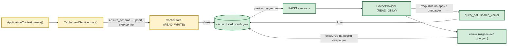

# 🗃 База данных, пул соединений и SQL-скрипты

> Навигационный индекс каталога `docs/` — в [`README.md`](README.md). Этот документ —
> самодостаточное описание подсистемы.

## 🔌 Универсальный слой данных lib/services

**Интерфейс** — `lib/services/cache_provider.py`, три роли в одном модуле:

- `CacheProvider` (ABC) — **роль чтения**: `is_ready()`, `preload_indexes()`,
  `search_vector()`, `query_sql()`, `explain()`, `get_schema()`, `close()`.
  Ни одного write-метода здесь нет: потребитель не пишет в кэш.
- `CacheIngestion` (ABC) — **роль записи**: `upsert_records()`,
  `replace_records()`, `ensure_schema()`. Её получает только
  `CacheLoadService` — единственный writer, он же владелец файла на
  время загрузки.
- `CacheStore(CacheProvider, CacheIngestion)` — полный контракт единственного
  хранилища; именно он лежит в `ApplicationContext.cache_provider` и его
  возвращает точка создания. Наружу (DI project tools, skill-CLI) отдаётся
  `CacheProvider`, то есть только чтение.
- `SearchResult` (dataclass): `content`, `score`, `source`, `table`, `pk_value`,
  `chunk`, `matched_chunks`, `row`.

**Реализация** — `lib/services/duckdb_cache_store.py`:

- `DuckDbCacheStore` — **единственная** concrete-реализация `CacheStore`:
  DuckDB-файл кэша + векторные индексы в памяти. Создаётся только через
  `open_cache_provider(*, mode)`; конструктор и `connect()` напрямую
  оставлены для тестов реализации, не для production-кода.
- Неудачное открытие файла — всегда исключение: `CacheBusyError` (файл держит
  другой процесс, в сообщении указан PID держателя), `CacheOpenError`
  (любая другая причина), `UnsupportedFilesystemError` (network FS).
  «Полуготовый» провайдер с `is_ready() == False` наружу не возвращается.
- Процесс **не удерживает** файл между операциями: каждый read-метод открывает
  соединение на время вызова и закрывает сразу после. Writer'ом (а он
  блокирует и остальных) является только загрузка.
- Репликация PG → кэш в интерфейсе **не** участвует: её владеет
  `CacheLoadService`, который и вызывает роли записи.

**Общие помощники** — `lib/services/cache_provider_impl.py` (не реализация
интерфейса, а то, что нужно и реализации, и потребителям конфигурации):

- `get_embedding()` (Ollama `/api/embed`), `read_embedding_config()`,
  `read_embedding_defaults()`, `read_vector_index_config()` (конфиг индексов —
  из `project.json::gateway.vector.index.indexes`, PG-реестр не читается),
  `list_runtime_vector_indexes(provider=...)` — читает состав runtime-индексов
  **через интерфейс** провайдера и сама файл кэша не открывает.
- Тяжёлые зависимости (`duckdb`, `psycopg2`, `faiss`, `numpy`, `pyarrow`, `httpx`)
  импортируются **лениво** внутри функций — импорт модуля остаётся лёгким,
  и gateway может управлять жизненным циклом без побочных эффектов.

**Точка создания провайдера** — `lib/services/cache_provider.py::open_cache_provider(*, mode)`,
единственная в рантайме. Она сама резолвит путь (`resolve_cache_path()`),
настраивает экземпляр и открывает файл; вызывающий код получает `CacheStore`
и не знает, какая реализация стоит за интерфейсом. Навык делегирует ей через
`lib/core/skill_config.build_cache_provider()` (skill-side —
`scripts/skill_config.build_cache_provider()`), тот же путь использует
`tools/build_vectors.py`.

## 🔌 Единый пул соединений PostgreSQL (`workspace/utils/db.py`)

Чтобы на сервере никогда не было десятков параллельных подключений к PG
(проблема «too many connections» решается на уровне архитектуры, а не ретраями),
все подсистемы пользуются **одним общим пулом** соединений:

- **Одна job-очередь + пул воркеров** (по умолчанию `min_conn=1`, `max_conn=4`).
  Каждый воркер — поток, владеющий ровно одним psycopg2-соединением; он берёт
  задачи из общей очереди и выполняет их последовательно.
- **Публичный API** сохраняется: `execute/fetch/fetchone/fetchval`, async-варианты
  через `asyncio.to_thread`, `transaction()/async_transaction()`,
  `configure/resolve_dsn/run/set_pool_config/get_stats/start/shutdown`.
  Дополнительно: `probe_connections(count=None, timeout=None)` — «прогрев» пула:
  отправляет `count` (по умолчанию `min_conn`) лёгких задач, чтобы воркеры
  реально попытались подключиться к БД (ленивые воркеры иначе видны как
  0 живых соединений до первой задачи). Ошибки подключений наружу не бросаются —
  их состояние читается через `get_stats()`.
- **`get_stats()`** дополнительно отдаёт живые счётчики состояния воркеров:
  `connected_workers` (воркеры с живым соединением в этот момент) и
  `failed_workers` (воркеры, чья последняя попытка подключения завершилась
  ошибкой — «запустились с ошибкой»).
- **Активность пула в терминал** — ключ конфига пула `print_activity`
  (флаг подключается из `gateway.print_db_activity` через
  `ApplicationContext` → `_configure_db_pool`). При включении каждый db-воркер
  печатает `[db-worker] ... взял job / ... закончил job (Nms)` и текущий размер
  очереди `[очередь-БД] N` — по образцу активности воркеров задач канала
  `[task-worker]` / `[очередь-задач]` (флаг `gateway.print_worker_activity`).
  Приоритет вывода — rich-консоль, при сбое — обычный `print`. Названия строк
  писан латиницей (`db-worker`), очереди — по-русски; юникодные стрелки
  `←/→` заменяются на ASCII `<-/->` (cp1251-консоль Windows их не кодирует),
  а квадратные скобки меток выводятся через `markup=False` чтобы rich не
  трактовал их как стили.
- **Кто ходит в БД** — каждая задача несёт метку вызывающего (`Job.tag`):
  публичные функции `db.execute/fetch/fetchone/fetchval` (sync/async),
  `db.run`, транзакции begin/end и `probe_connections` помечают себя
  `файл:строка` через `_caller_tag(frames_back=2)`, внутренние
  прокси транзакций — цепочку `файл:строка <- файл:строка …` (4-й кадр + chain
  до 8). Метка печатается в лог активности (`взял job [...путь...] N`) и в
  loguru-строке воркера. По ней видно, какой модуль генерирует запрос (например,
  постоянный поток `nanobot/agent/loop.py` → `list_sessions` — см. §
  «Управление сжатием контекста»). Метка `[unknown]` остаётся только при
  сбое разрешения кадров стека (патологический случай) — в штатном режиме
  каждая задача несёт тег вызывающей стороны.
- **Транзакции — эксклюзивная аренда соединения** (`lease_id`): пока `with
  transaction()` жив, воркер первого вызова выполняет только задачи этой
  транзакции, а свободные воркеры продолжают обслуживать обычные задачи.
  Транзакция работает через прокси-объекты `_ConnectionProxy/_CursorProxy`
  (поддерживают справочные атрибуты psycopg2 — `autocommit`, `closed`,
  `commit()/rollback()/cursor()` и т.п.).
- **Транзакции честно ждут в очереди.** Если все воркеры заняты лизами,
  транзакция НЕ падает с ошибкой через `pool_timeout`, а ждёт освобождения
  воркера (как обычные job-ы). `pool_timeout` — порог диагностического
  warning («no free worker for lease …»), а не лимит ожидания. Если воркер
  был зализован, а `begin`-задача упала (обрыв соединения, полная очередь),
  lease гарантированно возвращается в пул (в `_acquire_lease` — `try/except`).
- **Реконнект с backoff** — внутри воркера: при обрыве соединение закрывается
  и пересоздаётся с экспоненциальной паузой (`reconnect_backoff_sec` →
  `reconnect_backoff_max_sec`); retry-able задачи переподнимаются до
  `job_max_retries`. После `connect_max_retries` неудачных подключений воркер
  сдаётся с ошибкой — сервисы, ждущие `run()`, не блокируются навсегда.
- **Неподключённые воркеры уступают очередь подключённым.** Если часть
  воркеров не смогла установить соединение (например, исчерпан лимит
  `CONNECTION LIMIT` роли или БД недоступна), они не отнимают задачи у живых:
  в `_take_job` такой воркер берёт обычную задачу, только когда в пуле нет ни
  одного воркера с живым соединением. Пока хотя бы один воркер подключён —
  вся очередь обслуживается им, неподключённые не тратят время на
  retry-connect. При полной недоступности БД задачи быстро падают с ошибкой
  подключения, а не висят в очереди вечно. Транзакции (`lease_id != 0`) на
  это правило не влияют — их воркер забирает безусловно.
- **Настройка** — `project.json → channels.postgres.pool`:
  `min_conn`, `max_conn`, `pool_timeout`, `queue_maxsize`,
  `reconnect_backoff_sec`, `reconnect_backoff_max_sec`, `connect_max_retries`,
  `idle_timeout_sec`, `job_max_retries`. `ApplicationContext.create()` читает эту
  секцию и применяет через `set_pool_config()`; `ctx.start()/stop()` вызывают
  `utils.db.start()/shutdown()`.

**Кто ходит в БД через пул:** `DbLoggingService`, `CacheLoadService` (только на
время стартовой загрузки), `PGSessionManager`, `PostgresChannel`,
`session_storage` и инструменты. (`streamlit_app.py` тоже ходил, но удалён в
фазе 1.) Ни один сервис-поток не
держит собственного psycopg2-соединения — соединение выдаёт пул на время
запроса/транзакции. Чтение кэша в рабочем режиме пул **не занимает вовсе**:
это и есть смысл кэша.

**Санитизация NUL-байта.** PostgreSQL не принимает NUL (0x00) в text-литералах,
а psycopg2 не любит литеральные escape `\u0000`..`\u0003` — такой контент
(бинарь из `exec`/`read_file` или LLM-вывод) валит запись сессии
(`A string literal cannot contain NUL (0x00) characters.`). Вычистка идёт на
двух уровнях:
  1. **на источнике** — патч `RuntimePatcher.patch_session_content_cleanup`
     оборачивает `Session.add_message` и чистит контент через канонический
     `workspace/utils/clean_text.py`;
  2. **страховка на границе БД** — `utils.db._sanitize_param` (все параметры
     `execute`/`mogrify`, включая `execute_values`) тоже прогоняет значение через
     `clean_text`, чтобы обойдённая живым патчем строка не упала на записи.

---

## ⚙️ Конфигурация навыка

Секция `skills.audit_analyzer` в `project.json`:

| Ключ | Назначение | Значение / по умолчанию |
|------|-----------|-------------|
| `skills.audit_analyzer.enabled` | Вкл/выкл навыка | `true` |
| `skills.audit_analyzer.tables[*].name` | Таблицы домена, доступные агенту (`{name, tracking_column?, label?}`) | `oarb.audit_reports`, `oarb.audits`, `oarb.report_items`, `oarb.violations` — **примеры текущей инсталляции; имена настраиваются здесь** |
| `skills.audit_analyzer.tables[*].label` | Opaque-метка для `resources_by_label` (напр. реестр скриптов) | `public.agent_predefined_scripts` → `label: "scripts_registry"` |
| `skills.audit_analyzer.vector_indexes[*].name` | Имена FAISS-индексов (`index_name` в операции `vector_search`; persisted-файлов нет — индексы живут в памяти процесса) | `audits_index`, `violations_index`, `audit_reports_index` — **примеры текущей инсталляции** |
| ~~`skills.audit_analyzer.llm.*`~~ | — | **удалено (9.6)**: выбор модели принадлежит capability `llm`. `max_tokens` / `temperature` объявляет платформа — `mcp-platform/platform.json` → `llm.max_tokens` / `llm.temperature` |
| ~~`skills.audit_analyzer.cli.*`~~ | — | **удалено вместе с CLI навыка (фаза 9)**: `default_mode` / `max_retries` / `timeout_sec` больше не существуют, режим выбирает модель, а не флаг командной строки |
| `gateway.vector.index.storage_table` | Таблица сырых эмбеддингов; регистрируется через `lib.core.infra_registration.register_vector_storage` → `TableRegistry.register_infra("vector.storage", ...)` | `oarb.audit_vectors` |
| `gateway.vector.index.default_root` | Каталог FAISS-индексов (в runtime не персистится — FAISS в памяти) | `data_store/vectors` |
| `gateway.vector.index.indexes.<name>` | Декларативный конфиг индексов (`table`, `pk`, `source_table`, `content_columns`, `embedding_columns`, `track_column`, `chunk_size`, `chunk_overlap`, `metric`, `enabled`) — единственный источник; PG-реестр не читается | `audits_index`, `violations_index`, `audit_reports_index` |
| `gateway.sync.*` | **удалена** — поллинга и пересинхронизации больше нет | — |
| `gateway.cache.local_path` | Каталог файла кэша (имя `cache.duckdb` добавляется внутри `resolve_cache_path()`) | `~/.cache/nanobot/duckdb` |

> **Дубликат объявлений, который пока живёт.** `skills.audit_analyzer.tables[*]`
> и `skills.audit_analyzer.vector_indexes[*]` нужны агенту для загрузки снимка
> и сборки индексов — и те же значения объявлены ещё раз в
> `mcp-platform/platform.json` (секции `audit.tables`, `vectors.indexes`),
> потому что capability `audit` не должна получать знание о проекте из чужого
> окружения. Схлопывается вместе с уходом снимка из агента. До тех пор при
> расхождении доверять платформенному объявлению: запросы к данным идут через
> него, и только агент читает своё.

Декларация — единый источник истины. `ApplicationContext._auto_register_skills` (см. `lib/core/application_context.py`) читает эту секцию при старте и автоматически создаёт `TableResource`/`VectorResource` в `table_registry`. Никакого `register.py` не требуется. Для добавления нового skill достаточно добавить секцию `skills.<name>` в `project.json`. DoD-проверка — `tests/test_resource_universality.py`.

> Примечание: ретраи *генерации* SQL в режиме `generated_sql` захардкожены в
> `generated_sql_mode.py` (`MAX_RETRIES = 3` → до 4 попыток) и от `cli_max_retries`
> не зависят.

DSN подключается только через `channels.postgres.dsn` в `project.json`
(обычно `"${DATABASE_URL}"` из `.secrets.env`) через `utils.db.resolve_dsn()`.
Подключение возможно только через полный DSN (`channels.postgres.dsn`
в `project.json`, обычно `"${DATABASE_URL}"` из `.secrets.env` через
`utils.db.resolve_dsn()`). Частичные ключи `host`/`port`/`dbname`/`user`
не поддерживаются. Навык собственного DSN не хранит.

---

## 🔄 Жизненный цикл кеша

**Кеш — снимок, а не зеркало.** Он наполняется один раз при старте процесса и
больше не обращается к PostgreSQL. Дельт, фонового поллинга, очереди задач и
механизма координации писателей не существует. Свежесть обеспечивается
перезапуском процесса, а не фоном.

Пара сервисов строится в `ApplicationContext._init_cache_runtime`
(`lib/core/application_context.py`) внутри `create()` — там же, где поднимается
пул и проверяется схема. Возвращает `(None, None)`, если реестр таблиц пуст или
нет DSN.

- **`CacheLoadService`** (`lib/services/cache_load_service.py`) — единственный
  владелец подключения к PostgreSQL и единственный writer. Держит
  `CacheStore` напрямую (без колбэков — колбэки были лишним посредником между
  единственным писателем и его же хранилищем), выполняет **синхронную** загрузку
  и не порождает потоков. Для каждой таблицы из реестра:
  - `_fetch_schema()` — структура из PG `information_schema.columns` +
    `pg_description` (колонки, типы, NOT NULL, комментарии);
  - `store.ensure_schema()` — создаёт таблицу **с типами из PG** (включая пустые);
  - `_fetch_all()` → `store.replace_records()` — таблица пишется целиком.

  Именно `replace_records`, а не `upsert_records`: батч — полный снимок
  таблицы, поэтому строки, удалённые в PostgreSQL, корректно исчезают, а не
  остаются в кэше навсегда. `upsert_records` остаётся примитивом хранилища и
  из рантайм-пути не вызывается.

  Число потоков загрузки ограничено `channels.postgres.pool.max_conn`: каждый
  поток берёт слот общего пула на время запроса, поэтому больше потоков, чем
  слотов, означало бы драку за слоты. Ошибка соединения — `CacheLoadError`
  (громко); отсутствующая в PG таблица — запись в `missing_tables` без
  исключения.
- **`DuckDbCacheStore`** — DuckDB-файл кэша + FAISS-индексы в памяти.
  `ensure_schema()` создаёт таблицы с типами из PG и сохраняет комментарии +
  исходные PG-типы в мета-таблицу `__nanobot_meta.__schema_meta` (входит в
  снимок). `get_schema()` возвращает исходные PG-типы и комментарии (без них —
  DuckDB-тип из information_schema).

  Путь файла вычисляется через `resolve_cache_path()`
  (`lib/core/application_context.py`) — **единый механизм**, общий для runtime и
  навыка:

  1. `gateway.cache.local_path` (если задан) → `<это>/cache.duckdb`;
  2. **default** → `~/.cache/nanobot/duckdb/cache.duckdb`.
     DuckDB ATTACH flock не работает на NFS, поэтому default — локальная ФС,
     чтобы не падать с «Conflicting lock is held in PID 0».

  Единственного опционального knob'а `local_path` достаточно; legacy
  `<workspace>/data_store/duckdb/` через `gateway.cache.use_workspace_path`
  удалён (это была compat-ветка, которая расходилась с CLI).

**Файл не удерживается.** Загрузка открывает его на запись, пишет и **закрывает**
в `finally`. Затем провайдер на всё время жизни процесса открывает файл только на
время конкретной операции (`query_sql`, `search_vector`, `get_schema`) и закрывает
сразу после. Между запросами процесс файла не касается, поэтому файл физически
свободен всегда — в том числе для навыка, запущенного в отдельном процессе.

Схема в `gateway.py::main()`:



**Правило одного писателя.** DuckDB допускает только один процесс-писатель на
файл, поэтому запись идёт только на стадии загрузки в том же процессе, который
и читает файл. Плата за решение: DuckDB блокирует **и читателей**, пока держит
writer; поскольку writer'ом является только загрузка, а она завершается до
того, как процесс начнёт читать, конкуренции не возникает. Навык открывает файл
только на чтение и видит целостные данные в любой момент.

### 🔧 Управление загрузкой

#### Полный цикл (что происходит по шагам)

1. **Старт** (`gateway.py::main()`): `ApplicationContext.create()` читает
   секции `skills.*` и `gateway.vector` из `project.json`, регистрирует ресурсы
   в `TableRegistry`, поднимает пул и проверяет схему, затем
   `_init_cache_runtime()`.
2. **Стадия 1 — запись.** `open_cache_provider(mode=READ_WRITE)`;
   `CacheLoadService.load()` синхронно тянет все зарегистрированные таблицы
   (таблицы скиллов + `gateway.vector.index.storage_table`); в `finally` файл
   закрывается. Слоты пула освобождаются сразу после возврата.
3. **Стадия 2 — чтение.** `open_cache_provider(mode=READ_ONLY)` возвращает
   провайдера, который держит в памяти прогретые FAISS-индексы, но не держит
   файл.
4. **Ошибка соединения** поднимает `CacheLoadError` и прерывает старт: молча
   работать на пустом кэше хуже, чем не стартовать.
5. **Завершение**: при остановке провайдер закрывается. Перезагрузки кэша без
   перезапуска процесса нет.

#### Время снимка

Загрузка фиксирует время завершения и публикует его как
`cache_load_done.payload.loaded_at` в журнал `agent_gateway_logs` (плюс
`started_at` и `duration_sec`); `CacheLoadService.get_stats()` отдаёт то же.
С ним сверяются, чтобы не выдать устаревший снимок за «текущие» данные.

#### Управляющие ключи (`gateway.vector.index` / `gateway.cache` в `project.json`)

> Имена таблиц/индексов не зашиты: они берутся из `skills.audit_analyzer.tables[*].name`,
> `skills.audit_analyzer.vector_indexes[*].name` и `gateway.vector.index.*`.

| Ключ | По умолч. | Эффект |
|------|-----------|--------|
| `gateway.vector.index.storage_table` | `oarb.audit_vectors` | Таблица векторов, включается в загрузку и прогревается в FAISS (имя настраивается) |
| `gateway.vector.index.indexes` | `{}` | Декларация индексов (`<name>` → `VectorIndexConfig`); единственный источник конфигурации индексов (реестр `agent_vector_index_config` не читается) |
| `gateway.cache.local_path` | `~/.cache/nanobot/duckdb/cache.duckdb` | Путь файла кэша (`resolve_cache_path()`); legacy `<workspace>/data_store/duckdb/` не поддерживается |
| `channels.postgres.pool.max_conn` | `4` | Число слотов пула; оно же ограничивает число потоков загрузки |

Секции `gateway.sync.*` **удалена**: поллинга и пересинхронизации больше нет,
настраивать нечего. `config.py` мержит `project.json` в `SETTINGS`; после правки
`project.json` перезапуск обязателен.

#### Требования к таблицам источника

- Колонка `id` (upsert по ключу: `DELETE + INSERT`; если её нет — таблица
  пересоздаётся из батча целиком).
- Тип колонок должен быть читаем движком кэша. Отдельной track-колонки для
  инкрементального отслеживания больше не требуется: загрузка безусловно берёт
  всю таблицу, поэтому исчезновение строки из PostgreSQL корректно отражается в
  следующем снимке само по себе.

#### Практические сценарии

- **Обновить данные в PostgreSQL**: перезапустить процесс. Ничего другого нет.
- **Добавить таблицу в анализ**: добавить её в **оба** места — `audit.tables`
  в `mcp-platform/platform.json` (этим пользуется capability `audit` и именно
  по этому списку проверяется сгенерированный запрос) и
  `skills.audit_analyzer.tables` в `project.json` (этим наполняется снимок
  агента), затем перезапустить процесс. Правка только в `project.json` даст
  таблицу в снимке, но не в ответах, потому что запросы к данным больше не
  идут через агента.
- **Сомнение в свежести кэша**: сверить `loaded_at` в `cache_load_done` с
  временем последней правки данных в PostgreSQL.

#### Мониторинг

- `CacheLoadService.get_stats()`: `tables`, `loaded_at`, `loaded_ok`, `errors`,
  `missing_tables`, `rows_total`, `max_workers`.
- `DuckDbCacheStore.get_stats()`: `tables` (кол-во строк), `upserts`,
  `last_upsert_at`, `last_error`, `indexes_in_memory`, `vector_sources`.
- Журнал `agent_gateway_logs`: события `cache_load_started` и `cache_load_done`
  (время снимка, пропущенные таблицы, ошибки).
- Внешний признак актуальности: mtime файла кеша (по умолчанию
  `~/.cache/nanobot/duckdb/cache.duckdb`; см. `resolve_cache_path()`).

---

## 🗃 SQL-скрипты: создание таблиц

Все DDL собраны в корневом каталоге [`../sql/`](../sql/). Каталог, порядок применения, совместимость — в [`../sql/README.md`](../sql/README.md). Здесь только краткая сводка по новой структуре v2.

### Совместимость с Greenplum 6.5+

Таблица `oarb.audit_vectors` разработана для полной совместимости с
**Greenplum 6.5** (PostgreSQL 9.4 ядро): `BIGINT GENERATED BY DEFAULT AS IDENTITY`
для PK (нет переполнения), `TEXT` для `pk_value` (UUID/BIGINT),
`DISTRIBUTED BY (source)` для управляемой сегментации.

`public.agent_vector_index_store` (persisted FAISS-блобы) и
`public.agent_vector_index_config` (legacy-реестр) — **не применяются на новых
инстансах и не читаются кодом**; DDL остаётся в `sql/vectors/` как
legacy-артефакт (см. `docs/VECTOR_INDEXES.md`).

**Использование:**

| СУБД | Файлы |
|------|-------|
| Все (PG/GP) | `sql/audit_analyzer/create_oarb_*.sql` — доменные и векторные таблицы, один файл на таблицу (включая `create_oarb_audit_vectors.sql` — сырые эмбеддинги, Greenplum 6.5 `DISTRIBUTED BY (source)`) |

**Миграция со старой версии:** миграции схемы применяются через
`python tools/migrate.py --apply` (см. `sql/README.md`). После миграций
векторы пересобираются:
`python tools/build_vectors.py --full-rebuild`.

⚠️ Удаление persisted-FAISS-таблицы выполняется **вручную** (шаблон
`sql/migrations/V003__drop_vector_index_store.sql` через runner — no-op):

```bash
psql "$DATABASE_URL" -c "DROP TABLE IF EXISTS public.agent_vector_index_store;"
python tools/build_vectors.py --full-rebuild
```

### Структура (DDL)

```sql
-- PG 13+ вариант
oarb.audit_vectors (
    id             BIGINT GENERATED BY DEFAULT AS IDENTITY PRIMARY KEY,
    pk_value       TEXT,                     -- было INTEGER
    embedding      REAL[] NOT NULL,
    source         TEXT NOT NULL,
    ... (PK только по id; доп. индексов в DDL нет)
);
```

```sql
-- GP 6.5 вариант — добавляется распределение:
DISTRIBUTED BY (source);         -- audit_vectors
```

### Ограничения GP 6.5

- **`REAL[]`**: до ~1GB на массив. Для 1024-dim = ~1M векторов на сегмент OK.
- **`bigserial`**: не поддерживается, используйте `BIGINT IDENTITY`.

### Известные несовместимости с PG

- `DISTRIBUTED BY` — только GP. PG падает с `syntax error at or near "DISTRIBUTED"`.
- `GENERATED BY DEFAULT AS IDENTITY` — PG 10+. Старые PG 9.4-9.6 нуждаются в `SERIAL`.

---

## 🛡 Инфраструктурные границы P0 (stabilization)

Четыре инфраструктурные границы, не зависящие от домена навыков
(TARGET_ARCHITECTURE §16/§20/§28/§29).

### SQL Security Guard — уехал на платформу (фаза 9)

В агенте больше нет. Модуль `lib/utils/sql_safety.py` (AST-политика read-only
SQL на `sqlglot`) удалён: его единственным продакшн-потребителем был
`generated_sql_mode.py` навыка `audit_analyzer`, который тоже уехал. Проверять
SQL было нечем.

Граница не исчезла, а переехала и разделилась на две, потому что исходная
закрывала две разные задачи одним модулем:

| Уровень | Где | Что проверяет |
|---|---|---|
| Проверка вывода модели | `mcp-platform/libs/audit/guard.py` | Белый список таблиц: из AST собираются **все** ссылки (`FROM`, `JOIN`, подзапросы, `WITH`), ссылка вне списка — отказ **до** выполнения. Плюс потолок строк, применяемый к любому сгенерированному запросу и проверяемый повторным разбором готового текста |
| Режим доступа к снимку | `mcp-platform/libs/enterprise_data/snapshot/sql_guard.py` | Классификатор DDL / DML / SELECT / OTHER + запрет multi-statement. Второй уровень поверх `read_only=True` у соединения DuckDB |
| Общая SQL-политика | `mcp-platform/libs/enterprise_data/sql_safety.py` | `validate_sql` / `format_schema` — порт исходного модуля, используется генератором `libs.audit` |

Что изменилось по сути, а не только места хранения: старый `validate_sql` знал
только вид оператора и **не знал имён таблиц** — запрос к любой таблице домена
проходил без возражений. Белый список таблиц был строкой в промпте, то есть
просьбой, а не запретом. Теперь запрет настоящий и проверяется разбором, а
деградации к регулярным выражениям нет: без `sqlglot` поднимается
`GuardUnavailableError`, потому что «проверка, которая молча ничего не
проверяет», хуже её отсутствия.

Тесты: `mcp-platform/tests/test_enterprise_data_sql_safety.py`,
`mcp-platform/tests/test_audit_lib_table_guard.py`.

### Contract tests nanobot API — `tests/contract/`

Фиксируют поверхность `nanobot-ai==0.3.0`, от которой зависит адаптер:
импорт-пути, сигнатуры `AgentLoop.from_config/_assemble_outbound/_save_turn`,
hook-протокол, MessageBus, SessionManager, BaseChannel ABC, CommandRouter,
AutoCompact/Consolidator, ключи консолидации конфига, ToolContext,
`_SubagentHook`, `prompt_templates._environment`. Падение набора при
обновлении nanobot = сигнал к ревизии RuntimePatcher. Запуск в CI:
job `upgrade-readiness`.

### Валидация проектных настроек — `lib/core/project_settings.py`

Pydantic-модель `ProjectSettings` поверх merged SETTINGS; вызывается из
`ApplicationContext.create()` сразу после загрузки конфига. Все ключи
опциональны с дефолтами (отсутствие — не ошибка), но неверный ТИП или
значение поднимает `ConfigurationError` со списком всех проблем сразу.
Неизвестные ключи разрешены (extra=allow). Тесты: `tests/test_project_settings.py`.

### Миграции схемы — `sql/migrations/` + `tools/migrate.py`

Версионные миграции `V<N>__<name>.sql` с tracking-таблицей
`public.schema_migrations` (version PK, SHA256-checksum, applied_at).
Runner: `python tools/migrate.py --status|--dry-run|--apply|--verify|--baseline`
(DSN: `DATABASE_URL` или `channels.postgres.dsn`). Drift применённого
файла блокирует apply без `--force`. Существующая БД штампуется через
`--baseline` (V001 не содержит DDL). Подробности: [../sql/README.md](../sql/README.md).
Тесты: `tests/test_migrations.py`.
