# TARGET_ARCHITECTURE.md

# Workspaces Nanobot — целевая архитектура проекта

**Назначение документа:** это не описание текущей реализации и не backlog. Это архитектурный контракт, к которому должен стремиться проект.

Coding-agent обязан сверять любое существенное изменение с этим документом до и после внесения изменений.

Если текущее состояние проекта расходится с документом, агент не должен автоматически переписывать всё. Сначала он должен определить минимальное изменение, которое приближает систему к target architecture без нарушения текущего поведения.

> **Отношение к остальной документации (чтобы не дублировать):**
> - Этот файл — **норма/контракт** («как должно быть»), а не описание текущей реализации.
> - Описание того, **как система устроена сейчас**, — в `docs/`:
>   [ARCHITECTURE.md](ARCHITECTURE.md) (сервисный слой, `ApplicationContext`,
>   каналы), [DATABASE.md](DATABASE.md) (БД, пул соединений, границы SQL),
>   [INTERNAL_API.md](INTERNAL_API.md) (tool'ы, конфигурация),
>   [VECTOR_INDEXES.md](VECTOR_INDEXES.md) (FAISS/Ollama).
> - Где темы пересекаются: правила и invariant'ы — только здесь; детали реализации — только в `docs/*`.
> - Навигационный индекс документации — [README.md](README.md).

---

## 1. Главный архитектурный принцип

Проект не должен становиться вторым agent framework.

`nanobot-ai` является generic agent runtime.

`workspaces_nanobot` является специализированным enterprise/domain integration layer вокруг `nanobot-ai`.

Целевая модель:

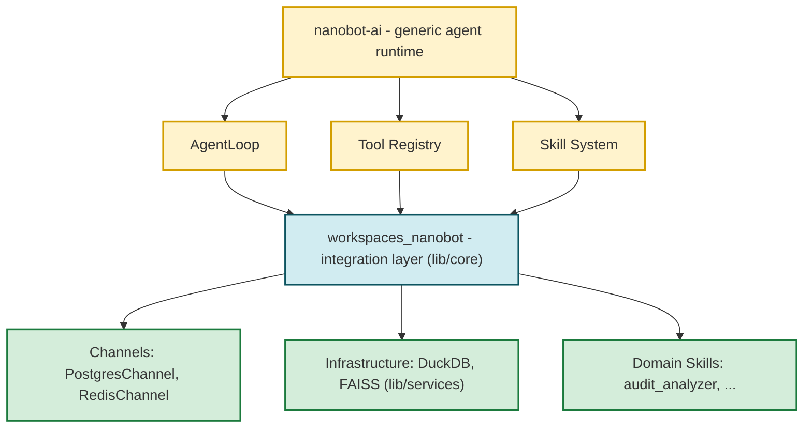

Проект должен использовать возможности `nanobot-ai`, а не копировать их.

---

# 2. Обязательное разделение ответственности

## 2.1. Nanobot

`nanobot-ai` владеет generic agent runtime:

- `AgentLoop`;
- `AgentRunner`;
- context building;
- sessions semantics;
- memory/compaction;
- tool registry;
- hooks;
- runtime events;
- MCP;
- providers;
- subagents;
- cron/automation;
- generic channels;
- generic security/runtime mechanisms.

Не создавать в проекте вторые версии этих механизмов без доказанной необходимости.

---

## 2.2. Workspaces core

`lib/core` — composition/integration layer проекта.

Он отвечает за:

- сборку приложения;
- создание зависимостей;
- конфигурацию проекта;
- lifecycle;
- подключение project-specific services;
- подключение custom channels/hooks/tools;
- связывание инфраструктурных компонентов.

`lib/core` не должен содержать бизнес-логику конкретного Skill.

`ApplicationContext` является composition root, а не вторым agent runtime.

---

## 2.3. Skills

Skill — отдельная domain/procedural capability агента.

Skill является самостоятельным расширением и не зависит от Tools напрямую.

Целевая структура:

```text
workspace/skills/<skill_name>/
    SKILL.md
    scripts/
    references/
    assets/
```

Skill может содержать:

- инструкции для агента;
- domain knowledge;
- procedural workflows;
- executable scripts;
- references;
- assets;
- специализированный детерминированный код.

Skill не обязан превращать свои scripts в Tools.

Skill не должен импортировать `workspace/tools`.

Skill не должен зависеть от конкретного Python-класса Tool.

### Граница `skills.<name>.*` vs shared infrastructure

`project.json::skills.<name>` содержит ТОЛЬКО **domain binding** skill'а —
то, что меняется при смене домена. Shared runtime-инфраструктура лежит
вне `skills.*` (см. `gateway.*`). Это сознательное правило: оно
фиксируется в `SkillSettings(extra="forbid")` (см.
`lib/core/project_settings.py::SkillSettings`) и автоматически
валидируется на старте через `SkillsSettings._validate_skill_sections`.

**Чек-лист «куда положить новый ключ»:**

| Меняется при смене... | Положить в... |
|---|---|
| Домена skill'а | `skills.<name>.<key>` |
| Инфраструктуры, но не домена | `gateway.<section>.<key>` |
| Deployment'а | `channels.*` или env (`.secrets.env`) |

**Примеры:**

| Настройка | Где живёт | Почему |
|---|---|---|
| `temperature`, `max_tokens` для SQL-генерации | `skills.<name>.llm` (или `skills.<name>.generation`) | Execution policy skill'а (доменное решение) |
| Модель / провайдер LLM | `config.json` (`agents.defaults.*`) | Выбор провайдера — это свойство инфраструктуры, не домена skill'а |
| Ollama URL / `auth_token` для эмбеддера | `gateway.vector.embedding` | Embedding service — общий runtime, не домен skill'а |
| DuckDB snapshot path | `table_registry.snapshot_path()` | Cache path — общий runtime |
| FAISS root / backend / storage_table | `gateway.vector.index.*` | FAISS-инфраструктура — общий runtime |
| PG → DuckDB sync интервал | `gateway.sync.*` | Sync — общий runtime |
| Список таблиц skill'а | `skills.<name>.tables[]` | Какие PG-ресурсы — часть домена skill'а |
| Список vector-индексов skill'а | `skills.<name>.vector_indexes[]` | Какие индексы использует skill (только имена) |
| Параметры CLI навыка (`default_mode`, `timeout_sec`) | `skills.<name>.cli` | Специфика CLI-интерфейса skill'а |
| Pool size / worker count | `channels.postgres.pool.*` | Deployment-настройка транспорта |
| CLI-флаги отображения (`show_reasoning`) | `cli.*` (верхний уровень) | Настройки CLI-агента, не skill |

**Что НЕ должно быть в `skills.<name>`** (по правилу): embedding service,
cache/refresh policy, FAISS-бэкенд, sync-параметры, model/provider LLM.
Всё это — shared infrastructure.

**Legacy-пути, удалённые при commit «skill configuration boundary»:**

* `skills.<name>.embedding` → перенесён в `gateway.vector.embedding`.
* `skills.<name>.cache` → удалён (поля были мёртвыми).
* `skills.<name>.vector_indexes[].source` → удалён (source —
  runtime-реестр в `public.agent_vector_index_config`).
* `gateway.vector_index.*` → переименован в `gateway.vector.index.*`.

Обратной совместимости нет (fail-fast через runtime-проверку, не
через Pydantic): старый `project.json` с этими секциями стартует, но
runtime их **не читает**.

---

## 2.4. Tools

Tool — независимая callable capability для agent runtime.

Tool не является wrapper над Skill.

Tool не должен загружать `SKILL.md` или Python-файлы из `workspace/skills`.

Tool не должен знать конкретные Skills.

Tool должен быть максимально generic в рамках своей capability.

Примеры целевых инфраструктурных Tools:

```text
workspace/tools/
    duckdb_query_tool.py
    vector_search_tool.py
```

В будущем допустимы другие независимые Tools, если они представляют самостоятельную generic capability.

---

# 3. Критическое правило: Skill и Tool независимы

## Разрешено

```text
Skill -> shared infrastructure/service
Tool  -> shared infrastructure/service
```

## Запрещено

```text
Skill -> Tool
Tool  -> Skill
```

Особенно запрещены конструкции вида:

```python
from workspace.skills.audit_analyzer import ...
```

в Tool и:

```python
from workspace.tools import ...
```

в Skill.

Агент должен считать такие зависимости архитектурным дефектом.

Связь Skill и Tool происходит через agent runtime:

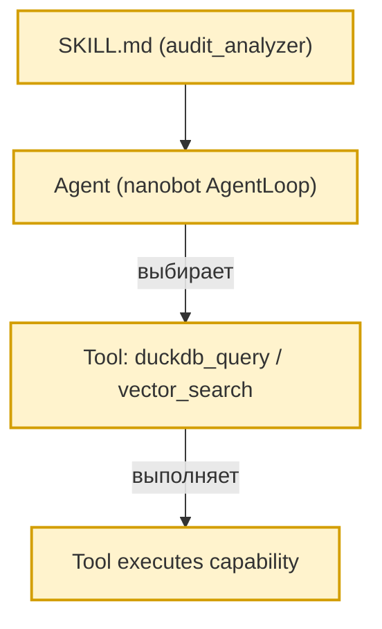

Skill не вызывает Tool программно.

---

# 4. Общая инфраструктура

Если одна capability нужна нескольким Skills и Tools, её реализация должна находиться в общем infrastructure/service layer.

Принцип:

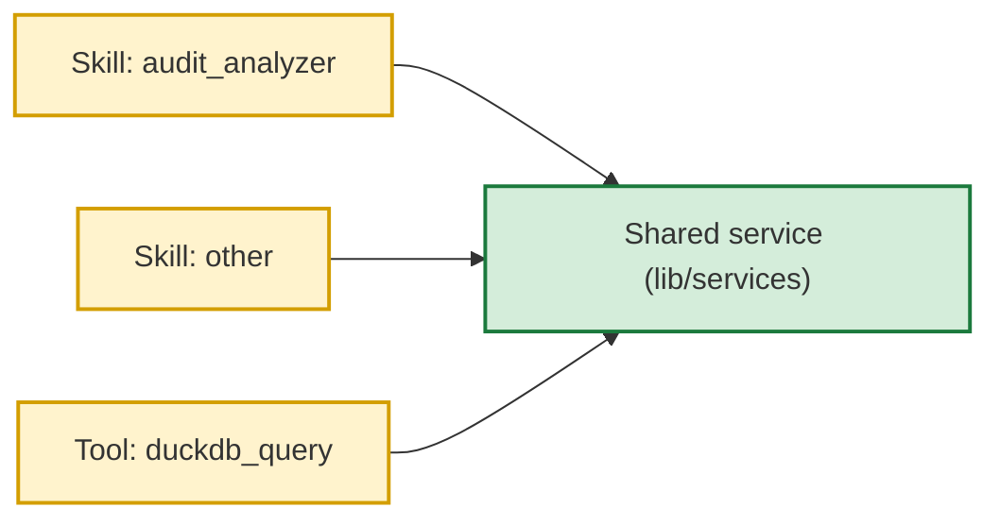

Общий код должен быть нейтральным к конкретному Skill.

Он не должен содержать:

```text
audit-specific conditions
skill-specific index names
skill-specific table names
business-specific routing
```

если это не является частью явно выделенного domain layer.

---

# 5. DuckDB Tool

Целевая capability:

```text
duckdb_query
```

Назначение:

> Выполнить безопасный read-only SQL запрос в доступном DuckDB источнике.

Tool не знает конкретные таблицы и не знает Skills.

Пример:

```json
{
  "sql": "SELECT year, count(*) FROM audits GROUP BY year ORDER BY year",
  "params": {},
  "max_rows": 100
}
```

## Tool отвечает за

- parsing/validation input;
- read-only SQL policy;
- запрет destructive statements;
- запрет multi-statement;
- query timeout;
- row limit;
- result size limit;
- JSON-safe serialization;
- structured errors;
- logging/metrics.

## Tool не отвечает за

- какие таблицы являются audit tables;
- какие таблицы разрешены конкретному Skill;
- значения business parameters;
- domain semantics;
- выбор таблицы за пользователя;
- orchestration конкретного Skill.

---

# 6. Vector Search Tool

Целевая capability:

```text
vector_search
```

Назначение:

> Выполнить semantic search по указанному vector index.

Пример:

```json
{
  "query": "финансовые нарушения",
  "index_name": "violations_index",
  "top_k": 5,
  "threshold": 0.65
}
```

Tool не знает, что `violations_index` относится к audit domain.

Он знает только generic vector infrastructure.

## Tool отвечает за

- получение/проверку index;
- embedding;
- vector lookup;
- top-k;
- threshold;
- result limits;
- timeout;
- structured errors;
- metrics/logging.

## Tool не отвечает за

- выбор индекса по бизнес-смыслу;
- audit-specific indexes;
- Skill routing;
- interpretation результатов.

---

# 7. Domain Skill: audit_analyzer

`audit_analyzer` должен оставаться самостоятельным Skill.

Целевая структура:

```text
workspace/skills/audit_analyzer/
    SKILL.md
    scripts/
        ...
    references/
        schema.md
        vector_indexes.md
        reports.md
    assets/
        ...
```

Skill должен знать domain context:

- какие таблицы доступны;
- какие поля важны;
- какие vector indexes доступны;
- какие сценарии анализа существуют;
- когда использовать DuckDB;
- когда использовать vector search;
- как комбинировать capability;
- какие ограничения действуют для domain.

Но Skill не должен знать реализацию Python-классов Tools.

---

# 8. Decision procedure Skill

Каждый сложный domain Skill должен иметь понятный workflow выбора capability.

Для `audit_analyzer` целевая логика:

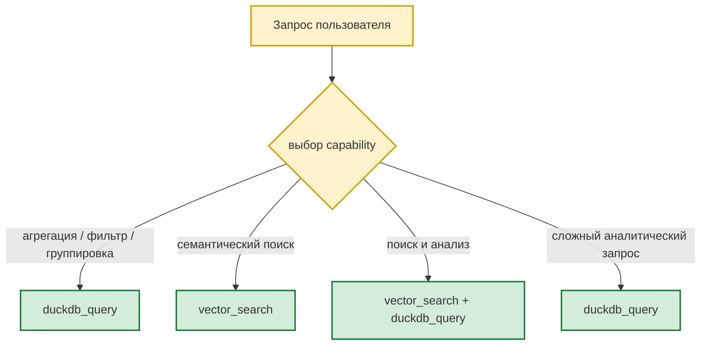

Если конкретный сценарий лучше решается predefined workflow внутри Skill, Skill может использовать собственный script.

Важно:

> Не каждое действие Skill обязано быть Tool call.

Scripts Skill остаются допустимыми и являются частью Skill package.

---

# 9. Scripts внутри Skills

Scripts — штатная часть Skill, а не legacy слой, который обязательно нужно удалять.

Scripts допустимы для:

- детерминированных операций;
- преобразования данных;
- подготовки входных данных;
- специальных workflows;
- batch/CLI scenarios;
- domain-specific алгоритмов;
- операций, которые не являются generic Agent Tool capability.

Script не должен регистрировать Tool и не должен знать внутренний Tool implementation.

Если script и Tool используют одну и ту же общую инфраструктурную функцию, она может находиться в shared service/infrastructure layer.

---

# 10. Skill references

Большие знания не следует целиком помещать в `SKILL.md`.

Использовать progressive disclosure:

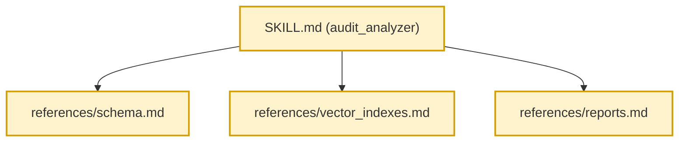

`SKILL.md` должен содержать правила принятия решений и основную процедуру.

Подробные справочники должны загружаться только при необходимости.

---

# 11. CLI

CLI является отдельным способом запуска capability.

CLI не является Tool.

CLI не должен зависеть от nanobot runtime только ради запуска domain logic.

Целевая модель:

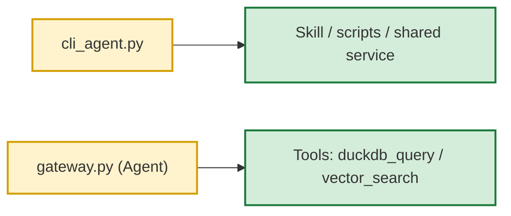

Оба пути могут использовать общий infrastructure/domain code, но не должны вызывать друг друга.

---

# 12. PostgreSQL Channel

`PostgresChannel` — enterprise transport adapter.

Он отвечает за:

- polling;
- message claiming;
- processing state;
- retries;
- reclaim/unstick;
- worker pool coordination;
- persistence outbound/inbound;
- media transport;
- delivery semantics.

Он не должен реализовывать:

- agent reasoning;
- planning;
- memory;
- business Skills;
- SQL generation by LLM;
- tool execution loop.

`single` и `worker_pool` являются deployment/transport behavior, а не agent runtime behavior.

---

# 13. Session architecture

PostgreSQL может быть durable session store проекта.

Целевая ответственность:

```text
PG Session Manager
    = persistence of nanobot session semantics
```

Он не должен становиться универсальной системой хранения всего:

- audit data;
- vector indexes;
- UI state;
- tool implementations;
- domain reports.

---

# 14. Storage responsibilities

Целевая модель:

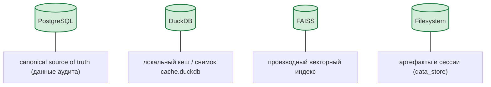

Производные данные должны быть восстановимыми из canonical source.

FAISS не должен быть единственным источником истины.

DuckDB не должен становиться authoritative database.

---

# 15. AuditSync

`PgDuckDbSyncService` (ранее `AuditSyncService`, переименован в Фазе 6) является
domain/infrastructure integration component.

Целевая цепочка:

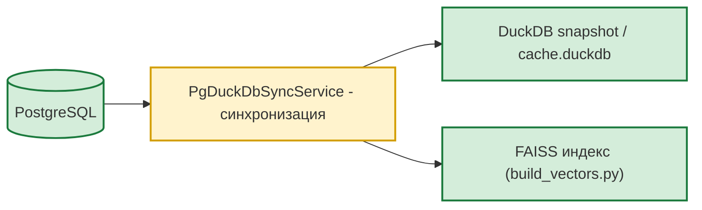

Он не должен зависеть от AgentLoop.

Он не должен быть Tool.

Он не должен быть Skill.

Он должен работать как самостоятельная service/background capability.

---

# 16. SQL security boundary

Любой SQL, который может быть сформирован LLM, обязан проходить инфраструктурную policy validation непосредственно перед execution.

Prompt или `SKILL.md` не являются security boundary.

Минимально необходимо:

- SELECT-only policy;
- one statement;
- запрет DML/DDL;
- timeout;
- row/result limit;
- controlled schema access;
- structured error;
- audit trail по необходимости.

Policy должна находиться ниже Skill, чтобы ошибка Skill не превращалась в нарушение безопасности.

---

# 17. Configuration

Конфигурация разделяется на три смысловых уровня.

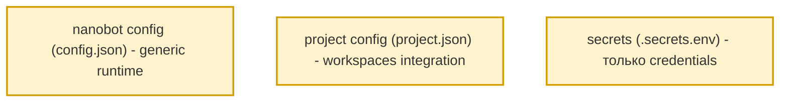

Не смешивать их без необходимости.

Критические project settings должны проходить startup validation.

Не должно быть скрытого порядка десятков legacy fallbacks, который невозможно объяснить.

---

# 18. ApplicationContext

`ApplicationContext` должен оставаться composition root.

Он делает:

```text
create
wire
configure
start
stop
```

Он не делает:

```text
business analysis
SQL generation
vector search
report calculation
Skill reasoning
```

Если ApplicationContext начинает накапливать domain logic, эту логику следует вынести в соответствующий service.

---

# 19. AgentFactory

`AgentFactory` должен только собирать `nanobot AgentLoop` с нужными project extensions:

- hooks;
- hook factories;
- project session manager;
- project cron/integration dependencies;
- другие штатные extension points.

Он не должен реализовывать agent execution semantics.

---

# 20. RuntimePatcher и private nanobot APIs

Private nanobot API и monkey patches являются исключением, а не нормальным механизмом интеграции.

Каждый patch должен иметь:

```text
purpose
reason
nanobot version
public alternative checked?
upgrade risk
test
```

Если upstream предоставляет официальный extension point, patch должен быть заменён на него.

Если patch пока необходим, он должен находиться в одном чётко обозначенном compatibility layer.

---

# 21. Dependency direction

Целевая зависимость:

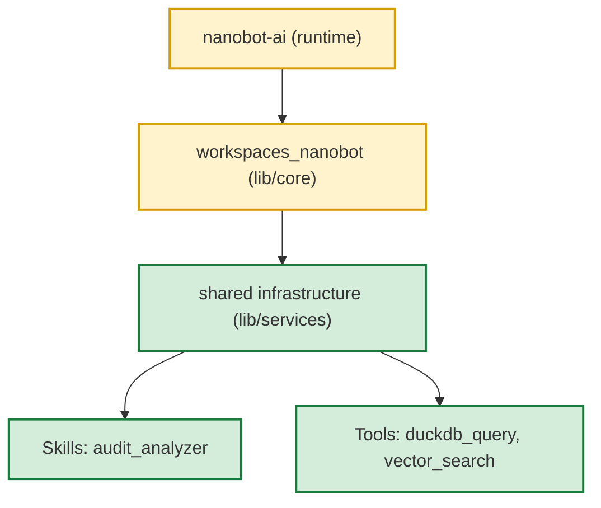

Но domain-specific Skills и generic Tools не должны зависеть друг от друга.

Более точная practical model:

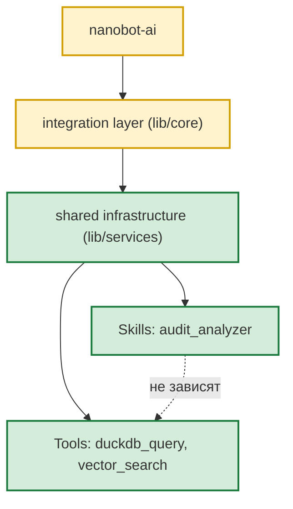

`Shared infrastructure` не должен быть скрытым business layer.

---

# 22. Anti-patterns

Следующие решения считаются архитектурным нарушением или требуют отдельного обоснования.

## 22.1. Tool -> Skill

Запрещено.

## 22.2. Skill -> Tool

Запрещено.

## 22.3. Tool знает domain

Например:

```python
if index_name == "violations_index":
    ...
```

Запрещено в generic Vector Tool.

## 22.4. Универсальный Tool превращается в hidden business engine

Например `duckdb_query` начинает сам выбирать audit tables.

Запрещено.

## 22.5. Второй AgentLoop

Запрещено без архитектурного решения уровня проекта.

## 22.6. Второй ToolRegistry

Запрещено, если nanobot registry может решить задачу.

## 22.7. Дублирование nanobot

Не создавать собственные memory/context/tool execution/session semantics без необходимости.

## 22.8. Dynamic import Skill из Tool

Запрещено как целевая архитектура.

## 22.9. Shared service с domain routing внутри

Например:

```python
if caller == "audit_analyzer":
    ...
```

Не использовать.

## 22.10. Hardcoded каталог ресурсов в `SKILL.md`

`SKILL.md` навыка не должен содержать **физических имён** таблиц, колонок,
векторных индексов или predefined-скриптов текущего datasource. Каталог
ресурсов рендерится runtime из auto-populated env-vars
`SKILL_<NAME>_*` (см. `lib/utils/skill_catalog.py` и
`RuntimePatcher.patch_skill_catalogs`).

Инвариант:

> **Adding, removing, renaming or extending datasource resources must be
> a configuration operation, not a skill modification.**

Конкретно запрещено в `SKILL.md`:

- имена таблиц (`oarb.audits`, `sales.orders`, и т.п.);
- имена колонок (`auditee_entity`, `severity`, `actual_date`, и т.п.);
- имена vector-индексов (`audits_index`, `violations_index`, и т.п.);
- имена predefined-скриптов (`audit_status_summary`, ..., и т.п.);
- ссылки на `references/*.md` с физической схемой.

Разрешено:

- маркеры `{{SCRIPTS_CATALOG}}`, `{{VECTORS_CATALOG}}`, `{{TABLES_CATALOG}}`
  для runtime-рендера каталога;
- capability-названия как категории выбора
  (`PREDEFINED SCRIPT`, `VECTOR SEARCH`, `NL → SQL`);
- бизнес-термины (`аудит`, `нарушение`, `организация`) — без привязки
  к конкретным колонкам;
- правила выбора capability, safety, quality.

Проверки: `tests/test_skill_tool_integration.py::test_skill_md_no_hardcoded_resource_names`.

---

# 23. Tool design rules

Каждый Tool должен иметь:

- ясное имя;
- минимальный input contract;
- строгую validation;
- bounded output;
- structured errors;
- timeout;
- logging/metrics;
- security policy, если capability чувствительная.

Tool не должен иметь огромный prompt.

Tool description должна объяснять capability, а не конкретный Skill.

---

# 24. Skill design rules

Каждый Skill должен иметь:

- понятное назначение;
- trigger/use cases;
- decision procedure;
- workflow;
- ограничения;
- examples;
- references при большом объёме знаний;
- scripts только там, где нужен executable workflow.

Skill должен быть полезен как самостоятельный package.

Можно удалить все Tools проекта, и Skill package не должен превращаться в неработающий Python import graph.

---

# 25. Progressive disclosure

Не помещать всю информацию в `SKILL.md`.

Правило:

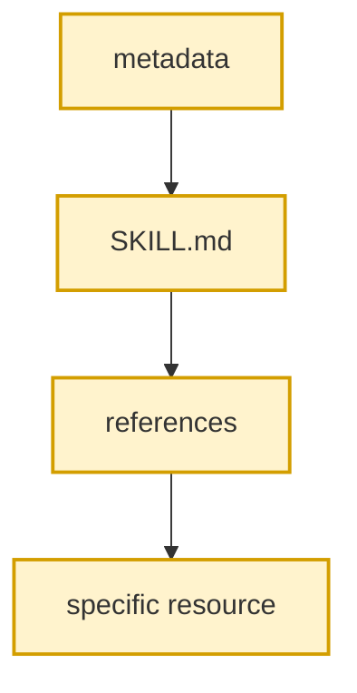

Большие schema, длинные examples и технические справочники должны быть вынесены из основного Skill instructions.

---

# 26. Observability

Каждая agent operation должна иметь возможность быть связана через:

```text
trace_id
request_id
session_id
turn_id
message_id
tool_call_id
worker_id
```

Для Tool минимум логируются:

- start;
- finish;
- duration;
- success/failure;
- bounded error metadata.

Sensitive payload не должен бесконтрольно попадать в обычные logs.

---

# 27. Health и readiness

Проект должен различать:

```text
health = process is alive

readiness = required dependencies are usable
```

Readiness должен учитывать, какие capabilities обязательны для текущего deployment profile.

Например optional vector functionality не должна автоматически ломать readiness всего gateway, если vector search не является обязательным.

---

# 28. Testing architecture

Нужны четыре уровня тестов.

## Unit

Тестирует отдельные classes/functions.

## Integration

Проверяет реальное взаимодействие:

```text
Tool -> infrastructure
Channel -> DB
Skill workflow -> infrastructure
```

## Contract tests

Проверяют совместимость с `nanobot-ai` public APIs.

## Architecture tests

Проверяют запрещённые зависимости:

```text
Skill -> Tool
Tool -> Skill
```

И проверяют, что generic tools не содержат domain-specific routing.

---

# 29. Upgrade strategy

Основной внешний runtime — `nanobot-ai`.

Поэтому upgrade должен проходить так:

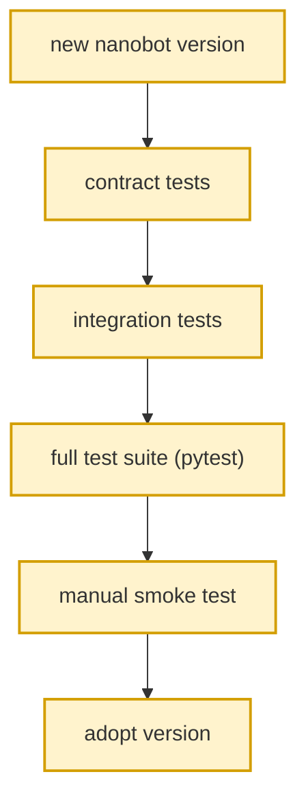

Не обновлять nanobot и одновременно переписывать половину проекта без необходимости.

Private API usage должен быть минимизирован и локализован.

---

# 30. Architecture decision checklist для coding-agent

Перед каждым существенным изменением агент обязан ответить на следующие вопросы.

### Question 1

Это generic runtime capability или project/domain capability?

Если generic runtime — сначала проверить возможности `nanobot-ai`.

### Question 2

Это Skill или Tool?

Skill = instructions/procedure/domain knowledge.

Tool = independent callable capability.

### Question 3

Не создаётся ли зависимость Skill <-> Tool?

Если да — изменение надо остановить и пересмотреть.

### Question 4

Можно ли использовать существующий nanobot extension point?

Если да — не создавать новый framework mechanism.

### Question 5

Знает ли generic Tool domain-specific names?

Если знает — вероятна неправильная архитектура.

### Question 6

Можно ли использовать capability без Skill?

Если нет, проверить, не слишком ли сильно Tool связан с domain.

### Question 7

Можно ли использовать Skill без конкретного Tool implementation?

Если нет, проверить наличие неправильной зависимости.

### Question 8

Является ли новая логика domain knowledge, infrastructure или runtime behavior?

Не смешивать эти уровни.

### Question 9

Не дублирует ли изменение уже существующее поведение nanobot?

Если дублирует — сначала рассмотреть стандартный upstream extension point.

### Question 10

Как это изменение повлияет на обновление `nanobot-ai`?

---

# 31. обязательная post-change проверка

После каждого архитектурно значимого изменения coding-agent должен выполнить:

```text
1. Проверить imports.
2. Проверить dependency direction.
3. Поискать Skill -> Tool.
4. Поискать Tool -> Skill.
5. Проверить domain-specific strings в generic Tools.
6. Запустить связанные тесты.
7. Запустить полный pytest.
8. Проверить, что CLI/Skill/Tool paths не сломаны.
9. Сравнить изменение с этим TARGET_ARCHITECTURE.md.
10. В отчёте явно указать, улучшило изменение архитектуру или только изменило код.
```

---

# 32. Минимальный architecture smoke test

В проекте должен существовать простой тест, подтверждающий:

```text
DuckDB Tool импортируется без audit_analyzer.
Vector Tool импортируется без audit_analyzer.
audit_analyzer Skill существует без Tool imports.
```

Если этот тест падает, это архитектурная регрессия.

---

# 33. Target structure

Целевая структура проекта должна приблизительно выглядеть так:

```text
workspaces_nanobot/
|
+-- gateway.py
+-- project.json
+-- requirements.txt
|
+-- lib/
|   |
|   +-- core/
|   |   +-- application_context.py
|   |   +-- agent_factory.py
|   |   +-- ...
|   |
|   +-- channels/
|   |   +-- postgres_channel.py
|   |   +-- ...
|   |
|   +-- hooks/
|   |   +-- tool_audit_hook.py
|   |   +-- database_logging_hook.py
|   |   +-- ...
|   |
|   +-- services/
|   |   +-- audit_sync.py
|   |   +-- vector_index_service.py
|   |   +-- ...
|   |
|   +-- repositories/
|   |   +-- ...
|   |
|   +-- adapters/
|       +-- nanobot/
|           +-- ... only where unstable/internal compatibility is required
|
+-- workspace/
|   |
|   +-- tools/
|   |   +-- duckdb_query_tool.py
|   |   +-- vector_search_tool.py
|   |
|   +-- skills/
|       |
|       +-- audit_analyzer/
|       |   +-- SKILL.md
|       |   +-- scripts/
|       |   +-- references/
|       |   +-- assets/
|       |
|       +-- other_skill/
|           +-- SKILL.md
|           +-- scripts/
|           +-- references/
|
+-- tests/
|   +-- unit/
|   +-- integration/
|   +-- contract/
|   +-- architecture/
|
+-- docs/
    +-- architecture-boundaries.md
    +-- skill-tool-architecture.md
    +-- TARGET_ARCHITECTURE.md
```

This is a target, not a requirement to immediately move every existing file.

---

# 34. Evolution strategy

Проект развивается по принципу:

```text
KEEP
    existing working behavior

ISOLATE
    unstable upstream integration

GENERALIZE
    reusable infrastructure capabilities

SPECIALIZE
    domain behavior inside Skills

REMOVE
    duplicate runtime/framework code
```

Не применять принцип:

```text
rewrite everything into target structure
```

Цель — постепенная конвергенция.

---

# 35. Что считается хорошим изменением

Хорошее изменение обычно обладает несколькими свойствами:

- уменьшает coupling;
- сохраняет существующее поведение;
- использует upstream extension point;
- делает generic infrastructure более reusable;
- оставляет domain knowledge внутри Skill;
- добавляет regression test;
- упрощает будущий upgrade nanobot.

---

# 36. Что считается плохим изменением

Плохое изменение обычно:

- добавляет второй runtime;
- связывает Tool с конкретным Skill;
- связывает Skill с конкретным Tool implementation;
- добавляет domain knowledge в generic infrastructure;
- копирует nanobot functionality;
- увеличивает количество hidden global state;
- добавляет private nanobot dependency без необходимости;
- решает локальную задачу через новый framework layer.

---

# 37. Финальный architectural invariant

В любой момент проект должен оставаться объяснимым следующими предложениями:

> `nanobot-ai` управляет агентом.

> `Skills` объясняют агенту, как решать domain-задачи, и могут содержать собственные scripts/resources.

> `Tools` предоставляют независимые callable capabilities.

> `Skills` и `Tools` не зависят друг от друга напрямую.

> Generic Tools не знают domain.

> Domain Skills не знают конкретную реализацию Tools.

> PostgreSQL, DuckDB, FAISS и filesystem имеют разные чёткие роли.

> `workspaces_nanobot` расширяет nanobot, а не заменяет его.

Если изменение делает эти утверждения менее правдивыми, изменение должно быть пересмотрено.

---

# 38. Final decision rule

При конфликте между «проще написать сейчас» и target architecture предпочтение отдаётся target architecture, если цена изменения разумна.

Если для сохранения target architecture требуется большой rewrite, не делать его автоматически. Сначала зафиксировать gap, добавить тест/constraint и выбрать постепенный путь миграции.

**Этот документ является главным архитектурным ориентиром проекта.**
