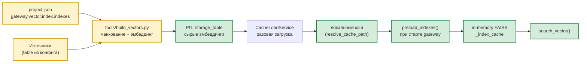

# 🔍 Векторная индексация

> Навигационный индекс каталога `docs/` — в [`README.md`](README.md). Этот документ —
> самодостаточное описание подсистемы.

## Архитектура



Ключевой инвариант: **сырые векторы живут в PG, FAISS — только в памяти
процесса**. Persisted-кеша FAISS нет: индекс каждый раз собирается заново из
DuckDB-снапшота (или лениво, при первом `search_vector`).

## Хранилище

| Объект | Назначение | Кто пишет | Кто читает |
|--------|-----------|-----------|-----------|
| `oarb.audit_vectors` (значение `gateway.vector.index.storage_table`) | Сырые эмбеддинги `REAL[]` + метаданные (`chunk_index`/`chunk_count`, `content_hash`, `row_data` JSONB, `synced_at`) | `tools/build_vectors.py` | `CacheLoadService` → локальный кэш → `DuckDbCacheStore` |
| Локальный снимок кэша (`resolve_cache_path()`) | Локальная реплика PG-таблиц для чтения агентом; снимок на момент загрузки | `lib/services/cache_load_service.py` | `lib/services/duckdb_cache_store.py::DuckDbCacheStore` |
| FAISS-индекс в памяти | Поисковый индекс (`IndexFlatIP`) | `provider.preload_indexes()` / `_load_index_from_cache()` | `provider.search_vector()` |

DDL: `sql/audit_analyzer/create_oarb_audit_vectors.sql`. Таблица
`public.agent_vector_index_store` (persisted FAISS-кеш) **удалена** миграцией
`sql/migrations/V003__drop_vector_index_store.sql`, а
`public.agent_vector_index_config` — legacy-артефакт, который кодом не читается
(`sql/vectors/*` на новых инстансах не применяются).

Путь к файлу DuckDB-кэша: `resolve_cache_path()` в
`lib/core/application_context.py` — `project.json::gateway.cache.local_path`
либо дефолт `~/.cache/nanobot/duckdb/cache.duckdb`.

## Конфигурация

Единственный источник конфигурации — `project.json`:

```jsonc
"gateway": {
  "vector": {
    "index": {
      "enable": true,                        // гейт векторной подсистемы
      "storage_table": "oarb.audit_vectors",// таблица сырых эмбеддингов
      "default_root": "data_store/vectors",  // каталог FAISS-индексов
      "backend": "faiss",
      "indexes": {
        "audits_index": {
          "table": "oarb.audits",            // исходная таблица
          "pk": "id",                        // PK исходной таблицы
          "source_table": "audits",          // значение source в audit_vectors
          "content_columns": ["title", "audit_type"],
          "embedding_columns": ["title", "audit_type"],
          "track_column": "updated_at",      // инкрементальное отслеживание
          "chunk_size": 500,                 // дефолт 500
          "chunk_overlap": 80,               // дефолт 80
          "metric": "cosine",                // cosine | inner_product
          "enabled": true
        }
      }
    }
  }
}
```

Модель — `VectorIndexSettings` / `VectorIndexConfig` в
`lib/core/project_settings.py`; **все ключи `extra="forbid"`** — опечатка в
`project.json` валит старт с `ConfigurationError`.

Поля `VectorIndexConfig`:

| Поле | Тип | Назначение |
|------|-----|-----------|
| `table` | `str` (обязательное) | Исходная таблица `schema.table` для эмбеддинга |
| `pk` | `str` (обязательное) | Колонка первичного ключа в `table` |
| `source_table` | `str \| None` | Логическое имя источника (значение `source` в `storage_table`) |
| `content_columns` | `list[str]` | Колонки, попадающие в `content` вектора (для отображения результатов) |
| `embedding_columns` | `list[str \| dict] \| None` | Колонки для эмбеддинга; элемент — строка или объект `{"column": ..., "chunk": true, "chunk_size": ..., "chunk_overlap": ...}` |
| `track_column` | `str \| None` | Track-колонка (дефолт `updated_at`) |
| `chunk_size` / `chunk_overlap` | `int \| None` | Параметры чанкинга (дефолты 500/80) |
| `metric` | `cosine \| inner_product \| None` | Метрика FAISS (дефолт `cosine`) |
| `enabled` | `bool` | `false` — индекс не участвует в сборке и прогреве (дефолт `true`) |

В skill'е (`project.json::skills.<name>.vector_indexes`) объявляется **только
имя** индекса (`VectorIndexEntry` со строгим `extra="forbid"`); source-таблица и
параметры сборки — общий runtime-конфиг.

### Параметры эмбеддинга

Захардкожены в `lib/services/cache_provider_impl.py` (`_EMBED_*`):
base_url `http://localhost:11434/api/embed`, модель `mxbai-embed-large:latest`,
размерность 1024, http_timeout 60.0, retries 3. Bearer-токен — переменная
окружения `EMBED_TOKEN` (если не задана — запрос без `Authorization`).
Секции `gateway.vector.embedding` в `project.json` **нет**.

## Индексы текущей инсталляции

| index_name | `table` | `content_columns` | `embedding_columns` | Чанкование |
|------------|---------|-------------------|---------------------|------------|
| `audits_index` | `oarb.audits` | `title, audit_type, auditee_entity, status` | те же 4 колонки | нет |
| `violations_index` | `oarb.violations` | `description, recommendation, violation_code, severity` | `description` (chunked 500/80) + `violation_code` | да |
| `audit_reports_index` | `oarb.audit_reports` | `full_text, title, report_number, report_date` | `full_text` (chunked 500/80) + `title` | да |

Имена таблиц и индексов — **не константы кода**, а значения текущей
инсталляции; в других развёртываниях они задаются в `project.json`
(`gateway.vector.index.storage_table`, `gateway.vector.index.indexes.*`,
`skills.<name>.vector_indexes[*].name`).

## Шпаргалка

| Цель | Команда / действие | Что происходит |
|------|-------------------|----------------|
| **Проверить конфиг (без сборки)** | `python tools/build_vectors.py --validate-only [--index <name>]` | Pre-flight: существование таблиц/колонок, формат `embedding_columns`, chunk-параметры, дубликаты. Exit 0 — ок, 1 — ошибки |
| **Собрать все индексы (новые/изменённые)** | `python tools/build_vectors.py` | Инкрементально по всем индексам: NEW / CHANGED / DELETED |
| **Пересобрать один индекс целиком** | `--index <name> --full-rebuild` | Все строки заново (для `--full-rebuild` вставка не читает старое состояние) |
| **Только если источник изменился** | `--check` | Сравнивает сигнатуру источника (`COUNT` + `MAX(track_column)`), при diff запускает инкрементальную сборку |
| **Сводное состояние** | `--status` | Состояние индексов без записи |
| **Прогнать без записи в БД** | `--dry-run` | План без INSERT/UPDATE |
| **Отключить индекс** | `"enabled": false` в `project.json` | `build_vectors` и `preload_indexes` его пропускают; вектора остаются |
| **Удалить вектора индекса** | `DELETE FROM <storage_table> WHERE source = '<index>'` | Поиск вернёт пустую выдачу до пересборки |
| **Проверить declared vs runtime** | `python tools/check_indexes.py` | Exit 0 — согласовано, 1 — divergence, 2 — инфраструктурная ошибка |
| **Посмотреть runtime-индексы из навыка** | `python scripts/cli.py --list-indexes` | Список индексов из DuckDB-снапшота + `CURRENT`/`ORPHAN` |
| **Поиск** | `python scripts/cli.py --mode vector --query '<текст>' --index-name <name>` | Семантический поиск (FAISS, top-5) |
| **Изменилась модель эмбеддинга** | Правка `_EMBED_*` в коде + `--full-rebuild` | Старые векторы имеют другую размерность → пересобрать |
| **Performance для 100k+ строк** | `--batch-size 8` (и `--pause-sec`) | Меньше памяти эмбеддера, дольше |

## Как добавить новый индекс

**1. Опишите индекс в `project.json::gateway.vector.index.indexes.<name>`** и,
если индекс используется конкретным skill'ом, добавьте его имя в
`skills.<name>.vector_indexes` (`[{"name": "objects_index"}]`).

**2. Проверьте конфиг (pre-flight, без сборки):**

```bash
python tools/build_vectors.py --validate-only --index objects_index
# ✓ Конфиг индекса 'objects_index' валиден
```

`--validate-only` проверяет **до** эмбеддинга (ничего не вставляет):
существование `table`/`pk`/`track_column` в PG, существование каждой колонки из
`embedding_columns`/`content_columns`, формат `embedding_columns`, корректность
`chunk_size`/`chunk_overlap`, дубликаты колонок. При ошибках — exit code 1,
каждая ошибка с подсказкой. Без `--index` проверяет все включённые индексы.

**3. Соберите вектора:**

```bash
python tools/build_vectors.py --index objects_index --full-rebuild
```

**4. Проверьте состояние:**

```bash
python tools/build_vectors.py --status
python tools/check_indexes.py
```

**5. Используйте в CLI:**

```bash
python scripts/cli.py --mode vector --query "объект с нарушениями" --index-name objects_index --top-k 5
```

## Как обновить существующий индекс

### Новые/изменённые/удалённые строки в источнике (типичный случай)

```bash
python tools/build_vectors.py --index audits_index   # один индекс, инкрементально
python tools/build_vectors.py                       # все индексы, инкрементально
python tools/build_vectors.py --check                # только если сигнатура источника изменилась
```

Классификация строк — по `content_hash` (MD5 от `search_text`) и
`MAX(track_column)`: NEW → INSERT, CHANGED → новые чанки вставляются, старые
удаляются **после** успешной вставки (при падении эмбеддинга старый вектор
сохраняется), DELETED → DELETE.

**Когда `--check` не помогает:** если изменились `embedding_columns` или
`content_columns` (сигнатура источника та же) — нужен `--full-rebuild`.

### Изменился состав embedding/content-колонок, chunk-параметры или metric

```bash
# правка project.json::gateway.vector.index.indexes.<name>
python tools/build_vectors.py --index audits_index --full-rebuild
```

### Изменилась модель эмбеддинга или размерность

> Параметры эмбеддера захардкожены (`_EMBED_*` в
> `lib/services/cache_provider_impl.py`, токен — `EMBED_TOKEN`).

```bash
python tools/build_vectors.py --full-rebuild   # вектора пересобираются целиком
python tools/build_vectors.py --status          # проверить размерность
```

Старые векторы другой размерности дают ошибку
`Размерность индекса не совпадает с размерностью эмбеддинга запроса` — поэтому
`--full-rebuild` обязателен (очистка `storage_table` вручную не нужна: при
`--full-rebuild` строки перезаписываются).

### DDL-изменения в исходной таблице

- колонка **не** используется в `embedding_columns` → достаточно инкрементального
  запуска;
- колонка добавлена/переименована в `embedding_columns`, изменён тип
  (`varchar→text`, `bigint→int`) → `--full-rebuild`;
- `embedding_columns` ссылается на удалённую колонку → сначала правка
  `project.json`, затем `--full-rebuild` (иначе ошибка
  `column "X" does not exist`);
- `track_column` удалён → индексация перестанет обновляться инкрементально
  (задать новую track-колонку в конфиге).

### Источник очищен (TRUNCATE)

```bash
psql "$DATABASE_URL" -c "TRUNCATE oarb.audits"
python tools/build_vectors.py --index audits_index
# build_vectors увидит: строк в источнике 0, в storage_table > 0 → все DELETED
```

### Остановить и продолжить (mid-build)

`build_vectors.py` идемпотентен: прерывание на середине `--full-rebuild`
безопасно — повторный запуск дозакончит вставку. Вручную `TRUNCATE` не нужен.

## Как отключить/удалить индекс

### Отключить (вектора остаются)

```jsonc
"audits_index": { ..., "enabled": false }
```

`build_vectors` и `preload_indexes` пропустят индекс. `--mode vector
--index-name audits_index` вернёт ошибку `unknown_index` (CLI валидирует имя по
`gateway.vector.index.indexes` до поиска, `_resolve_known_index`).

### Удалить вектора индекса

```sql
DELETE FROM oarb.audit_vectors WHERE source = 'audits_index';
```

После этого поиск вернёт пустую выдачу (в снапшоте нет строк для индекса).
Восстановление — `python tools/build_vectors.py --index audits_index`.

**Осторожно:** `TRUNCATE`/`DELETE` по `storage_table` **без** `WHERE` очищает
вектора всех индексов сразу.

### Удалить индекс из конфигурации

Убрать объект из `project.json::gateway.vector.index.indexes` (и из
`skills.<name>.vector_indexes`, если был). `build_vectors --validate-only`
покажет расхождение, если ссылки остались.

### Recovery

| Что сделали | Что делать |
|-------------|-----------|
| Удалили вектора (`DELETE`/`TRUNCATE` по `storage_table`) | `python tools/build_vectors.py --full-rebuild` |
| Удалили/испортили локальный снимок кэша | `python tools/build_vectors.py --full-rebuild` + перезапуск gateway (снимок пересобирается `CacheLoadService` при старте) |
| Удалили индекс из `project.json` | Вернуть объект, затем `--full-rebuild` |

## Сборка одного индекса

`tools/build_vectors.py:build_index(index_name, index_cfg, db_table, ...)`:

1. Прочитать текущее состояние из `storage_table` по `source` →
   `{pk_value: {content_hash, chunk_count, synced_at}}` (при `--full-rebuild` —
   считать пустым).
2. Прочитать строки источника (`SELECT *` по `table`).
3. Посчитать `content_hash` (MD5 от `search_text`, собранного из
   `embedding_columns`).
4. Классифицировать строки: NEW / CHANGED / DELETED.
5. Разбить длинные тексты на чанки — `lib/services/text_splitter.py:build_chunks`
   (только колонки с `chunk: true`).
6. Отправить батчи в эмбеддер (`get_embedding()`, Ollama `/api/embed`).
7. INSERT чанков в `storage_table` (одна строка на чанк), удалить
   устаревшие/удалённые строки.
8. Прогреть FAISS в памяти процесса — `provider.preload_indexes(db_table)`
   (`_rebuild_faiss`): для CLI это нужно, чтобы сразу искать; в gateway
   индексы прогреваются при старте.

Идемпотентность: `pk_value` сравнивается как строка (`_norm_pk`), поэтому
детект CHANGED/DELETED работает и не переписывает индекс на каждом запуске.

## Сигнатура индекса

`compute_index_signature()` (`lib/services/cache_provider_impl.py`) — SHA256 от
канонической конфигурации сборки по полям `_INDEX_SIGNATURE_FIELDS`:
`src_table`, `pk_column`, `content_cols`, `embedding_cols`, `track_column`,
`embedding_model`, `embedding_dimension`, `chunk_size`, `chunk_overlap`, `metric`.

`verify_index_signature(stored_meta, current_cfg)` возвращает:

- `CURRENT` — persisted-сигнатуры нет (штатный путь: индекс собран в памяти) либо
  совпадает с текущим конфигом;
- `STALE` — сигнатура есть и не совпадает (legacy-сборка);
- `INVALID` — сигнатура повреждена (не hex / не 64 символа).

Проверка выполняется при загрузке индекса (`_check_index_signature`) и **не
блокирует** загрузку: в `meta` добавляются `_signature_status` и
`_signature_reason`, они видны в `SearchResult.signature_status`.

**Метрика и нормализация:**

- `metric=cosine` (дефолт) — векторы нормализуются (`faiss.normalize_L2`) при
  сборке, query нормализуется перед поиском; score = косинусное сходство;
- `metric=inner_product` — без нормализации.

## Загрузка индекса в память

Единый путь `_load_index(index_name)`:

1. `self._index_cache[index_name]` — уже загружен;
2. `_load_index_from_cache()` — `SELECT ... FROM <storage_table> WHERE source = ?`
   из DuckDB-снапшота → `build_faiss_index(records, metric)` → кладётся в
   `_index_cache`.

`preload_indexes(db_table=None)` прогревает все индексы с `enabled != false` и
возвращает `[{index_name, vectors, signature_status?}]`. Вызывается при старте
gateway (`lib/services/preload_service.py`) — это и есть «warm-up».

`invalidate_cache(source=None)` сбрасывает один индекс или весь кэш — нужно
после того, как в `storage_table` появились новые строки (например, после
`build_vectors.py` в другом процессе).

## Поиск

```python
provider.search_vector(query, index_name="audits_index", top_k=5, threshold=None)
```

Возвращает `list[SearchResult]` (`content`, `score`, `source`, `table`,
`pk_value`, `chunk`, `matched_chunks`, `row`, `signature_status`). Пустой список
возвращается при отсутствии эмбеддинга, индекса или результатов; причина — в
`provider._search_error`:

- `faiss`/`numpy` не установлены → `pip install faiss-cpu numpy`;
- индекс не найден в снапшоте (нет строк с `source = <index_name>`);
- размерность индекса не совпадает с размерностью эмбеддинга запроса;
- эмбеддер недоступен / не удалось получить эмбеддинг.

## declared vs runtime

`tools/check_indexes.py` — контроль расхождения между декларацией
(`project.json::gateway.vector.index.indexes`) и runtime (набор `source` в
DuckDB-снапшоте `storage_table`):

- `MISSING` — индекс объявлен, но векторов нет (поиск вернёт пусто);
- `ORPHAN` — векторы есть, но индекс не объявлен (мёртвые данные);
- `STALE/INVALID` — устаревшая/повреждённая сигнатура.

Exit codes: `0` — расхождений нет, `1` — расхождение, `2` — инфраструктурная
ошибка (снапшот недоступен, `project.json` невалиден).

`--json` печатает машиночитаемый отчёт (`declared` / `runtime` / `divergence`).

Skill-уровневый список: `python scripts/cli.py --list-indexes` — та же runtime-
выборка со статусами `CURRENT` / `ORPHAN` (не из PG-реестра).

## Требования к источнику

- `table` существует в PG, все колонки из `content_columns`/`embedding_columns`
  существуют и читаемы;
- `pk` — стабильный PK строки источника;
- `track_column` — монотонная (`updated_at`, `bigint`): по ней определяется
  инкрементальное отслеживание;
- `source_table` — короткое имя источника, пишется в `storage_table.source`
  (используется как ключ индекса при сборке и поиске).

## Производительность и эксплуатация

- Инкрементальный режим дешёвый: переэмбедживаются только изменившиеся строки
  (`content_hash`).
- Батчинг: `--batch-size` (по умолчанию 10) и `--pause-sec` (5.0) ограничивают
  нагрузку на эмбеддер; при ошибке эмбеддинга — одна повторная попытка после
  `--embedding-retry-wait` секунд.
- Полный прогон может идти часами: безопасно прерывать и запускать заново.
- Падение отдельного индекса не роняет прогон — ошибка попадает в сводку.
- `--verbose` даёт DEBUG-лог конфига, чанков и каждой вставки.

## Edge cases

| Симптом | Причина | Решение |
|---------|---------|---------|
| `--validate-only` ругается на отсутствие колонки | опечатка в `project.json` или DDL-расхождение | сверить `information_schema.columns`, исправить конфиг |
| `unknown_index` при `--mode vector` | индекс не объявлен в `gateway.vector.index.indexes` | добавить объект в `project.json` и собрать индекс |
| Поиск возвращает `[]`, `_search_error` пуст | в снапшоте нет строк для `source` | `build_vectors --index <name>`, дождаться sync, `preload_indexes` |
| `Размерность индекса не совпадает…` | сменилась модель эмбеддинга | `--full-rebuild` после правки `_EMBED_*` |
| `SIGNATURE_STATUS=STALE` в результатах | изменились параметры сборки | `--full-rebuild` (загрузка не блокируется) |
| `faiss`/`numpy` не установлены | зависимости отсутствуют | `pip install faiss-cpu numpy`; вектора уже в БД, поиск заработает после установки |
| Медленный поиск (единицы секунд) | индекс не прогрет | `preload_indexes` при старте gateway (обычно уже вызывается), иначе первый `search_vector` платит за сборку |
| Параллельные запуски `build_vectors` | гонка за одни и те же строки | не запускать два процесса на один индекс одновременно (в CI/CI-CD — один прогон) |
| После внешнего `INSERT` в `storage_table` поиск старый | кэш индекса процесса не сброшен | `invalidate_cache()` / перезапуск gateway |

## Миграция с persisted-кеша

Инструкции для перехода со старой схемы (удаление
`public.agent_vector_index_store`, переход конфигурации в `project.json`) —
в [MIGRATION.md](MIGRATION.md). Детали runtime-контракта — в
[ARCHITECTURE.md](ARCHITECTURE.md) § «Vector-инфраструктура», нормативные
требования — в `openspec/specs/data/vector-indexes/spec.md`.
