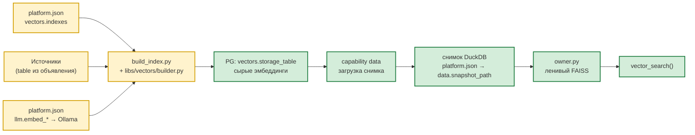

# 🔍 Векторная индексация

> Навигационный индекс каталога `docs/` — в [`README.md`](README.md). Этот документ —
> самодостаточное описание подсистемы.

## Где живёт подсистема

Вся векторная подсистема принадлежит платформе (`mcp-platform`), capability
`vectors`. В дереве агента (`lib/`, `workspace/`) её кода не осталось: сборка,
эмбеддинги, подпись индекса, чанкинг и FAISS уехали на платформу фазами 4, 5 и
9. Агент обращается к ней только через MCP-операции `vector_search`,
`list_indexes`, `index_stats`.

| Слой | Модуль |
|------|--------|
| Операторская сборка (CLI) | `mcp-platform/servers/enterprise/build_index.py` |
| Сборщик индексов | `mcp-platform/libs/vectors/builder.py` (`VectorBuilder`) |
| Объявление индексов, чтение настроек | `mcp-platform/libs/vectors/config.py` |
| Владелец FAISS-индексов в памяти | `mcp-platform/libs/vectors/owner.py` |
| Подпись и её проверка | `mcp-platform/libs/vectors/signature.py` |
| Здоровье: declared / loaded / missing / orphan / stale | `mcp-platform/libs/vectors/preload.py` |
| Чанкинг | `mcp-platform/libs/vectors/text_splitter.py` |
| Сборка FAISS-индекса из строк | `mcp-platform/libs/vectors/indexing.py` |
| Операции для агента | `mcp-platform/servers/enterprise/capabilities/vectors/tools/` |
| Владелец снимка DuckDB | capability `data` (`mcp-platform/libs/enterprise_data/`) |

Агентский `tools/build_vectors.py` (878 строк) удалён 2026-10-01 вместе с
кластером локального снимка; его логика портирована в `libs/vectors/builder.py`
без изменения поведения. Восстанавливать его **не нужно и нельзя**: второй
писатель в ту же `storage_table` — ровно та двойная запись, которой
`servers/enterprise/build_index.py` и объявлен против.

## Архитектура



Ключевой инвариант: **сырые векторы живут в PG, FAISS — только в памяти
процесса**. Persisted-кеша FAISS нет: индекс каждый раз собирается заново из
снимка DuckDB, лениво, при первом обращении к индексу.

Второй, менее очевидный инвариант: **запись в PG и чтение из снимка —
разные хранилища**. Сборщик пишет вектора в PostgreSQL, а поиск читает их из
снимка DuckDB. Поэтому после каждой сборки снимок обязан быть перезагружен, и
это единственное место, где важен порядок действий.

## Хранилище

| Объект | Назначение | Кто пишет | Кто читает |
|--------|-----------|-----------|-----------|
| `oarb.audit_vectors` (значение `platform.json → vectors.storage_table`) | Сырые эмбеддинги `REAL[]` + метаданные (`chunk_index`/`chunk_count`, `content_hash`, `row_data` JSONB, `synced_at`) | `libs/vectors/builder.py` | capability `data` → снимок → `libs/vectors/owner.py` |
| Снимок DuckDB (`platform.json → data.snapshot_path`) | Локальная реплика PG-таблиц, в том числе векторов | capability `data` (загрузчик) | `libs/vectors/owner.py` |
| FAISS-индекс в памяти | Поисковый индекс (`IndexFlatIP`) | `libs/vectors/indexing.py::build_faiss_index` | `owner.py` → операция `vector_search` |

DDL: `sql/audit_analyzer/create_oarb_audit_vectors.sql`. Таблица
`public.agent_vector_index_store` (persisted FAISS-кеш) **удалена** миграцией
`sql/migrations/V003__drop_vector_index_store.sql`, а
`public.agent_vector_index_config` — legacy-артефакт, который кодом не читается
(`sql/vectors/*` на новых инстансах не применяются).

Путь к файлу снимка объявлен в `mcp-platform/platform.json →
data.snapshot_path` (дефолт `~/.cache/nanobot/duckdb/cache.duckdb`). Агент путь
не вычисляет: снимком владеет capability `data`, и второй вычислятель означал
бы два ответа на вопрос «откуда взялось значение».

## Конфигурация

Единственный источник объявления индексов — `mcp-platform/platform.json`:

```jsonc
"vectors": {
  "enable": true,                          // выключатель capability
  "storage_table": "oarb.audit_vectors",   // таблица сырых эмбеддингов
  "indexes": {
    "audits_index": {
      "table": "oarb.audits",            // исходная таблица
      "pk": "id",                        // PK исходной таблицы
      "source_table": "audits",          // значение source в audit_vectors
      "content_columns": ["title", "audit_type"],
      "embedding_columns": ["title", "audit_type"],
      "track_column": "updated_at",      // инкрементальное отслеживание
      "chunk_size": 500,                 // дефолт 500
      "chunk_overlap": 80,               // дефолт 80
      "metric": "cosine",                // cosine | inner_product
      "enabled": true
    }
  }
}
```

Форма объявления повторяет прежнюю (`config.json → gateway.vector.index`)
целиком — это осознанно: перенос не должен переписывать объявления руками,
иначе подпись индекса считалась бы по одной форме, а собиралась по другой.
Разбор формы — единственная точка `libs/vectors/config.py::read_vector_index_config`.

Поля объявления:

| Поле | Тип | Назначение |
|------|-----|-----------|
| `table` | `str` (обязательное) | Исходная таблица `schema.table` для эмбеддинга |
| `pk` | `str` (обязательное) | Колонка первичного ключа в `table` |
| `source_table` | `str \| None` | Логическое имя источника (значение `source` в `storage_table`) |
| `content_columns` | `list[str]` | Колонки, попадающие в `content` вектора (для отображения результатов) |
| `embedding_columns` | `list[str \| dict] \| None` | Колонки для эмбеддинга; элемент — строка или объект `{"column": ..., "chunk": true, "chunk_size": ..., "chunk_overlap": ...}` |
| `track_column` | `str \| None` | Track-колонка (дефолт `updated_at`) |
| `chunk_size` / `chunk_overlap` | `int \| None` | Параметры чанкинга (дефолты 500/80 — `libs/vectors/config.py::DEFAULT_CHUNK_*`) |
| `metric` | `cosine \| inner_product \| None` | Метрика FAISS (дефолт `cosine`) |
| `enabled` | `bool` | `false` — индекс не участвует в сборке и прогреве (дефолт `true`) |

Скил, ссылающийся на индекс, объявляет у себя **только имя**; source-таблица и
параметры сборки — общее объявление платформы.

### Параметры эмбеддинга

Объявлены в той же `platform.json`, секция `llm`, и принадлежат capability `llm`
(владельцу единственного HTTP-вызова к провайдеру):

| Ключ | Значение |
|---|---|
| `embed_api_base` | `http://localhost:11434` |
| `embed_path` | `api/embed` |
| `embed_model` | `mxbai-embed-large:latest` |
| `embed_dimension` | `1024` |
| `embed_timeout` | `60.0` |
| `embed_key` | `${EMBED_TOKEN}` |

Захардкоженных `_EMBED_*` в коде больше нет. Сборка и поиск зовут **тот же**
эмбеддер capability `llm` (`build_index.py::_embedder` поднимает
`LlmGateway` + `LlmService`): вторая копия выбора модели разъехалась бы с
платформенной при первой же смене модели.

`embed_key` нужен не ради безопасности: локальный Ollama авторизацию не
проверяет, но код при пустом embed-ключе подставил бы в запрос ключ чата —
облачный секрет не на своём месте. Секрет разворачивается из
`mcp-platform/.secrets.env`, при отсутствии файла — из окружения процесса.

## Индексы текущей инсталляции

| index_name | `table` | `content_columns` | `embedding_columns` | Чанкование |
|------------|---------|-------------------|---------------------|------------|
| `audits_index` | `oarb.audits` | `title, audit_type, auditee_entity, status` | те же 4 колонки | нет |
| `violations_index` | `oarb.violations` | `description, recommendation, violation_code, severity` | `description` (chunked 500/80) + `violation_code` | да |
| `audit_reports_index` | `oarb.audit_reports` | `full_text, title, report_number, report_date` | `full_text` (chunked 500/80) + `title` | да |

Имена таблиц и индексов — **не константы кода**, а значения текущей
инсталляции; в других развёртываниях они задаются в `platform.json`
(`vectors.storage_table`, `vectors.indexes.*`).

## Шпаргалка

Сборка выполняется операторским модулем платформы
`python -m servers.enterprise.build_index` (из каталога `mcp-platform`).
Это **не capability**: операций у него нет, модель его не видит — сборка
пакетная работа администратора (часы на миллионы эмбеддингов), а не действие в
обороте.

**После записи векторов требуется перезагрузка снимка.** Сборщик пишет в
PostgreSQL, а поиск читает вектора из снимка DuckDB, поэтому без перезагрузки
поиск продолжит выдавать прежние вектора.

| Цель | Команда | Что происходит |
|------|-------------------|----------------|
| **Собрать все индексы (новые/изменённые)** | `python -m servers.enterprise.build_index` | Инкрементально по всем индексам: NEW / CHANGED / REMOVED |
| **Собрать один индекс** | `--index <name>` | Один индекс; неизвестное имя — ошибка со списком доступных, а не пустой отчёт |
| **Пересобрать один индекс целиком** | `--index <name> --full-rebuild` | Очистка векторов источника и пересчёт с нуля |
| **Прогнать без записи в БД** | `--dry-run` | План: что вставится, что удалится. Синоним — `--status` |
| **Пауза перед повтором эмбеддинга** | `--embedding-retry-wait 5` | Сек; по умолчанию 5 |
| **Подробный лог** | `--verbose` | Уровень DEBUG по этапам |
| **Отключить индекс** | `"enabled": false` в `platform.json` | Сборщик его пропускает (пересборки не будет); вектора и поиск по ним остаются |
| **Удалить вектора индекса** | `DELETE FROM <storage_table> WHERE source = '<index>'` | Поиск вернёт пустую выдачу до пересборки |
| **Прогресс с оценкой остатка** | автоматически | Печатается в stderr, отчёт-таблица — в stdout |

Отчёт выводится таблицей `index / inserted / updated / deleted / unchanged /
errors / skipped / reason`, поэтому его можно разбирать в пайпе. Код возврата `1`,
если хотя бы у одного индекса были ошибки; `2` — индексы не объявлены либо не
задана `storage_table`. При `--dry-run` печатается и отдельная строка
`план построен, записи не выполнялись`; при фактической записи — напоминание
перезагрузить снимок.

## Как добавить новый индекс

**1. Опишите индекс в `mcp-platform/platform.json → vectors.indexes.<name>`.**
Объявление читает реестр настроек платформы; собственный разбор этого файла
рядом с реестром означал бы, что «откуда взялось значение» у настройки два
ответа.

```jsonc
"vectors": {
  "storage_table": "oarb.audit_vectors",
  "indexes": {
    "objects_index": {
      "enabled": true,
      "table": "oarb.objects",
      "pk": "id",
      "content_columns": ["title"],
      "embedding_columns": ["title", "description"],
      "track_column": "updated_at"
    }
  }
}
```

**2. Посмотрите план, ничего не записывая:**

```bash
python -m servers.enterprise.build_index --index objects_index --dry-run
```

`--dry-run` считает по `content_hash`, что именно изменится, и ничего не
вставляет: существование `table`/`pk`/`track_column` в PG, существование колонок
из `embedding_columns`/`content_columns`, классификацию NEW / CHANGED / REMOVED.
Без `--index` разбирает все включённые индексы.

**3. Соберите вектора:**

```bash
python -m servers.enterprise.build_index --index objects_index
```

**4. Перезагрузите снимок.** Обязательный шаг: сборщик пишет вектора в
PostgreSQL, а поиск читает их из снимка. Без перезагрузки поиск продолжит
выдавать прежние результаты, и сборка будет выглядеть сделанной, но невидимой.

**5. Проверьте состояние** — операцией capability `index_stats` (она не строит
индекс) либо повторным `--dry-run`.

## Как обновить существующий индекс

### Новые/изменённые/удалённые строки в источнике (типичный случай)

```bash
cd mcp-platform
python -m servers.enterprise.build_index --index audits_index   # один индекс, инкрементально
python -m servers.enterprise.build_index                        # все индексы, инкрементально
```

Классификация строк — по `content_hash` (MD5 от `search_text`, собранного из
`embedding_columns` с метками колонок в виде `"col: значение"`) и
`MAX(track_column)`: NEW → INSERT, CHANGED → новые чанки вставляются, старые
удаляются **после** успешной вставки (при падении эмбеддинга старый вектор
сохраняется), DELETED → DELETE.

Отдельного флага «проверить, не устарел ли источник» больше нет: он был нужен
только чтобы обойти отсутствие инкрементальной классификации, а её перенесли
целиком. Инкрементальный запуск и есть проверка.

### Изменился состав embedding/content-колонок, chunk-параметры или metric

```bash
# правка platform.json → vectors.indexes.<name>
cd mcp-platform && python -m servers.enterprise.build_index --index audits_index --full-rebuild
```

### Изменилась модель эмбеддинга или размерность

> Параметры эмбеддера объявлены в `platform.json → llm.embed_*`.

```bash
cd mcp-platform
python -m servers.enterprise.build_index --full-rebuild   # вектора пересобираются целиком
python -m servers.enterprise.build_index --dry-run        # что изменится, без записи
```

Старые векторы другой размерности дают ошибку `IndexIntegrityError` с кодом
`stale_index` — поэтому `--full-rebuild` обязателен (очистка `storage_table`
вручную не нужна: при `--full-rebuild` строки перезаписываются).

### DDL-изменения в исходной таблице

- колонка **не** используется в `embedding_columns` → достаточно инкрементального
  запуска;
- колонка добавлена/переименована в `embedding_columns`, изменён тип
  (`varchar→text`, `bigint→int`) → `--full-rebuild`;
- `embedding_columns` ссылается на удалённую колонку → сначала правка
  `platform.json`, затем `--full-rebuild` (иначе ошибка
  `column "X" does not exist`);
- `track_column` удалён → индексация перестанет обновляться инкрементально
  (задать новую track-колонку в объявлении).

### Источник очищен (TRUNCATE)

```bash
psql "$DATABASE_URL" -c "TRUNCATE oarb.audits"
cd mcp-platform && python -m servers.enterprise.build_index --index audits_index
# сборщик увидит: строк в источнике 0, в storage_table > 0 → все DELETED
```

### Остановить и продолжить (mid-build)

Сборщик идемпотентен: прерывание на середине `--full-rebuild` безопасно —
повторный запуск дозакончит вставку. Вручную `TRUNCATE` не нужен.

## Как отключить/удалить индекс

### Отключить (вектора остаются)

```jsonc
"audits_index": { ..., "enabled": false }
```

Сборщик индекс пропустит: `VectorBuilder` отбрасывает выключенные индексы ещё
до планирования. **Но поиск по нему продолжит работать**, если вектора ещё
лежат в снимке: `known_names()` — это объявленные имена плюс источники, реально
найденные в снимке, поэтому выключенный, но объявленный индекс известен и будет
собран в память по первому запросу. `enabled: false` означает «не пересобирать»,
а не «запретить искать». Чтобы поиск перестал отдавать выдачу, вектора надо
удалить из `storage_table` (см. ниже) — выключение само по себе их не трогает.

### Удалить вектора индекса

```sql
DELETE FROM oarb.audit_vectors WHERE source = 'audits_index';
```

После этого поиск вернёт `NotFoundError`: в снимке не осталось строк для
индекса, и `_build` сообщает об этом прямо, а не отдаёт пустую выдачу.
Восстановление — `python -m servers.enterprise.build_index --index audits_index`
и перезагрузка снимка.

**Осторожно:** `TRUNCATE`/`DELETE` по `storage_table` **без** `WHERE` очищает
вектора всех индексов сразу.

### Удалить индекс из конфигурации

Убрать объект из `platform.json → vectors.indexes`. Вектора останутся в
`storage_table` и станут «сиротами» — они видны в `list_indexes` как
`declared: false`. Чистить их нужно вручную, `DELETE ... WHERE source = ...`.

## Recovery

| Что сделали | Что делать |
|-------------|-----------|
| Удалили вектора (`DELETE`/`TRUNCATE` по `storage_table`) | `python -m servers.enterprise.build_index --full-rebuild` + перезагрузка снимка |
| Удалили/испортили снимок | Перезагрузка снимка силами capability `data`; вектора в PG целы, пересборка не нужна |
| Удалили индекс из `platform.json` | Вернуть объявление, затем `--full-rebuild` |
| Сменили модель эмбеддинга | `--full-rebuild` — иначе поиск будет отдавать `stale_index` |
| Индекс не находится | Проверьте `vectors.enable` и `enabled` индекса, затем `list_indexes` |

## Сборка одного индекса

`VectorBuilder.build_index(index_name)` — `mcp-platform/libs/vectors/builder.py:304`.
Поведение перенесено из агентского `tools/build_vectors.py` без изменений:

1. Прочитать текущее состояние из `storage_table` по `source` →
   `{pk_value: {content_hash, chunk_count, synced_at}}` (при `--full-rebuild` —
   считать пустым);
2. Прочитать строки источника (`SELECT *` по `table`, сортировка по `pk`);
3. Посчитать `search_text` и `content_hash` (MD5);
4. Классифицировать строки: NEW / CHANGED / DELETED;
5. Разбить длинные тексты на чанки — `libs/vectors/text_splitter.py::build_chunks`
   (только колонки с `chunk: true`);
6. Отправить чанки в эмбеддер по одному (тот же сервис, что у поиска); при пустом
   ответе — одна повторная попытка через `--embedding-retry-wait`, иначе строка
   в лог и счётчик `errors`;
7. INSERT чанков в `storage_table` (одна строка на чанк), удалить
   устаревшие/удалённые строки;
8. Вернуть `IndexBuildResult` — числа (`inserted`/`updated`/`deleted`/
   `unchanged`/`errors`), а не проза: их читают и CI, и человек.

Сборщик **не открывает снимок**: в нём нет ни чтения, ни записи DuckDB. Шаг
«прогреть FAISS в памяти процесса», который был в агентском CLI, уехал на
владельца индексов и ленив — отдельного вызова он не требует.

Идемпотентность: `pk_value` сравнивается как строка (`norm_pk`), поэтому
детект CHANGED/DELETED работает и не переписывает индекс на каждом запуске.

## Сигнатура индекса

`compute_index_signature(cfg)` и `verify_index_signature(stored_meta, current_cfg)` —
`mcp-platform/libs/vectors/signature.py`: портированы из модуля агента
снятого `lib/services/cache_provider_impl.py` без изменений. SHA256 от
канонической конфигурации сборки по полям `INDEX_SIGNATURE_FIELDS`:
`src_table`, `pk_column`, `content_cols`, `embedding_cols`, `track_column`,
`embedding_model`, `embedding_dimension`, `chunk_size`, `chunk_overlap`, `metric`.

`verify_index_signature` возвращает:

- `CURRENT` — persisted-сигнатуры нет (штатный путь) либо совпадает с текущим
  объявлением;
- `STALE` — подпись есть и не совпадает (изменилась модель, размерность,
  колонки или chunk-параметры);
- `INVALID` — подпись повреждена (не hex / не 64 символа).

Проверка выполняется на каждом поиске (`owner.py::search`) и **блокирует**
загрузку: `STALE`/`INVALID` поднимают `IndexIntegrityError` с кодом
`stale_index`/`invalid_index`. Это осознанное отличие от прежнего поведения:
молчаливая деградация в «ничего не найдено» выглядела бы как пустой результат
поиска, и оператор не узнал бы, что индекс надо пересобрать.

**Метрика и нормализация:**

- `metric=cosine` (дефолт) — векторы нормализуются (`faiss.normalize_L2`) при
  сборке, query нормализуется перед поиском; score = косинусное сходство;
- `metric=inner_product` — без нормализации.

## Загрузка индекса в память

Прогрев **ленивый** — при первом обращении к индексу, а не на старте процесса.
Владелец индексов — `libs/vectors/owner.py`, наблюдаемые состояния
(`STATE_*`): `missing` → `building` → `ready`, либо `error` с кодом.

Путь `_build(index_name)`:

1. `self._slots[index_name]` — уже собран, состояние `ready`;
2. `snapshot.fetch_source_vectors(name)` — строки из снимка DuckDB;
3. `build_faiss_index(records, metric)` (`libs/vectors/indexing.py`) → кладётся
   в слот.

Отдельного `invalidate_cache()` больше нет: в платформе процесс переживает
запись в PG, а новизна в снимке появляется только после его перезагрузки.
Достаточно перезагрузить снимок — процесс поднимет индекс заново.

`compute_index_health(declared, loaded, runtime_rows)`
(`libs/vectors/preload.py`) — свёртка объявления и снимка в
`{declared_names, loaded_items, missing, orphan, stale, divergence, level}`.
Это тот же разбор, что делал удалённый `tools/check_indexes.py`; exit codes и
`--json`-отчёт ушли вместе с ним, потому что вызывать было нечем — операция
возвращает структуру.

## Поиск

Агент ходит к поиску MCP-операцией `vector_search`
(`servers/enterprise/capabilities/vectors/tools/vector_search.py`), а не прямым
вызовом провайдера. На стороне платформы — `owner.py::search(query, index_name,
top_k, threshold)`.

Возвращает сгруппированные по исходной строке результаты
(`libs/vectors/grouping.py::group_vector_hits`): `content`, `score`, `source`,
`pk_value`, число совпавших чанков и `row` с исходными данными.

Ошибки поднимаются **исключениями с кодами**, а не молчаливым пустым списком:

| Ситуация | Что приходит |
|---|---|
| Индекс не объявлен и не найден в снимке | `NotFoundError` |
| Подпись `STALE` / `INVALID` | `IndexIntegrityError`, код `stale_index` / `invalid_index` |
| Снимок недоступен или эмбеддер не ответил | `InfrastructureError` |
| Строки есть, но векторы не разобрались | `InfrastructureError` |

Раньше эти причины собирались в строковое поле `provider._search_error`, и
пустой результат с пустой причиной был самым частым «непонятно, что сломалось».
Теперь причина приходит отдельным кодом, а состояние индекса — операцией
`index_stats`.

## declared vs runtime

Контроль расхождения между объявлением (`platform.json → vectors.indexes`) и
runtime (набор `source` в снимке) делают операции capability:

| Операция | Что отвечает | Поднимает FAISS |
|---|---|---|
| `list_indexes` | все известные индексы и их состояние | нет |
| `index_stats` | метрики одного индекса: векторы, размерность, время сборки, число поисков | нет |

`list_indexes` для каждого индекса отдаёт `state` (`missing`/`building`/
`ready`/`error`), `declared` (объявлен ли), `vector_count`, `dimension`,
`metric`, `error`, `error_code`.

Классификация расхождения (`preload.py::compute_index_health`):

- `missing` — индекс объявлен, но векторов в снимке нет (поиск вернёт
  `NotFoundError`);
- `orphan` — векторы есть, но индекс не объявлен (мёртвые данные);
- `stale` — подпись `STALE`/`INVALID`, формат `имя:статус`.

`divergence: true` и `level: "WARN"`, если непуст хотя бы один из списков.

## Требования к источнику

- `table` существует в PG, все колонки из `content_columns`/`embedding_columns`
  существуют и читаемы;
- `pk` — стабильный PK строки источника;
- `track_column` — монотонная (`updated_at`, `bigint`): по ней определяется
  инкрементальное отслеживание;
- `source_table` — короткое имя источника, пишется в `storage_table.source`
  (используется как ключ индекса при сборке и поиске).

## Производительность и эксплуатация

- Инкрементальный режим дешёвый: переэмбедживаются только изменившиеся строки
  (`content_hash`).
- Эмбеддер вызывается **по одному чанку за раз**, батчинга нет: батчинг требовал
  бы держать пачку текстов в памяти и ждать весь ответ, а сбой одного чанка
  уводил бы в ошибку всю пачку. Единственное, что наружу вынесено, — пауза перед
  повтором эмбеддинга (`--embedding-retry-wait`): один повтор на чанк, и если
  он не помог — строка в логе и счётчик `errors` в отчёте, сборка индекса идёт
  дальше.
- Полный прогон может идти часами: безопасно прерывать и запускать заново.
- Падение отдельного индекса не роняет прогон — ошибка попадает в сводку.
- `--verbose` даёт DEBUG-лог по этапам.
- Снимок не переоткрывается между операциями: каждый read открывает соединение
  на время вызова и закрывает сразу. Сборщик снимок не трогает вовсе.

## Edge cases

| Симптом | Причина | Решение |
|---------|---------|---------|
| Ошибка `column "X" does not exist` при сборке | опечатка в `platform.json` или DDL-расхождение | сверить `information_schema.columns`, исправить объявление |
| `NotFoundError` при поиске | индекс не объявлен в `platform.json` и его нет в снимке | добавить объявление, собрать индекс, перезагрузить снимок |
| Поиск возвращает `NotFoundError` про векторы в снимке | индекс не пересобран или вектора удалены вручную | `build_index --index <name>`, перезагрузить снимок |
| `stale_index` в ответе | изменилась модель эмбеддинга или параметры сборки | `--full-rebuild` |
| `invalid_index` в ответе | подпись повреждена | `--full-rebuild` |
| `faiss`/`numpy` не установлены | зависимости отсутствуют | `pip install faiss-cpu numpy`; вектора уже в БД, поиск заработает после установки |
| Первый поиск медленный (единицы секунд) | индекс не прогрет | норма для ленивого прогона: плата только за первый запрос к индексу |
| Параллельные запуски сборщика | гонка за одни и те же строки | не запускать два процесса на один индекс одновременно (в CI — один прогон) |
| Сборка прошла, поиск отдаёт прежнее | снимок не перезагружен | перезагрузить снимок capability `data` |
| `--dry-run` показывает правки, а поиск молчит | та же причина: план считается по PG, поиск читает снимок | перезагрузить снимок |

## Миграция с persisted-кеша

Инструкции для перехода со старой схемы (удаление
`public.agent_vector_index_store`, перенос конфигурации в `platform.json`) —
в [MIGRATION.md](MIGRATION.md). Детали runtime-контракта — в
[ARCHITECTURE.md](ARCHITECTURE.md) § «Vector-инфраструктура», нормативные
требования — в `openspec/specs/data/vector-indexes/spec.md`.
