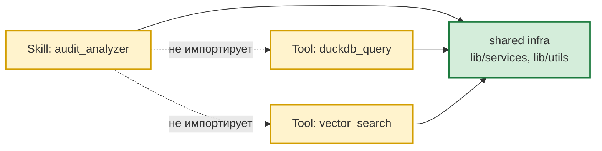

# Skill / Tool inventory

Зафиксированное состояние после рефакторинга `refactor/skills-tools-cleanup`
(коммиты `c593d509`..`7d8f6b0`; слито в `master` @ `bb844cf`).

Baseline до старта рефакторинга — в [docs/refactor_baseline.md](refactor_baseline.md).

## Сводная таблица

| component | path | type | depends_on_skill | depends_on_tool | depends_on_shared_infra | status |
|---|---|---|---|---|---|---|
| `audit_analyzer` Skill | `workspace/skills/audit_analyzer/SKILL.md` + `references/` | Skill (domain, **tool-only**) | — | `nl_sql_generate`, `duckdb_query`, `vector_search`, `column_descriptions` (через SKILL.md) | — | active |
| `compact_context` tool | `workspace/tools/compact_context.py` | Tool | — | — | `lib/services/context_compaction.py` | active |
| `duckdb_query` tool | `workspace/tools/duckdb_query_tool.py` | Tool (generic infrastructure) | — | — | `lib/utils/sql_safety.py` (последняя граница безопасности) + `lib/services/cache_provider_impl.py` | active |
| `vector_search` tool | `workspace/tools/vector_search_tool.py` | Tool (generic infrastructure) | — | — | `lib/services/cache_provider_impl.py` (FAISS через `CacheProvider.search_vector`) | active |
| `nl_sql_generate` tool | `workspace/tools/nl_sql_generate.py` | Tool (generic infrastructure) | — | — (через `column_descriptions.lookup`) | `lib/services/nl_sql_runner.py` (общий NL→SELECT pipeline) + `lib/services/schema_formatter.py` (internal service) + `lib/services/cache_provider_impl.py` + `lib/utils/sql_safety.py` + `lib/utils/text_utils.py` | active |
| `column_descriptions` tool | `workspace/tools/column_descriptions.py` | Tool (generic infrastructure, тонкий adapter) | — | — | `lib/services/column_descriptions.py::ColumnDescriptionsResolver` (механизм lookup) + `data_store/column_descriptions.json` (data_file) + `ctx._settings_ref.tools.column_descriptions.entries` (inline fallback) | active |
| `ColumnDescriptionsResolver` | `lib/services/column_descriptions.py` | Internal service (generic mechanism) | — | — | — | active |
| `example_tool` | `workspace/tools/example.py` | Tool (template) | — | — | — | reference |

## Удалённые компоненты

| component | бывший путь | замена |
|---|---|---|
| `audit_run_predefined_script` tool | `workspace/tools/audit_analyzer_tool.py::AuditRunPredefinedScriptTool` | CLI skill'а (`scripts/cli.py --mode predefined`) + runtime-context provider в `workspace/skills/audit_analyzer/providers.py` |
| `audit_search_vector` tool | `workspace/tools/audit_analyzer_tool.py::AuditSearchVectorTool` | tool `vector_search` (с указанием `index_name`) |
| `audit_generate_sql` tool | `workspace/tools/audit_analyzer_tool.py::AuditGenerateSqlTool` | skill workflow с tool `duckdb_query` (см. `workspace/skills/audit_analyzer/references/sql_guidance.md`) |
| `audit_analyzer_tool.py` | `workspace/tools/audit_analyzer_tool.py` (файл целиком) | три tool'а выше + замены |
| `audit_analyze.bat` / `audit_analyze.sh` | `workspace/skills/audit_analyzer/audit_analyze.{bat,sh}` | прямой запуск `python scripts/cli.py --mode ...` (см. бенчмарки) |
| `scripts/__init__.py` (skill) | `workspace/skills/audit_analyzer/scripts/__init__.py` | legacy-фасад (никем не импортировался) |
| `tests/e2e_test.py` (skill) | `workspace/skills/audit_analyzer/tests/e2e_test.py` | standalone (не pytest) |
| `scripts/generated/` | `workspace/skills/audit_analyzer/scripts/generated/` | одноразовый dump-скрипт |
| `providers.py` (навыка, старая версия) | `workspace/skills/audit_analyzer/providers.py` (наброски без регистрации) | переписан в этом же цикле; регистрация через `ApplicationContext._auto_register_skills()` |

## Последующие изменения (после слияния в `master`)

После первоначального рефакторинга на ветке `master` (HEAD `bb844cf`) закреплены
дополнительные границы конфигурации:

- **Конфигурационная граница `skills.*`**: секции `embedding` и `cache` вынесены
  из `skills.<name>` на уровень общей runtime-инфраструктуры `gateway.vector.*`.
  `SkillSettings` теперь имеет `model_config = ConfigDict(extra="forbid")`
  (fail-fast на опечатках и legacy-ключах). Регистрация embedding — через
  `lib.core.skill_registration.register_embedding_config` (вызывается в
  `lib.core.application_context`). Источник правды для эмбеддингов —
  `gateway.vector.embedding` (см. `lib/core/project_settings.py::EmbeddingSettings`).
- **`tools/build_vectors.py`** стал generic: убран hardcoded `audit_analyzer`,
  источник индексов — `public.agent_vector_index_config` (runtime-БД). Коммит `bb844cf`.
- **Embedding `auth_token`** (bearer) поддерживается в
  `gateway.vector.embedding.auth_token` (см. `EmbeddingSettings`).

## Целевая зависимость (после рефакторинга)

Контракт и инварианты — в [docs/skill-tool-architecture.md](skill-tool-architecture.md)
(TARGET_ARCHITECTURE.md §4, §22.1, §22.2, §28). Любое падение
`tests/test_skill_tool_independence.py` / `tests/test_architecture_tool_domain_free.py` /
`tests/test_core_infrastructure_independence.py` — архитектурная регрессия.