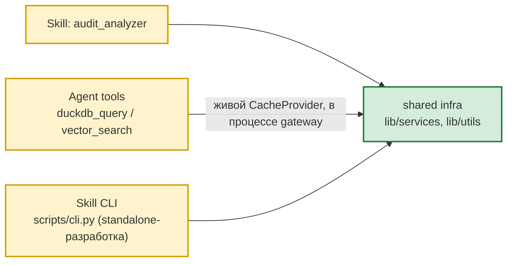

# Skill / Tool inventory

Зафиксированное состояние skill/tool в репозитории. Доступ к данным capability
дают два пути: skill-side CLI (доменная логика) и generic tools
`duckdb_query` / `vector_search` (прямой доступ агента через
`workspace/tools/`, работают в процессе gateway).

Исторические process/baseline-артефакты — в
[`docs/_archive/`](_archive/).

## Сводная таблица

| component | path | type | depends_on_skill | depends_on_tool | depends_on_shared_infra | status |
|---|---|---|---|---|---|---|
| `audit_analyzer` Skill | `workspace/skills/audit_analyzer/SKILL.md` + `scripts/` | Skill (domain, **CLI**) | — | следование SKILL.md через CLI `scripts/cli.py --mode predefined` (агент); CLI `--mode <predefined \| generated_sql \| vector>` для бенчмарков/CI/operator | — | active |
| `audit_formulation_strengthener` Skill | `workspace/skills/audit_formulation_strengthener/SKILL.md` + `prompts/` + `references/` + `scripts/` | Skill (domain, **CLI**) | — | через собственный skill-side CLI `scripts/cli.py --mode <analyze | search | synthesize | all>`; отчёт кладётся в `workspace/data_store/cache/sessions/<session_key>/` (резолвит `scripts/paths.py`) | `lib/services/llm_client.py`, `lib/services/text_splitter.py`, `workspace/utils/office_files.py` | active |
| `legal_summarizer` Skill | `workspace/skills/legal_summarizer/SKILL.md` + `references/` + `scripts/` | Skill (domain) | — | через собственный skill-side CLI; follow-up через tool `legal_summarizer_query` | `lib/services/llm_client.py` | active |
| `office_files` Skill | `workspace/skills/office_files/SKILL.md` + `references/` + `scripts/` | Skill (domain) | — | чтение docx/xlsx/xls/pdf/pptx/csv/txt через `workspace/utils/office_files.py` + `lib/services/text_splitter.py` | — | active |
| `compact_context` tool | `workspace/tools/compact_context.py` | Tool | — | — | `lib/services/context_compaction.py` | active |
| `history_search` tool | `workspace/tools/history_search_tool.py` | Tool (generic infrastructure) | — | — | `agent_gateway_logs` (долговечный журнал) | active |
| `legal_summarizer_query` tool | `workspace/tools/legal_summarizer_query.py` | Tool | `legal_summarizer` (follow-up по сохранённой `operation_id`) | — | skill CLI `cli_query.py` + `data_store/cache/skills/legal_summarizer/<op_id>/` | active |
| `duckdb_query` tool | `workspace/tools/duckdb_query_tool.py` | Tool | `audit_analyzer` (доступ к данным capability) | — | `CacheProvider.execute_readonly` на живом соединении gateway | active (восстановлен) |
| `vector_search` tool | `workspace/tools/vector_search_tool.py` | Tool | `audit_analyzer` (доступ к данным capability) | — | `CacheProvider.search_vector` (FAISS в памяти gateway) | active (восстановлен) |
| `example_tool` | `workspace/tools/example.py` | Tool (template) | — | — | — | reference |

## Почему tool'ы агента к аудиту возвращены (отмена этапа 18)

Этап 18 удалил `duckdb_query` / `vector_search` и оставил агенту единственный
путь — CLI skill'а. Это решение оказалось неисполнимым:

- gateway открывает `cache.duckdb` как **живую** базу
  (`application_context.py::_make_sync_services`, `DuckDbCacheStore.open(path=publish_path, mode=READ_WRITE)`)
  и держит её открытой весь жизненный цикл процесса;
- CLI skill'а работает в отдельном процессе, и DuckDB отдаёт ему
  `IOException: File is already open in <python> (PID ...)`, даже когда
  CLI просит `read_only=True`;
- `open_cache()` глотал причину (`except Exception: return False`), а
  `_open_db()` превращал её в «DuckDB-кеш не найден … запустите gateway» —
  при том, что файл существует, а gateway как раз запущен.

Агент оказывался в тупике: единственный задокументированный путь к данным
нерабочий. Tool'ы решают это структурно — они исполняются **в процессе
gateway** на том же открытом `CacheProvider` (`project_tool_loader` прокидывает
живой `ctx.cache_provider` через `set_provider`) и файла не касаются вовсе.

## Удалённые компоненты

| component | бывший путь | замена |
|---|---|---|
| `run_predefined_script` tool | `workspace/tools/run_predefined_script.py` | `duckdb_query` (SQL из реестра `public.agent_predefined_scripts`); CLI skill'а остаётся для standalone-разработки |
| `run_predefined_script` tool | `workspace/tools/run_predefined_script.py` | CLI skill'а `scripts/cli.py --mode predefined --script <name>` / `predefined.run()` (реестр в `public.agent_predefined_scripts`, см. `SKILL.md`) |
| `nl_sql_generate` tool | `workspace/tools/nl_sql_generate.py` | CLI skill'а `scripts/cli.py --mode generated_sql` (LLM-генерация SQL) |
| `column_descriptions` tool | `workspace/tools/column_descriptions.py` | `SKILL.md` секции «Схема домена» + «SQL guidance» (Agent читает сам) |
| `NlSqlRunner` core | `lib/services/nl_sql_runner.py` | не используется (NL→SELECT pipeline выпилен) |
| `SchemaFormatter` core | `lib/services/schema_formatter.py` | не используется |
| `ColumnDescriptionsResolver` core | `lib/services/column_descriptions.py` | не используется |
| `PredefinedScriptRegistry` core | `lib/services/predefined_script_registry.py` | реестр `public.agent_predefined_scripts` (DB-first; Python `REGISTRY`/`scripts/predefined/scripts.py` отсутствуют) |
| `PredefinedScriptRequestBuilder` core | `lib/services/predefined_script_request.py` | `scripts/predefined/builder.py::DynamicQueryBuilder` (inline `?`-подстановка в SQL из реестра skill'а) |
| `ParameterValidator` core | `lib/services/predefined_script_validator.py` | не используется |
| `audit_run_predefined_script` tool | `workspace/tools/audit_analyzer_tool.py::AuditRunPredefinedScriptTool` | CLI skill'а (`scripts/cli.py --mode predefined --script <name>`) |
| `audit_search_vector` tool | `workspace/tools/audit_analyzer_tool.py::AuditSearchVectorTool` | CLI skill'а `scripts/cli.py --mode vector` (с указанием `index_name`) |
| `audit_generate_sql` tool | `workspace/tools/audit_analyzer_tool.py::AuditGenerateSqlTool` | CLI skill'а `scripts/cli.py --mode generated_sql` (LLM-генерация SQL) |
| `audit_analyzer_tool.py` | `workspace/tools/audit_analyzer_tool.py` (файл целиком) | три tool'а выше + замены |
| `audit_analyze.bat` / `audit_analyze.sh` | `workspace/skills/audit_analyzer/audit_analyze.{bat,sh}` | прямой запуск `python scripts/cli.py --mode ...` (см. бенчмарки) |
| `scripts/__init__.py` (skill) | `workspace/skills/audit_analyzer/scripts/__init__.py` | legacy-фасад (никем не импортировался) |
| `tests/e2e_test.py` (skill) | `workspace/skills/audit_analyzer/tests/e2e_test.py` | standalone (не pytest) |
| `scripts/generated/` | `workspace/skills/audit_analyzer/scripts/generated/` | одноразовый dump-скрипт |
| `providers.py` (навыка) | `workspace/skills/audit_analyzer/providers.py` (наброски без регистрации) | удалён — регистрация через `ApplicationContext._auto_register_skills()` |
| `workspace.utils.event_log` module | `workspace/utils/event_log.py` (197 строк: `record_event`, `record_sync_event`, `emit_sync_event`) | отсутствует — заменён `DbLoggingService.log_event(LogEvent(...))` / `DbLoggingService.try_log_event(...)` (change `unify-agent-event-logging-pipeline`, коммит `1893b17`); прямой SQL INSERT bypass ликвидирован |
| `tests/test_event_log.py` | `tests/test_event_log.py` (83 строки) | удалён — тестировал прямой INSERT bypass; заменён `tests/test_unified_event_logging_pipeline.py` (AST + ownership guard'ы) |

## Границы конфигурации runtime

- **Конфигурационная граница `skills.*`**: секции `embedding` и `cache` вынесены
  из `skills.<name>` на уровень общей runtime-инфраструктуры `gateway.vector.*`.
  `SkillSettings` имеет `model_config = ConfigDict(extra="forbid")`
  (fail-fast на опечатках и legacy-ключах). Регистрация embedding
  (`lib.core.skill_registration.register_embedding_config`) отсутствует:
  параметры эмбеддера захардкожены в `cache_provider_impl` (`_EMBED_*`-константы),
  токен — из переменной окружения `EMBED_TOKEN`. Секция
  `gateway.vector.embedding` в `project.json` отсутствует.
- **`tools/build_vectors.py`** — generic: hardcoded `audit_analyzer` отсутствует,
  источник индексов — `gateway.vector.index.indexes` в `project.json`
  (PG-реестр `public.agent_vector_index_config` — legacy-артефакт,
  кодом не читается).
- **Embedding `auth_token`** (bearer) поддерживается через
  переменную окружения `EMBED_TOKEN` (см. `cache_provider_impl._EMBED_TOKEN_ENV`).

## Целевая зависимость

```mermaid
flowchart LR
    SKILL["Skill: audit_analyzer"] --> INFRA["shared infra<br/>lib/services, lib/utils"]
    TOOLS["Agent tools<br/>duckdb_query / vector_search"] -->|живой CacheProvider, в процессе gateway| INFRA
    CLI["Skill CLI<br/>scripts/cli.py (standalone-разработка)"] --> INFRA
    classDef core fill:#fff3cd,stroke:#d39e00,stroke-width:2px
    classDef infra fill:#d4edda,stroke:#1b7a3d,stroke-width:2px
    class SKILL,TOOLS,CLI core
    class INFRA infra
```

Контракт и инварианты — в [skill-tool-architecture.md](skill-tool-architecture.md)
(TARGET_ARCHITECTURE.md §4, §22.1, §22.2, §28). Agent-доступ к данным
`audit_analyzer` идёт через tools `duckdb_query` / `vector_search`, которые
исполняются в процессе gateway; CLI — только standalone-разработка (при
работающем gateway он не может открыть `cache.duckdb`). Любое падение
`tests/test_skill_tool_independence.py` / `tests/test_architecture_tool_domain_free.py` /
`tests/test_core_infrastructure_independence.py` /
`tests/test_skill_tool_integration.py` — архитектурная регрессия.

## История

Process/baseline/inventory-артефакты перенесены в [`_archive/`](_archive/) —
на актуальное состояние не ссылаться. Сводка изменений проекта — в
[`CHANGELOG.md`](../CHANGELOG.md).