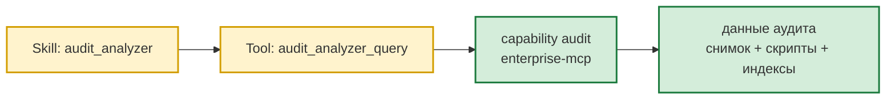

# Skill / Tool inventory

Зафиксированное состояние skill/tool в репозитории.

Единственная точка входа к данным аудита — инструмент `audit_analyzer_query`,
который вызывает операции capability `audit` платформы `enterprise-mcp`.
Skill-side CLI у навыка **нет**: `scripts/cli.py` не существует и не должен
появляться — это проверяет `tests/test_docs_consistency.py`. Отдельных
generic-инструментов для произвольного SQL и векторного поиска в проекте тоже
нет.

Исторические process/baseline-артефакты — в
[`openspec/changes/archive/`](../openspec/changes/archive/).

## Сводная таблица

| component | path | type | depends_on_skill | depends_on_tool | depends_on_shared_infra | status |
|---|---|---|---|---|---|---|
| `audit_analyzer` Skill | `workspace/skills/audit_analyzer/SKILL.md` | Skill (domain) | — | выбор операции и чтение её ответа | — | active (единственный skill в `workspace/skills/`) |
| `audit_analyzer_query` tool | `workspace/tools/audit_analyzer_query.py` | Tool (единственный вход в данные аудита) | `audit_analyzer` | аргумент `operation` выбирает `list_scripts` / `run_script` / `generate_sql` / `vector_search` | capability `audit` платформы | active |
| `legal_summarizer` Skill | ~~`workspace/skills/legal_summarizer/`~~ | Skill (domain) | — | — | — | **уехал в платформу**: каталога в `workspace/skills/` нет, домен живёт в capability `legal_summarizer` |
| `office_files` Skill | ~~`workspace/skills/office_files/`~~ | Skill (domain) | — | — | — | **удалён**: каталога в `workspace/skills/` нет |
| `compact_context` tool | `workspace/tools/compact_context.py` | Tool | — | — | `lib/services/context_compaction.py` | active |
| `history_search` tool | `workspace/tools/history_search_tool.py` | Tool (generic infrastructure) | — | — | `agent_gateway_logs` (долговечный журнал), операция `history_search` | active |
| `legal_summarizer_query` tool | `workspace/tools/legal_summarizer_query.py` | Tool | `legal_summarizer` (follow-up по сохранённой `operation_id`) | — | capability `legal_summarizer` | active |
| `query_operation` operation | `mcp-platform/servers/enterprise/capabilities/legal_summarizer/tools/query_operation.py` | Платформенная операция (capability `legal_summarizer`) | — | follow-up-вопрос по уже сохранённому документу, без повторного парсинга | — | active |
| `read_result` operation | `mcp-platform/servers/enterprise/tools/read_result.py` | Платформенная операция | — | чтение результата, сохранённого по порогу, по ссылке `session://results/...` | `SessionWorkspace` / `ArtifactStore` (владелец — платформа, capability доступа не имеют) | active |

## Удалённые компоненты

Замена в последней колонке — то, чем компонент заменён **сейчас**. Прежние
записи вели к `scripts/cli.py --mode ...`; этого CLI в проекте нет, доступ к
данным аудита идёт через `audit_analyzer_query` и операции capability `audit`.

| component | бывший путь | замена |
|---|---|---|
| `duckdb_query` tool | `workspace/tools/duckdb_query_tool.py` | `audit_analyzer_query` с `operation=run_script` (произвольного SQL у агента нет) |
| `vector_search` tool | `workspace/tools/vector_search_tool.py` | `audit_analyzer_query` с `operation=vector_search` |
| `run_predefined_script` tool | `workspace/tools/run_predefined_script.py` | `audit_analyzer_query` с `operation=run_script`; каталог — `operation=list_scripts` |
| `nl_sql_generate` tool | `workspace/tools/nl_sql_generate.py` | `audit_analyzer_query` с `operation=generate_sql` (запрос строит и проверяет платформа) |
| `column_descriptions` tool | `workspace/tools/column_descriptions.py` | `SKILL.md` секции «Схема домена» + «SQL guidance» (агент читает сам) |
| `audit_analyzer_tool.py` | `workspace/tools/audit_analyzer_tool.py` (файл целиком) | `workspace/tools/audit_analyzer_query.py` |
| `audit_run_predefined_script` / `audit_search_vector` / `audit_generate_sql` tool | `workspace/tools/audit_analyzer_tool.py` (классы `AuditRunPredefinedScriptTool`, `AuditSearchVectorTool`, `AuditGenerateSqlTool`) | одна операция `audit_analyzer_query`, ветвление по аргументу `operation` |
| `audit_analyze.bat` / `audit_analyze.sh` | `workspace/skills/audit_analyzer/audit_analyze.{bat,sh}` | ничего: файлов нет, запуска навыка как CLI не существует |
| `scripts/__init__.py` (skill) | `workspace/skills/audit_analyzer/scripts/__init__.py` | legacy-фасад (никем не импортировался) |
| `tests/e2e_test.py` (skill) | `workspace/skills/audit_analyzer/tests/e2e_test.py` | standalone (не pytest) |
| `scripts/generated/` | `workspace/skills/audit_analyzer/scripts/generated/` | одноразовый dump-скрипт |
| `providers.py` (навыка) | `workspace/skills/audit_analyzer/providers.py` (наброски без регистрации) | удалён |
| `NlSqlRunner` core | `lib/services/nl_sql_runner.py` | не используется (NL→SELECT pipeline выпилен) |
| `SchemaFormatter` core | `lib/services/schema_formatter.py` | не используется |
| `ColumnDescriptionsResolver` core | `lib/services/column_descriptions.py` | не используется |
| `PredefinedScriptRegistry` core | `lib/services/predefined_script_registry.py` | реестр переехал в capability `audit`; Python `REGISTRY`/`scripts/predefined/scripts.py` отсутствуют |
| `PredefinedScriptRequestBuilder` core | `lib/services/predefined_script_request.py` | параметры скрипта и подстановка — на стороне capability `audit` |
| `ParameterValidator` core | `lib/services/predefined_script_validator.py` | не используется |
| `workspace.utils.event_log` module | `workspace/utils/event_log.py` (197 строк) | отсутствует — заменён `DbLoggingService.log_event(LogEvent(...))` / `DbLoggingService.try_log_event(...)`; прямой SQL INSERT bypass ликвидирован |
| `tests/test_event_log.py` | `tests/test_event_log.py` (83 строки) | удалён — тестировал прямой INSERT bypass; заменён `tests/test_unified_event_logging_pipeline.py` (AST + ownership guard'ы) |

## Границы конфигурации runtime

- **Эмбеддинги и индексы — не настройки агента.** Сборку и владение FAISS-индексами
  держит capability `vectors` платформы, объявления индексов живут в
  `mcp-platform/platform.json → vectors.indexes`. Агент их не строит, не хранит и
  не вычисляет; параметры эмбеддера захардкожены в платформе.
- **Skill-side конфиг навыков.** Настройки навыков читаются из
  `config.json → gateway.agent.skills.<name>`. Секций `skills.*.embedding` и
  `skills.*.cache` в конфиге нет: они уехали вместе с кодом кэша в платформу.
  `SkillSettings` имеет `model_config = ConfigDict(extra="forbid")` —
  опечатка в ключе падает на старте, а не игнорируется.
- **Локального кэша у агента нет.** Ни снимка, ни FAISS, ни собственного клиента
  LLM: всё это capability `data` / `vectors` / `llm` платформы.

## Целевая зависимость

```mermaid
flowchart LR
    SKILL["Skill: audit_analyzer"] --> TOOL["Tool: audit_analyzer_query"]
    TOOL --> CAP["capability audit<br/>enterprise-mcp"]
    CAP --> DATA["данные аудита<br/>снимок + скрипты + индексы"]
    classDef core fill:#fff3cd,stroke:#d39e00,stroke-width:2px
    classDef infra fill:#d4edda,stroke:#1b7a3d,stroke-width:2px
    class SKILL,TOOL core
    class CAP,DATA infra
```

Инструментов `duckdb_query` / `vector_search` не существует, CLI у навыка нет.
Падение `tests/test_skill_tool_independence.py`,
`tests/test_architecture_tool_domain_free.py` или
`tests/test_core_infrastructure_independence.py` — архитектурная регрессия.
Контракт и инварианты — в [skill-tool-architecture.md](skill-tool-architecture.md)
(разделы «Целевая зависимость» и «Границы»).

## История

Process/baseline/inventory-артефакты перенесены в
[`openspec/changes/archive/`](../openspec/changes/archive/) —
на актуальное состояние не ссылаться. Сводка изменений проекта — в
[`CHANGELOG.md`](../CHANGELOG.md).
