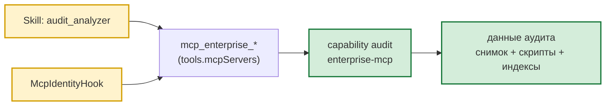

# Skill / Tool inventory

Зафиксированное состояние skill/tool в репозитории.

**Точка входа к данным аудита — операции capability `audit` платформы,
объявленные в `config.json → tools.mcpServers` и приходящие к модели как
`mcp_enterprise_*` с их настоящими `inputSchema`.** Посредника-Tool между
навыком и платформой больше нет: `audit_analyzer_query` переписывал схемы
операций, сводил ошибки к своему формату и передавал личность вызова руками.
Всё это теперь делает штатный MCP-клиент нанобота и хук `McpIdentityHook`
(change `2026-10-03-mcp-native-tools`).

Skill-side CLI у навыков **нет**: `scripts/cli.py` не существует и не должен
появляться — это проверяет `tests/test_docs_consistency.py`. Отдельных
generic-инструментов для произвольного SQL и векторного поиска в проекте тоже
нет.

Исторические process/baseline-артефакты — в
[`openspec/changes/archive/`](../openspec/changes/archive/).

## Сводная таблица

| component | path | type | depends_on_skill | depends_on_tool | depends_on_shared_infra | status |
|---|---|---|---|---|---|---|
| `enterprise_mcp` Skill | `workspace/skills/enterprise_mcp/SKILL.md` | Skill (контракт вызовов) | — | общие правила для всех `mcp_enterprise_*` | capability любой | active |
| `audit_analyzer` Skill | `workspace/skills/audit_analyzer/SKILL.md` | Skill (domain) | — | выбор операции и чтение её ответа | — | active |
| `McpIdentityHook` | `lib/hooks/mcp_identity_hook.py` | framework-хук | — | подставляет личность оборота в аргументы `mcp_enterprise_*` | `runtime_inventory` (required) | active |
| `audit_analyzer` operations | `config.json → tools.mcpServers.enterprise.enabled_tools` | Операции capability `audit` | `audit_analyzer` | `audit.list_scripts` / `audit.run_script` / `audit.generate_sql` / `vectors.vector_search` / `vectors.list_indexes` | capability `audit` платформы; `vectors.vector_search` и `vectors.list_indexes` — capability `vectors` | active |
| документ follow-up | `mcp-platform/servers/enterprise/capabilities/legal_summarizer/tools/query_operation.py` | Платформенная операция | — | follow-up-вопрос по сохранённому `operation_id`, без повторного парсинга | — | active (выдаётся как `mcp_enterprise_legal_summarizer_query_operation`) |
| `data.history_search` operation | `mcp-platform/servers/enterprise/capabilities/data/tools/history_search.py` | Платформенная операция | — | поиск по журналу в пределах личности вызова | — | active (выдаётся как `mcp_enterprise_data_history_search`) |
| `platform.read_result` operation | `mcp-platform/servers/enterprise/tools/read_result.py` | Платформенная операция | — | чтение результата, сохранённого по порогу, по ссылке `session://results/...` | `SessionWorkspace` / `ArtifactStore` (владелец — платформа, capability доступа не имеют) | active |
| `compact_context` tool | `workspace/tools/compact_context.py` | Tool | — | — | `lib/services/context_compaction.py` | active |
| `document_read` tool | `workspace/tools/document_read.py` | Tool | — | — | извлечение текста на платформе | active |
| ~~`legal_summarizer`~~ Skill | ~~`workspace/skills/legal_summarizer/`~~ | Skill (domain) | — | — | — | **уехал в платформу**: каталога в `workspace/skills/` нет, домен живёт в capability `legal_summarizer` |
| ~~`office_files`~~ Skill | ~~`workspace/skills/office_files/`~~ | Skill (domain) | — | — | — | **удалён**: каталога в `workspace/skills/` нет |

Два Skill'а в `workspace/skills/`, два Tool'а в `workspace/tools/` — оба
переживают удаление трёх обёрток. Списки канонизированы в
`lib/services/runtime_inventory.py` (`canonical_project_tools()`), и страж
`tests/test_runtime_inventory.py` падает при рассинхроне.

## Удалённые компоненты

Замена в последней колонке — то, чем компонент заменён **сейчас**. Цепочка
`duckdb_query` → `audit_analyzer_query` с `operation=run_script` укоротилась на
одно звено: эти компоненты менялись трижды, и каждая следующая замена снимала
то, что предыдущая вводила.

| component | бывший путь | замена |
|---|---|---|
| `audit_analyzer_query` tool | `workspace/tools/audit_analyzer_query.py` | `mcp_enterprise_{audit_list_scripts,audit_run_script,audit_generate_sql,vectors_vector_search}` — с настоящими схемами операций |
| `legal_summarizer_query` tool | `workspace/tools/legal_summarizer_query.py` | `mcp_enterprise_legal_summarizer_query_operation` |
| `history_search` tool | `workspace/tools/history_search_tool.py` | `mcp_enterprise_data_history_search`; область видимости задаёт личность вызова, а не аргумент модели |
| `duckdb_query` tool | `workspace/tools/duckdb_query_tool.py` | `mcp_enterprise_audit_run_script` (произвольного SQL у агента нет) |
| `vector_search` tool | `workspace/tools/vector_search_tool.py` | `mcp_enterprise_vectors_vector_search` |
| `run_predefined_script` tool | `workspace/tools/run_predefined_script.py` | `mcp_enterprise_audit_run_script`; каталог — `mcp_enterprise_audit_list_scripts` |
| `nl_sql_generate` tool | `workspace/tools/nl_sql_generate.py` | `mcp_enterprise_audit_generate_sql` (запрос строит и проверяет платформа) |
| `column_descriptions` tool | `workspace/tools/column_descriptions.py` | `SKILL.md` секции «Схема домена» + «SQL guidance» (агент читает сам) |
| `audit_analyzer_tool.py` | `workspace/tools/audit_analyzer_tool.py` (файл целиком) | `workspace/tools/audit_analyzer_query.py` → далее операции платформы |
| `audit_run_predefined_script` / `audit_search_vector` / `audit_generate_sql` tool | `workspace/tools/audit_analyzer_tool.py` (классы `AuditRunPredefinedScriptTool`, `AuditSearchVectorTool`, `AuditGenerateSqlTool`) | сначала одна операция с ветвлением по аргументу `operation`, затем операции платформы напрямую |
| `audit_analyze.bat` / `audit_analyze.sh` | `workspace/skills/audit_analyzer/audit_analyze.{bat,sh}` | ничего: файлов нет, запуска навыка как CLI не существует |
| `scripts/__init__.py` (skill) | `workspace/skills/audit_analyzer/scripts/__init__.py` | legacy-фасад (никем не импортировался) |
| `tests/e2e_test.py` (skill) | `workspace/skills/audit_analyzer/tests/e2e_test.py` | standalone (не pytest) |
| `scripts/generated/` | `workspace/skills/audit_analyzer/scripts/generated/` | одноразовый dump-скрипт |
| `providers.py` (навыка) | `workspace/skills/audit_analyzer/providers.py` (наброски без регистрации) | удалён |
| `NlSqlRunner` core | `lib/services/nl_sql_runner.py` | не используется (NL→SELECT pipeline выпилен) |
| `SchemaFormatter` core | `lib/services/schema_formatter.py` | не используется |
| `ColumnDescriptionsResolver` core | `lib/services/column_descriptions.py` | не используется |
| `PredefinedScriptRegistry` core | `lib/services/predefined_script_registry.py` | реестр переехал в capability `audit`; Python `REGISTRY`/`scripts/predefined/scripts.py` отсутствуют |
| `PredefinedScriptRequestBuilder` core | `lib/services/predefined_script_request.py` | параметры скрипта и подстановка — на стороне capability `audit` |
| `ParameterValidator` core | `lib/services/predefined_script_validator.py` | не используется |
| `workspace.utils.event_log` module | `workspace/utils/event_log.py` (197 строк) | отсутствует — заменён `DbLoggingService.log_event(LogEvent(...))` / `DbLoggingService.try_log_event(...)`; прямой SQL INSERT bypass ликвидирован |
| `tests/test_event_log.py` | `tests/test_event_log.py` (83 строки) | удалён — тестировал прямой INSERT bypass; заменён `tests/test_unified_event_logging_pipeline.py` (AST + ownership guard'ы) |
| `tests/test_audit_analyzer_query_tool.py` и соседи | `tests/` | удалены вместе с инструментами; покрытие ушло на платформу (`test_audit_capability.py`, `test_vectors_*`, `test_data_service.py::TestHistorySearchIsolation`) |

## Границы конфигурации runtime

- **Эмбеддинги и индексы — не настройки агента.** Сборку и владение FAISS-индексами
  держит capability `vectors` платформы, объявления индексов живут в
  `mcp-platform/platform.json → vectors.indexes`. Агент их не строит, не хранит и
  не вычисляет; параметры эмбеддера захардкожены в платформе.
- **Состав операций для модели — настройка агента, но объявлена один раз.**
  Белый список `config.json → tools.mcpServers.enterprise.enabled_tools` решает,
  что модель вообще видит; снять или добавить операцию в нём нельзя, не
  изменив одно объявление.
- **Skill-side конфиг навыков.** Настройки навыков читаются из
  `config.json → gateway.agent.skills.<name>`. Секций `skills.*.embedding` и
  `skills.*.cache` в конфиге нет: они уехали вместе с кодом кэша в платформу.
  `SkillSettings` имеет `model_config = ConfigDict(extra="forbid")` —
  опечатка в ключе падает на старте, а не игнорируется.
- **Локального кэша у агента нет.** Ни снимка, ни FAISS, ни собственного клиента
  LLM: всё это capability `data` / `vectors` / `llm` платформы.

## Целевая зависимость

```mermaid
flowchart LR
    SKILL["Skill: audit_analyzer"] --> MCP["mcp_enterprise_*<br/>(tools.mcpServers)"]
    HOOK["McpIdentityHook"] --> MCP
    MCP --> CAP["capability audit<br/>enterprise-mcp"]
    CAP --> DATA["данные аудита<br/>снимок + скрипты + индексы"]
    classDef core fill:#fff3cd,stroke:#d39e00,stroke-width:2px
    classDef infra fill:#d4edda,stroke:#1b7a3d,stroke-width:2px
    class SKILL,HOOK core
    class CAP,DATA infra
```

Между Skill и платформой нет ни Tool'а, ни CLI: только штатный MCP-клиент.
Инструментов `duckdb_query` / `vector_search` не существует, CLI у навыков нет.
Падение `tests/test_skill_tool_independence.py`,
`tests/test_architecture_tool_domain_free.py` или
`tests/test_core_infrastructure_independence.py` — архитектурная регрессия.
Контракт вызовов — в [`enterprise_mcp/SKILL.md`](../workspace/skills/enterprise_mcp/SKILL.md),
инварианты — в [skill-tool-architecture.md](skill-tool-architecture.md).

## История

Process/baseline/inventory-артефакты перенесены в
[`openspec/changes/archive/`](../openspec/changes/archive/) —
на актуальное состояние не ссылаться. Сводка изменений проекта — в
[`CHANGELOG.md`](../CHANGELOG.md).
