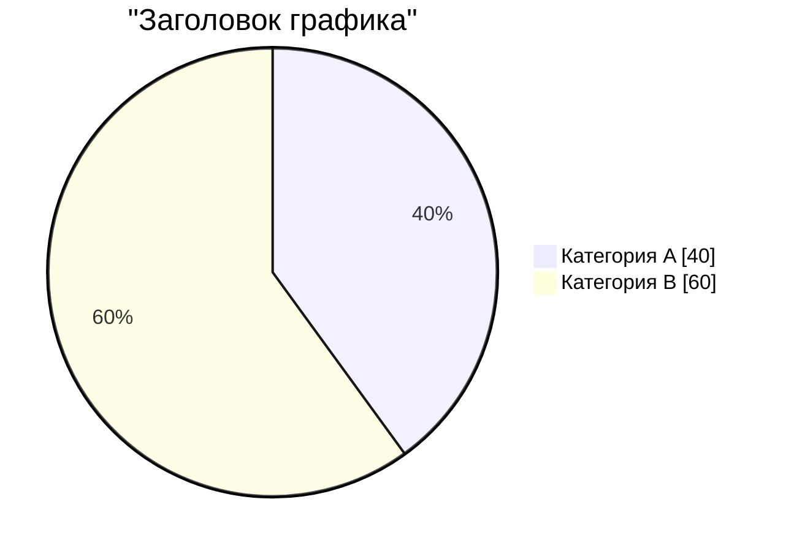

# HTML Presentation Generator

Используй tool **`generate_presentation`** для генерации HTML-презентаций из Markdown.

## Tool: `generate_presentation`

Генерирует самодостаточный HTML-файл с навигацией, Mermaid-диаграммами и адаптивным дизайном.

### Параметры

| Параметр | Тип | Обязательный | Описание |
|:---------|:----|:-------------|:---------|
| `input` | `string` | да* | Markdown-содержимое презентации. Слайды разделяются `---` |
| `input_file` | `string` | да* | Путь к Markdown-файлу (альтернатива `input`) |
| `output` | `string` | нет | Путь к выходному HTML-файлу. Если не указан — временный файл |
| `title` | `string` | нет | Заголовок презентации (по умолчанию "Презентация") |

*Требуется указать `input` или `input_file`.

### Формат Markdown

```
# Заголовок презентации (становится заголовком 1-го слайда)

---

## Название слайда
Текст слайда, **жирный**, списки, таблицы.

| Колонка 1 | Колонка 2 |
|-----------|-----------|
| Значение  | Значение  |

---

## Слайд с графиком



---

## Слайд с bar-чартом

```mermaid
xychart-beta
    title "Продажи"
    x-axis ["Янв", "Фев", "Мар"]
    y-axis "Выручка" 0 to 100
    bar [30, 50, 80]
```
```

### Навигация в браузере

| Клавиша | Действие |
|:--------|:---------|
| `←` / `→` | Предыдущий / следующий слайд |
| `↑` / `↓` | Предыдущий / следующий слайд |
| `Space` | Следующий слайд |
| `F` | Полный экран |
| `Home` | Первый слайд |
| `End` | Последний слайд |

### Примеры

**Передача содержимого напрямую:**
`generate_presentation(input="# Доклад\n\n---\n\n## Введение\nТекст доклада...", output="report.html", title="Годовой отчёт")`

**Из файла:**
`generate_presentation(input_file="examples/input.md", output="examples/output.html", title="Анализ нарушений")`

### Формат результата

На выходе — самодостаточный HTML:
- CSS встроен в `<style>`
- Mermaid загружается из CDN (требуется интернет)
- Навигация, прогресс-бар, кнопки prev/next/fullscreen
- Поддержка печати (`@media print` — все слайды с page-break)

### Ограничения

- Mermaid требует подключения к интернету (CDN)
- Экспорт в PDF — через браузер (Ctrl+P)

---

## CLI (standalone)

Запуск через `generate_presentation.bat` (Windows) или `generate_presentation.sh` (Linux):

```bash
# Из папки навыка:
generate_presentation --input slides.md --output out.html --title "Мой доклад"
```

Параметры:

| Аргумент      | Обязательный | Описание |
|:--------------|:------------:|:---------|
| `--input`     | да | Путь к Markdown-файлу |
| `--output`    | да | Путь к выходному HTML-файлу |
| `--title`     | нет | Заголовок презентации (по умолч. "Презентация") |
