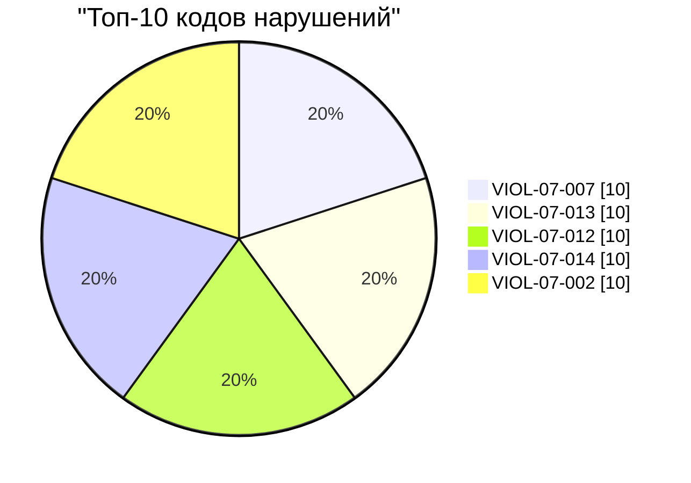

# Презентация: Анализ нарушений в OARB

---

## Титульный слайд
**Название:** Анализ нарушений в базе данных OARB
**Дата:** 22 мая 2026 года
**Автор:** nanobot

---

## Распределение нарушений по времени

```mermaid
xychart-beta
    title "Распределение нарушений по месяцам (2024)"
    x-axis ["Январь", "Февраль", "Март", "Май", "Июнь"]
    y-axis "Количество" 0 to 1200
    bar [337, 233, 670, 1069, 326]
```

| Месяц   | Количество нарушений | Процент от общего |
|---------|----------------------|-------------------|
| Январь  | 337                  | 12.79%            |
| Февраль | 233                  | 8.84%             |
| Март    | 670                  | 25.43%            |
| Май     | 1069                 | 40.57%            |
| Июнь    | 326                  | 12.37%            |

---

## Топ-коды нарушений



| Код нарушения | Количество случаев | Процент от общего |
|---------------|--------------------|-------------------|
| VIOL-07-007   | 10                 | 0.28%             |
| VIOL-07-013   | 10                 | 0.28%             |
| VIOL-07-012   | 10                 | 0.28%             |

---

## Выводы и рекомендации

### Выводы:
1. **Майский всплеск**: 40.57% всех нарушений за 2024 год.
2. **Пропуск апреля**: Нет данных за этот месяц.
3. **Равномерность кодов нарушений**: Нет явных лидеров.

### Рекомендации:
1. Проверить причины майского всплеска.
2. Автоматизировать контроль сроков.
3. Пересмотреть классификацию нарушений.
